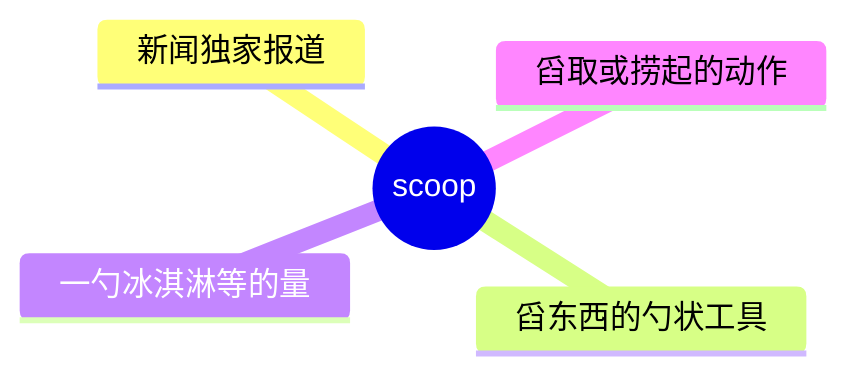
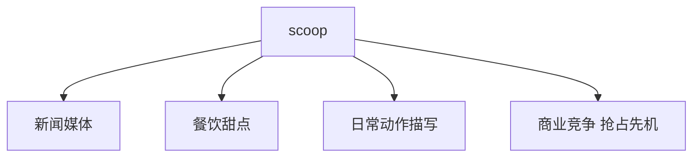
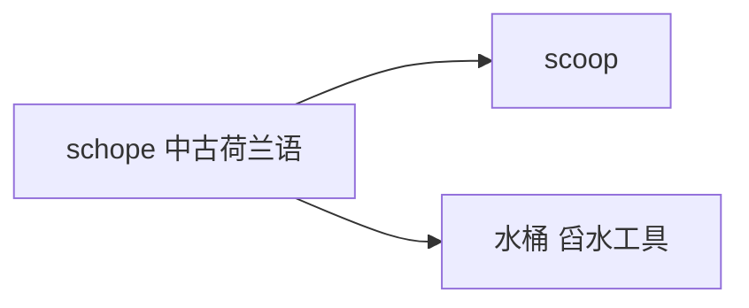

# scoop

## 1. 单词卡片

| 项目 | 内容 |
|---|---|
| 单词 | scoop |
| 词性 | noun / verb |
| 英式音标 | /skuːp/ |
| 美式音标 | /skuːp/（基本相同） |
| 音节 | scoop（单音节） |
| 重音 | 单音节词，无需标重音 |
| 核心意思 | （新闻）独家报道；勺子、一勺的量；舀取 |

## 2. 发音拆解


发音提示：

* 单音节词，读作 /skuːp/，元音是长元音 /uː/
* 开头的 `sc` 组合读作 /sk/，两个辅音连读
* 词尾 `p` 是清辅音，要短促干脆地收尾
* 中文近似音只能辅助记忆，不能代替标准发音：可理解为“斯库普”，但真实发音更短促紧凑

## 3. 核心词义



## 4. 不同词性与用法

| 词性 | 英文含义 | 中文意思 | 常见结构 |
|---|---|---|---|
| noun (新闻) | an exclusive news story | 独家新闻、独家报道 | get a scoop |
| noun | a spoon-like tool, or a portion | 勺子；一勺（的量） | a scoop of ice cream |
| verb | to lift/gather with a scooping motion | 舀取、捞起 | scoop up |

## 5. 常见使用语境



## 6. 常见搭配

| 搭配 | 中文意思 | 使用场景 |
|---|---|---|
| get a scoop | 获得独家新闻 | 新闻、媒体 |
| a scoop of ice cream | 一勺冰淇淋 | 日常生活 |
| scoop up | 舀起、捞起 | 日常动作 |
| scoop the competition | 抢在竞争对手之前获得独家消息 | 商业、新闻 |

## 7. 基础例句

**例句 1**

```text
The reporter got the **scoop** on the company's upcoming merger.
```

这位记者获得了关于这家公司即将进行的合并的独家消息。

**例句 2**

```text
Can I have two **scoops** of chocolate ice cream, please?
```

请给我来两勺巧克力冰淇淋，可以吗？

## 8. 问答例句

**Question**

```text
How did the newspaper get the scoop before anyone else?
```

这家报纸是怎么比其他人更早拿到独家新闻的？

**Answer**

```text
They had a source inside the company who leaked the information early.
```

他们在公司内部有一个消息来源，提前泄露了信息。

## 9. 工作场景

```text
Our team managed to **scoop** the story before our competitors.
```

我们的团队成功抢在竞争对手之前拿到了这条独家新闻。

## 10. 日常生活场景

```text
She **scooped up** her keys and rushed out the door.
```

她一把抓起钥匙，冲出了门。

## 11. 词根词缀与构词



| 单词 | 词性 | 中文意思 |
|---|---|---|
| scoop | noun/verb | 独家新闻；勺子；舀取 |
| scooper | noun | 舀取工具（较少见） |

`scoop` 来自中古荷兰语 `schope`，原意与“水桶、舀水的工具”有关，后来引申出“舀取的动作”，并进一步比喻性地引申出新闻业中“抢先获得独家消息”的含义。

## 12. 同义词辨析

| 单词 | 主要区别 |
|---|---|
| scoop (新闻义) | 强调抢先获得独家、未公开的新闻 |
| exclusive | 更常用于形容词，指“独家的”，也可作名词表示独家新闻 |
| gather | 用于“舀取”这个动作的同义词时更中性、更通用 |

## 13. 反义词

没有非常固定的反义词。

## 14. 易混淆点

```text
scoop (勺子；舀取；独家新闻)
```

```text
scope (范围；瞄准镜)
```

两个词拼写非常相似，只是中间字母顺序不同，意思完全不同，容易被初学者看错。

## 15. 常见错误

错误：

```text
The journalist scoop the story last week.
```

正确：

```text
The journalist scooped the story last week.
```

说明：

`scoop` 作动词表示过去时态时需要加 `-ed`，写作 `scooped`，不能直接用原形。

## 16. 记忆方法

```text
scoop（源自“舀水的工具”）→ 舀取的动作 → 比喻抢先“舀到”独家新闻
```

场景记忆：

```text
The reporter got the scoop on the company's upcoming merger.
这位记者获得了关于这家公司即将进行的合并的独家消息。
```

## 17. 快速复习

| 问题 | 答案 |
|---|---|
| 核心意思是什么 | 独家新闻；勺子；舀取 |
| 常见词性是什么 | 名词、动词 |
| 常见搭配是什么 | get a scoop / a scoop of ice cream |
| 容易混淆的词是什么 | scope（范围；瞄准镜） |

## 18. 选择题考试

> 请先独立选择答案，不要提前展开答案区。

### 第 1 题

`scoop` 在新闻语境中最核心的意思是什么？

- [ ] A. 假新闻
- [ ] B. 独家新闻、独家报道
- [ ] C. 新闻发布会
- [ ] D. 新闻编辑

<details>
<summary>提交选择后查看结果</summary>

- 正确答案：**B. 独家新闻、独家报道**
- 对错判断：选择 B 为正确；选择 A、C 或 D 为错误。
- 解析：scoop 在新闻业中指抢先获得的独家、未公开的新闻消息。

</details>

### 第 2 题

`scoop` 开头的 `sc` 应该怎么读？

- [ ] A. 读作 /s/，c 不发音
- [ ] B. 读作 /sk/，两个辅音连读
- [ ] C. 读作 /ʃ/
- [ ] D. 不发音

<details>
<summary>提交选择后查看结果</summary>

- 正确答案：**B. 读作 /sk/，两个辅音连读**
- 对错判断：选择 B 为正确；选择 A、C 或 D 为错误。
- 解析：scoop 开头的 sc 组合读作两个辅音连读的 /sk/。

</details>

### 第 3 题

下面哪个搭配表示“一勺冰淇淋”？

- [ ] A. a scoop of ice cream
- [ ] B. a scope of ice cream
- [ ] C. a scoop for ice cream
- [ ] D. a scoop ice cream

<details>
<summary>提交选择后查看结果</summary>

- 正确答案：**A. a scoop of ice cream**
- 对错判断：选择 A 为正确；选择 B、C 或 D 为错误。
- 解析：a scoop of ice cream 是日常生活中的常见搭配，表示“一勺冰淇淋”。

</details>

### 第 4 题

下面哪句话语法正确？

- [ ] A. The journalist scoop the story last week.
- [ ] B. The journalist scooped the story last week.
- [ ] C. The journalist scooping the story last week.
- [ ] D. The journalist is scoop the story last week.

<details>
<summary>提交选择后查看结果</summary>

- 正确答案：**B. The journalist scooped the story last week.**
- 对错判断：选择 B 为正确；选择 A、C 或 D 为错误。
- 解析：scoop 作动词表示过去时态需要加 -ed，写作 scooped。

</details>

### 第 5 题

下面哪个词最容易和 `scoop` 拼写混淆？

- [ ] A. scope
- [ ] B. spoon
- [ ] C. stoop
- [ ] D. swoop

<details>
<summary>提交选择后查看结果</summary>

- 正确答案：**A. scope**
- 对错判断：选择 A 为正确；选择 B、C 或 D 为错误。
- 解析：scoop（勺子、独家新闻）和 scope（范围、瞄准镜）拼写非常相似，只是中间字母顺序不同，意思完全不同。

</details>

## 19. 考试结果汇总

完成全部题目后，根据答案区自行统计：

| 正确题数 | 掌握情况 | 建议 |
|---|---|---|
| 5 题 | 已掌握 | 进入下一个单词 |
| 4 题 | 基本掌握 | 复习答错的知识点 |
| 2～3 题 | 掌握不稳 | 重新阅读搭配、例句和易错点 |
| 0～1 题 | 尚未掌握 | 重新学习整个单词课程 |
