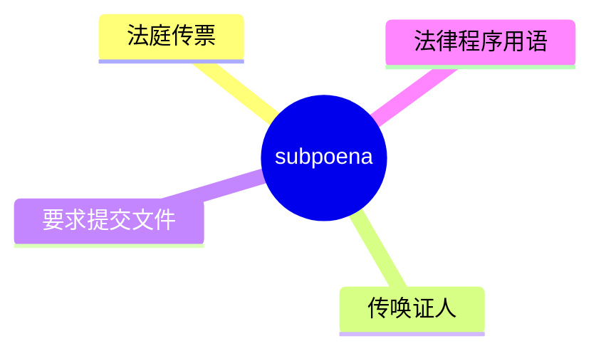
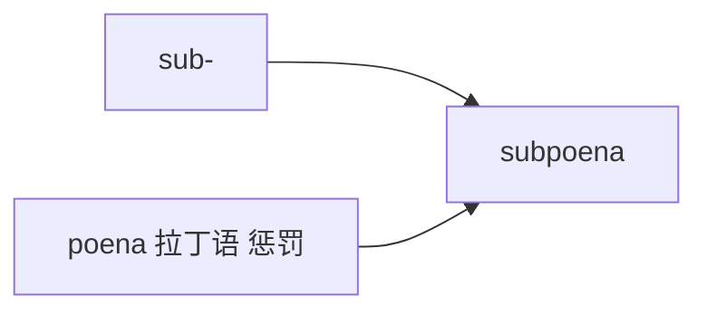

# subpoena

## 1. 单词卡片

| 项目 | 内容 |
|---|---|
| 单词 | subpoena |
| 词性 | noun / verb |
| 英式音标 | /səˈpiːnə/ |
| 美式音标 | /səˈpiːnə/（基本相同） |
| 音节 | sub-poe-na |
| 重音 | 第二音节 `poe` |
| 核心意思 | （法律）传票；传唤出庭作证 |

## 2. 发音拆解


发音提示：

* 重音在第二个音节 `PEE`，读作 /piː/，是一个长元音
* 第一个音节 `sub` 弱读为 /səb/，注意不要读成 /sʌb/
* 拼写中的 `oe` 不发 /oʊ/，而是发长元音 /iː/，这是这个单词的发音难点
* 中文近似音只能辅助记忆，不能代替标准发音：可理解为“瑟皮纳”，但真实发音第二音节要拉长

## 3. 核心词义



## 4. 不同词性与用法

| 词性 | 英文含义 | 中文意思 | 常见结构 |
|---|---|---|---|
| noun | a legal document ordering attendance/evidence | 传票 | issue a subpoena |
| verb | to summon someone by subpoena | 传唤（某人出庭） | subpoena a witness |

## 5. 常见使用语境


## 6. 常见搭配

| 搭配 | 中文意思 | 使用场景 |
|---|---|---|
| issue a subpoena | 发出传票 | 法律 |
| serve a subpoena | 送达传票 | 法律 |
| subpoena a witness | 传唤证人 | 法庭 |
| be subpoenaed to testify | 被传唤出庭作证 | 新闻、法律 |

## 7. 基础例句

**例句 1**

```text
The court issued a **subpoena** requiring him to appear as a witness.
```

法庭发出了一张传票，要求他以证人身份出庭。

**例句 2**

```text
She was **subpoenaed** to testify in the trial next month.
```

她被传唤在下个月的审判中出庭作证。

## 8. 问答例句

**Question**

```text
Why was the executive subpoenaed by the committee?
```

为什么这位高管被委员会传唤了？

**Answer**

```text
He was subpoenaed to provide documents related to the investigation.
```

他被传唤是为了提供与调查相关的文件。

## 9. 工作场景

```text
The company received a **subpoena** for its internal emails.
```

这家公司收到了一份要求提交内部邮件的传票。

## 10. 日常生活场景

```text
He was surprised to receive a **subpoena** to appear in small claims court.
```

他很惊讶收到了一张要求在小额索赔法庭出庭的传票。

## 11. 词根词缀与构词



| 单词 | 词性 | 中文意思 |
|---|---|---|
| subpoena | noun/verb | 传票；传唤 |
| subpoenaed | adjective/past tense | 被传唤的 |

`sub-` 表示“在……之下”，`poena` 来自拉丁语“惩罚”，字面意思是“在受罚的威胁之下”，也就是“不出庭就要受罚”，因此引申为“传票”。

## 12. 同义词辨析

| 单词 | 主要区别 |
|---|---|
| subpoena | 专门指法律传票，具有法律强制力 |
| summons | 更通用，指传唤出庭的正式通知，范围更广 |
| citation | 常指传票或罚单，也可指引用 |

## 13. 反义词

没有固定反义词，语境中常与以下概念相对：

| 单词 | 中文意思 |
|---|---|
| exemption | 豁免 |
| release | 免除、解除 |

## 14. 易混淆点

```text
subpoena
```

传票，法律术语，拼写中 `oe` 容易被误读。

```text
subpeona / supeona
```

常见的错误拼写，正确拼写必须是 `subpoena`。

## 15. 常见错误

错误：

```text
He was subpoena to court.
```

正确：

```text
He was subpoenaed to court.
```

说明：

`subpoena` 作动词时，过去式和过去分词需要加 `-ed`，写作 `subpoenaed`，不能直接用原形做被动语态。

## 16. 记忆方法

```text
sub(在……之下) + poena(惩罚，拉丁语) = subpoena（受罚威胁下的传票）
```

场景记忆：

```text
The court issued a subpoena requiring him to appear as a witness.
法庭发出了一张传票，要求他以证人身份出庭。
```

## 17. 快速复习

| 问题 | 答案 |
|---|---|
| 核心意思是什么 | 传票；传唤出庭 |
| 常见词性是什么 | 名词、动词 |
| 常见搭配是什么 | issue a subpoena / subpoena a witness |
| 容易犯的错误是什么 | 动词过去式忘记加 -ed |
