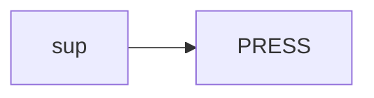
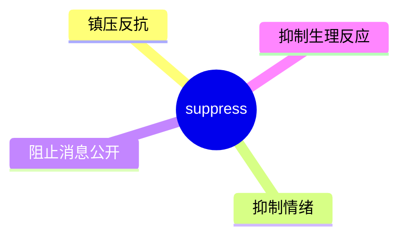
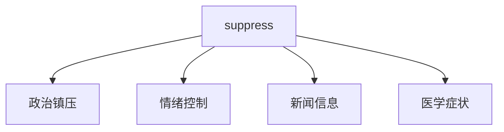
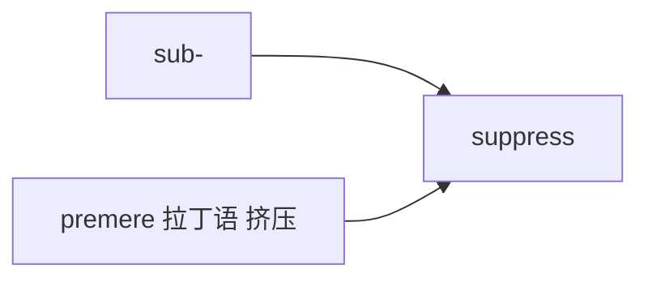

# suppress

## 1. 单词卡片

| 项目 | 内容 |
|---|---|
| 单词 | suppress |
| 词性 | verb |
| 英式音标 | /səˈpres/ |
| 美式音标 | /səˈpres/（基本相同） |
| 音节 | sup-press |
| 重音 | 第二音节 `press` |
| 核心意思 | 镇压、抑制；压抑（情绪）；阻止（消息等）公开 |

## 2. 发音拆解



发音提示：

* 重音在第二个音节 `PRESS`，读音和单词 press 完全相同
* 第一个音节 `sup` 弱读为 /səp/
* 中间的双写字母 `pp` 只读一个 /p/ 音，不要重复发音
* 中文近似音只能辅助记忆，不能代替标准发音：可理解为“瑟普瑞斯”，但真实发音更连贯短促

## 3. 核心词义



## 4. 不同词性与用法

| 词性 | 英文含义 | 中文意思 | 常见结构 |
|---|---|---|---|
| verb | forcibly put an end to (rebellion etc.) | 镇压 | suppress a rebellion |
| verb | prevent from being expressed | 抑制（情绪、笑声等） | suppress a laugh |
| verb | prevent from being known | 隐瞒、阻止公开 | suppress information |

## 5. 常见使用语境



## 6. 常见搭配

| 搭配 | 中文意思 | 使用场景 |
|---|---|---|
| suppress a rebellion | 镇压叛乱 | 政治、历史 |
| suppress emotions | 抑制情绪 | 心理、日常生活 |
| suppress information | 隐瞒信息 | 新闻、政治 |
| suppress a cough | 抑制咳嗽 | 医学 |

## 7. 基础例句

**例句 1**

```text
The government tried to **suppress** the protest.
```

政府试图镇压这场抗议活动。

**例句 2**

```text
She could barely **suppress** her laughter during the meeting.
```

她在会议上几乎抑制不住笑意。

## 8. 问答例句

**Question**

```text
Why did the company try to suppress the negative report?
```

为什么这家公司试图压下这份负面报告？

**Answer**

```text
They wanted to suppress it because it could damage their reputation.
```

他们想压下它，因为这可能损害他们的声誉。

## 9. 工作场景

```text
Don't **suppress** your concerns; raise them in the meeting.
```

不要压抑你的顾虑，在会议上提出来。

## 10. 日常生活场景

```text
He took medicine to **suppress** his appetite before the diet started.
```

他吃了药来抑制食欲，为节食做准备。

## 11. 词根词缀与构词



| 单词 | 词性 | 中文意思 |
|---|---|---|
| suppress | verb | 镇压、抑制 |
| suppression | noun | 镇压、抑制（行为） |
| suppressive | adjective | 抑制性的 |

`sub-` 在这里变形为 `sup-`，表示“在下方”，词根 `premere` 来自拉丁语“挤压”，合起来表示“向下压制”。

## 12. 同义词辨析

| 单词 | 主要区别 |
|---|---|
| suppress | 强调用力量或权力强行压制或阻止表达 |
| repress | 更偏心理学用语，指下意识地压抑情感 |
| restrain | 强调控制，语气较温和，不一定涉及强力镇压 |

## 13. 反义词

| 单词 | 中文意思 |
|---|---|
| release | 释放 |
| express | 表达 |
| encourage | 鼓励 |

## 14. 易混淆点

```text
suppress
```

镇压、抑制，强调主动、强力地压制。

```text
repress
```

压抑，更常用于心理学语境，指长期压抑情绪，可能是无意识的。

## 15. 常见错误

错误：

```text
He suppress his anger.
```

正确：

```text
He suppresses his anger.
```

说明：

`suppress` 作第三人称单数动词时需要加 `-es`（因为词尾是 `ss`），不能直接省略。

## 16. 记忆方法

```text
sup(向下) + press(挤压，来自 premere) = suppress（向下压制）
```

场景记忆：

```text
The government tried to suppress the protest.
政府试图镇压这场抗议活动。
```

## 17. 快速复习

| 问题 | 答案 |
|---|---|
| 核心意思是什么 | 镇压、抑制；阻止公开 |
| 常见词性是什么 | 动词 |
| 常见搭配是什么 | suppress a rebellion / suppress emotions |
| 容易犯的错误是什么 | 第三人称单数忘记加 -es |
