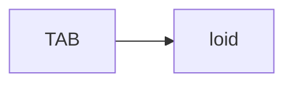
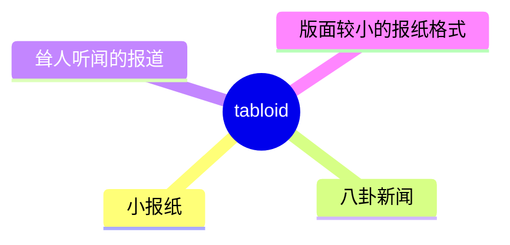
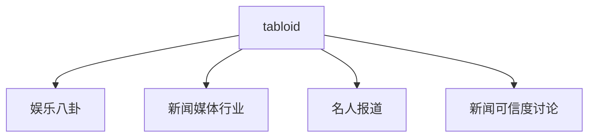
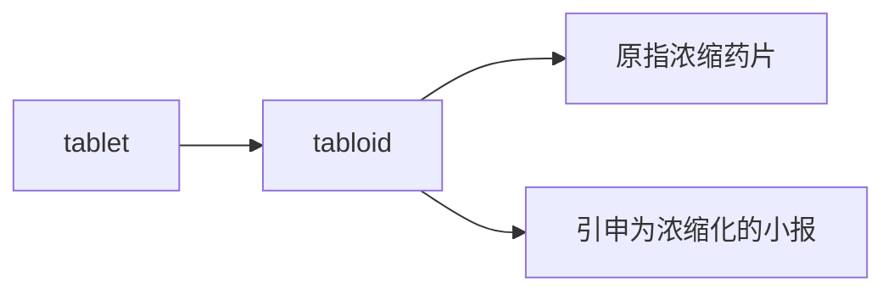

# tabloid

## 1. 单词卡片

| 项目 | 内容 |
|---|---|
| 单词 | tabloid |
| 词性 | noun / adjective |
| 英式音标 | /ˈtæblɔɪd/ |
| 美式音标 | /ˈtæblɔɪd/（基本相同） |
| 音节 | tab-loid |
| 重音 | 第一音节 `tab` |
| 核心意思 | 小报（版面小、图片多、内容常带娱乐或八卦性质的报纸） |

## 2. 发音拆解



发音提示：

* 重音在第一个音节 `TAB`，元音是 /æ/，类似单词 cat 中的元音
* 第二个音节 `loid` 读作 /lɔɪd/，包含双元音 /ɔɪ/，类似单词 boy 中的元音
* 整体发音短促清晰，只有两个音节
* 中文近似音只能辅助记忆，不能代替标准发音：可理解为“泰布洛伊德”，但真实发音只有两个音节，比中文谐音短很多

## 3. 核心词义



## 4. 不同词性与用法

| 词性 | 英文含义 | 中文意思 | 常见结构 |
|---|---|---|---|
| noun | a small-format newspaper with sensational stories | 小报 | a tabloid newspaper |
| adjective | relating to sensational, simplified news | 小报风格的、耸人听闻的 | tabloid journalism |

## 5. 常见使用语境



## 6. 常见搭配

| 搭配 | 中文意思 | 使用场景 |
|---|---|---|
| a tabloid newspaper | 一份小报 | 媒体 |
| tabloid journalism | 小报新闻业 | 媒体行业讨论 |
| tabloid headline | 小报式标题 | 新闻、娱乐 |
| the tabloid press | 小报媒体（统称） | 正式写作 |

## 7. 基础例句

**例句 1**

```text
The story was first reported by a **tabloid** newspaper.
```

这则消息最早是由一家小报报道的。

**例句 2**

```text
Celebrities often complain about **tabloid** journalism.
```

名人们常常抱怨小报新闻业。

## 8. 问答例句

**Question**

```text
Is that news source reliable, or is it just a tabloid?
```

那个新闻来源可靠吗，还是只是个小报？

**Answer**

```text
It's mostly a tabloid, so I wouldn't trust every story it publishes.
```

它基本上是个小报，所以我不会相信它发布的每一篇报道。

## 9. 工作场景

```text
Our PR team needs to respond to the **tabloid** headline about the CEO.
```

我们的公关团队需要针对小报关于首席执行官的标题做出回应。

## 10. 日常生活场景

```text
My grandmother loves reading **tabloid** gossip about movie stars.
```

我奶奶喜欢看关于电影明星的小报八卦。

## 11. 词根词缀与构词



| 单词 | 词性 | 中文意思 |
|---|---|---|
| tabloid | noun/adjective | 小报；小报风格的 |
| tablet | noun | 药片、平板（相关词，非派生词） |

`tabloid` 最初是一个药品商标名，指“浓缩药片”，后来引申指“内容浓缩、篇幅小”的报纸，逐渐演变为“耸人听闻的小报”这一含义。这一词源较为特殊，属于品牌名演变为普通名词的例子。

## 12. 同义词辨析

| 单词 | 主要区别 |
|---|---|
| tabloid | 强调版面小、内容娱乐化，常带贬义 |
| newspaper | 中性词，泛指所有报纸 |
| broadsheet | 与 tabloid 相对，指版面大、内容严肃的正式报纸 |

## 13. 反义词

| 单词 | 中文意思 |
|---|---|
| broadsheet | 大报、严肃报纸 |
| quality press | 严肃媒体 |

## 14. 易混淆点

```text
tabloid
```

小报，版面小、内容娱乐化，常带贬义。

```text
broadsheet
```

大报，版面大、内容严肃、通常被认为更权威。

## 15. 常见错误

错误：

```text
This is a very tabloid story.
```

正确：

```text
This is a very sensational story reported by a tabloid.
```

说明：

`tabloid` 作形容词时，通常直接修饰 `newspaper`、`journalism`、`headline` 等固定搭配，不太自然地用来形容“故事”本身；描述故事的耸人听闻，更自然用 `sensational`。

## 16. 记忆方法

```text
tabloid（浓缩药片 → 浓缩、简化的报纸 → 小报）
```

场景记忆：

```text
The story was first reported by a tabloid newspaper.
这则消息最早是由一家小报报道的。
```

## 17. 快速复习

| 问题 | 答案 |
|---|---|
| 核心意思是什么 | 小报；小报风格的 |
| 常见词性是什么 | 名词、形容词 |
| 常见搭配是什么 | a tabloid newspaper / tabloid journalism |
| 反义词是什么 | broadsheet（大报） |

## 18. 选择题考试

> 请先独立选择答案，不要提前展开答案区。

### 第 1 题

`tabloid` 最核心的意思是什么？

- [ ] A. 严肃的学术期刊
- [ ] B. 小报，内容常偏娱乐或八卦
- [ ] C. 官方公告
- [ ] D. 电视新闻节目

<details>
<summary>提交选择后查看结果</summary>

- 正确答案：**B. 小报，内容常偏娱乐或八卦**
- 对错判断：选择 B 为正确；选择 A、C 或 D 为错误。
- 解析：tabloid 指版面小、图片多、内容常带娱乐或八卦性质的报纸。

</details>

### 第 2 题

`tabloid` 的重音在哪个音节？

- [ ] A. 第一个音节 tab
- [ ] B. 第二个音节 loid
- [ ] C. 没有明显重音
- [ ] D. 两个音节重音相同

<details>
<summary>提交选择后查看结果</summary>

- 正确答案：**A. 第一个音节 tab**
- 对错判断：选择 A 为正确；选择 B、C 或 D 为错误。
- 解析：tabloid 重音在第一个音节 TAB 上，元音是 /æ/。

</details>

### 第 3 题

下面哪个搭配最自然？

- [ ] A. tabloid journalism
- [ ] B. tabloid mathematics
- [ ] C. tabloid chemistry
- [ ] D. tabloid engineering

<details>
<summary>提交选择后查看结果</summary>

- 正确答案：**A. tabloid journalism**
- 对错判断：选择 A 为正确；选择 B、C 或 D 为错误。
- 解析：tabloid journalism 是固定搭配，指小报式的新闻业，其他选项不是自然搭配。

</details>

### 第 4 题

`tabloid` 和 `broadsheet` 的关系是什么？

- [ ] A. 完全同义
- [ ] B. tabloid 是大报，broadsheet 是小报
- [ ] C. 两者相对，broadsheet 指版面大、内容严肃的报纸
- [ ] D. broadsheet 是 tabloid 的派生词

<details>
<summary>提交选择后查看结果</summary>

- 正确答案：**C. 两者相对，broadsheet 指版面大、内容严肃的报纸**
- 对错判断：选择 C 为正确；选择 A、B 或 D 为错误。
- 解析：broadsheet 和 tabloid 常被拿来对比，broadsheet 版面大、内容严肃，tabloid 版面小、内容娱乐化。

</details>

### 第 5 题

`tabloid` 这个词最初的含义是什么？

- [ ] A. 一种药品商标名，指浓缩药片
- [ ] B. 一种古老的乐器
- [ ] C. 一种法律文件
- [ ] D. 一种交通工具

<details>
<summary>提交选择后查看结果</summary>

- 正确答案：**A. 一种药品商标名，指浓缩药片**
- 对错判断：选择 A 为正确；选择 B、C 或 D 为错误。
- 解析：tabloid 最初是药品商标名，指“浓缩药片”，后来引申为“内容浓缩、篇幅小”的报纸。

</details>

## 19. 考试结果汇总

完成全部题目后，根据答案区自行统计：

| 正确题数 | 掌握情况 | 建议 |
|---|---|---|
| 5 题 | 已掌握 | 进入下一个单词 |
| 4 题 | 基本掌握 | 复习答错的知识点 |
| 2～3 题 | 掌握不稳 | 重新阅读搭配、例句和易错点 |
| 0～1 题 | 尚未掌握 | 重新学习整个单词课程 |
