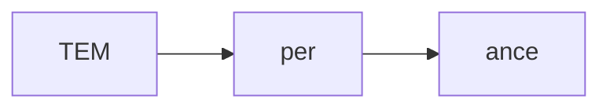
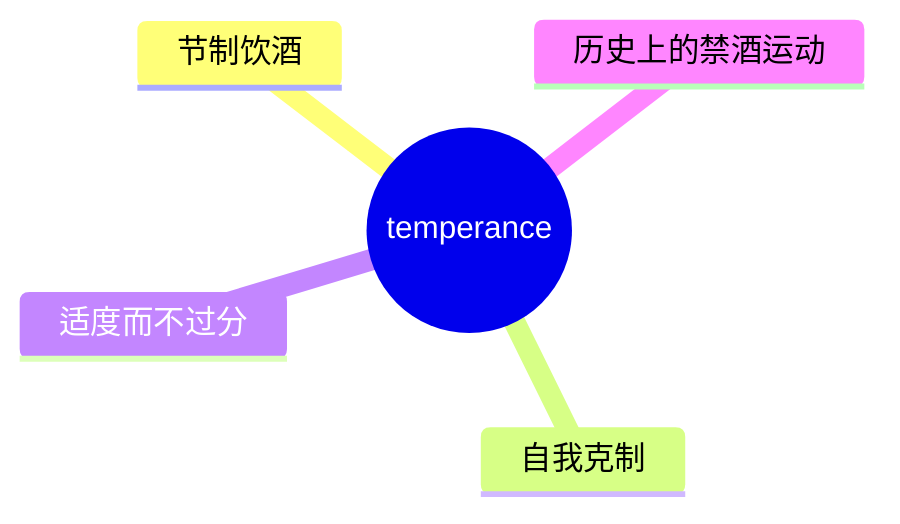
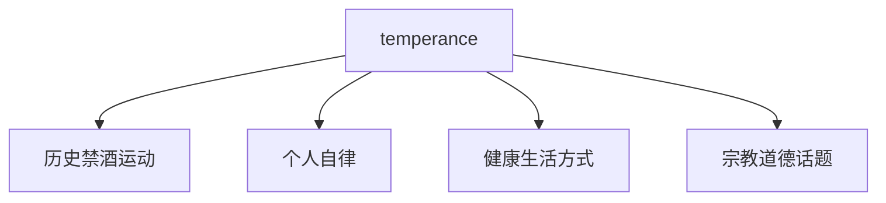
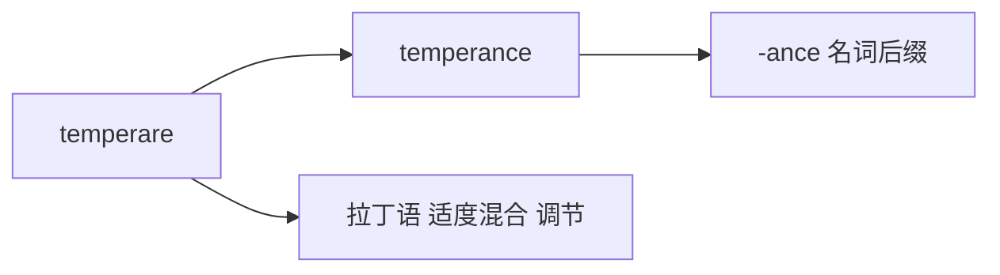

# temperance

## 1. 单词卡片

| 项目 | 内容 |
|---|---|
| 单词 | temperance |
| 词性 | noun |
| 英式音标 | /ˈtemp(ə)rəns/ |
| 美式音标 | /ˈtɛmpərəns/ |
| 音节 | tem-per-ance |
| 重音 | 第一音节 `tem` |
| 核心意思 | 节制、克制；（尤指）戒酒或适度饮酒 |

## 2. 发音拆解



发音提示：

* 重音在第一个音节 `TEM`，读作 /tem/
* 英式发音中第二个音节的 `ə` 有时会被省略，读成两个音节 `temprance`
* 词尾 `-ance` 读作弱读的 /əns/
* 中文近似音只能辅助记忆，不能代替标准发音：可理解为“坦坡兰斯”，但真实发音比中文谐音更紧凑

## 3. 核心词义



## 4. 不同词性与用法

| 词性 | 英文含义 | 中文意思 | 常见结构 |
|---|---|---|---|
| noun | moderation, especially in drinking alcohol | 节制、克制饮酒 | practice temperance |
| noun (历史) | the temperance movement (阻止饮酒的社会运动) | 禁酒运动 | the temperance movement |

## 5. 常见使用语境



## 6. 常见搭配

| 搭配 | 中文意思 | 使用场景 |
|---|---|---|
| the temperance movement | 禁酒运动 | 历史 |
| practice temperance | 保持节制 | 正式写作 |
| a life of temperance | 节制的生活 | 文学、道德话题 |
| temperance in eating | 饮食有节制 | 健康 |

## 7. 基础例句

**例句 1**

```text
The **temperance** movement led to the prohibition of alcohol in some countries.
```

禁酒运动导致一些国家禁止了酒精饮品。

**例句 2**

```text
He believed strongly in **temperance** and rarely drank.
```

他非常相信节制，很少饮酒。

## 8. 问答例句

**Question**

```text
What was the goal of the temperance movement?
```

禁酒运动的目标是什么？

**Answer**

```text
Its goal was to reduce or eliminate the consumption of alcohol.
```

它的目标是减少甚至消除酒精的消费。

## 9. 工作场景

```text
The company encourages **temperance** at work events involving alcohol.
```

公司在涉及酒精的工作活动中提倡节制。

## 10. 日常生活场景

```text
Doctors often recommend **temperance** in diet and alcohol consumption.
```

医生常常建议在饮食和饮酒上保持节制。

## 11. 词根词缀与构词



| 单词 | 词性 | 中文意思 |
|---|---|---|
| temperance | noun | 节制、克制 |
| temperate | adjective | 有节制的；（气候）温和的 |
| temper | noun/verb | 脾气；调节、缓和 |

词根 `temperare` 来自拉丁语，意思是“适度混合、调节”，加上名词后缀 `-ance`，表示“保持适度、有节制的状态”。

## 12. 同义词辨析

| 单词 | 主要区别 |
|---|---|
| temperance | 较正式、较古典，常特指对酒精的节制 |
| moderation | 更常用、更通用，可用于饮食、消费等任何方面 |
| self-control | 强调对自身行为、情绪的控制，范围更广 |

## 13. 反义词

| 单词 | 中文意思 |
|---|---|
| excess | 过度 |
| indulgence | 放纵 |

## 14. 易混淆点

```text
temperance (noun)
```

节制、克制，尤指饮酒方面。

```text
temperature (noun)
```

温度，拼写开头相似，但意思完全不同，容易被初学者看错。

## 15. 常见错误

错误：

```text
He lives with temperature.
```

正确：

```text
He lives with temperance.
```

说明：

`temperance`（节制）和 `temperature`（温度）拼写相似，意思完全不同，书写时要特别小心，不要混淆。

## 16. 记忆方法

```text
temper(调节、脾气) + ance(名词后缀) = temperance（保持适度、节制）
```

场景记忆：

```text
He believed strongly in temperance and rarely drank.
他非常相信节制，很少饮酒。
```

## 17. 快速复习

| 问题 | 答案 |
|---|---|
| 核心意思是什么 | 节制、克制，尤指饮酒 |
| 常见词性是什么 | 名词 |
| 常见搭配是什么 | the temperance movement / practice temperance |
| 容易混淆的词是什么 | temperature（温度） |
