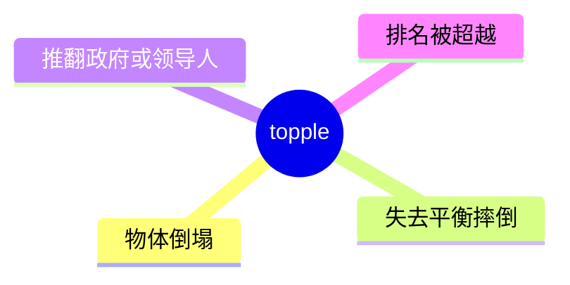
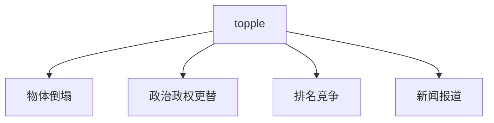

# topple

## 1. 单词卡片

| 项目 | 内容 |
|---|---|
| 单词 | topple |
| 词性 | verb |
| 英式音标 | /ˈtɒpl/ |
| 美式音标 | /ˈtɑːpl/ |
| 音节 | top-ple |
| 重音 | 第一音节 `top` |
| 核心意思 | 倒塌、翻倒；推翻（政权、领导人） |

## 2. 发音拆解


发音提示：

* 重音在第一个音节 `TOP`
* 英式发音元音是 /ɒ/，美式发音元音是 /ɑː/，是英美发音差异比较明显的一个词
* 第二个音节 `ple` 中的 `l` 是音节主音，读作很轻的 /pl/，不要加元音变成“泡”
* 中文近似音只能辅助记忆，不能代替标准发音：可理解为“陶泡”，但真实发音第二音节几乎没有独立元音

## 3. 核心词义



## 4. 不同词性与用法

| 词性 | 英文含义 | 中文意思 | 常见结构 |
|---|---|---|---|
| verb (不及物) | fall over, lose balance | 倒塌、翻倒 | topple over |
| verb (及物) | overthrow a government/leader | 推翻 | topple a regime |

## 5. 常见使用语境



## 6. 常见搭配

| 搭配 | 中文意思 | 使用场景 |
|---|---|---|
| topple over | 倒塌、翻倒 | 日常生活 |
| topple a government | 推翻政府 | 新闻、政治 |
| topple a regime | 推翻政权 | 新闻、历史 |
| be toppled from power | 被赶下台 | 政治新闻 |

## 7. 基础例句

**例句 1**

```text
The tower of blocks **toppled** over when the toddler touched it.
```

那座积木塔在小孩碰到时倒塌了。

**例句 2**

```text
The dictator was eventually **toppled** by a popular uprising.
```

这名独裁者最终被一场民众起义推翻了。

## 8. 问答例句

**Question**

```text
What caused the government to be toppled so quickly?
```

是什么导致政府这么快就被推翻了？

**Answer**

```text
Widespread protests and a loss of military support toppled the government within weeks.
```

大规模的抗议活动和军方支持的丧失在几周内就推翻了这个政府。

## 9. 工作场景

```text
The new startup has **toppled** the industry leader in market share.
```

这家新创公司在市场份额上超越了行业龙头。

## 10. 日常生活场景

```text
Be careful, that stack of books looks like it might **topple**.
```

小心点，那摞书看起来快要倒了。

## 11. 词根词缀与构词


| 单词 | 词性 | 中文意思 |
|---|---|---|
| topple | verb | 倒塌；推翻 |
| top-heavy | adjective | 头重脚轻的（相关词，非派生词） |

`topple` 由 `top`（顶部）加上表示重复动作的后缀 `-le` 构成，字面含义带有“从顶端不稳、反复摇晃后倒下”的意象。

## 12. 同义词辨析

| 单词 | 主要区别 |
|---|---|
| topple | 强调因失衡而倒下，也可比喻推翻政权 |
| overthrow | 专门用于推翻政府、政权，语气更正式、更强烈 |
| collapse | 强调整体崩塌，范围可以更大，比如建筑物、体系 |

## 13. 反义词

| 单词 | 中文意思 |
|---|---|
| stabilize | 使稳定 |
| support | 支撑 |

## 14. 易混淆点

```text
topple over
```

物体因失衡而倒塌，不及物动词用法。

```text
topple a government
```

推翻政府，及物动词用法，宾语是被推翻的对象。

同一个词根据是否带宾语，意思略有不同，需要根据上下文判断。

## 15. 常见错误

错误：

```text
The government was toppled by protests to happen.
```

正确：

```text
The government was toppled by protests.
```

说明：

`topple` 后面直接接施动者（用 by 引出），不需要额外加动词不定式；表达原因时直接用介词短语即可。

## 16. 记忆方法

```text
top(顶部) + -le(表示反复摇晃动作) = topple（从顶端摇晃后倒下）
```

场景记忆：

```text
The tower of blocks toppled over when the toddler touched it.
那座积木塔在小孩碰到时倒塌了。
```

## 17. 快速复习

| 问题 | 答案 |
|---|---|
| 核心意思是什么 | 倒塌、翻倒；推翻 |
| 常见词性是什么 | 动词 |
| 常见搭配是什么 | topple over / topple a government |
| 与 overthrow 的区别 | topple 更广泛，overthrow 专用于推翻政权 |

## 18. 选择题考试

> 请先独立选择答案，不要提前展开答案区。

### 第 1 题

`topple over` 最自然的中文意思是什么？

- [ ] A. 稳稳站立
- [ ] B. 倒塌、翻倒
- [ ] C. 慢慢上升
- [ ] D. 保持平衡

<details>
<summary>提交选择后查看结果</summary>

- 正确答案：**B. 倒塌、翻倒**
- 对错判断：选择 B 为正确；选择 A、C 或 D 为错误。
- 解析：`topple over` 是不及物用法，表示物体因为失去平衡而倒塌。

</details>

### 第 2 题

`topple` 的英式和美式发音元音有什么区别？

- [ ] A. 完全相同，没有区别
- [ ] B. 英式是 /ɒ/，美式是 /ɑː/
- [ ] C. 英式是 /iː/，美式是 /aɪ/
- [ ] D. 英式不发音，美式发音

<details>
<summary>提交选择后查看结果</summary>

- 正确答案：**B. 英式是 /ɒ/，美式是 /ɑː/**
- 对错判断：选择 B 为正确；选择 A、C 或 D 为错误。
- 解析：topple 是英美发音差异比较明显的一个词，第一个音节的元音在英式和美式中不同。

</details>

### 第 3 题

下面哪个搭配表示“推翻政府”？

- [ ] A. topple over
- [ ] B. topple a government
- [ ] C. topple a friend
- [ ] D. topple a meeting

<details>
<summary>提交选择后查看结果</summary>

- 正确答案：**B. topple a government**
- 对错判断：选择 B 为正确；选择 A、C 或 D 为错误。
- 解析：topple 作及物动词时，常见宾语是政府、政权或领导人，表示“推翻”。

</details>

### 第 4 题

下面哪句话语法正确？

- [ ] A. The government was toppled by protests to happen.
- [ ] B. The government was toppled by protests.
- [ ] C. The government toppled by protests.
- [ ] D. The government was toppling protests.

<details>
<summary>提交选择后查看结果</summary>

- 正确答案：**B. The government was toppled by protests.**
- 对错判断：选择 B 为正确；选择 A、C 或 D 为错误。
- 解析：表达“政府被抗议活动推翻”应使用被动语态 was toppled by，不需要额外加 to happen，也不能省略 was。

</details>

### 第 5 题

`topple` 和 `overthrow` 的主要区别是什么？

- [ ] A. 完全同义，可以随意互换
- [ ] B. topple 使用范围更广，可指物体倒塌或推翻政权；overthrow 专用于推翻政权
- [ ] C. overthrow 只能用于物体倒塌
- [ ] D. topple 是名词，overthrow 是动词

<details>
<summary>提交选择后查看结果</summary>

- 正确答案：**B. topple 使用范围更广，可指物体倒塌或推翻政权；overthrow 专用于推翻政权**
- 对错判断：选择 B 为正确；选择 A、C 或 D 为错误。
- 解析：topple 既可以形容物体因失衡而倒塌，也可以比喻推翻政权；overthrow 语气更正式，专门用于推翻政府或政权。

</details>

## 19. 考试结果汇总

完成全部题目后，根据答案区自行统计：

| 正确题数 | 掌握情况 | 建议 |
|---|---|---|
| 5 题 | 已掌握 | 进入下一个单词 |
| 4 题 | 基本掌握 | 复习答错的知识点 |
| 2～3 题 | 掌握不稳 | 重新阅读搭配、例句和易错点 |
| 0～1 题 | 尚未掌握 | 重新学习整个单词课程 |
