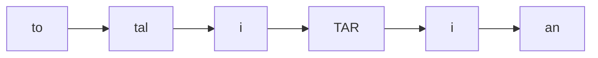
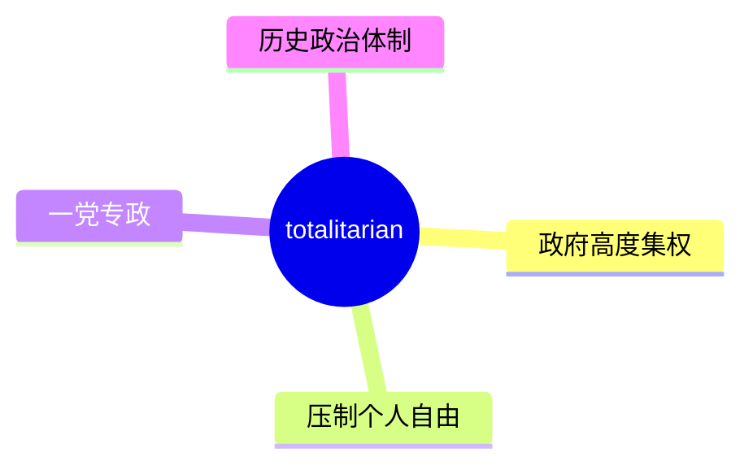
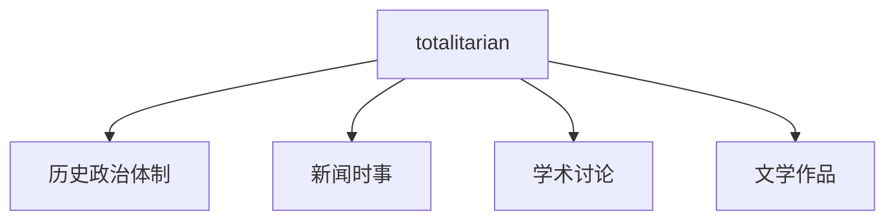
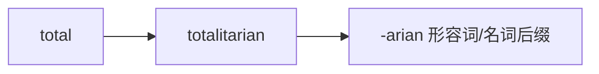

# totalitarian

## 1. 单词卡片

| 项目 | 内容 |
|---|---|
| 单词 | totalitarian |
| 词性 | adjective / noun |
| 英式音标 | /təʊˌtælɪˈteəriən/ |
| 美式音标 | /toʊˌtælɪˈteriən/ |
| 音节 | to-tal-i-tar-i-an |
| 重音 | 第四音节 `tar` |
| 核心意思 | 极权主义的；实行高度集中控制的（政府或制度） |

## 2. 发音拆解



发音提示：

* 这是一个六音节长单词，主重音在第四个音节 `TAR`，读作 /teər/（英式）或 /ter/（美式）
* 第一个音节 `to` 是弱读，英式读作 /təʊ/，美式读作 /toʊ/，这里是完整二重元音，不能弱化太多
* 中间的音节要读得又轻又快，不要每个都用力读出来
* 中文近似音只能辅助记忆，不能代替标准发音：可理解为“透泰利泰瑞恩”，但真实发音要连贯得多

## 3. 核心词义



## 4. 不同词性与用法

| 词性 | 英文含义 | 中文意思 | 常见结构 |
|---|---|---|---|
| adjective | of a government exercising total control | 极权主义的 | a totalitarian regime |
| noun | a supporter of totalitarian rule | 极权主义者 | a totalitarian |

## 5. 常见使用语境



## 6. 常见搭配

| 搭配 | 中文意思 | 使用场景 |
|---|---|---|
| a totalitarian regime | 极权主义政权 | 政治、历史 |
| totalitarian control | 极权控制 | 学术、新闻 |
| totalitarian state | 极权国家 | 政治学 |
| totalitarianism | 极权主义（名词形式） | 学术讨论 |

## 7. 基础例句

**例句 1**

```text
The novel describes life under a **totalitarian** regime.
```

这部小说描写了极权政权统治下的生活。

**例句 2**

```text
Historians study how **totalitarian** governments maintain control over their populations.
```

历史学家研究极权政府是如何维持对人口的控制的。

## 8. 问答例句

**Question**

```text
What are the main features of a totalitarian government?
```

极权政府的主要特征是什么？

**Answer**

```text
A totalitarian government typically controls the media, restricts political opposition, and monitors citizens closely.
```

极权政府通常控制媒体、限制政治反对派，并对公民进行严密监视。

## 9. 工作场景

```text
The report compares economic development under **totalitarian** and democratic systems.
```

这份报告比较了极权体制和民主体制下的经济发展情况。

## 10. 日常生活场景

```text
We discussed the novel's portrayal of a **totalitarian** society in our book club.
```

我们在读书会上讨论了这部小说对极权社会的描绘。

## 11. 词根词缀与构词



| 单词 | 词性 | 中文意思 |
|---|---|---|
| total | adjective | 完全的、全部的 |
| totalitarian | adjective/noun | 极权主义的；极权主义者 |
| totalitarianism | noun | 极权主义（制度） |

`totalitarian` 由 `total`（完全的）加上后缀 `-arian`（表示相关的人或性质）构成，字面意思强调“对社会实施全面控制”。

## 12. 同义词辨析

| 单词 | 主要区别 |
|---|---|
| totalitarian | 强调国家对政治、经济、社会、思想的全面控制 |
| authoritarian | 强调权力集中、压制反对声音，但不一定涉及全面的社会控制 |
| dictatorial | 强调独裁者个人的专断统治 |

## 13. 反义词

| 单词 | 中文意思 |
|---|---|
| democratic | 民主的 |
| liberal | 自由的、开放的 |

## 14. 易混淆点

```text
totalitarian
```

极权主义的，强调对社会全方位的控制。

```text
authoritarian
```

威权主义的，强调权力集中、压制反对声音，但控制范围不一定像 totalitarian 那样全面。

## 15. 常见错误

错误：

```text
The country has a totalitarian government since decades.
```

正确：

```text
The country has had a totalitarian government for decades.
```

说明：

表示“持续了多久”应使用现在完成时 `has had... for`，而不是 `since decades`；`since` 后面通常接一个具体的时间点，`for` 后面接一段时间长度。

## 16. 记忆方法

```text
total(完全的) + -arian(相关性质的后缀) = totalitarian（追求全面控制的）
```

场景记忆：

```text
The novel describes life under a totalitarian regime.
这部小说描写了极权政权统治下的生活。
```

## 17. 快速复习

| 问题 | 答案 |
|---|---|
| 核心意思是什么 | 极权主义的；实行全面控制的 |
| 常见词性是什么 | 形容词、名词 |
| 常见搭配是什么 | a totalitarian regime / totalitarian control |
| 和 authoritarian 的区别 | totalitarian 控制范围更全面，authoritarian 侧重权力集中 |

## 18. 选择题考试

> 请先独立选择答案，不要提前展开答案区。

### 第 1 题

`totalitarian` 最核心的意思是什么？

- [ ] A. 民主的、开放的
- [ ] B. 极权主义的，实行高度集中控制的
- [ ] C. 温和的、宽容的
- [ ] D. 临时的、短暂的

<details>
<summary>提交选择后查看结果</summary>

- 正确答案：**B. 极权主义的，实行高度集中控制的**
- 对错判断：选择 B 为正确；选择 A、C 或 D 为错误。
- 解析：totalitarian 形容一种对社会实行全面、高度集中控制的政府或制度。

</details>

### 第 2 题

`totalitarian` 的主重音在第几个音节？

- [ ] A. 第一个音节
- [ ] B. 第二个音节
- [ ] C. 第四个音节
- [ ] D. 最后一个音节

<details>
<summary>提交选择后查看结果</summary>

- 正确答案：**C. 第四个音节**
- 对错判断：选择 C 为正确；选择 A、B 或 D 为错误。
- 解析：totalitarian 是六音节词，主重音落在第四个音节 tar 上。

</details>

### 第 3 题

下面哪个搭配表示“极权主义政权”？

- [ ] A. a totalitarian regime
- [ ] B. a totalitarian breakfast
- [ ] C. a totalitarian vacation
- [ ] D. a totalitarian recipe

<details>
<summary>提交选择后查看结果</summary>

- 正确答案：**A. a totalitarian regime**
- 对错判断：选择 A 为正确；选择 B、C 或 D 为错误。
- 解析：a totalitarian regime 是政治学和历史中的常见固定搭配。

</details>

### 第 4 题

下面哪句话语法正确？

- [ ] A. The country has a totalitarian government since decades.
- [ ] B. The country has had a totalitarian government for decades.
- [ ] C. The country have a totalitarian government since decades.
- [ ] D. The country had a totalitarian government since decades.

<details>
<summary>提交选择后查看结果</summary>

- 正确答案：**B. The country has had a totalitarian government for decades.**
- 对错判断：选择 B 为正确；选择 A、C 或 D 为错误。
- 解析：表示持续了一段时间应使用现在完成时加 for，而不是 since 加一段时长。

</details>

### 第 5 题

`totalitarian` 和 `authoritarian` 的主要区别是什么？

- [ ] A. 完全同义，可以随意互换
- [ ] B. totalitarian 强调对社会各方面的全面控制，authoritarian 更侧重权力集中
- [ ] C. authoritarian 只能形容个人，totalitarian 只能形容国家
- [ ] D. totalitarian 是名词，authoritarian 是动词

<details>
<summary>提交选择后查看结果</summary>

- 正确答案：**B. totalitarian 强调对社会各方面的全面控制，authoritarian 更侧重权力集中**
- 对错判断：选择 B 为正确；选择 A、C 或 D 为错误。
- 解析：totalitarian 强调国家在政治、经济、思想等方面进行全面控制；authoritarian 强调权力集中、压制反对声音，但控制范围不一定那么全面。

</details>

## 19. 考试结果汇总

完成全部题目后，根据答案区自行统计：

| 正确题数 | 掌握情况 | 建议 |
|---|---|---|
| 5 题 | 已掌握 | 进入下一个单词 |
| 4 题 | 基本掌握 | 复习答错的知识点 |
| 2～3 题 | 掌握不稳 | 重新阅读搭配、例句和易错点 |
| 0～1 题 | 尚未掌握 | 重新学习整个单词课程 |
