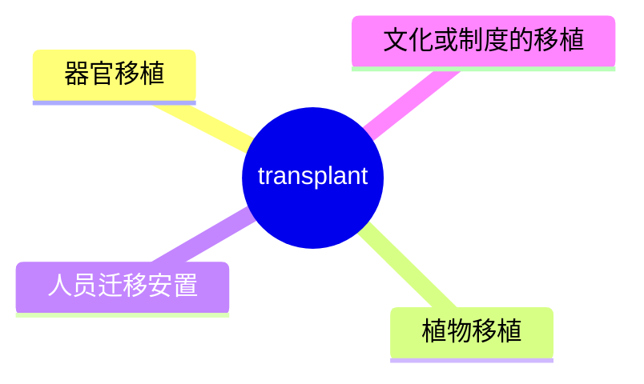
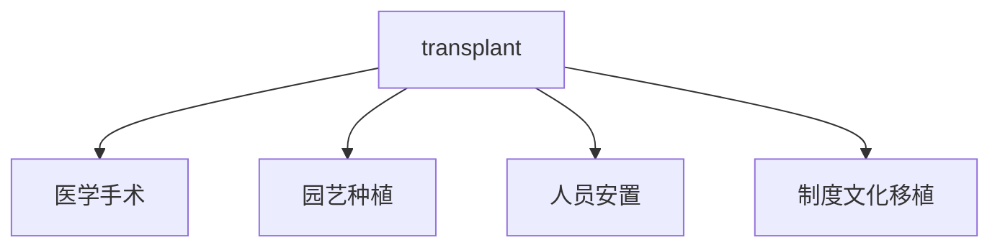
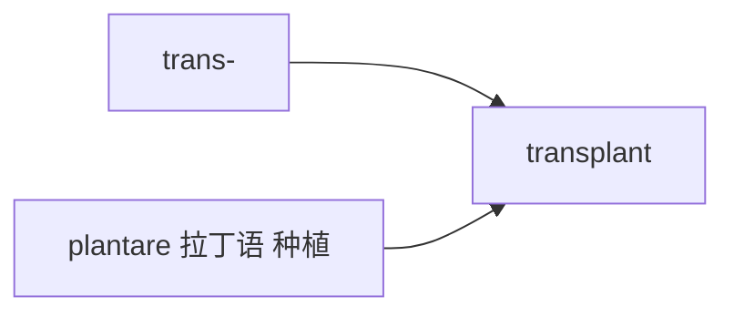

# transplant

## 1. 单词卡片

| 项目 | 内容 |
|---|---|
| 单词 | transplant |
| 词性 | verb / noun |
| 英式音标 | 动词 /trænsˈplɑːnt/，名词 /ˈtrænsplɑːnt/ |
| 美式音标 | 动词 /trænsˈplænt/，名词 /ˈtrænsplænt/ |
| 音节 | trans-plant |
| 重音 | 动词重音在第二音节，名词重音在第一音节 |
| 核心意思 | 移植（器官、植物）；使迁移到新环境 |

## 2. 发音拆解


发音提示：

* 作动词时重音在第二个音节 `PLANT`
* 作名词时重音移到第一个音节 `TRANS`，这种词性决定重音位置的变化和 record、contrast 等词类似
* 美式发音中元音更接近 /æ/，英式发音在部分方言中更接近 /ɑː/
* 中文近似音只能辅助记忆，不能代替标准发音：可理解为“川斯普兰特”，但真实发音要根据词性调整重音

## 3. 核心词义



## 4. 不同词性与用法

| 词性 | 英文含义 | 中文意思 | 常见结构 |
|---|---|---|---|
| verb | move an organ/plant to a new place | 移植 | transplant an organ |
| verb (比喻) | move people/ideas to a new setting | 使迁移、移植（观念、人） |transplant a system |
| noun | the surgical procedure or the organ | 移植手术；移植物 | a heart transplant |

## 5. 常见使用语境



## 6. 常见搭配

| 搭配 | 中文意思 | 使用场景 |
|---|---|---|
| a heart transplant | 心脏移植 | 医学 |
| an organ transplant | 器官移植 | 医学 |
| transplant seedlings | 移植幼苗 | 园艺 |
| transplant a system | 移植一套制度/系统 | 商业、比喻用法 |

## 7. 基础例句

**例句 1**

```text
She received a kidney **transplant** last year.
```

她去年接受了肾脏移植。

**例句 2**

```text
We need to **transplant** these seedlings before they outgrow the pots.
```

我们需要在这些幼苗长得太大之前把它们移植出去。

## 8. 问答例句

**Question**

```text
How long is the waiting list for a liver transplant?
```

肝脏移植的等待名单有多长？

**Answer**

```text
It can take months or even years, depending on availability.
```

根据可获得性不同，可能需要几个月甚至几年。

## 9. 工作场景

```text
The company tried to **transplant** its successful business model to a new market.
```

这家公司试图把它成功的商业模式移植到一个新市场。

## 10. 日常生活场景

```text
My uncle is a **transplant** from the countryside who now lives in the city.
```

我叔叔是从乡下迁移过来的，现在住在城市里。

## 11. 词根词缀与构词



| 单词 | 词性 | 中文意思 |
|---|---|---|
| transplant | verb/noun | 移植 |
| transplantation | noun | 移植（手术过程，更正式） |
| plant | verb/noun | 种植；植物 |

`trans-` 表示“跨越、转移”，词根 `plantare` 来自拉丁语“种植”，合起来表示“把植物或其他事物转移到新的地方栽种”。

## 12. 同义词辨析

| 单词 | 主要区别 |
|---|---|
| transplant | 强调把有生命的事物（器官、植物、人）移到新环境 |
| relocate | 更常用于人或机构的搬迁，不涉及器官或植物 |
| graft | 强调嫁接，常用于植物或皮肤移植的技术性描述 |

## 13. 反义词

没有非常固定的反义词。

## 14. 易混淆点

```text
transplant (verb) 动词重音在第二音节
```

```text
transplant (noun) 名词重音在第一音节
```

这是英语中常见的“动词重音后移、名词重音前移”的现象，和 record、export、contrast 等词类似。

## 15. 常见错误

错误：

```text
He had a transplant operation of his heart.
```

正确：

```text
He had a heart transplant.
```

说明：

英语中习惯直接用“器官 + transplant”的复合结构，比如 heart transplant、kidney transplant，不需要额外加 operation of。

## 16. 记忆方法

```text
trans(跨越) + plant(种植，来自 plantare) = transplant（把事物移到新地方栽种）
```

场景记忆：

```text
She received a kidney transplant last year.
她去年接受了肾脏移植。
```

## 17. 快速复习

| 问题 | 答案 |
|---|---|
| 核心意思是什么 | 移植（器官、植物）；使迁移 |
| 常见词性是什么 | 动词、名词，重音随词性变化 |
| 常见搭配是什么 | a heart transplant / transplant seedlings |
| 容易犯的错误是什么 | 多余地加上 operation of，应直接说 heart transplant |

## 18. 选择题考试

> 请先独立选择答案，不要提前展开答案区。

### 第 1 题

`transplant` 最核心的意思是什么？

- [ ] A. 切除、摘除
- [ ] B. 移植（器官、植物）；使迁移
- [ ] C. 修复、维修
- [ ] D. 检查、诊断

<details>
<summary>提交选择后查看结果</summary>

- 正确答案：**B. 移植（器官、植物）；使迁移**
- 对错判断：选择 B 为正确；选择 A、C 或 D 为错误。
- 解析：transplant 核心意思是把器官、植物或人从一个地方移到另一个地方。

</details>

### 第 2 题

`transplant` 作名词和作动词时，重音有什么区别？

- [ ] A. 完全一样，没有区别
- [ ] B. 动词重音在第二音节，名词重音在第一音节
- [ ] C. 动词重音在第一音节，名词重音在第二音节
- [ ] D. 名词和动词都没有重音

<details>
<summary>提交选择后查看结果</summary>

- 正确答案：**B. 动词重音在第二音节，名词重音在第一音节**
- 对错判断：选择 B 为正确；选择 A、C 或 D 为错误。
- 解析：这是英语中常见的“动词重音后移，名词重音前移”现象，和 record、export 等词类似。

</details>

### 第 3 题

下面哪个搭配表示“心脏移植”？

- [ ] A. a heart transplant
- [ ] B. a heart operation of transplant
- [ ] C. a transplant heart surgery
- [ ] D. a surgery transplant heart

<details>
<summary>提交选择后查看结果</summary>

- 正确答案：**A. a heart transplant**
- 对错判断：选择 A 为正确；选择 B、C 或 D 为错误。
- 解析：英语习惯用“器官 + transplant”的复合结构，比如 heart transplant、kidney transplant。

</details>

### 第 4 题

下面哪句话更自然？

- [ ] A. He had a transplant operation of his heart.
- [ ] B. He had a heart transplant.
- [ ] C. He had a transplant of operation heart.
- [ ] D. He had an operation transplant heart.

<details>
<summary>提交选择后查看结果</summary>

- 正确答案：**B. He had a heart transplant.**
- 对错判断：选择 B 为正确；选择 A、C 或 D 为错误。
- 解析：直接用“器官 + transplant”的复合结构最自然，不需要额外加 operation of。

</details>

### 第 5 题

`transplant` 和 `graft` 的主要区别是什么？

- [ ] A. 完全同义，可以随意互换
- [ ] B. transplant 强调把有生命的事物移到新环境，graft 更强调嫁接的技术性描述
- [ ] C. graft 只能用于人，transplant 只能用于植物
- [ ] D. transplant 是名词，graft 是动词

<details>
<summary>提交选择后查看结果</summary>

- 正确答案：**B. transplant 强调把有生命的事物移到新环境，graft 更强调嫁接的技术性描述**
- 对错判断：选择 B 为正确；选择 A、C 或 D 为错误。
- 解析：transplant 使用范围更广，可以指器官、植物或人的迁移；graft 更专注于嫁接这种具体技术，常用于植物或皮肤移植。

</details>

## 19. 考试结果汇总

完成全部题目后，根据答案区自行统计：

| 正确题数 | 掌握情况 | 建议 |
|---|---|---|
| 5 题 | 已掌握 | 进入下一个单词 |
| 4 题 | 基本掌握 | 复习答错的知识点 |
| 2～3 题 | 掌握不稳 | 重新阅读搭配、例句和易错点 |
| 0～1 题 | 尚未掌握 | 重新学习整个单词课程 |
