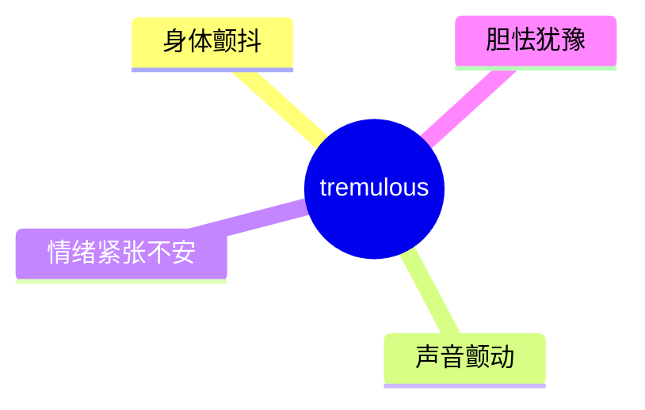
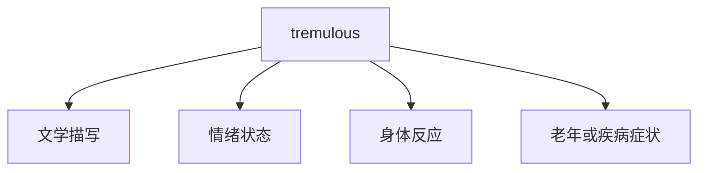
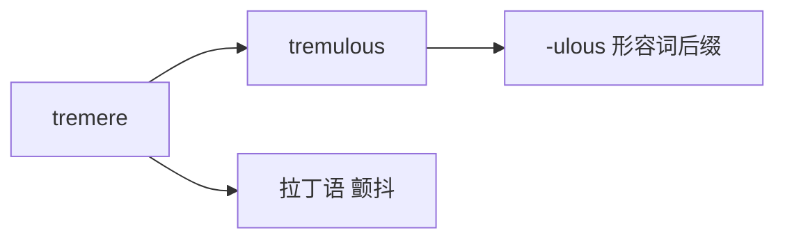

# tremulous

## 1. 单词卡片

| 项目 | 内容 |
|---|---|
| 单词 | tremulous |
| 词性 | adjective |
| 英式音标 | /ˈtremjʊləs/ |
| 美式音标 | /ˈtrɛmjələs/ |
| 音节 | trem-u-lous |
| 重音 | 第一音节 `trem` |
| 核心意思 | 颤抖的、发抖的；（声音）颤动的；胆怯不安的 |

## 2. 发音拆解


发音提示：

* 重音在第一个音节 `TREM`，元音是短元音 /e/
* 第二个音节 `u` 读作弱读的 /jʊ/ 或 /jə/
* 词尾 `-lous` 读作 /ləs/，很轻很短
* 中文近似音只能辅助记忆，不能代替标准发音：可理解为“泰缪勒斯”，但真实发音更紧凑，只有三个音节

## 3. 核心词义



## 4. 不同词性与用法

| 词性 | 英文含义 | 中文意思 | 常见结构 |
|---|---|---|---|
| adjective | shaking slightly (voice/hands) | 颤抖的、颤动的 | a tremulous voice |
| adjective (比喻) | nervous, timid | 胆怯的、不安的 | a tremulous smile |

## 5. 常见使用语境



## 6. 常见搭配

| 搭配 | 中文意思 | 使用场景 |
|---|---|---|
| a tremulous voice | 颤抖的声音 | 文学描写、日常 |
| a tremulous hand | 颤抖的手 | 医学、文学 |
| a tremulous smile | 略带不安的微笑 | 文学、情感描写 |
| tremulous with fear | 因害怕而颤抖 | 文学描写 |

## 7. 基础例句

**例句 1**

```text
She answered in a **tremulous** voice, clearly nervous.
```

她用颤抖的声音回答，显然很紧张。

**例句 2**

```text
His **tremulous** hands made it hard to hold the cup steady.
```

他颤抖的双手让他很难稳稳地拿住杯子。

## 8. 问答例句

**Question**

```text
Why did her voice sound so tremulous during the speech?
```

她演讲时的声音为什么听起来这么颤抖？

**Answer**

```text
She was extremely nervous because it was her first time speaking in public.
```

她非常紧张，因为这是她第一次公开演讲。

## 9. 工作场景

```text
The new intern gave a **tremulous** presentation, but her ideas were solid.
```

这位新实习生的演讲有些紧张颤抖，但她的想法很扎实。

## 10. 日常生活场景

```text
The old man's **tremulous** hands reminded her of her grandfather.
```

老人颤抖的双手让她想起了自己的祖父。

## 11. 词根词缀与构词



| 单词 | 词性 | 中文意思 |
|---|---|---|
| tremulous | adjective | 颤抖的 |
| tremble | verb | 颤抖（动词） |
| tremor | noun | 颤抖、震颤 |

词根 `tremere` 来自拉丁语，意思是“颤抖”，和 `tremble`（颤抖）、`tremor`（震颤）是同源词。

## 12. 同义词辨析

| 单词 | 主要区别 |
|---|---|
| tremulous | 较文学化，常用于描写声音、手部或情绪的轻微颤动 |
| shaky | 更口语化，用法更广泛，可形容任何不稳定的事物 |
| trembling | 强调正在发生的颤抖动作，是 tremble 的现在分词形式 |

## 13. 反义词

| 单词 | 中文意思 |
|---|---|
| steady | 稳定的 |
| calm | 平静的 |
| firm | 坚定的 |

## 14. 易混淆点

```text
tremulous (adjective)
```

颤抖的，用于描述状态，常见于文学语言。

```text
trembling (present participle)
```

正在颤抖的，是动词 tremble 的现在分词，语气更口语、更动态。

## 15. 常见错误

错误：

```text
She spoke tremulous.
```

正确：

```text
She spoke in a tremulous voice.
```

或：

```text
She spoke tremulously.
```

说明：

`tremulous` 是形容词，不能直接放在动词后面作状语；如果要修饰动词，应使用副词形式 `tremulously`，或者用 `in a tremulous voice` 这样的结构。

## 16. 记忆方法

```text
trem(颤抖，来自 tremere) + ulous(形容词后缀) = tremulous（微微颤抖的）
```

场景记忆：

```text
She answered in a tremulous voice, clearly nervous.
她用颤抖的声音回答，显然很紧张。
```

## 17. 快速复习

| 问题 | 答案 |
|---|---|
| 核心意思是什么 | 颤抖的、不安的 |
| 常见词性是什么 | 形容词 |
| 常见搭配是什么 | a tremulous voice / a tremulous hand |
| 容易犯的错误是什么 | 不能直接作状语，需用 tremulously 或加介词短语 |

## 18. 选择题考试

> 请先独立选择答案，不要提前展开答案区。

### 第 1 题

`tremulous` 最核心的意思是什么？

- [ ] A. 坚定的、稳定的
- [ ] B. 颤抖的、不安的
- [ ] C. 响亮的、洪亮的
- [ ] D. 疲惫的、困倦的

<details>
<summary>提交选择后查看结果</summary>

- 正确答案：**B. 颤抖的、不安的**
- 对错判断：选择 B 为正确；选择 A、C 或 D 为错误。
- 解析：tremulous 用来形容声音、手部或情绪的轻微颤动或紧张不安。

</details>

### 第 2 题

`tremulous` 的重音在哪个音节？

- [ ] A. 第一个音节 trem
- [ ] B. 第二个音节 u
- [ ] C. 第三个音节 lous
- [ ] D. 没有明显重音

<details>
<summary>提交选择后查看结果</summary>

- 正确答案：**A. 第一个音节 trem**
- 对错判断：选择 A 为正确；选择 B、C 或 D 为错误。
- 解析：tremulous 重音在第一个音节 TREM 上，后面两个音节都是弱读。

</details>

### 第 3 题

下面哪个搭配表示“颤抖的声音”？

- [ ] A. a tremulous voice
- [ ] B. a tremulous building
- [ ] C. a tremulous idea
- [ ] D. a tremulous meeting

<details>
<summary>提交选择后查看结果</summary>

- 正确答案：**A. a tremulous voice**
- 对错判断：选择 A 为正确；选择 B、C 或 D 为错误。
- 解析：a tremulous voice 是最常见的搭配之一，形容声音因紧张或害怕而颤动。

</details>

### 第 4 题

下面哪句话语法正确？

- [ ] A. She spoke tremulous.
- [ ] B. She spoke in a tremulous voice.
- [ ] C. She tremulous spoke.
- [ ] D. She spoke tremulousness.

<details>
<summary>提交选择后查看结果</summary>

- 正确答案：**B. She spoke in a tremulous voice.**
- 对错判断：选择 B 为正确；选择 A、C 或 D 为错误。
- 解析：tremulous 是形容词，不能直接放在动词后面作状语，需要用 in a tremulous voice 这样的结构，或者用副词 tremulously。

</details>

### 第 5 题

`tremulous` 和 `trembling` 的主要区别是什么？

- [ ] A. 完全同义，可以随意互换
- [ ] B. tremulous 更文学化，常描写状态；trembling 强调正在发生的颤抖动作
- [ ] C. trembling 只能用于形容建筑物
- [ ] D. tremulous 是动词，trembling 是名词

<details>
<summary>提交选择后查看结果</summary>

- 正确答案：**B. tremulous 更文学化，常描写状态；trembling 强调正在发生的颤抖动作**
- 对错判断：选择 B 为正确；选择 A、C 或 D 为错误。
- 解析：tremulous 是形容词，语气偏文学化，常描写声音或情绪的状态；trembling 是 tremble 的现在分词，更强调动作正在发生，语气更口语动态。

</details>

## 19. 考试结果汇总

完成全部题目后，根据答案区自行统计：

| 正确题数 | 掌握情况 | 建议 |
|---|---|---|
| 5 题 | 已掌握 | 进入下一个单词 |
| 4 题 | 基本掌握 | 复习答错的知识点 |
| 2～3 题 | 掌握不稳 | 重新阅读搭配、例句和易错点 |
| 0～1 题 | 尚未掌握 | 重新学习整个单词课程 |
