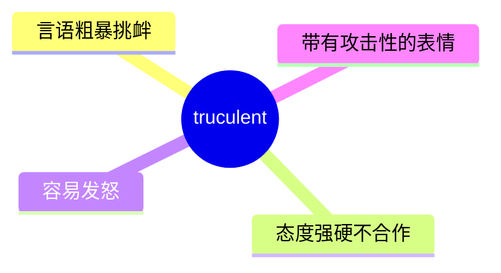
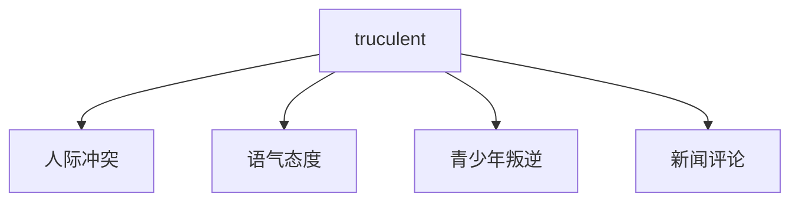
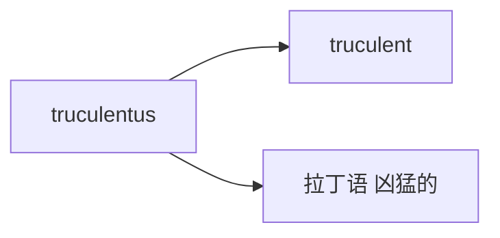

# truculent

## 1. 单词卡片

| 项目 | 内容 |
|---|---|
| 单词 | truculent |
| 词性 | adjective |
| 英式音标 | /ˈtrʌkjʊlənt/ |
| 美式音标 | /ˈtrʌkjələnt/ |
| 音节 | truc-u-lent |
| 重音 | 第一音节 `truc` |
| 核心意思 | 好斗的、粗暴挑衅的；态度强硬、不友好的 |

## 2. 发音拆解


发音提示：

* 重音在第一个音节 `TRUC`，元音是 /ʌ/，类似单词 cup 中的元音
* 第二个音节读作弱读的 /jʊ/ 或 /jə/
* 词尾 `-lent` 读作 /lənt/，`t` 要清晰发出
* 中文近似音只能辅助记忆，不能代替标准发音：可理解为“特拉克尤伦特”，但真实发音只有三个音节，比中文谐音短很多

## 3. 核心词义



## 4. 不同词性与用法

| 词性 | 英文含义 | 中文意思 | 常见结构 |
|---|---|---|---|
| adjective | eager to fight, aggressively defiant | 好斗的、挑衅的 | a truculent tone |
| adjective | harsh and uncooperative in manner | 态度强硬粗暴的 | a truculent reply |

## 5. 常见使用语境



## 6. 常见搭配

| 搭配 | 中文意思 | 使用场景 |
|---|---|---|
| a truculent tone | 挑衅的语气 | 日常、写作 |
| a truculent reply | 强硬粗暴的回应 | 正式写作 |
| a truculent teenager | 好斗的青少年 | 日常生活 |
| grow truculent | 变得好斗 | 描述情绪变化 |

## 7. 基础例句

**例句 1**

```text
He gave a **truculent** reply when questioned about the delay.
```

被问及延误问题时，他给出了一个态度强硬的回答。

**例句 2**

```text
The customer became increasingly **truculent** as the wait grew longer.
```

随着等待时间越来越长，这位顾客变得越来越暴躁挑衅。

## 8. 问答例句

**Question**

```text
Why was the manager so truculent during the meeting?
```

为什么经理在会议上态度这么强硬粗暴？

**Answer**

```text
He was under a lot of pressure and took it out on the team.
```

他承受了很大压力，把情绪发泄到了团队身上。

## 9. 工作场景

```text
Try to stay calm even if a client sounds **truculent** on the phone.
```

即使客户在电话里语气强硬，也要尽量保持冷静。

## 10. 日常生活场景

```text
Her **truculent** teenager slammed the door and refused to talk.
```

她那个好斗的青少年孩子摔上门，拒绝说话。

## 11. 词根词缀与构词



| 单词 | 词性 | 中文意思 |
|---|---|---|
| truculent | adjective | 好斗的、挑衅的 |
| truculence | noun | 好斗、粗暴（较少见） |

`truculent` 来自拉丁语 `truculentus`，意思是“凶猛的、野蛮的”，现代英语中语气有所软化，更多用来形容“态度强硬、爱找茬”的样子。

## 12. 同义词辨析

| 单词 | 主要区别 |
|---|---|
| truculent | 强调言语或态度上的挑衅和不合作，语气较文学化 |
| aggressive | 更常用、更通用，涵盖范围更广，可以是身体或言语上的 |
| hostile | 强调敌意，不一定表现为主动挑衅 |

## 13. 反义词

| 单词 | 中文意思 |
|---|---|
| cooperative | 合作的 |
| amiable | 和蔼可亲的 |
| docile | 温顺的 |

## 14. 易混淆点

```text
truculent
```

好斗挑衅的，强调态度和语气上的强硬不合作。

```text
truthful
```

诚实的，拼写开头相似，但意思完全不同，容易被初学者混淆。

## 15. 常见错误

错误：

```text
He is truculent to me yesterday.
```

正确：

```text
He was truculent with me yesterday.
```

说明：

`truculent` 后面表示对象时通常用介词 `with`，不用 `to`；同时要注意根据时态使用正确的 be 动词形式。

## 16. 记忆方法

```text
truculent（来自拉丁语“凶猛的”）→ 态度凶猛好斗、爱挑衅
```

场景记忆：

```text
He gave a truculent reply when questioned about the delay.
被问及延误问题时，他给出了一个态度强硬的回答。
```

## 17. 快速复习

| 问题 | 答案 |
|---|---|
| 核心意思是什么 | 好斗的、挑衅的、态度强硬的 |
| 常见词性是什么 | 形容词 |
| 常见搭配是什么 | a truculent tone / a truculent reply |
| 容易混淆的词是什么 | truthful（诚实的） |
