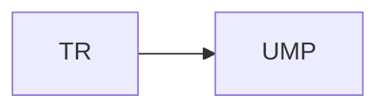
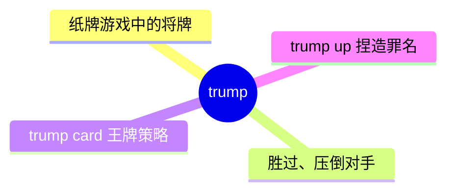
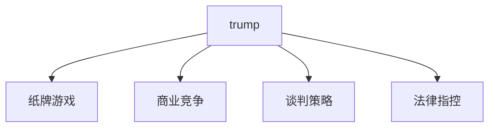
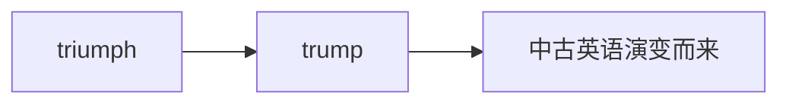

# trump

## 1. 单词卡片

| 项目 | 内容 |
|---|---|
| 单词 | trump |
| 词性 | verb / noun |
| 英式音标 | /trʌmp/ |
| 美式音标 | /trʌmp/（基本相同） |
| 音节 | trump（单音节） |
| 重音 | 单音节词，无需标重音 |
| 核心意思 | （纸牌）将牌、王牌；胜过、压倒 |

## 2. 发音拆解



发音提示：

* 单音节词，元音是 /ʌ/，类似单词 cup 中的元音
* 开头的 `tr` 组合要连贯读出，不要拆成两个音
* 词尾 `mp` 两个辅音要清晰但快速地读出，不要拖长
* 中文近似音只能辅助记忆，不能代替标准发音：可理解为“川普”，这个音在中文里常作为专有名词音译，但作普通词使用时意思完全不同

## 3. 核心词义



## 4. 不同词性与用法

| 词性 | 英文含义 | 中文意思 | 常见结构 |
|---|---|---|---|
| noun | a card that outranks others in a card game | 将牌、王牌 | play a trump |
| verb | to beat or surpass | 胜过、压倒 | trump someone's offer |
| phrase | trump card | 制胜法宝、王牌 | play one's trump card |
| phrasal verb | trump up | 捏造（罪名、借口） | trump up a charge |

## 5. 常见使用语境



## 6. 常见搭配

| 搭配 | 中文意思 | 使用场景 |
|---|---|---|
| a trump card | 王牌、制胜法宝 | 比喻、日常 |
| play one's trump card | 使出王牌策略 | 商业、谈判 |
| trump someone's offer | 出价压过某人 | 商业竞争 |
| trump up a charge | 捏造一项指控 | 法律、新闻 |

## 7. 基础例句

**例句 1**

```text
The company **trumped** its rival's bid by offering a higher price.
```

这家公司出价更高，压过了对手的报价。

**例句 2**

```text
She saved her **trump** card for the final round of negotiations.
```

她把自己的王牌留到了谈判的最后一轮。

## 8. 问答例句

**Question**

```text
What's your trump card in this negotiation?
```

你在这次谈判中的王牌是什么？

**Answer**

```text
Our trump card is that we can deliver the product faster than any competitor.
```

我们的王牌是能比任何竞争对手更快交付产品。

## 9. 工作场景

```text
Our new feature could **trump** everything else the competitors offer.
```

我们的新功能可能会胜过竞争对手提供的一切。

## 10. 日常生活场景

```text
In this card game, hearts are the **trump** suit this round.
```

在这局纸牌游戏中，红心是这一轮的将牌花色。

## 11. 词根词缀与构词



| 单词 | 词性 | 中文意思 |
|---|---|---|
| trump | verb/noun | 王牌；胜过 |
| trump up | phrasal verb | 捏造 |
| triumph | noun/verb | 胜利、凯旋（相关词，非直接派生） |

`trump` 一词据信是从 `triumph`（胜利）在中古英语中演变而来，逐渐用于指纸牌游戏中的“将牌”，因为将牌能“战胜”其他花色的牌，进而引申出“胜过、压倒”的动词含义。

## 12. 同义词辨析

| 单词 | 主要区别 |
|---|---|
| trump | 强调用更好的条件或牌面压过对方，常带策略、竞争色彩 |
| surpass | 更中性、更通用，强调在某方面超过 |
| outdo | 强调做得比别人更好，语气较口语化 |

## 13. 反义词

没有非常固定的反义词，语境中常与以下概念相对：

| 单词 | 中文意思 |
|---|---|
| lose to | 输给 |
| fall short of | 不及、逊色于 |

## 14. 易混淆点

```text
trump (王牌、胜过)
```

普通名词/动词，注意区分下面这个短语动词的特殊含义。

```text
trump up (捏造)
```

固定短语动词，意思是“捏造（罪名、借口）”，和单独使用的 trump 意思差别很大。

## 15. 常见错误

错误：

```text
He trumped up his skills in the interview.
```

正确：

```text
He exaggerated his skills in the interview.
```

说明：

`trump up` 专门用于“捏造罪名、指控或借口”这类负面、正式的语境，不适合用来表示“夸大、吹嘘技能”，这种情况更自然的说法是 `exaggerate`。

## 16. 记忆方法

```text
trump（源自 triumph 胜利）→ 能战胜其他牌的将牌 → 引申为“胜过、压倒”
```

场景记忆：

```text
The company trumped its rival's bid by offering a higher price.
这家公司出价更高，压过了对手的报价。
```

## 17. 快速复习

| 问题 | 答案 |
|---|---|
| 核心意思是什么 | 将牌、王牌；胜过、压倒 |
| 常见词性是什么 | 名词、动词 |
| 常见搭配是什么 | a trump card / trump someone's offer |
| 特殊短语动词是什么 | trump up（捏造罪名、指控） |
