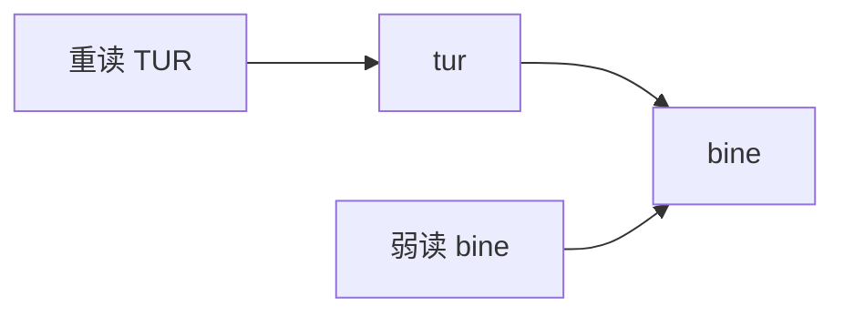
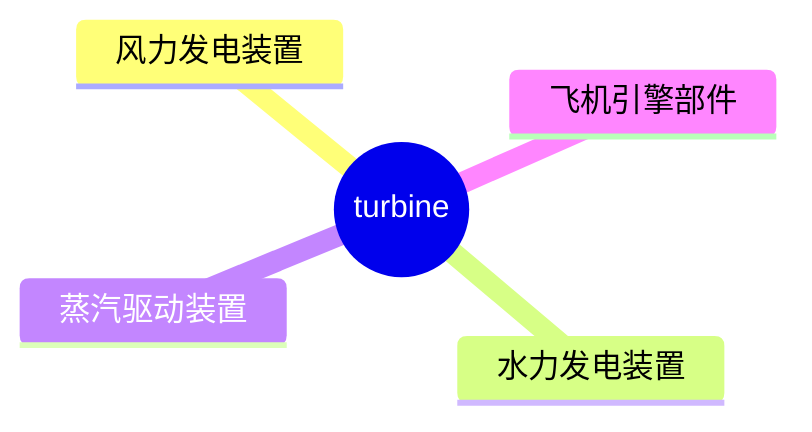
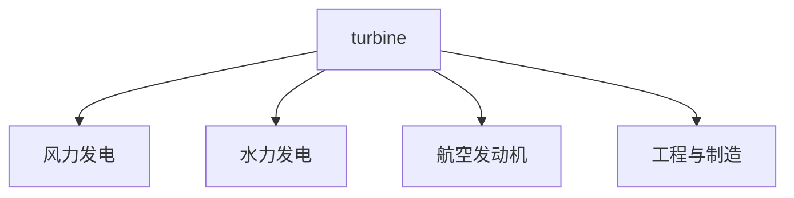
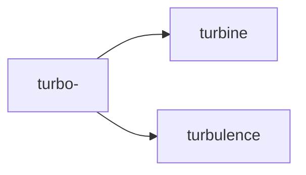

# turbine

## 1. 单词卡片

| 项目 | 内容 |
|---|---|
| 单词 | turbine |
| 词性 | noun |
| 英式音标 | /ˈtɜːbaɪn/ |
| 美式音标 | /ˈtɜːrbaɪn/ |
| 音节 | tur-bine |
| 重音 | 第一音节 |
| 核心意思 | 涡轮机、涡轮 |

## 2. 发音拆解



发音提示：

* 重音在第一个音节，读作 `/ˈtɜː/`（英）或 `/ˈtɜːr/`（美），类似“特尔”。
* 美式发音中 `r` 音要卷舌，英式发音中不发 `r` 音。
* 第二个音节 `bine` 读作 `/baɪn/`，元音是双元音 `/aɪ/`，类似“拜恩”。
* 中文近似音只能辅助记忆，不能代替标准发音：可理解为“特尔拜恩”。

## 3. 核心词义



## 4. 不同词性与用法

| 词性 | 英文含义 | 中文意思 | 常见结构 |
|---|---|---|---|
| noun | a machine that produces power using a rotating wheel driven by wind, water, steam, or gas | 涡轮机 | wind turbine, gas turbine |

说明：`turbine` 只有名词用法，没有常见的动词或形容词形式。

## 5. 常见使用语境



## 6. 常见搭配

| 搭配 | 中文意思 | 使用场景 |
|---|---|---|
| wind turbine | 风力发电机 | 能源、环保 |
| gas turbine | 燃气轮机 | 工业、发电 |
| steam turbine | 蒸汽轮机 | 传统发电厂 |
| turbine engine | 涡轮发动机 | 航空 |
| turbine blade | 涡轮叶片 | 工程制造 |

## 7. 核心句型

```text
A turbine converts A into B.
The turbine converts wind energy into electricity.
```

## 8. 基础例句

**例句 1**

```text
The wind **turbine** spins slowly on windless days.
```

在无风的日子里，风力涡轮转得很慢。

**例句 2**

```text
Engineers inspected every blade of the turbine before the test.
```

工程师在测试前检查了涡轮的每一个叶片。

## 9. 否定句、疑问句与问答

**否定句**

```text
This old turbine does not generate enough power for the village.
```

这台旧涡轮机产生的电力不足以供应这个村庄。

**一般疑问句**

```text
Does the new turbine design improve energy efficiency?
```

新的涡轮设计能提高能源效率吗？

**特殊疑问句**

```text
How much electricity can a single wind turbine produce in a day?
```

一台风力涡轮机一天能发多少电？

**问答组合**

```text
Question: Why did the turbine stop working?
Answer: A blade was damaged during the storm.
```

问：涡轮机为什么停止运转了？
答：一个叶片在暴风雨中损坏了。

## 10. 工作场景例句

```text
Our team is responsible for maintaining the turbines at the offshore wind farm.
```

我们团队负责维护这座海上风电场的涡轮机。

## 11. 日常生活例句

```text
You can see several wind turbines on the hills near our town.
```

在我们镇附近的山上可以看到好几台风力涡轮机。

## 12. 词根词缀与构词



| 单词 | 词性 | 中文意思 |
|---|---|---|
| turbine | noun | 涡轮机 |
| turbulence | noun | 湍流、乱流 |
| turbo | noun/adjective | 涡轮增压装置 |

说明：`turbine` 来自拉丁语 `turbo`（意为“旋转、漩涡”），因此和表示“旋转、扰动”的 `turbulence`（湍流）有共同的词源根基。

## 13. 派生词

| 单词 | 词性 | 中文意思 | 常见程度 |
|---|---|---|---|
| turbine | noun | 涡轮机 | 高 |
| turbo | noun/adjective | 涡轮增压 | 中 |
| turbulent | adjective | 动荡的、湍流的 | 中 |

## 14. 同义词辨析

`turbine` 是一个具体的机械专有名词，一般没有真正的同义词，但可以根据上下文和以下相关词区分：

| 单词 | 主要区别 |
|---|---|
| turbine | 具体指靠流体旋转产生动力的机械装置 |
| generator | 发电机，通常和涡轮配合使用，但发电机本身不靠流体驱动旋转 |
| engine | 泛指“引擎、发动机”，范围更广，不一定是涡轮结构 |

## 15. 反义词

`turbine` 是具体名词，没有常见反义词。

## 16. 易混淆词辨析

`turbine` 容易和 `turbulence`（湍流）拼写混淆。

| 单词 | 词性 | 中文意思 |
|---|---|---|
| turbine | noun | 涡轮机（一种机械装置） |
| turbulence | noun | 湍流、乱流（一种流体现象） |

## 17. 常见错误

错误：

```text
The plane experienced strong turbine during the flight.
```

正确：

```text
The plane experienced strong turbulence during the flight.
```

说明：描述飞机颠簸应使用 `turbulence`（湍流），而不是 `turbine`（涡轮机），这是两个完全不同的词。

## 18. 记忆方法

```text
turbine = 靠旋转产生动力的机械装置
```

场景记忆：

```text
Wind turbines convert wind energy into electricity.
风力涡轮机把风能转化成电能。
```

## 19. 快速复习

| 问题 | 答案 |
|---|---|
| 核心意思是什么 | 涡轮机 |
| 最常见搭配是什么 | wind turbine |
| 容易混淆的词是什么 | turbulence（湍流） |
| 词源含义是什么 | 来自拉丁语“旋转” |

## 20. 选择题考试

### 第 1 题

`turbine` 最核心的意思是什么？

- [ ] A. 一种旋转发电的机械装置
- [ ] B. 一种天气现象
- [ ] C. 一种建筑材料
- [ ] D. 一种交通工具

<details>
<summary>提交选择后查看结果</summary>

- 正确答案：**A. 一种旋转发电的机械装置**
- 对错判断：选择 A 为正确；选择 B、C 或 D 为错误。
- 解析：`turbine` 是通过风、水、蒸汽或燃气驱动旋转从而产生动力的机械装置。

</details>

### 第 2 题

下面哪个搭配最自然？

- [ ] A. wind turbulence
- [ ] B. wind turbine
- [ ] C. turbine storm
- [ ] D. turbo turbulence

<details>
<summary>提交选择后查看结果</summary>

- 正确答案：**B. wind turbine**
- 对错判断：选择 B 为正确；选择 A、C 或 D 为错误。
- 解析：`wind turbine`（风力涡轮机）是描述风力发电装置的标准搭配。

</details>

### 第 3 题

`turbine` 的重音在哪个音节？

- [ ] A. 第一个音节
- [ ] B. 第二个音节
- [ ] C. 没有重音
- [ ] D. 每个音节都重读

<details>
<summary>提交选择后查看结果</summary>

- 正确答案：**A. 第一个音节**
- 对错判断：选择 A 为正确；选择 B、C 或 D 为错误。
- 解析：`turbine` 的重音固定在第一个音节 `tur` 上。

</details>

### 第 4 题

下面哪个句子用词正确？

- [ ] A. The plane experienced strong turbine during the flight.
- [ ] B. The plane experienced strong turbulence during the flight.
- [ ] C. The plane has a turbulence engine.
- [ ] D. The wind turbulence spins slowly.

<details>
<summary>提交选择后查看结果</summary>

- 正确答案：**B. The plane experienced strong turbulence during the flight.**
- 对错判断：选择 B 为正确；选择 A、C 或 D 为错误。
- 解析：描述飞行中的“颠簸”应使用 `turbulence`，而不是 `turbine`。

</details>

### 第 5 题

`turbine` 一词的词源与下面哪个含义最相关？

- [ ] A. 光明
- [ ] B. 旋转
- [ ] C. 冷却
- [ ] D. 静止

<details>
<summary>提交选择后查看结果</summary>

- 正确答案：**B. 旋转**
- 对错判断：选择 B 为正确；选择 A、C 或 D 为错误。
- 解析：`turbine` 来自拉丁语 `turbo`，意为“旋转、漩涡”，涡轮机正是依靠旋转产生动力。

</details>

## 21. 考试结果汇总

| 正确题数 | 掌握情况 | 建议 |
|---|---|---|
| 5 题 | 已掌握 | 进入下一个单词 |
| 4 题 | 基本掌握 | 复习答错的知识点 |
| 2～3 题 | 掌握不稳 | 重新阅读搭配、例句和易错点 |
| 0～1 题 | 尚未掌握 | 重新学习整个单词课程 |
