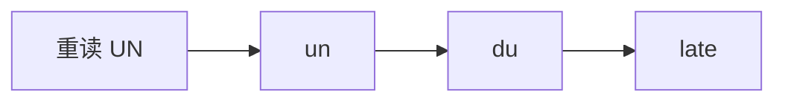
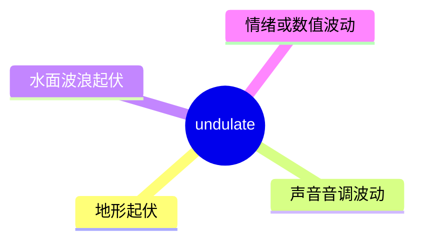
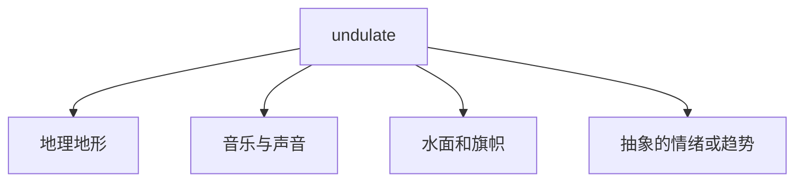
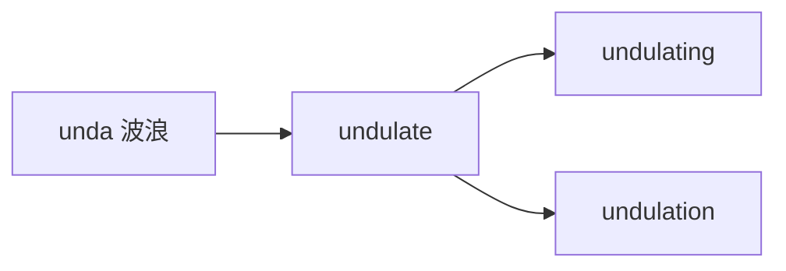

# undulate

## 1. 单词卡片

| 项目 | 内容 |
|---|---|
| 单词 | undulate |
| 词性 | verb |
| 英式音标 | /ˈʌndjuleɪt/ |
| 美式音标 | /ˈʌndʒəleɪt/ |
| 音节 | un-du-late |
| 重音 | 第一音节 |
| 核心意思 | 起伏、波动；呈波浪形移动 |

## 2. 发音拆解



发音提示：

* 重音在第一个音节，读作 `/ˈʌn/`，元音类似汉语“啊”的短促版本。
* 英式发音中间是 `/dju/`，美式常读成 `/dʒə/`，听起来更像“ju”变成“jə”。
* 最后一个音节 `late` 读作 `/leɪt/`，是清晰的双元音，不要读得太轻。
* 中文近似音只能辅助记忆，不能代替标准发音：可理解为“安杜莱特”（英式）或“安加莱特”（美式）。

## 3. 核心词义



## 4. 不同词性与用法

| 词性 | 英文含义 | 中文意思 | 常见结构 |
|---|---|---|---|
| verb (intransitive) | to move in a smooth wave-like motion | 波动、起伏移动 | the field undulates |
| verb (intransitive) | to have a wavy shape or surface | 呈波浪形 | undulating hills |

说明：`undulate` 主要作不及物动词，很少直接接宾语。

## 5. 常见使用语境



## 6. 常见搭配

| 搭配 | 中文意思 | 使用场景 |
|---|---|---|
| undulating hills | 起伏的丘陵 | 地理、旅行 |
| undulate gently | 轻柔地起伏 | 描写水面、田野 |
| the melody undulates | 旋律起伏 | 音乐描写 |
| undulating landscape | 起伏的地貌 | 写作、描述风景 |

## 7. 核心句型

```text
A undulates.
The wheat field undulates in the wind.
```

```text
A undulating N
an undulating road
```

## 8. 基础例句

**例句 1**

```text
The hills **undulate** gently toward the horizon.
```

丘陵地带缓缓起伏，一直延伸到地平线。

**例句 2**

```text
The flag undulated slowly in the light breeze.
```

旗帜在微风中缓缓飘动、起伏。

## 9. 否定句、疑问句与问答

**否定句**

```text
The road does not undulate much in this part of the country.
```

这个地区的道路起伏不大。

**一般疑问句**

```text
Does the terrain undulate a lot near the coast?
```

海岸附近的地形起伏很大吗？

**特殊疑问句**

```text
Why does her voice seem to undulate when she is nervous?
```

为什么她紧张的时候声音听起来会有起伏？

**问答组合**

```text
Question: Does the landscape undulate along this hiking trail?
Answer: Yes, it rises and falls gently the whole way.
```

问：这条徒步小径沿途的地形起伏吗？
答：是的，一路都是缓缓起伏的。

## 10. 工作场景例句

```text
The sales chart undulates from month to month, but the overall trend is upward.
```

销售图表逐月起伏波动，但整体趋势是上升的。

## 11. 日常生活例句

```text
We drove through a countryside where the fields undulated for miles.
```

我们开车穿过一片乡村，田野绵延起伏了好几英里。

## 12. 词根词缀与构词



| 单词 | 词性 | 中文意思 |
|---|---|---|
| undulate | verb | 起伏、波动 |
| undulating | adjective | 起伏的、波浪形的 |
| undulation | noun | 起伏、波动（名词形式） |

说明：`undulate` 来自拉丁语 `unda`（意为“波浪”），核心含义始终围绕“像波浪一样运动”。

## 13. 派生词

| 单词 | 词性 | 中文意思 | 常见程度 |
|---|---|---|---|
| undulate | verb | 起伏、波动 | 中 |
| undulating | adjective | 起伏的 | 高 |
| undulation | noun | 起伏、波状 | 中 |

## 14. 同义词辨析

| 单词 | 主要区别 |
|---|---|
| undulate | 强调平缓、连续的波浪形运动，语气偏书面 |
| wave | 最常用、最口语化，泛指“摆动、波动” |
| ripple | 强调细小的波纹，通常幅度更小 |
| fluctuate | 强调数值或状态的不规则波动，多用于抽象场景，如价格、情绪 |

## 15. 反义词

| 单词 | 中文意思 |
|---|---|
| flatten | 变平坦 |
| stabilize | 稳定、平稳 |
| stay level | 保持水平 |

## 16. 易混淆词辨析

`undulate` 容易和 `fluctuate` 混淆，两者都表示“波动”，但侧重点不同。

| 单词 | 侧重点 | 例句 |
|---|---|---|
| undulate | 平缓、连续、有形状的波动，常用于地形、声音、水面 | The hills undulate gently. |
| fluctuate | 不规则、数值上的波动，常用于价格、情绪、数据 | Stock prices fluctuate daily. |

## 17. 常见错误

错误：

```text
The price of oil undulates every day due to the market.
```

正确：

```text
The price of oil fluctuates every day due to the market.
```

说明：描述价格这种不规则的数值波动，应使用 `fluctuate`，而不是 `undulate`；`undulate` 更适合描述平缓、连续的物理形状起伏。

## 18. 记忆方法

```text
undulate = 像波浪一样连续起伏
```

场景记忆：

```text
The hills undulate gently toward the horizon.
丘陵缓缓起伏，延伸到地平线。
```

## 19. 快速复习

| 问题 | 答案 |
|---|---|
| 核心意思是什么 | 起伏、呈波浪形移动 |
| 最常见搭配是什么 | undulating hills |
| 容易混淆的词是什么 | fluctuate（数值不规则波动） |
| 词根含义是什么 | 来自拉丁语“波浪” |

## 20. 选择题考试

### 第 1 题

`undulate` 最核心的意思是什么？

- [ ] A. 突然停止
- [ ] B. 呈波浪形连续起伏
- [ ] C. 快速旋转
- [ ] D. 完全消失

<details>
<summary>提交选择后查看结果</summary>

- 正确答案：**B. 呈波浪形连续起伏**
- 对错判断：选择 B 为正确；选择 A、C 或 D 为错误。
- 解析：`undulate` 描述的是平缓、连续、类似波浪的起伏运动。

</details>

### 第 2 题

下面哪个搭配最自然？

- [ ] A. undulating stock prices
- [ ] B. undulating hills
- [ ] C. undulating salary
- [ ] D. undulating exam

<details>
<summary>提交选择后查看结果</summary>

- 正确答案：**B. undulating hills**
- 对错判断：选择 B 为正确；选择 A、C 或 D 为错误。
- 解析：`undulate` 常用于描述地形等物理形状的起伏，`undulating hills`（起伏的丘陵）是最典型的搭配。

</details>

### 第 3 题

`undulate` 的重音在哪个音节？

- [ ] A. 第一个音节
- [ ] B. 第二个音节
- [ ] C. 第三个音节
- [ ] D. 没有固定重音

<details>
<summary>提交选择后查看结果</summary>

- 正确答案：**A. 第一个音节**
- 对错判断：选择 A 为正确；选择 B、C 或 D 为错误。
- 解析：`undulate` 的重音固定在第一个音节 `un` 上。

</details>

### 第 4 题

描述“股价每天不规则波动”，最自然的用词是什么？

- [ ] A. undulate
- [ ] B. fluctuate
- [ ] C. flatten
- [ ] D. stabilize

<details>
<summary>提交选择后查看结果</summary>

- 正确答案：**B. fluctuate**
- 对错判断：选择 B 为正确；选择 A、C 或 D 为错误。
- 解析：股价这类数值上的不规则波动应使用 `fluctuate`，而 `undulate` 更适合描述连续、平缓的物理形状起伏。

</details>

### 第 5 题

`undulate` 的词源和下面哪个含义最相关？

- [ ] A. 波浪
- [ ] B. 火焰
- [ ] C. 石头
- [ ] D. 声音

<details>
<summary>提交选择后查看结果</summary>

- 正确答案：**A. 波浪**
- 对错判断：选择 A 为正确；选择 B、C 或 D 为错误。
- 解析：`undulate` 来自拉丁语 `unda`，意为“波浪”，词义始终围绕“像波浪一样运动”。

</details>

## 21. 考试结果汇总

| 正确题数 | 掌握情况 | 建议 |
|---|---|---|
| 5 题 | 已掌握 | 进入下一个单词 |
| 4 题 | 基本掌握 | 复习答错的知识点 |
| 2～3 题 | 掌握不稳 | 重新阅读搭配、例句和易错点 |
| 0～1 题 | 尚未掌握 | 重新学习整个单词课程 |
