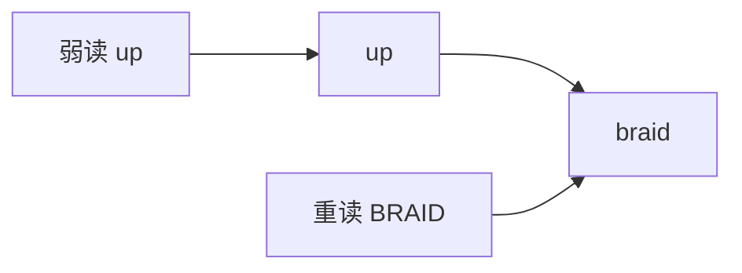
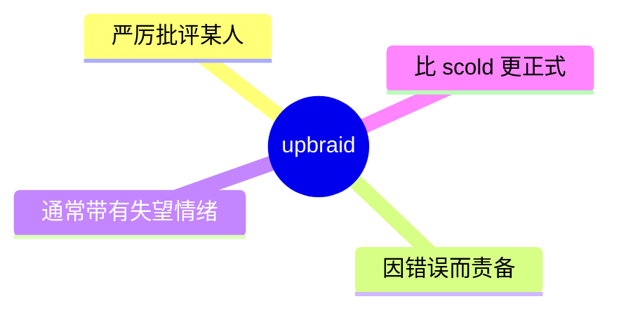
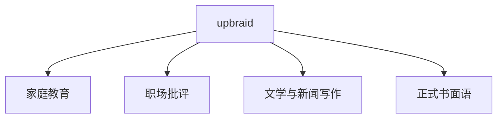
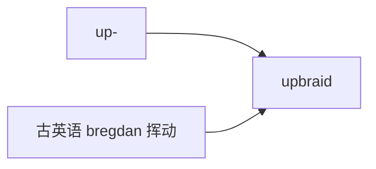

# upbraid

## 1. 单词卡片

| 项目 | 内容 |
|---|---|
| 单词 | upbraid |
| 词性 | verb |
| 英式音标 | /ʌpˈbreɪd/ |
| 美式音标 | /ʌpˈbreɪd/ |
| 音节 | up-braid |
| 重音 | 第二音节 |
| 核心意思 | 严厉斥责、责骂 |

## 2. 发音拆解



发音提示：

* 重音在第二个音节 `braid`，读作 `/ˈbreɪd/`，和英语单词 `braid`（辫子）发音相同。
* 第一个音节 `up` 读得较轻，接近 `/əp/`。
* `br` 是辅音连缀，需要连贯发出，不要在中间加入元音。
* 中文近似音只能辅助记忆，不能代替标准发音：可理解为“阿普布瑞德”。

## 3. 核心词义



## 4. 不同词性与用法

| 词性 | 英文含义 | 中文意思 | 常见结构 |
|---|---|---|---|
| verb (transitive) | to criticize someone severely, often for a mistake | 斥责、责备 | upbraid someone for something |

说明：`upbraid` 是及物动词，通常需要一个宾语，表示“责备某人”。

## 5. 常见使用语境



## 6. 常见搭配

| 搭配 | 中文意思 | 使用场景 |
|---|---|---|
| upbraid someone for something | 因某事斥责某人 | 通用 |
| upbraid oneself | 自责 | 情绪描写 |
| bitterly upbraid | 严厉地斥责 | 强调语气 |

## 7. 核心句型

```text
A upbraids B for C.
She upbraided her son for lying.
```

## 8. 基础例句

**例句 1**

```text
The manager **upbraided** the intern for missing the deadline.
```

经理因为实习生错过了截止日期而严厉斥责了他。

**例句 2**

```text
He upbraided himself for not speaking up sooner.
```

他因为没有早点站出来发声而自责不已。

## 9. 否定句、疑问句与问答

**否定句**

```text
She did not upbraid him, even though he made a serious mistake.
```

即使他犯了严重的错误，她也没有责备他。

**一般疑问句**

```text
Did the coach upbraid the team after the loss?
```

教练在输球后斥责了球队吗？

**特殊疑问句**

```text
Why did she upbraid her colleague in front of everyone?
```

她为什么在大家面前斥责她的同事？

**问答组合**

```text
Question: Did your boss upbraid you for the mistake?
Answer: No, he explained the problem calmly instead.
```

问：你的老板因为这个错误斥责你了吗？
答：没有，他反而平静地解释了问题所在。

## 10. 工作场景例句

```text
It is rarely a good idea to upbraid an employee in front of the whole team.
```

在整个团队面前斥责一名员工通常不是一个好主意。

## 11. 日常生活例句

```text
My grandmother used to upbraid us gently whenever we forgot our manners.
```

每当我们忘记礼貌，奶奶总是温和地责备我们。

## 12. 词根词缀与构词



| 单词 | 词性 | 中文意思 |
|---|---|---|
| upbraid | verb | 斥责、责备 |
| upbraiding | noun/adjective | 斥责（的） |

说明：`upbraid` 来自古英语，字面含义与“挥动、扭转”有关，后来引申为“言辞上的责备、指摘”，词源较为古老，不建议强行拆解成现代常见的前缀和词根。

## 13. 派生词

| 单词 | 词性 | 中文意思 | 常见程度 |
|---|---|---|---|
| upbraid | verb | 斥责、责备 | 中 |
| upbraiding | noun | 斥责（这个行为） | 低 |

## 14. 同义词辨析

| 单词 | 主要区别 |
|---|---|
| upbraid | 正式、书面语气强，常带有失望或痛心的情绪 |
| scold | 日常口语中最常用，多用于长辈责备晚辈 |
| criticize | 中性，泛指“批评”，不一定情绪强烈 |
| reprimand | 正式、常用于职场或官方场合的正式训斥 |

## 15. 反义词

| 单词 | 中文意思 |
|---|---|
| praise | 表扬、赞扬 |
| commend | 称赞、嘉奖 |
| compliment | 赞美 |

## 16. 易混淆词辨析

`upbraid` 容易和 `upgrade`（升级）在书写和发音上产生混淆，尤其是初学者。

| 单词 | 词性 | 中文意思 |
|---|---|---|
| upbraid | verb | 斥责、责备 |
| upgrade | verb/noun | 升级、提升 |

## 17. 常见错误

错误：

```text
He upbraided about her mistake.
```

正确：

```text
He upbraided her for her mistake.
```

说明：`upbraid` 是及物动词，直接接被责备的人作宾语，责备的原因用 `for` 引出，而不是用 `about`。

## 18. 记忆方法

```text
upbraid = 因为某事，严厉地斥责某人
```

场景记忆：

```text
The manager upbraided the intern for missing the deadline.
经理因为实习生错过了截止日期而严厉斥责了他。
```

## 19. 快速复习

| 问题 | 答案 |
|---|---|
| 核心意思是什么 | 严厉斥责、责备 |
| 常见句型是什么 | upbraid someone for something |
| 语气比 scold 更 | 正式、书面 |
| 反义词是什么 | praise（表扬） |

## 20. 选择题考试

### 第 1 题

`upbraid` 最核心的意思是什么？

- [ ] A. 表扬某人
- [ ] B. 严厉斥责某人
- [ ] C. 帮助某人
- [ ] D. 忽视某人

<details>
<summary>提交选择后查看结果</summary>

- 正确答案：**B. 严厉斥责某人**
- 对错判断：选择 B 为正确；选择 A、C 或 D 为错误。
- 解析：`upbraid` 表示因为某个错误而严厉批评、责备某人，语气正式且带有情绪色彩。

</details>

### 第 2 题

下面哪个句子语法正确？

- [ ] A. She upbraided about him for lying.
- [ ] B. She upbraided him for lying.
- [ ] C. She upbraided to him for lying.
- [ ] D. She upbraided lying to him.

<details>
<summary>提交选择后查看结果</summary>

- 正确答案：**B. She upbraided him for lying.**
- 对错判断：选择 B 为正确；选择 A、C 或 D 为错误。
- 解析：`upbraid` 直接接被责备的人作宾语，责备的原因用 `for` 引出。

</details>

### 第 3 题

`upbraid` 的重音在哪个音节？

- [ ] A. 第一个音节 up
- [ ] B. 第二个音节 braid
- [ ] C. 两个音节重音相同
- [ ] D. 没有固定重音

<details>
<summary>提交选择后查看结果</summary>

- 正确答案：**B. 第二个音节 braid**
- 对错判断：选择 B 为正确；选择 A、C 或 D 为错误。
- 解析：`upbraid` 的重音在第二个音节 `braid` 上，读作 `/ˈbreɪd/`。

</details>

### 第 4 题

下面哪个词和 `upbraid` 意思最接近，但语气更正式、常用于官方场合？

- [ ] A. praise
- [ ] B. reprimand
- [ ] C. compliment
- [ ] D. commend

<details>
<summary>提交选择后查看结果</summary>

- 正确答案：**B. reprimand**
- 对错判断：选择 B 为正确；选择 A、C 或 D 为错误。
- 解析：`reprimand` 和 `upbraid` 都表示“严厉批评”，但 `reprimand` 更常用于正式或官方场合，而 A、C、D 都是表示“表扬、赞美”的词，含义相反。

</details>

### 第 5 题

`upbraid` 容易和下面哪个单词发生拼写混淆？

- [ ] A. upgrade
- [ ] B. upload
- [ ] C. update
- [ ] D. upright

<details>
<summary>提交选择后查看结果</summary>

- 正确答案：**A. upgrade**
- 对错判断：选择 A 为正确；选择 B、C 或 D 为错误。
- 解析：`upbraid` 和 `upgrade` 都以 `up` 开头，且都是双音节词，初学者容易在拼写和发音上混淆。

</details>

## 21. 考试结果汇总

| 正确题数 | 掌握情况 | 建议 |
|---|---|---|
| 5 题 | 已掌握 | 进入下一个单词 |
| 4 题 | 基本掌握 | 复习答错的知识点 |
| 2～3 题 | 掌握不稳 | 重新阅读搭配、例句和易错点 |
| 0～1 题 | 尚未掌握 | 重新学习整个单词课程 |
