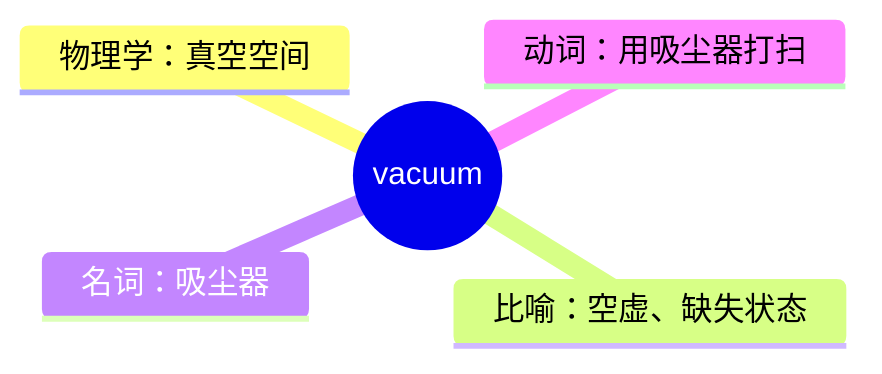
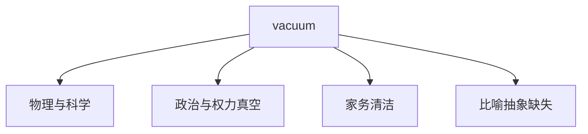
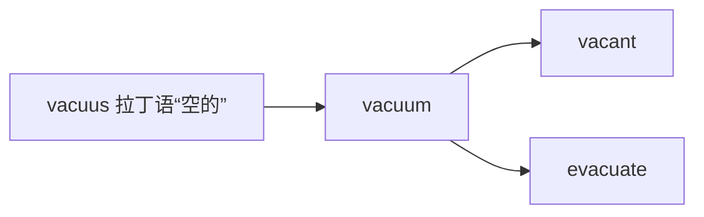

# vacuum

## 1. 单词卡片

| 项目 | 内容 |
|---|---|
| 单词 | vacuum |
| 词性 | noun / verb |
| 英式音标 | /ˈvækjuːm/ |
| 美式音标 | /ˈvækjuːm/ |
| 音节 | vac-u-um |
| 重音 | 第一音节 |
| 核心意思 | 真空；空虚状态；用吸尘器打扫 |

## 2. 发音拆解


发音提示：

* 重音在第一个音节，读作 `/ˈvæk/`，元音 `/æ/` 类似 `cat` 中的音，嘴巴要张得比较大。
* 中间的 `u` 读作半元音 `/j/` 加长音 `/uː/`，连读成 `/kjuː/`。
* 最后的 `um` 很轻，读作弱化的 `/əm/`。
* 中文近似音只能辅助记忆，不能代替标准发音：可理解为“瓦克尤姆”。
* 注意拼写中有两个 `u`，容易漏写一个，可以记成 `vac-u-um`。

## 3. 核心词义



## 4. 不同词性与用法

| 词性 | 英文含义 | 中文意思 | 常见结构 |
|---|---|---|---|
| noun | a space completely empty of matter | 真空 | in a vacuum |
| noun | a situation lacking something needed | 空白、真空状态（比喻） | a power vacuum |
| noun (informal) | a vacuum cleaner | 吸尘器（口语简称） | run the vacuum |
| verb | to clean using a vacuum cleaner | 用吸尘器打扫 | vacuum the carpet |

## 5. 常见使用语境



## 6. 常见搭配

| 搭配 | 中文意思 | 使用场景 |
|---|---|---|
| in a vacuum | 在真空中；比喻孤立地、不考虑周边因素 | 科学、比喻表达 |
| power vacuum | 权力真空 | 政治、组织管理 |
| vacuum cleaner | 吸尘器 | 家用电器 |
| vacuum the floor | 用吸尘器清扫地板 | 家务 |
| leave a vacuum | 留下空白 | 比喻 |

## 7. 核心句型

```text
Nothing happens in a vacuum.
Decisions are never made in a vacuum.
```

```text
vacuum + 名词（动词用法）
I need to vacuum the living room before guests arrive.
```

## 8. 基础例句

**例句 1**

```text
Sound cannot travel through a **vacuum**.
```

声音无法在真空中传播。

**例句 2**

```text
His sudden resignation left a power vacuum in the department.
```

他的突然辞职在部门里留下了一个权力真空。

## 9. 否定句、疑问句与问答

**否定句**

```text
Business decisions do not happen in a vacuum; they always affect other departments.
```

商业决策不是在真空中做出的，它们总会影响其他部门。

**一般疑问句**

```text
Did you vacuum the bedroom yet?
```

你已经用吸尘器打扫卧室了吗？

**特殊疑问句**

```text
How often should we vacuum the carpet?
```

我们应该多久用吸尘器清扫一次地毯？

**问答组合**

```text
Question: Can anything exist in a perfect vacuum?
Answer: Yes, but very few things behave the way we expect there.
```

问：任何东西都能存在于完美真空中吗？
答：可以，但很少有东西会按照我们预期的方式表现。

## 10. 工作场景例句

```text
When the manager left without a replacement plan, it created a leadership vacuum on the team.
```

经理离职却没有交接计划，这在团队中造成了领导层的真空。

## 11. 日常生活例句

```text
I usually vacuum the whole apartment on Sunday mornings.
```

我通常在周日早上给整个公寓吸尘。

## 12. 词根词缀与构词



| 单词 | 词性 | 中文意思 |
|---|---|---|
| vacuum | noun/verb | 真空；吸尘 |
| vacant | adjective | 空的、空缺的 |
| evacuate | verb | 疏散、撤离 |

说明：`vacuum` 来自拉丁语 `vacuus`（意为“空的”），与 `vacant`（空缺的）、`evacuate`（撤离、清空）属于同一个词源家族，核心概念都是“空”。

## 13. 派生词

| 单词 | 词性 | 中文意思 | 常见程度 |
|---|---|---|---|
| vacuum | noun/verb | 真空；用吸尘器打扫 | 高 |
| vacuum cleaner | noun | 吸尘器（完整说法） | 高 |
| vacuous | adjective | 空洞的、没有内容的 | 中 |

## 14. 同义词辨析

| 单词 | 主要区别 |
|---|---|
| vacuum | 强调完全没有物质或内容的“空”，多用于科学或比喻表达 |
| void | 语气更抽象、更文学化，常用于描述情感或抽象上的空虚 |
| emptiness | 最口语化，泛指“空、空虚”，可用于物理或情感场景 |
| gap | 强调“缺口、空缺”，不一定完全是空的，只是有所欠缺 |

## 15. 反义词

| 单词 | 中文意思 |
|---|---|
| fullness | 充满、丰满 |
| abundance | 丰富、充裕 |

## 16. 易混淆词辨析

`vacuum` 作名词（真空）和作动词（用吸尘器打扫）时拼写完全相同，学习者容易搞不清语境。

| 用法 | 词性 | 例句 |
|---|---|---|
| Sound cannot travel through a vacuum. | noun | 描述物理上的真空 |
| I need to vacuum the carpet. | verb | 描述打扫地毯的动作 |

## 17. 常见错误

错误：

```text
I need to vacuum cleaner the room.
```

正确：

```text
I need to vacuum the room.
```

说明：作动词使用时，直接用 `vacuum` 即可，不需要加上 `cleaner`；`vacuum cleaner` 只在指代“吸尘器”这个物品（名词）时使用。

## 18. 记忆方法

```text
vacuum = 完全没有物质的“空” → 引申为“权力真空”“情感空虚”，也指“用吸尘器清空灰尘”
```

场景记忆：

```text
I usually vacuum the whole apartment on Sunday mornings.
我通常在周日早上给整个公寓吸尘。
```

## 19. 快速复习

| 问题 | 答案 |
|---|---|
| 核心意思是什么 | 真空；空虚；用吸尘器打扫 |
| 常见比喻搭配是什么 | power vacuum（权力真空） |
| 动词用法怎么用 | vacuum the carpet（直接接宾语） |
| 词源含义是什么 | 来自拉丁语“空的” |

## 20. 选择题考试

### 第 1 题

`in a vacuum` 在比喻意义上最常表达什么？

- [ ] A. 在真实的物理真空里
- [ ] B. 孤立地、不考虑其他因素地
- [ ] C. 在非常拥挤的环境里
- [ ] D. 在极度寒冷的环境里

<details>
<summary>提交选择后查看结果</summary>

- 正确答案：**B. 孤立地、不考虑其他因素地**
- 对错判断：选择 B 为正确；选择 A、C 或 D 为错误。
- 解析：`in a vacuum` 常用于比喻，表示某件事发生时没有考虑周围的环境或影响，是孤立发生的。

</details>

### 第 2 题

下面哪个句子中 `vacuum` 是动词用法？

- [ ] A. Sound cannot travel through a vacuum.
- [ ] B. I need to vacuum the living room.
- [ ] C. His resignation left a power vacuum.
- [ ] D. Nothing exists in a perfect vacuum.

<details>
<summary>提交选择后查看结果</summary>

- 正确答案：**B. I need to vacuum the living room.**
- 对错判断：选择 B 为正确；选择 A、C 或 D 为错误。
- 解析：只有 B 中的 `vacuum` 表示“用吸尘器打扫”的动作，是动词用法；其余三句都是名词用法。

</details>

### 第 3 题

`vacuum` 的重音在哪个音节？

- [ ] A. 第一个音节
- [ ] B. 第二个音节
- [ ] C. 第三个音节
- [ ] D. 没有固定重音

<details>
<summary>提交选择后查看结果</summary>

- 正确答案：**A. 第一个音节**
- 对错判断：选择 A 为正确；选择 B、C 或 D 为错误。
- 解析：`vacuum` 的重音固定在第一个音节 `vac` 上。

</details>

### 第 4 题

下面哪个搭配最自然地表示“权力真空”？

- [ ] A. vacuum power
- [ ] B. power vacuum
- [ ] C. vacuum of power cleaner
- [ ] D. vacuous power

<details>
<summary>提交选择后查看结果</summary>

- 正确答案：**B. power vacuum**
- 对错判断：选择 B 为正确；选择 A、C 或 D 为错误。
- 解析：`power vacuum` 是固定搭配，表示因领导缺失而产生的“权力真空”。

</details>

### 第 5 题

`vacuum` 的词源含义与下面哪个最接近？

- [ ] A. 圆的
- [ ] B. 空的
- [ ] C. 快的
- [ ] D. 热的

<details>
<summary>提交选择后查看结果</summary>

- 正确答案：**B. 空的**
- 对错判断：选择 B 为正确；选择 A、C 或 D 为错误。
- 解析：`vacuum` 来自拉丁语 `vacuus`，意思是“空的”，与 `vacant`（空缺的）同源。

</details>

## 21. 考试结果汇总

| 正确题数 | 掌握情况 | 建议 |
|---|---|---|
| 5 题 | 已掌握 | 进入下一个单词 |
| 4 题 | 基本掌握 | 复习答错的知识点 |
| 2～3 题 | 掌握不稳 | 重新阅读搭配、例句和易错点 |
| 0～1 题 | 尚未掌握 | 重新学习整个单词课程 |
