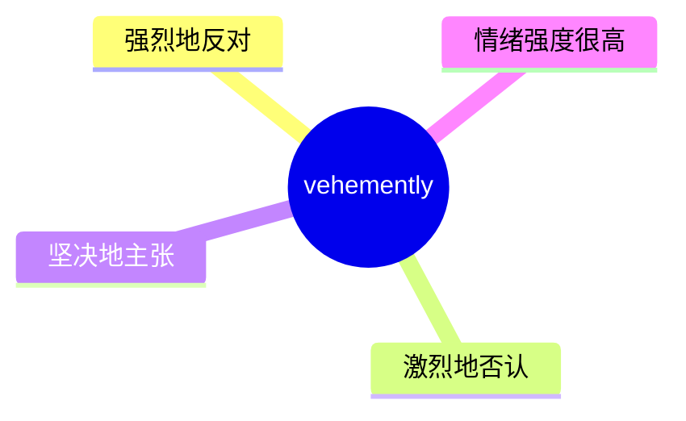
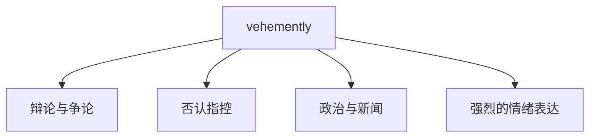
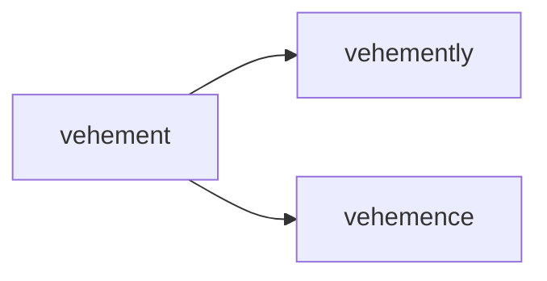

# vehemently

## 1. 单词卡片

| 项目 | 内容 |
|---|---|
| 单词 | vehemently |
| 词性 | adverb |
| 英式音标 | /ˈviːəməntli/ |
| 美式音标 | /ˈviːəməntli/ |
| 音节 | ve-he-ment-ly |
| 重音 | 第一音节 |
| 核心意思 | 强烈地、激烈地；坚决地 |

## 2. 发音拆解


发音提示：

* 重音在第一个音节，读作 `/ˈviː/`，是长元音，类似“唯”。
* 第二个音节 `he` 中的 `h` 音很轻，几乎不发声，容易被忽略。
* 注意这里不要把 `h` 读成汉语拼音的“喝”，英语中 `h` 音更轻、更快。
* 最后的 `-ly` 是常见副词后缀，读作轻快的 `/li/`。
* 中文近似音只能辅助记忆，不能代替标准发音：可理解为“唯厄门特利”。

## 3. 核心词义



## 4. 不同词性与用法

| 词性 | 英文含义 | 中文意思 | 常见结构 |
|---|---|---|---|
| adverb | in a forceful, passionate, or intense way | 强烈地、激烈地 | vehemently deny / oppose / argue |

说明：`vehemently` 是副词，通常修饰表达情绪或立场的动词，如 `deny`（否认）、`oppose`（反对）、`argue`（争辩）。

## 5. 常见使用语境



## 6. 常见搭配

| 搭配 | 中文意思 | 使用场景 |
|---|---|---|
| vehemently deny | 强烈否认 | 新闻、法律 |
| vehemently oppose | 强烈反对 | 政治、辩论 |
| vehemently argue | 激烈争辩 | 讨论、争执 |
| vehemently insist | 坚决坚持 | 意见表达 |

## 7. 核心句型

```text
A vehemently V-ed B.
He vehemently denied the accusations.
```

## 8. 基础例句

**例句 1**

```text
She **vehemently** opposed the new company policy.
```

她强烈反对这项新的公司政策。

**例句 2**

```text
The suspect vehemently denied any involvement in the crime.
```

嫌疑人激烈地否认与这起犯罪有任何关系。

## 9. 否定句、疑问句与问答

**否定句**

```text
He did not vehemently object; he simply raised a few concerns.
```

他并没有激烈反对，只是提出了一些顾虑。

**一般疑问句**

```text
Did she vehemently argue against the proposal in the meeting?
```

她在会议上激烈地反对了这项提案吗？

**特殊疑问句**

```text
Why did he react so vehemently to a simple question?
```

他为什么对一个简单的问题反应如此激烈？

**问答组合**

```text
Question: Did the committee vehemently reject the budget cut?
Answer: Yes, several members spoke out strongly against it.
```

问：委员会强烈拒绝了预算削减吗？
答：是的，好几位成员都强烈发言反对。

## 10. 工作场景例句

```text
The employees vehemently protested the sudden change in the vacation policy.
```

员工们对休假政策的突然变动表示强烈抗议。

## 11. 日常生活例句

```text
My grandfather vehemently insists on cooking dinner himself every night.
```

我爷爷坚决坚持每晚都自己做饭。

## 12. 词根词缀与构词



| 单词 | 词性 | 中文意思 |
|---|---|---|
| vehement | adjective | 强烈的、激烈的 |
| vehemently | adverb | 强烈地、激烈地 |
| vehemence | noun | 激烈、强烈的情绪 |

说明：`vehemently` 由形容词 `vehement` 加上副词后缀 `-ly` 构成，来自拉丁语，本义与“猛烈、热切”有关。

## 13. 派生词

| 单词 | 词性 | 中文意思 | 常见程度 |
|---|---|---|---|
| vehement | adjective | 强烈的、激烈的 | 中 |
| vehemently | adverb | 强烈地 | 高 |
| vehemence | noun | 激烈、强烈 | 低 |

## 14. 同义词辨析

| 单词 | 主要区别 |
|---|---|
| vehemently | 强调情绪激烈、态度坚决，常用于书面语和正式表达 |
| strongly | 最常用、语气中性，适用范围广 |
| fiercely | 强调“凶猛、激烈”，有一定攻击性色彩 |
| passionately | 强调“充满热情”，不一定带有对抗性 |

## 15. 反义词

| 单词 | 中文意思 |
|---|---|
| mildly | 温和地 |
| calmly | 平静地 |
| indifferently | 漠不关心地 |

## 16. 易混淆词辨析

`vehemently` 容易和 `violently`（暴力地）混淆，两者都带有“强烈”的含义，但侧重点不同。

| 单词 | 侧重点 | 例句 |
|---|---|---|
| vehemently | 强调情绪或态度上的强烈、坚决，不一定涉及肢体行为 | She vehemently denied the accusation. |
| violently | 强调身体上的暴力行为，带有肢体冲突的含义 | The protest turned violently against police. |

## 17. 常见错误

错误：

```text
He vehemently hit the table when he was angry.
```

正确：

```text
He violently hit the table when he was angry.
```

说明：描述具体的肢体动作（如猛击桌子）应使用 `violently`，而 `vehemently` 主要用来形容言语、态度或情绪上的强烈，不直接修饰身体动作。

## 18. 记忆方法

```text
vehemently = 情绪强烈、态度坚决地表达（否认、反对、坚持）
```

场景记忆：

```text
The suspect vehemently denied any involvement in the crime.
嫌疑人激烈地否认与这起犯罪有任何关系。
```

## 19. 快速复习

| 问题 | 答案 |
|---|---|
| 核心意思是什么 | 强烈地、激烈地、坚决地 |
| 最常见搭配是什么 | vehemently deny |
| 容易混淆的词是什么 | violently（暴力地，涉及肢体动作） |
| 对应的形容词是什么 | vehement |

## 20. 选择题考试

### 第 1 题

`vehemently` 最核心的意思是什么？

- [ ] A. 平静地、温和地
- [ ] B. 强烈地、激烈地
- [ ] C. 缓慢地
- [ ] D. 随意地

<details>
<summary>提交选择后查看结果</summary>

- 正确答案：**B. 强烈地、激烈地**
- 对错判断：选择 B 为正确；选择 A、C 或 D 为错误。
- 解析：`vehemently` 用来描述情绪或态度非常强烈、坚决，常修饰 `deny`、`oppose` 等动词。

</details>

### 第 2 题

下面哪个搭配最自然？

- [ ] A. vehemently sleep
- [ ] B. vehemently deny
- [ ] C. vehemently relax
- [ ] D. vehemently smile

<details>
<summary>提交选择后查看结果</summary>

- 正确答案：**B. vehemently deny**
- 对错判断：选择 B 为正确；选择 A、C 或 D 为错误。
- 解析：`vehemently deny`（强烈否认）是最常见、最自然的搭配，`vehemently` 通常修饰表达对抗或坚决态度的动词。

</details>

### 第 3 题

`vehemently` 的重音在哪个音节？

- [ ] A. 第一个音节
- [ ] B. 第二个音节
- [ ] C. 第三个音节
- [ ] D. 最后一个音节

<details>
<summary>提交选择后查看结果</summary>

- 正确答案：**A. 第一个音节**
- 对错判断：选择 A 为正确；选择 B、C 或 D 为错误。
- 解析：`vehemently` 的重音固定在第一个音节 `ve` 上，读作长元音 `/viː/`。

</details>

### 第 4 题

下面哪个句子用词更自然，能准确描述“猛击桌子”这个身体动作？

- [ ] A. He vehemently hit the table.
- [ ] B. He violently hit the table.
- [ ] C. He vehemence hit the table.
- [ ] D. He vehement hit the table.

<details>
<summary>提交选择后查看结果</summary>

- 正确答案：**B. He violently hit the table.**
- 对错判断：选择 B 为正确；选择 A、C 或 D 为错误。
- 解析：描述具体的肢体动作应使用 `violently`，`vehemently` 主要用于形容言语或态度上的强烈，不直接修饰身体动作。

</details>

### 第 5 题

`vehemently` 对应的形容词形式是什么？

- [ ] A. vehemence
- [ ] B. vehement
- [ ] C. vehemential
- [ ] D. vehementous

<details>
<summary>提交选择后查看结果</summary>

- 正确答案：**B. vehement**
- 对错判断：选择 B 为正确；选择 A、C 或 D 为错误。
- 解析：`vehemently` 是副词，由形容词 `vehement` 加上 `-ly` 构成；`vehemence` 是对应的名词形式。

</details>

## 21. 考试结果汇总

| 正确题数 | 掌握情况 | 建议 |
|---|---|---|
| 5 题 | 已掌握 | 进入下一个单词 |
| 4 题 | 基本掌握 | 复习答错的知识点 |
| 2～3 题 | 掌握不稳 | 重新阅读搭配、例句和易错点 |
| 0～1 题 | 尚未掌握 | 重新学习整个单词课程 |
