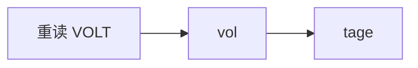
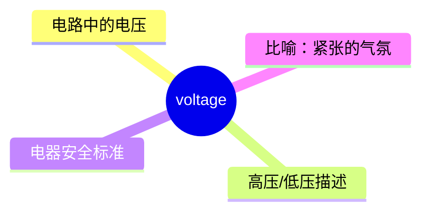
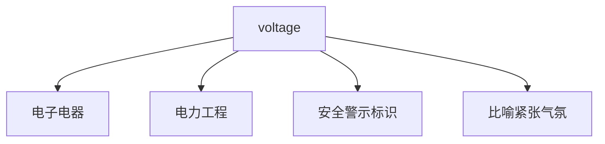
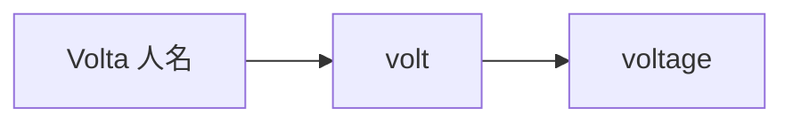

# voltage

## 1. 单词卡片

| 项目 | 内容 |
|---|---|
| 单词 | voltage |
| 词性 | noun |
| 英式音标 | /ˈvəʊltɪdʒ/ |
| 美式音标 | /ˈvoʊltɪdʒ/ |
| 音节 | vol-tage |
| 重音 | 第一音节 |
| 核心意思 | 电压 |

## 2. 发音拆解



发音提示：

* 重音在第一个音节，读作 `/ˈvəʊlt/`（英）或 `/ˈvoʊlt/`（美），是双元音，类似“沃尔特”。
* 第二个音节 `-tage` 读作 `/tɪdʒ/`，不要按照法语单词的习惯读成“塔日”。
* 词尾的 `-age` 在这里发轻音 `/ɪdʒ/`，和 `village`（村庄）结尾的发音方式相同。
* 中文近似音只能辅助记忆，不能代替标准发音：可理解为“沃尔泰奇”。

## 3. 核心词义



## 4. 不同词性与用法

| 词性 | 英文含义 | 中文意思 | 常见结构 |
|---|---|---|---|
| noun | the force that drives electric current through a circuit | 电压 | high/low voltage |

说明：`voltage` 是不可数名词，通常不用复数形式，除非specifically 指“多个不同电压值”。

## 5. 常见使用语境



## 6. 常见搭配

| 搭配 | 中文意思 | 使用场景 |
|---|---|---|
| high voltage | 高压 | 电力、安全警示 |
| low voltage | 低压 | 电子设备 |
| voltage drop | 电压降 | 电路、工程 |
| stable voltage | 稳定电压 | 电力供应 |
| voltage regulator | 稳压器 | 电子设备 |

## 7. 核心句型

```text
The voltage is + 数值.
The voltage is 220 volts in most European countries.
```

## 8. 基础例句

**例句 1**

```text
Please be careful — this cable carries a very high **voltage**.
```

请小心——这根电缆的电压非常高。

**例句 2**

```text
A sudden voltage drop caused the machine to shut down.
```

突然的电压下降导致机器停机了。

## 9. 否定句、疑问句与问答

**否定句**

```text
This appliance does not require a high voltage to operate.
```

这个电器不需要高电压就能运行。

**一般疑问句**

```text
Does this charger support 110-volt as well as 220-volt voltage?
```

这个充电器同时支持110伏和220伏的电压吗？

**特殊疑问句**

```text
What voltage does this device need to work safely?
```

这个设备安全运行需要多少电压？

**问答组合**

```text
Question: What is the standard voltage in your country?
Answer: It is 220 volts, but some older buildings still use 110 volts.
```

问：你们国家的标准电压是多少？
答：是220伏，不过一些老建筑仍然使用110伏。

## 10. 工作场景例句

```text
The engineer measured the voltage across the circuit before continuing the repair.
```

工程师在继续维修之前测量了电路两端的电压。

## 11. 日常生活例句

```text
Make sure the voltage matches before plugging in a foreign appliance.
```

在插入国外电器之前，一定要确认电压是否匹配。

## 12. 词根词缀与构词



| 单词 | 词性 | 中文意思 |
|---|---|---|
| volt | noun | 伏特（电压单位） |
| voltage | noun | 电压 |

说明：`volt` 来自意大利科学家 Alessandro Volta 的姓氏，`voltage` 是在 `volt` 后面加上表示“性质、程度”的后缀 `-age` 构成的，表示“电压这种性质或数值”。

## 13. 派生词

| 单词 | 词性 | 中文意思 | 常见程度 |
|---|---|---|---|
| volt | noun | 伏特 | 高 |
| voltage | noun | 电压 | 高 |
| voltmeter | noun | 伏特计、电压表 | 中 |

## 14. 同义词辨析

`voltage` 是一个具体的物理量名词，一般没有直接的同义词，但需要与相关电学术语区分：

| 单词 | 主要区别 |
|---|---|
| voltage | 电压，即驱动电流的“电势差”，单位是伏特 |
| current | 电流，即电荷流动的速率，单位是安培，和电压是不同的物理量 |
| power | 功率，表示单位时间内做的功，单位是瓦特，由电压和电流共同决定 |

## 15. 反义词

`voltage` 是一个具体的物理量名词，没有严格意义上的反义词。

## 16. 易混淆词辨析

`voltage`（电压）容易和 `current`（电流）混淆，两者都是电学基本概念，但含义不同。

| 单词 | 物理意义 | 单位 |
|---|---|---|
| voltage | 电压，驱动电流的“电势差” | 伏特（V） |
| current | 电流，电荷流动的速率 | 安培（A） |

## 17. 常见错误

错误：

```text
The voltage of this wire is very strong.
```

正确：

```text
The voltage of this wire is very high.
```

说明：描述电压的大小应使用 `high`（高）或 `low`（低），而不是 `strong`（强）或 `weak`（弱），这是汉语母语学习者容易出现的直译错误。

## 18. 记忆方法

```text
voltage = 电路中“推动”电流的力量，单位是伏特
```

场景记忆：

```text
Please be careful — this cable carries a very high voltage.
请小心——这根电缆的电压非常高。
```

## 19. 快速复习

| 问题 | 答案 |
|---|---|
| 核心意思是什么 | 电压 |
| 最常见搭配是什么 | high voltage / low voltage |
| 容易混淆的词是什么 | current（电流） |
| 表达“大小”时该用哪个形容词 | high / low，不能用 strong / weak |

## 20. 选择题考试

### 第 1 题

`voltage` 最核心的意思是什么？

- [ ] A. 电流
- [ ] B. 电压
- [ ] C. 功率
- [ ] D. 电阻

<details>
<summary>提交选择后查看结果</summary>

- 正确答案：**B. 电压**
- 对错判断：选择 B 为正确；选择 A、C 或 D 为错误。
- 解析：`voltage` 指的是电路中驱动电流的“电势差”，也就是电压，单位是伏特。

</details>

### 第 2 题

描述电压“很高”，最自然的说法是什么？

- [ ] A. The voltage is very strong.
- [ ] B. The voltage is very high.
- [ ] C. The voltage is very heavy.
- [ ] D. The voltage is very big.

<details>
<summary>提交选择后查看结果</summary>

- 正确答案：**B. The voltage is very high.**
- 对错判断：选择 B 为正确；选择 A、C 或 D 为错误。
- 解析：描述电压的大小应使用 `high` 或 `low`，而不是 `strong`、`heavy` 或 `big`，这是常见的中式英语错误。

</details>

### 第 3 题

`voltage` 的重音在哪个音节？

- [ ] A. 第一个音节
- [ ] B. 第二个音节
- [ ] C. 没有固定重音
- [ ] D. 每个音节都重读

<details>
<summary>提交选择后查看结果</summary>

- 正确答案：**A. 第一个音节**
- 对错判断：选择 A 为正确；选择 B、C 或 D 为错误。
- 解析：`voltage` 的重音固定在第一个音节 `vol` 上。

</details>

### 第 4 题

下面哪个单词表示“电流”，容易和 `voltage` 混淆？

- [ ] A. current
- [ ] B. power
- [ ] C. resistance
- [ ] D. energy

<details>
<summary>提交选择后查看结果</summary>

- 正确答案：**A. current**
- 对错判断：选择 A 为正确；选择 B、C 或 D 为错误。
- 解析：`current`（电流）和 `voltage`（电压）都是电学基础概念，容易被初学者混用，但两者的物理意义和单位完全不同。

</details>

### 第 5 题

`voltage` 这个单词的构词来源与下面哪个最相关？

- [ ] A. 一位科学家的姓氏
- [ ] B. 一个地名
- [ ] C. 一种颜色
- [ ] D. 一种植物

<details>
<summary>提交选择后查看结果</summary>

- 正确答案：**A. 一位科学家的姓氏**
- 对错判断：选择 A 为正确；选择 B、C 或 D 为错误。
- 解析：`volt` 来自意大利科学家 Alessandro Volta 的姓氏，`voltage` 是在此基础上加后缀 `-age` 构成的。

</details>

## 21. 考试结果汇总

| 正确题数 | 掌握情况 | 建议 |
|---|---|---|
| 5 题 | 已掌握 | 进入下一个单词 |
| 4 题 | 基本掌握 | 复习答错的知识点 |
| 2～3 题 | 掌握不稳 | 重新阅读搭配、例句和易错点 |
| 0～1 题 | 尚未掌握 | 重新学习整个单词课程 |
