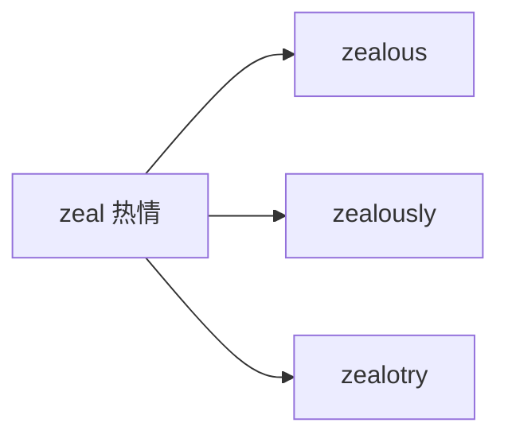

# zealous

## 1. 单词卡片

| 项目 | 内容 |
|---|---|
| 单词 | zealous |
| 词性 | adjective |
| 英式音标 | /ˈzeləs/ |
| 美式音标 | /ˈzeləs/ |
| 音节 | zeal-ous |
| 重音 | 第一音节 |
| 核心意思 | 热心的、热忱的、狂热的 |

## 2. 发音拆解


发音提示：

* 重音在第一个音节，读作 `/ˈzel/`，注意 `ea` 在这里读作短元音 `/e/`，而不是长元音 `/iː/`。
* 这是一个常见发音陷阱：很多学习者会误读成 `/ˈziːləs/`，正确读法应该是 `/ˈzeləs/`。
* 词首的 `z` 是浊辅音，声带要振动，不要读成清辅音 `/s/`。
* 中文近似音只能辅助记忆，不能代替标准发音：可理解为“泽勒斯”。

## 3. 核心词义


## 4. 不同词性与用法

| 词性 | 英文含义 | 中文意思 | 常见结构 |
|---|---|---|---|
| adjective | showing great energy and enthusiasm in pursuit of something | 热心的、热忱的 | be zealous about / in / for |

说明：`zealous` 常与介词 `about`、`in` 或 `for` 搭配，用来说明“对什么事情充满热情”。

## 5. 常见使用语境


## 6. 常见搭配

| 搭配 | 中文意思 | 使用场景 |
|---|---|---|
| zealous about something | 对某事充满热情 | 通用 |
| a zealous supporter | 热心的支持者 | 政治、粉丝文化 |
| zealous advocate | 热心的倡导者 | 社会议题 |
| overly zealous | 过分热心、过度积极 | 略带批评意味 |

## 7. 核心句型

```text
A is zealous about B.
She is zealous about protecting the environment.
```

## 8. 基础例句

**例句 1**

```text
He is a **zealous** supporter of local wildlife conservation.
```

他是当地野生动物保护事业的热心支持者。

**例句 2**

```text
The new manager was almost too zealous in enforcing the rules.
```

新经理在执行规定方面几乎有些过度热心。

## 9. 否定句、疑问句与问答

**否定句**

```text
He is not particularly zealous about sports, but he enjoys watching occasionally.
```

他对体育运动并不算特别热心，只是偶尔喜欢看看。

**一般疑问句**

```text
Is she still as zealous about volunteering as she used to be?
```

她对做志愿者还像以前那样热心吗？

**特殊疑问句**

```text
Why is he so zealous about recycling at home?
```

他为什么在家里对回收利用这么热心？

**问答组合**

```text
Question: Is he zealous about his new job?
Answer: Yes, he arrives early every day and stays late to finish extra tasks.
```

问：他对新工作很热心吗？
答：是的，他每天都早到，还经常加班完成额外的任务。

## 10. 工作场景例句

```text
Our new intern is incredibly zealous, often volunteering for extra projects.
```

我们的新实习生非常热心，经常主动承担额外的项目。

## 11. 日常生活例句

```text
My neighbor is a zealous gardener who spends hours in the yard every weekend.
```

我的邻居是个热心的园艺爱好者，每个周末都要在院子里待上好几个小时。

## 12. 词根词缀与构词



| 单词 | 词性 | 中文意思 |
|---|---|---|
| zeal | noun | 热情、热忱 |
| zealous | adjective | 热心的、热忱的 |
| zealously | adverb | 热心地 |
| zealot | noun | 狂热分子（较少见） |

说明：`zealous` 是在名词 `zeal`（热情）后面加上形容词后缀 `-ous` 构成的，字面含义就是“充满热情的”。

## 13. 派生词

| 单词 | 词性 | 中文意思 | 常见程度 |
|---|---|---|---|
| zeal | noun | 热情 | 中 |
| zealous | adjective | 热心的 | 高 |
| zealously | adverb | 热心地 | 中 |
| zealot | noun | 狂热分子 | 低 |

## 14. 同义词辨析

| 单词 | 主要区别 |
|---|---|
| zealous | 强调持续、积极的热情，常带有努力追求的意味，语气偏正式 |
| enthusiastic | 最常用、最口语化，泛指“热情的” |
| passionate | 强调情感上的强烈投入，常用于兴趣或爱好 |
| fanatical | 强调“狂热、过度”，带有较明显的负面色彩 |

## 15. 反义词

| 单词 | 中文意思 |
|---|---|
| indifferent | 冷漠的、不关心的 |
| apathetic | 缺乏热情的 |
| lukewarm | 不冷不热的、态度含糊的 |

## 16. 易混淆词辨析

`zealous` 容易和 `jealous`（嫉妒的）混淆，两者拼写和发音都很接近，但意思完全不同。

| 单词 | 词性 | 中文意思 |
|---|---|---|
| zealous | adjective | 热心的、热忱的 |
| jealous | adjective | 嫉妒的、吃醋的 |

## 17. 常见错误

错误：

```text
She was zealous when she saw her friend's new car.
```

正确：

```text
She was jealous when she saw her friend's new car.
```

说明：这里描述的是“嫉妒”的情绪，应使用 `jealous`，而不是 `zealous`；两个词发音相近，非常容易被拼错或用错。

## 18. 记忆方法

```text
zealous = 对某件事充满热情、积极努力
```

记忆技巧：`zealous` 开头是 `z`，可以联想到 `zeal`（热情）；`jealous` 开头是 `j`，可以联想到中文里“嫉妒”常见的负面情绪，两者字母和含义都要分开记。

场景记忆：

```text
He is a zealous supporter of local wildlife conservation.
他是当地野生动物保护事业的热心支持者。
```

## 19. 快速复习

| 问题 | 答案 |
|---|---|
| 核心意思是什么 | 热心的、热忱的 |
| 最常见搭配是什么 | zealous about something |
| 容易混淆的词是什么 | jealous（嫉妒的） |
| 对应的名词是什么 | zeal（热情） |

## 20. 选择题考试

### 第 1 题

`zealous` 最核心的意思是什么？

- [ ] A. 冷漠的
- [ ] B. 热心的、热忱的
- [ ] C. 嫉妒的
- [ ] D. 疲惫的

<details>
<summary>提交选择后查看结果</summary>

- 正确答案：**B. 热心的、热忱的**
- 对错判断：选择 B 为正确；选择 A、C 或 D 为错误。
- 解析：`zealous` 用来形容一个人对某件事充满热情、积极努力地追求。

</details>

### 第 2 题

下面哪个句子用词正确？

- [ ] A. She was zealous when she saw her friend's new car.
- [ ] B. She was jealous when she saw her friend's new car.
- [ ] C. She was zeal when she saw her friend's new car.
- [ ] D. She was zealously when she saw her friend's new car.

<details>
<summary>提交选择后查看结果</summary>

- 正确答案：**B. She was jealous when she saw her friend's new car.**
- 对错判断：选择 B 为正确；选择 A、C 或 D 为错误。
- 解析：这里描述的是“嫉妒”的情绪，应该使用 `jealous`，而不是发音相近但意思不同的 `zealous`。

</details>

### 第 3 题

`zealous` 中 `ea` 应该读成什么音？

- [ ] A. 长元音 /iː/
- [ ] B. 短元音 /e/
- [ ] C. 双元音 /aɪ/
- [ ] D. 双元音 /eɪ/

<details>
<summary>提交选择后查看结果</summary>

- 正确答案：**B. 短元音 /e/**
- 对错判断：选择 B 为正确；选择 A、C 或 D 为错误。
- 解析：`zealous` 中的 `ea` 读作短元音 `/e/`，正确读音是 `/ˈzeləs/`，很多学习者会误读成长元音。

</details>

### 第 4 题

下面哪个搭配最自然地表示“过分热心”？

- [ ] A. under zealous
- [ ] B. overly zealous
- [ ] C. zealous under
- [ ] D. zealous over

<details>
<summary>提交选择后查看结果</summary>

- 正确答案：**B. overly zealous**
- 对错判断：选择 B 为正确；选择 A、C 或 D 为错误。
- 解析：`overly zealous`（过分热心、过度积极）是常见搭配，通常带有轻微的批评意味。

</details>

### 第 5 题

`zealous` 对应的名词形式是什么？

- [ ] A. zeal
- [ ] B. zealotry
- [ ] C. zealously
- [ ] D. zealousness only

<details>
<summary>提交选择后查看结果</summary>

- 正确答案：**A. zeal**
- 对错判断：选择 A 为正确；选择 B、C 或 D 为错误。
- 解析：`zealous` 是在名词 `zeal`（热情）后面加上形容词后缀 `-ous` 构成的，`zeal` 是最常用、最基础的名词形式。

</details>

## 21. 考试结果汇总

| 正确题数 | 掌握情况 | 建议 |
|---|---|---|
| 5 题 | 已掌握 | 进入下一个单词 |
| 4 题 | 基本掌握 | 复习答错的知识点 |
| 2～3 题 | 掌握不稳 | 重新阅读搭配、例句和易错点 |
| 0～1 题 | 尚未掌握 | 重新学习整个单词课程 |
