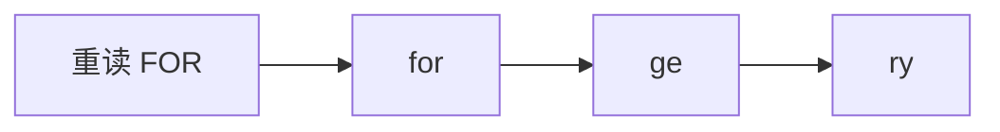
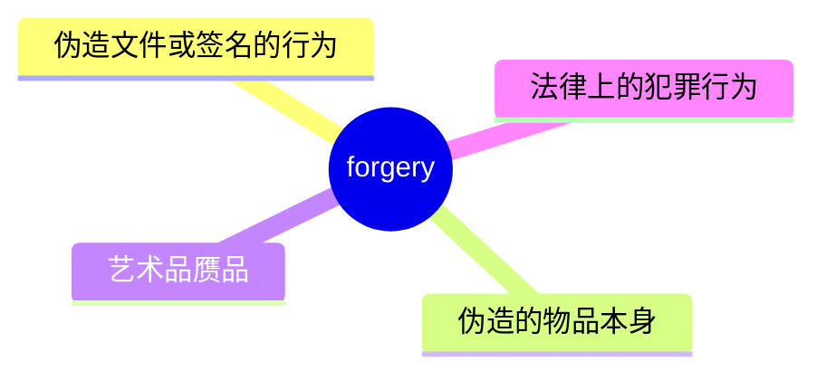
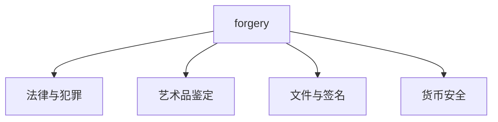
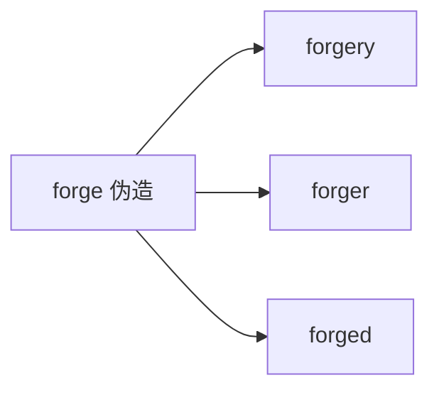

# forgery

## 1. 单词卡片

| 项目 | 内容 |
|---|---|
| 单词 | forgery |
| 词性 | noun |
| 英式音标 | /ˈfɔːdʒəri/ |
| 美式音标 | /ˈfɔːrdʒəri/ |
| 音节 | for-ge-ry |
| 重音 | 第一音节 |
| 核心意思 | 伪造（行为）；伪造品、赝品 |

## 2. 发音拆解



发音提示：

* 重音在第一个音节，英式读 `/ˈfɔː/`，美式读 `/ˈfɔːr/`，美式需要卷舌发出 `r` 音。
* 第二个音节 `ge` 读作浊辅音 `/dʒ/` 加短元音，接近“智”。
* 最后的 `-ry` 读得较轻快，接近 `/ri/`。
* 中文近似音只能辅助记忆，不能代替标准发音：可理解为“弗奥杰瑞”。

## 3. 核心词义



## 4. 不同词性与用法

| 词性 | 英文含义 | 中文意思 | 常见结构 |
|---|---|---|---|
| noun (uncountable) | the crime of copying money, documents, etc. to deceive people | 伪造罪 | be charged with forgery |
| noun (countable) | a fake copy of something, made to deceive | 一件伪造品 | the painting is a forgery |

说明：`forgery` 既可以是不可数名词，表示“伪造”这种犯罪行为，也可以是可数名词，表示“一件伪造品”。

## 5. 常见使用语境



## 6. 常见搭配

| 搭配 | 中文意思 | 使用场景 |
|---|---|---|
| charged with forgery | 被控伪造罪 | 法律 |
| commit forgery | 实施伪造行为 | 法律 |
| an obvious forgery | 一件明显的赝品 | 艺术品鉴定 |
| document forgery | 文件伪造 | 商务、法律 |
| signature forgery | 签名伪造 | 法律、金融 |

## 7. 核心句型

```text
A be charged with forgery.
He was charged with forgery after selling fake paintings.
```

## 8. 基础例句

**例句 1**

```text
Experts quickly determined that the painting was a **forgery**.
```

专家很快就确定这幅画是一件赝品。

**例句 2**

```text
He was arrested for the forgery of official documents.
```

他因伪造官方文件而被逮捕。

## 9. 否定句、疑问句与问答

**否定句**

```text
The signature is not a forgery; it matches the original perfectly.
```

这个签名不是伪造的，它和原件完全吻合。

**一般疑问句**

```text
Is this famous painting a forgery or the real thing?
```

这幅著名的画作是赝品还是真迹？

**特殊疑问句**

```text
How did experts detect that the document was a forgery?
```

专家是如何发现这份文件是伪造的？

**问答组合**

```text
Question: How was the forgery finally discovered?
Answer: A specialist noticed that the ink was too new for the supposed date.
```

问：这件伪造品最终是如何被发现的？
答：一位专家发现墨水的新旧程度和文件标注的日期对不上。

## 10. 工作场景例句

```text
The finance department flagged the invoice as a possible forgery.
```

财务部门标记这张发票为可能的伪造件。

## 11. 日常生活例句

```text
The old man was shocked to learn that the antique clock he bought was a forgery.
```

老人得知自己买的古董钟是赝品时非常震惊。

## 12. 词根词缀与构词



| 单词 | 词性 | 中文意思 |
|---|---|---|
| forge | verb | 伪造 |
| forgery | noun | 伪造行为、伪造品 |
| forger | noun | 造假者 |
| forged | adjective | 伪造的 |

说明：`forgery` 是在动词 `forge`（伪造）后面加上名词后缀 `-ery` 构成的，表示“伪造这种行为或结果”。

## 13. 派生词

| 单词 | 词性 | 中文意思 | 常见程度 |
|---|---|---|---|
| forge | verb | 伪造 | 高 |
| forgery | noun | 伪造行为、伪造品 | 高 |
| forger | noun | 造假者 | 中 |
| forged | adjective | 伪造的 | 高 |

## 14. 同义词辨析

| 单词 | 主要区别 |
|---|---|
| forgery | 强调“伪造”这一行为或结果，语气正式，常用于法律和艺术语境 |
| fake | 最口语化，泛指“假的东西”，使用范围广泛 |
| counterfeit | 强调“仿冒品”，常特指假币、假名牌商品 |
| imitation | 中性词，泛指“仿制品”，不一定带有欺骗意图 |

## 15. 反义词

| 单词 | 中文意思 |
|---|---|
| original | 原件、真品 |
| authentic | 真实的、正品的 |
| genuine | 真正的 |

## 16. 易混淆词辨析

`forgery`（伪造品/伪造罪）容易和动词 `forge`（伪造）在词性上混淆。

| 单词 | 词性 | 例句 |
|---|---|---|
| forge | verb | He forged the signature on the check. |
| forgery | noun | The signature on the check was a forgery. |

## 17. 常见错误

错误：

```text
He was arrested for forge the documents.
```

正确：

```text
He was arrested for forging the documents.
```

或者：

```text
He was arrested for the forgery of the documents.
```

说明：介词 `for` 后面需要接动名词 `forging` 或者名词 `forgery`，不能直接接动词原形 `forge`。

## 18. 记忆方法

```text
forge（伪造，动词） + -ery（表示行为或结果的后缀） = forgery（伪造行为、伪造品）
```

场景记忆：

```text
Experts quickly determined that the painting was a forgery.
专家很快就确定这幅画是一件赝品。
```

## 19. 快速复习

| 问题 | 答案 |
|---|---|
| 核心意思是什么 | 伪造行为、伪造品 |
| 对应的动词是什么 | forge（伪造） |
| 最常见搭配是什么 | charged with forgery |
| 反义词是什么 | authentic（真实的） |

## 20. 选择题考试

### 第 1 题

`forgery` 最核心的意思是什么？

- [ ] A. 真品、原件
- [ ] B. 伪造行为或伪造品
- [ ] C. 一种绘画技巧
- [ ] D. 一种货币单位

<details>
<summary>提交选择后查看结果</summary>

- 正确答案：**B. 伪造行为或伪造品**
- 对错判断：选择 B 为正确；选择 A、C 或 D 为错误。
- 解析：`forgery` 既可以指“伪造”这一犯罪行为，也可以指“伪造出来的物品”本身，比如假画、假签名。

</details>

### 第 2 题

下面哪个句子语法正确？

- [ ] A. He was arrested for forge the documents.
- [ ] B. He was arrested for forging the documents.
- [ ] C. He was arrested for forgery the documents.
- [ ] D. He was arrested for forged the documents.

<details>
<summary>提交选择后查看结果</summary>

- 正确答案：**B. He was arrested for forging the documents.**
- 对错判断：选择 B 为正确；选择 A、C 或 D 为错误。
- 解析：介词 `for` 后面需要接动名词形式，`forging` 是正确的动名词形式。

</details>

### 第 3 题

`forgery` 的重音在哪个音节？

- [ ] A. 第一个音节
- [ ] B. 第二个音节
- [ ] C. 第三个音节
- [ ] D. 没有固定重音

<details>
<summary>提交选择后查看结果</summary>

- 正确答案：**A. 第一个音节**
- 对错判断：选择 A 为正确；选择 B、C 或 D 为错误。
- 解析：`forgery` 的重音固定在第一个音节 `for` 上。

</details>

### 第 4 题

下面哪个词是 `forgery` 对应的动词形式？

- [ ] A. forge
- [ ] B. forger
- [ ] C. forgeful
- [ ] D. forgeous

<details>
<summary>提交选择后查看结果</summary>

- 正确答案：**A. forge**
- 对错判断：选择 A 为正确；选择 B、C 或 D 为错误。
- 解析：`forgery` 是在动词 `forge`（伪造）后面加上名词后缀 `-ery` 构成的，`forger` 是“造假者”这个人，不是动词。

</details>

### 第 5 题

`forgery` 最常见的反义词是什么？

- [ ] A. authentic
- [ ] B. fake
- [ ] C. counterfeit
- [ ] D. imitation

<details>
<summary>提交选择后查看结果</summary>

- 正确答案：**A. authentic**
- 对错判断：选择 A 为正确；选择 B、C 或 D 为错误。
- 解析：`authentic`（真实的、正品的）与 `forgery`（伪造品）意思相反；B、C、D 都属于“假的、仿制的”这一类，和 `forgery` 意思相近，而不是相反。

</details>

## 21. 考试结果汇总

| 正确题数 | 掌握情况 | 建议 |
|---|---|---|
| 5 题 | 已掌握 | 进入下一个单词 |
| 4 题 | 基本掌握 | 复习答错的知识点 |
| 2～3 题 | 掌握不稳 | 重新阅读搭配、例句和易错点 |
| 0～1 题 | 尚未掌握 | 重新学习整个单词课程 |
