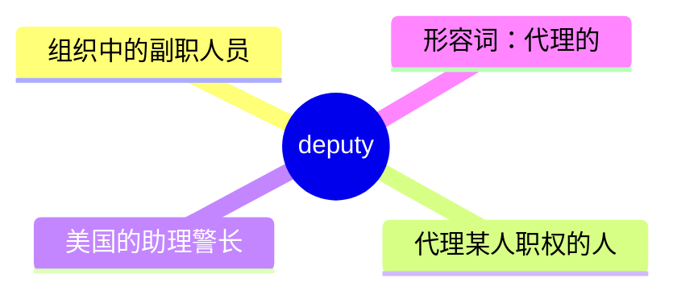
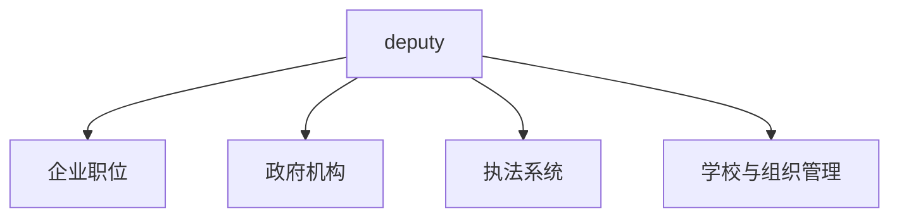

# deputy

## 1. 单词卡片

| 项目 | 内容 |
|---|---|
| 单词 | deputy |
| 词性 | noun / adjective |
| 英式音标 | /ˈdepjʊti/ |
| 美式音标 | /ˈdepjəti/ |
| 音节 | dep-u-ty |
| 重音 | 第一音节 |
| 核心意思 | 副职、代理人；助理警长（美式口语） |

## 2. 发音拆解


发音提示：

* 重音在第一个音节，读作 `/ˈdep/`，元音 `/e/` 类似 `bed` 中的音。
* 第二个音节 `u` 读作半元音加短音，接近 `/jʊ/` 或 `/jə/`。
* 最后的 `-ty` 读得较轻快，接近 `/ti/`。
* 中文近似音只能辅助记忆，不能代替标准发音：可理解为“德普悌”。

## 3. 核心词义



## 4. 不同词性与用法

| 词性 | 英文含义 | 中文意思 | 常见结构 |
|---|---|---|---|
| noun | a person appointed to act on behalf of another, often a second-in-command | 副职、代理人 | deputy manager |
| noun (US) | an officer who works for a sheriff | 助理警长、副警长 | sheriff's deputy |
| adjective (前置定语) | acting as a substitute or second-in-command | 代理的、副的 | deputy director |

说明：`deputy` 作形容词使用时，通常直接放在职位名词前面，构成“副……”这样的头衔，如 `deputy manager`（副经理）。

## 5. 常见使用语境



## 6. 常见搭配

| 搭配 | 中文意思 | 使用场景 |
|---|---|---|
| deputy manager | 副经理 | 企业 |
| deputy director | 副主任、副总监 | 政府、组织 |
| deputy mayor | 副市长 | 政府 |
| sheriff's deputy | 助理警长 | 美国执法系统 |
| act as deputy for | 代理某人的职务 | 通用 |

## 7. 核心句型

```text
A serves as deputy to B.
She serves as deputy to the company's CEO.
```

## 8. 基础例句

**例句 1**

```text
The **deputy** manager took over while the manager was on leave.
```

在经理休假期间，副经理接手了工作。

**例句 2**

```text
He was appointed deputy director of the research department last year.
```

他去年被任命为研究部门的副主任。

## 9. 否定句、疑问句与问答

**否定句**

```text
She is not the deputy manager; she is a senior team leader.
```

她不是副经理，她是一名高级团队负责人。

**一般疑问句**

```text
Is he the deputy or the actual head of the department?
```

他是部门的代理负责人还是正式负责人？

**特殊疑问句**

```text
Who will act as deputy while the director is traveling?
```

在主任出差期间，谁将代理他的职务？

**问答组合**

```text
Question: Who is the current deputy mayor of the city?
Answer: It is someone who was appointed just last month.
```

问：这座城市现任的副市长是谁？
答：是上个月刚被任命的一个人。

## 10. 工作场景例句

```text
As deputy manager, she is responsible for daily operations when the manager is unavailable.
```

作为副经理，当经理不在时，她负责日常运营工作。

## 11. 日常生活例句

```text
A sheriff's deputy pulled the car over for speeding.
```

一名助理警长因超速拦下了这辆车。

## 12. 词根词缀与构词


| 单词 | 词性 | 中文意思 |
|---|---|---|
| deputy | noun/adjective | 副职、代理人 |
| deputize | verb | 任命某人为代理人 |

说明：`deputy` 来自拉丁语 `deputare`（意为“分配、指派”），核心含义始终围绕“被指派代理某项职责的人”。

## 13. 派生词

| 单词 | 词性 | 中文意思 | 常见程度 |
|---|---|---|---|
| deputy | noun/adjective | 副职、代理人 | 高 |
| deputize | verb | 任命……为代理人 | 低 |
| deputation | noun | 代表团（较少见） | 低 |

## 14. 同义词辨析

| 单词 | 主要区别 |
|---|---|
| deputy | 强调“正式被指派的副职或代理人”，常用于头衔前，语气正式 |
| assistant | 强调“协助工作”，不一定拥有代理决策的权力 |
| substitute | 强调“临时替代某人”，通常是短期、临时性的 |
| representative | 强调“代表某个组织或群体”，不一定是职位上的“副职” |

## 15. 反义词

`deputy` 是一个具体的职位名词，没有严格意义上的反义词，但语境上常与以下词相对：

| 单词 | 中文意思 |
|---|---|
| head | 负责人、主管 |
| chief | 首长、主要负责人 |
| principal | 主要负责人 |

## 16. 易混淆词辨析

`deputy` 容易和 `dispute`（争端、争论）在拼写结构上产生初步混淆，尤其是初学者。

| 单词 | 词性 | 中文意思 |
|---|---|---|
| deputy | noun/adjective | 副职、代理人 |
| dispute | noun/verb | 争端、争论 |

## 17. 常见错误

错误：

```text
He is the deputy of manager.
```

正确：

```text
He is the deputy manager.
```

说明：`deputy` 作形容词直接放在职位名词前面构成头衔，不需要加介词 `of`，正确结构是 `deputy manager`，而不是 `deputy of manager`。

## 18. 记忆方法

```text
deputy = 被指派代理某项职责的人（副……）
```

场景记忆：

```text
The deputy manager took over while the manager was on leave.
在经理休假期间，副经理接手了工作。
```

## 19. 快速复习

| 问题 | 答案 |
|---|---|
| 核心意思是什么 | 副职、代理人 |
| 最常见搭配是什么 | deputy manager |
| 美式常见用法是什么 | sheriff's deputy（助理警长） |
| 语法结构要点是什么 | 直接前置修饰职位名词，不加 of |

## 20. 选择题考试

### 第 1 题

`deputy manager` 最自然的中文意思是什么？

- [ ] A. 前任经理
- [ ] B. 副经理
- [ ] C. 实习经理
- [ ] D. 兼职经理

<details>
<summary>提交选择后查看结果</summary>

- 正确答案：**B. 副经理**
- 对错判断：选择 B 为正确；选择 A、C 或 D 为错误。
- 解析：`deputy` 作形容词修饰职位名词时，表示“副……”，`deputy manager` 就是“副经理”。

</details>

### 第 2 题

下面哪个句子语法正确？

- [ ] A. He is the deputy of manager.
- [ ] B. He is the deputy manager.
- [ ] C. He is deputy for manager.
- [ ] D. He is manager's deputy of.

<details>
<summary>提交选择后查看结果</summary>

- 正确答案：**B. He is the deputy manager.**
- 对错判断：选择 B 为正确；选择 A、C 或 D 为错误。
- 解析：`deputy` 直接放在职位名词前面构成头衔，不需要加介词 `of`。

</details>

### 第 3 题

`deputy` 的重音在哪个音节？

- [ ] A. 第一个音节
- [ ] B. 第二个音节
- [ ] C. 第三个音节
- [ ] D. 没有固定重音

<details>
<summary>提交选择后查看结果</summary>

- 正确答案：**A. 第一个音节**
- 对错判断：选择 A 为正确；选择 B、C 或 D 为错误。
- 解析：`deputy` 的重音固定在第一个音节 `dep` 上。

</details>

### 第 4 题

在美国，`sheriff's deputy` 最常指的是什么？

- [ ] A. 警长的秘书
- [ ] B. 助理警长、副警长
- [ ] C. 警局的清洁工
- [ ] D. 警长的律师

<details>
<summary>提交选择后查看结果</summary>

- 正确答案：**B. 助理警长、副警长**
- 对错判断：选择 B 为正确；选择 A、C 或 D 为错误。
- 解析：在美国执法系统中，`sheriff's deputy` 是协助警长工作的执法人员，常见于地方治安管理。

</details>

### 第 5 题

`deputy` 这个单词的词源含义与下面哪个最接近？

- [ ] A. 分配、指派
- [ ] B. 战斗、对抗
- [ ] C. 建造、修建
- [ ] D. 隐藏、遮盖

<details>
<summary>提交选择后查看结果</summary>

- 正确答案：**A. 分配、指派**
- 对错判断：选择 A 为正确；选择 B、C 或 D 为错误。
- 解析：`deputy` 来自拉丁语 `deputare`，意思是“分配、指派”，核心含义是“被指派代理某项职责的人”。

</details>

## 21. 考试结果汇总

| 正确题数 | 掌握情况 | 建议 |
|---|---|---|
| 5 题 | 已掌握 | 进入下一个单词 |
| 4 题 | 基本掌握 | 复习答错的知识点 |
| 2～3 题 | 掌握不稳 | 重新阅读搭配、例句和易错点 |
| 0～1 题 | 尚未掌握 | 重新学习整个单词课程 |
