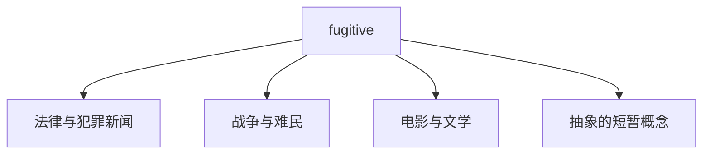
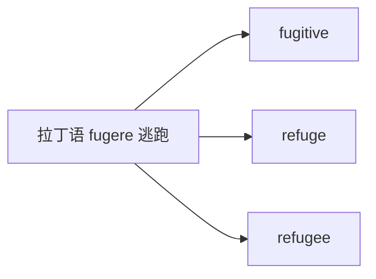

# fugitive

## 1. 单词卡片

| 项目 | 内容 |
|---|---|
| 单词 | fugitive |
| 词性 | noun / adjective |
| 英式音标 | /ˈfjuːdʒɪtɪv/ |
| 美式音标 | /ˈfjuːdʒɪtɪv/ |
| 音节 | fu-gi-tive |
| 重音 | 第一音节 |
| 核心意思 | 逃亡者、逃犯；逃亡的、短暂的 |

## 2. 发音拆解


发音提示：

* 重音在第一个音节，读作 `/ˈfjuː/`，是半元音加长元音，类似“非尤”连读。
* 第二个音节 `gi` 读作浊辅音 `/dʒɪ/`，接近“吉”。
* 最后的 `-tive` 读作 `/tɪv/`，不要读成“太夫”。
* 中文近似音只能辅助记忆，不能代替标准发音：可理解为“菲尤吉悌夫”。

## 3. 核心词义


## 4. 不同词性与用法

| 词性 | 英文含义 | 中文意思 | 常见结构 |
|---|---|---|---|
| noun | a person who is running away, especially from the law | 逃亡者、逃犯 | a fugitive from justice |
| adjective | fleeing or having fled, e.g. from danger or the law | 逃亡的 | a fugitive suspect |
| adjective (文学用法) | lasting only a short time; fleeting | 短暂的、转瞬即逝的 | fugitive moments of joy |

说明：`fugitive` 作形容词时既可以描述具体的“逃亡状态”，也可以在较正式或文学的语境中描述“短暂、易逝”的抽象概念。

## 5. 常见使用语境



## 6. 常见搭配

| 搭配 | 中文意思 | 使用场景 |
|---|---|---|
| a fugitive from justice | 一名在逃的逃犯 | 法律、新闻 |
| a wanted fugitive | 一名被通缉的逃犯 | 新闻 |
| fugitive suspect | 在逃嫌疑人 | 新闻 |
| fugitive moments | 转瞬即逝的时刻 | 文学、抽象表达 |

## 7. 核心句型

```text
A is a fugitive from B.
He became a fugitive from justice after the robbery.
```

## 8. 基础例句

**例句 1**

```text
Police finally captured the **fugitive** after a three-day search.
```

警方经过三天的搜捕，终于抓获了这名逃犯。

**例句 2**

```text
She lived as a fugitive for nearly a decade before being caught.
```

在被抓获之前，她做了将近十年的逃亡者。

## 9. 否定句、疑问句与问答

**否定句**

```text
He is not a fugitive; he simply left the country for business reasons.
```

他不是逃犯，他只是因为商务原因离开了这个国家。

**一般疑问句**

```text
Is the suspect still a fugitive, or has he been arrested?
```

这名嫌疑人还是在逃状态，还是已经被逮捕了？

**特殊疑问句**

```text
How did the fugitive manage to avoid capture for so long?
```

这名逃犯是如何设法躲避追捕这么久的？

**问答组合**

```text
Question: Is the fugitive believed to be hiding in another country?
Answer: Yes, investigators think he crossed the border last month.
```

问：人们认为这名逃犯藏匿在另一个国家吗？
答：是的，调查人员认为他上个月已经越境了。

## 10. 工作场景例句

```text
The journalist wrote a detailed report on the fugitive's years on the run.
```

这名记者写了一篇详细报道，记录了这名逃犯多年的逃亡生活。

## 11. 日常生活例句

```text
The documentary followed a fugitive who spent twenty years hiding in the mountains.
```

这部纪录片记录了一名在山区躲藏了二十年的逃亡者。

## 12. 词根词缀与构词



| 单词 | 词性 | 中文意思 |
|---|---|---|
| fugitive | noun/adjective | 逃亡者；逃亡的 |
| refuge | noun | 避难所、庇护 |
| refugee | noun | 难民 |

说明：`fugitive` 来自拉丁语 `fugere`（意为“逃跑”），和 `refuge`（避难所）、`refugee`（难民）属于同一个词源家族，都与“逃离、寻求庇护”这一概念相关。

## 13. 派生词

| 单词 | 词性 | 中文意思 | 常见程度 |
|---|---|---|---|
| fugitive | noun/adjective | 逃亡者；逃亡的 | 高 |
| refuge | noun | 避难所 | 高 |
| refugee | noun | 难民 | 高 |

## 14. 同义词辨析

| 单词 | 主要区别 |
|---|---|
| fugitive | 强调“正在逃避法律追捕”，语气正式，常见于新闻和法律语境 |
| runaway | 更口语化，常指离家出走的人，不一定涉及法律问题 |
| escapee | 强调“从监狱或拘留场所逃脱的人” |
| refugee | 强调因战争、迫害等原因被迫离开家园寻求庇护的人，不一定涉及违法行为 |

## 15. 反义词

`fugitive` 是描述“逃亡”状态的名词/形容词，没有严格意义上的单一反义词，但可以与以下概念相对：

| 单词 | 中文意思 |
|---|---|
| captive | 被俘的、被囚禁的 |
| law-abiding citizen | 守法公民 |

## 16. 易混淆词辨析

`fugitive`（逃亡者）容易和 `refugee`（难民）混淆，两者都与“离开、逃离”有关，但含义和使用场景不同。

| 单词 | 侧重点 |
|---|---|
| fugitive | 通常因为犯罪或违法而逃避追捕，带有法律上的负面色彩 |
| refugee | 通常因为战争、迫害或灾难而被迫离开家园，是需要保护的弱势群体 |

## 17. 常见错误

错误：

```text
The war created millions of fugitives seeking safety abroad.
```

正确：

```text
The war created millions of refugees seeking safety abroad.
```

说明：因战争而流离失所、寻求庇护的人应称为 `refugee`（难民），而不是 `fugitive`（逃犯），后者通常带有“逃避法律责任”的负面含义，不能随意替换。

## 18. 记忆方法

```text
fugitive = 正在逃避追捕的人（尤指因触犯法律）
```

场景记忆：

```text
Police finally captured the fugitive after a three-day search.
警方经过三天的搜捕，终于抓获了这名逃犯。
```

## 19. 快速复习

| 问题 | 答案 |
|---|---|
| 核心意思是什么 | 逃亡者、逃犯；逃亡的 |
| 最常见搭配是什么 | a fugitive from justice |
| 容易混淆的词是什么 | refugee（难民） |
| 词根含义是什么 | 来自拉丁语“逃跑” |

## 20. 选择题考试

### 第 1 题

`fugitive` 最核心的意思是什么？

- [ ] A. 正在逃避追捕的人
- [ ] B. 一位法官
- [ ] C. 一名志愿者
- [ ] D. 一位旅行者

<details>
<summary>提交选择后查看结果</summary>

- 正确答案：**A. 正在逃避追捕的人**
- 对错判断：选择 A 为正确；选择 B、C 或 D 为错误。
- 解析：`fugitive` 指的是正在逃避法律追捕的人，常翻译为“逃亡者”或“逃犯”。

</details>

### 第 2 题

描述“因战争流离失所、寻求庇护的人”，最自然的用词是什么？

- [ ] A. fugitive
- [ ] B. refugee
- [ ] C. captive
- [ ] D. deputy

<details>
<summary>提交选择后查看结果</summary>

- 正确答案：**B. refugee**
- 对错判断：选择 B 为正确；选择 A、C 或 D 为错误。
- 解析：因战争或迫害而被迫离开家园的人应称为 `refugee`（难民），而不是带有法律负面含义的 `fugitive`（逃犯）。

</details>

### 第 3 题

`fugitive` 的重音在哪个音节？

- [ ] A. 第一个音节
- [ ] B. 第二个音节
- [ ] C. 第三个音节
- [ ] D. 没有固定重音

<details>
<summary>提交选择后查看结果</summary>

- 正确答案：**A. 第一个音节**
- 对错判断：选择 A 为正确；选择 B、C 或 D 为错误。
- 解析：`fugitive` 的重音固定在第一个音节 `fu` 上，读作 `/ˈfjuː/`。

</details>

### 第 4 题

下面哪个搭配最自然地表示“在逃嫌疑人”？

- [ ] A. fugitive suspect
- [ ] B. suspect fugitive of
- [ ] C. fugitive of suspect
- [ ] D. suspecting fugitive

<details>
<summary>提交选择后查看结果</summary>

- 正确答案：**A. fugitive suspect**
- 对错判断：选择 A 为正确；选择 B、C 或 D 为错误。
- 解析：`fugitive` 作形容词直接修饰名词 `suspect`，构成 `fugitive suspect`（在逃嫌疑人），这是最自然的搭配方式。

</details>

### 第 5 题

`fugitive` 的词源与下面哪个词共享相同的拉丁语词根？

- [ ] A. refuge
- [ ] B. voltage
- [ ] C. deputy
- [ ] D. forgery

<details>
<summary>提交选择后查看结果</summary>

- 正确答案：**A. refuge**
- 对错判断：选择 A 为正确；选择 B、C 或 D 为错误。
- 解析：`fugitive` 和 `refuge` 都来自拉丁语 `fugere`（逃跑），因此在词源上是同一个家族。

</details>

## 21. 考试结果汇总

| 正确题数 | 掌握情况 | 建议 |
|---|---|---|
| 5 题 | 已掌握 | 进入下一个单词 |
| 4 题 | 基本掌握 | 复习答错的知识点 |
| 2～3 题 | 掌握不稳 | 重新阅读搭配、例句和易错点 |
| 0～1 题 | 尚未掌握 | 重新学习整个单词课程 |
