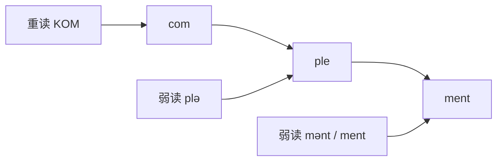
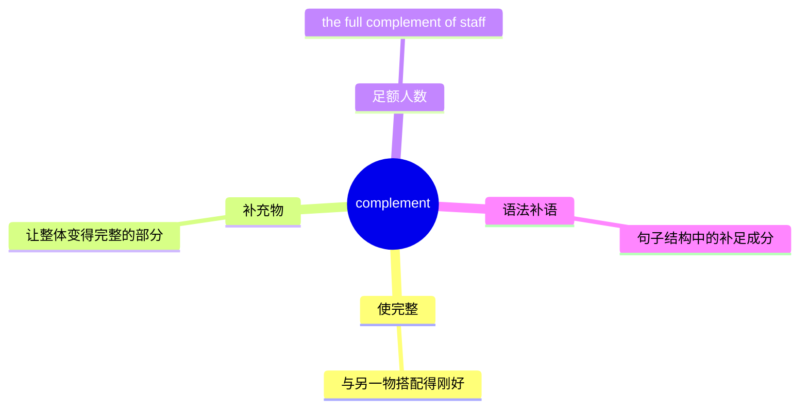
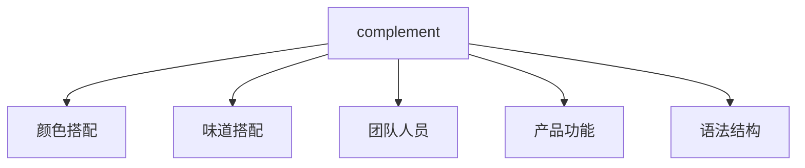
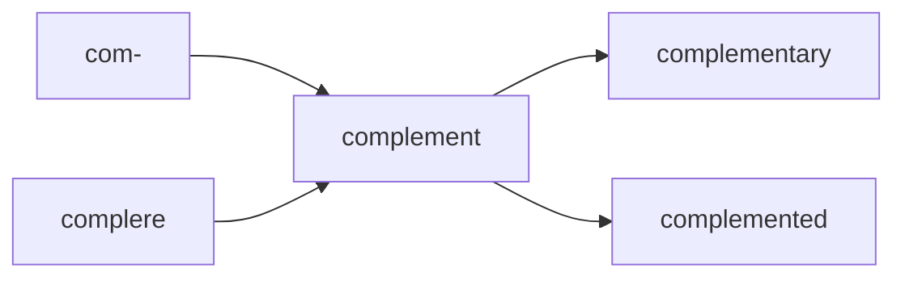
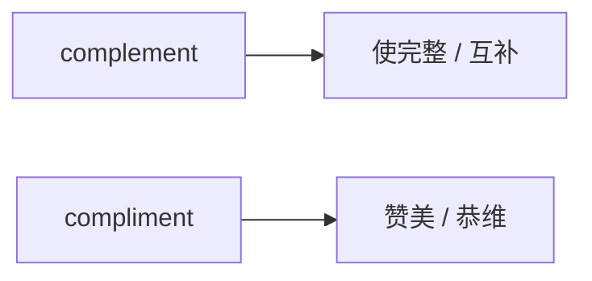

# complement

## 1. 单词卡片

| 项目 | 内容 |
|---|---|
| 单词 | complement |
| 词性 | noun / verb |
| 英式音标（名词） | /ˈkɒmplɪmənt/ |
| 美式音标（名词） | /ˈkɑːmplɪmənt/ |
| 英式音标（动词） | /ˈkɒmplɪment/ |
| 美式音标（动词） | /ˈkɑːmplɪment/ |
| 音节 | com-ple-ment |
| 重音 | 第一音节 |
| 核心意思 | 补充、互补、使完整；补足物、配套物 |

> 原输入拼写正确，直接生成课程，无需调整。

## 2. 发音拆解



发音提示：

* 重音固定在第一个音节 `com`，读作 `/ˈkɒm/` 或 `/ˈkɑːm/`。
* 第二个音节很轻，读成弱化的 `/plɪ/`。
* 作名词时，最后一个音节是弱读 `/mənt/`，类似很轻的“们特”。
* 作动词时，最后一个音节常读得稍微清楚一些，接近 `/ment/`，但差别很细微，不必刻意强调。
* 中文近似音只能辅助记忆，不能代替标准发音：可以理解为“康普勒们特”，但真实发音比这个更轻、更快。

## 3. 核心词义



## 4. 不同词性与用法

| 词性 | 英文含义 | 中文意思 | 常见结构 |
|---|---|---|---|
| noun | something that completes or improves | 补充物、互补的东西 | a perfect complement to |
| noun | the number needed to make something complete | 满额人数、齐备的数量 | a full complement of |
| verb | to complete or improve something | 补充、与……相配 | complement each other |
| noun (grammar) | a word/phrase that completes meaning | 语法中的补语 | subject complement |

## 5. 常见使用语境



## 6. 常见搭配

| 搭配 | 中文意思 | 使用场景 |
|---|---|---|
| complement each other | 互相补充、相得益彰 | 人际关系、团队合作 |
| a perfect complement to | 完美的补充 | 描述搭配效果 |
| complementary colors | 互补色 | 设计、艺术 |
| full complement of staff | 全部编制人员 | 公司、团队管理 |
| complement the flavor | 衬托味道 | 美食、烹饪 |

## 7. 核心句型

```text
A complement(s) B.
The wine complements the dish.
```

```text
A and B complement each other.
Their skills complement each other.
```

## 8. 基础例句

**例句 1**

```text
This scarf **complements** her dress nicely.
```

这条围巾很好地衬托了她的裙子。

**例句 2**

```text
The team does not have a full complement of engineers this month.
```

这个团队这个月没有配齐全部工程师。

## 9. 否定句、疑问句与问答

**否定句**

```text
This color scheme does not complement the room's lighting.
```

这个配色方案和房间的灯光不搭配。

**一般疑问句**

```text
Does the new hire complement the existing team's skills?
```

这位新员工是否能补充现有团队的技能？

**特殊疑问句**

```text
How does background music complement a film scene?
```

背景音乐是如何衬托电影场景的？

**问答组合**

```text
Question: Do these two flavors complement each other?
Answer: Yes, the sweetness of the mango complements the spiciness perfectly.
```

问：这两种味道搭配吗？
答：是的，芒果的甜味和辣味搭配得很完美。

## 10. 工作场景例句

```text
Her design skills **complement** his technical background, which makes them a strong team.
```

她的设计能力和他的技术背景互相补充，让他们成为一个强大的团队。

```text
We are still short one developer to reach a full complement for the project.
```

我们还差一名开发者，才能配齐这个项目的全部人手。

## 11. 日常生活例句

```text
A good dessert should **complement**, not overpower, the main course.
```

一份好的甜点应该衬托主菜，而不是抢了主菜的风头。

## 12. 词根词缀与构词



| 单词 | 词性 | 中文意思 |
|---|---|---|
| complement | noun / verb | 补充、互补物 |
| complementary | adjective | 互补的、相配的 |
| complemented | verb (过去式/分词) | 补充了、搭配了 |

说明：`complement` 来自拉丁语 `complere`（意为“填满、使完整”），词根含义是“使完整”，而不是“赞美”。这个词源可以帮助记住它和 `compliment`（赞美）的本质区别。

## 13. 派生词

| 单词 | 词性 | 中文意思 | 常见程度 |
|---|---|---|---|
| complement | noun / verb | 补充、互补物 | 高 |
| complementary | adjective | 互补的 | 高 |
| complemental | adjective | 补充性的（较少用） | 低 |

## 14. 同义词辨析

| 单词 | 主要区别 |
|---|---|
| complement | 强调“使整体更完整”，中性、常用于搭配和结构 |
| supplement | 强调“额外添加”，常用于补充营养、内容或资金，不一定使原物更完整 |
| accompany | 强调“伴随、一起出现”，不一定有互补效果 |
| enhance | 强调“提升、增强”，不一定是搭配关系 |

## 15. 反义词

| 单词 | 中文意思 |
|---|---|
| clash | 冲突、不协调 |
| contradict | 矛盾 |
| detract from | 削弱、减损 |

## 16. 易混淆词辨析

`complement` 最容易和 `compliment` 混淆，两者发音几乎相同，但意思完全不同。



| 单词 | 词性 | 中文意思 | 记忆提示 |
|---|---|---|---|
| complement | noun/verb | 补充、互补 | e 表示“完整 complete” |
| compliment | noun/verb | 赞美、恭维 | i 表示“我喜欢 I like it” |

## 17. 常见错误

错误：

```text
Thank you for the complement on my dress.
```

正确：

```text
Thank you for the compliment on my dress.
```

说明：这里指的是“别人夸奖裙子”，应该使用 `compliment`（赞美），而不是 `complement`（补充）。

错误：

```text
Their skills complement to each other.
```

正确：

```text
Their skills complement each other.
```

说明：`complement` 作及物动词，直接接宾语，不需要介词 `to`。

## 18. 记忆方法

```text
complement = 让整体更完整（complete）
```

记忆技巧：`complement` 中间有 `e`，联想到 `complete`（完整）；而 `compliment` 中间有 `i`，联想到 `I`（我喜欢听到的赞美）。

场景记忆：

```text
The scarf complements her outfit.
围巾让她的整套穿搭更完整、更好看。
```

## 19. 快速复习

| 问题 | 答案 |
|---|---|
| 核心意思是什么 | 补充、互补，使整体更完整 |
| 常见搭配是什么 | complement each other |
| 最容易混淆的词是什么 | compliment（赞美） |
| 词源含义是什么 | 来自拉丁语，意为“使完整” |

## 20. 选择题考试

> 请先独立选择答案，不要提前展开答案区。

### 第 1 题

`complement` 作为动词时，最核心的意思是什么？

- [ ] A. 批评某人
- [ ] B. 使某物更完整、与之相配
- [ ] C. 复制某物
- [ ] D. 取代某物

<details>
<summary>提交选择后查看结果</summary>

- 正确答案：**B. 使某物更完整、与之相配**
- 对错判断：选择 B 为正确；选择 A、C 或 D 为错误。
- 解析：`complement` 表示两个事物搭配在一起，让整体变得更完整或更好。

</details>

### 第 2 题

下面哪个句子用词正确？

- [ ] A. Thank you for the complement on my cooking.
- [ ] B. This wine complements the dish perfectly.
- [ ] C. She gave me a nice complement about my hair.
- [ ] D. He always complements people to make them happy.

<details>
<summary>提交选择后查看结果</summary>

- 正确答案：**B. This wine complements the dish perfectly.**
- 对错判断：选择 B 为正确；选择 A、C 或 D 为错误，因为它们都应该使用 `compliment`（赞美），而不是 `complement`。
- 解析：A、C、D 都在描述“夸奖”，属于 `compliment` 的用法；只有 B 描述的是“搭配得很好”，正确使用了 `complement`。

</details>

### 第 3 题

`a full complement of staff` 最自然的中文意思是什么？

- [ ] A. 一份员工名单
- [ ] B. 全部编制的员工人数
- [ ] C. 一次员工聚餐
- [ ] D. 一份员工奖励

<details>
<summary>提交选择后查看结果</summary>

- 正确答案：**B. 全部编制的员工人数**
- 对错判断：选择 B 为正确；选择 A、C 或 D 为错误。
- 解析：`full complement` 表示“齐备的数量、满编”，常用于描述人员是否配齐。

</details>

### 第 4 题

`complement` 这个单词的重音在哪里？

- [ ] A. 第一个音节
- [ ] B. 第二个音节
- [ ] C. 第三个音节
- [ ] D. 没有固定重音

<details>
<summary>提交选择后查看结果</summary>

- 正确答案：**A. 第一个音节**
- 对错判断：选择 A 为正确；选择 B、C 或 D 为错误。
- 解析：无论作名词还是动词，`complement` 的重音都在第一个音节 `com` 上。

</details>

### 第 5 题

下面哪一组说法最准确地区分了 `complement` 和 `compliment`？

- [ ] A. 两个词完全同义，可以互换
- [ ] B. complement 表示“互补”，compliment 表示“赞美”
- [ ] C. complement 表示“赞美”，compliment 表示“互补”
- [ ] D. 两个词都只能用作名词

<details>
<summary>提交选择后查看结果</summary>

- 正确答案：**B. complement 表示“互补”，compliment 表示“赞美”**
- 对错判断：选择 B 为正确；选择 A、C 或 D 为错误。
- 解析：这两个词发音相近但含义不同，`complement` 与“完整、搭配”有关，`compliment` 与“夸奖、恭维”有关。

</details>

## 21. 考试结果汇总

完成全部题目后，根据答案区自行统计：

| 正确题数 | 掌握情况 | 建议 |
|---|---|---|
| 5 题 | 已掌握 | 进入下一个单词 |
| 4 题 | 基本掌握 | 复习答错的知识点 |
| 2～3 题 | 掌握不稳 | 重新阅读搭配、例句和易错点 |
| 0～1 题 | 尚未掌握 | 重新学习整个单词课程 |
