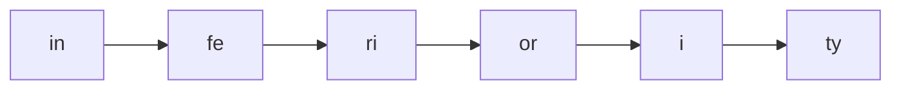
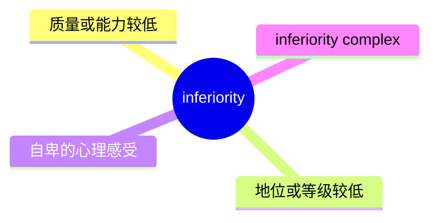
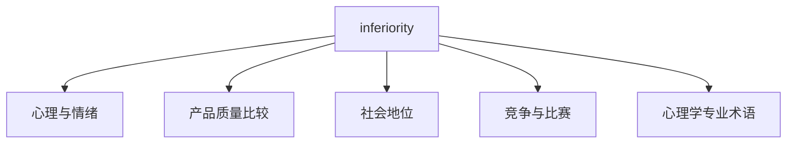
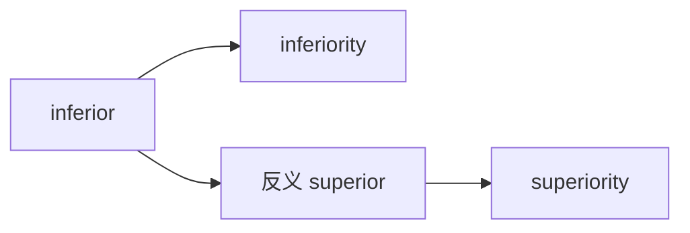
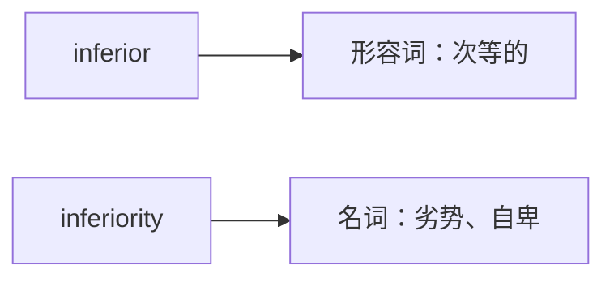

# inferiority

## 1. 单词卡片

| 项目 | 内容 |
|---|---|
| 单词 | inferiority |
| 词性 | noun |
| 英式音标 | /ɪnˌfɪəriˈɒrəti/ |
| 美式音标 | /ɪnˌfɪriˈɔːrəti/ |
| 音节 | in-fe-ri-or-i-ty |
| 重音 | 第四音节（or） |
| 核心意思 | 低劣、次等；自卑、劣势地位 |

> 原输入拼写正确，直接生成课程，无需调整。

## 2. 发音拆解



发音提示：

* 这是一个六音节长单词，重音落在第四个音节 `or` 上，英式读作 `/ˈɒ/`，美式读作 `/ˈɔː/`。
* 第一个音节 `in` 读得比较轻，不要重读。
* `feri` 部分连读较快，接近 `/fɪəri/`（英式）或 `/fɪri/`（美式）。
* 最后的 `-ity` 读作轻快的 `/əti/`，不要拖长。
* 中文近似音只能辅助记忆，不能代替标准发音：可以理解为“因菲尔瑞奥瑞提”，但真实发音比这个更连贯、更轻快。
* 英美发音差异主要在 `or` 这个重读音节上，英式偏 `/ɒ/`，美式偏 `/ɔː/`。

## 3. 核心词义



## 4. 不同词性与用法

| 词性 | 英文含义 | 中文意思 | 常见结构 |
|---|---|---|---|
| noun | the state of being lower in quality or status | 劣势、次等 | a feeling of inferiority |
| noun | a psychological sense of not being good enough | 自卑感 | inferiority complex |

说明：`inferiority` 本身只有名词用法，它是形容词 `inferior`（次等的、较差的）对应的抽象名词。

## 5. 常见使用语境



## 6. 常见搭配

| 搭配 | 中文意思 | 使用场景 |
|---|---|---|
| inferiority complex | 自卑情结 | 心理学、日常表达 |
| a sense of inferiority | 一种自卑感 | 情绪描述 |
| feelings of inferiority | 自卑的情绪 | 情绪描述 |
| technological inferiority | 技术上的劣势 | 商业、科技比较 |
| overcome inferiority | 克服自卑 | 个人成长 |

## 7. 核心句型

```text
feel a sense of inferiority
He felt a deep sense of inferiority.
```

```text
have an inferiority complex
She has always had an inferiority complex about her height.
```

## 8. 基础例句

**例句 1**

```text
He struggled with feelings of **inferiority** throughout his childhood.
```

他在童年时期一直被自卑感困扰。

**例句 2**

```text
The company's technological inferiority made it hard to compete.
```

这家公司在技术上的劣势让它很难参与竞争。

## 9. 否定句、疑问句与问答

**否定句**

```text
She does not feel any sense of inferiority around her colleagues.
```

她在同事面前完全没有自卑感。

**一般疑问句**

```text
Does he still have an inferiority complex about his English?
```

他对自己的英语还有自卑情结吗？

**特殊疑问句**

```text
Why do some people develop a strong sense of inferiority?
```

为什么有些人会产生强烈的自卑感？

**问答组合**

```text
Question: What usually causes a sense of inferiority in children?
Answer: It often comes from constant comparison with other children.
```

问：是什么通常导致孩子产生自卑感？
答：通常来自不断和其他孩子做比较。

## 10. 工作场景例句

```text
Our outdated software gives us a real sense of technological inferiority compared to competitors.
```

与竞争对手相比，我们过时的软件让我们在技术上有明显的劣势感。

```text
New employees sometimes feel a sense of inferiority when everyone else seems more experienced.
```

新员工有时会因为其他人看起来更有经验而感到自卑。

## 11. 日常生活例句

```text
Comparing yourself to others online can create an unnecessary feeling of inferiority.
```

在网上和别人比较，可能会产生不必要的自卑感。

## 12. 词根词缀与构词



| 单词 | 词性 | 中文意思 |
|---|---|---|
| inferior | adjective | 次等的、较差的 |
| inferiority | noun | 劣势、自卑 |
| superior | adjective | 优越的、较高的 |
| superiority | noun | 优势、优越感 |

说明：`inferior` 来自拉丁语 `inferus`（意为“下方的”），加上抽象名词后缀 `-ity` 构成 `inferiority`，表示“处于下方的状态”，也就是“劣势、次等”。

## 13. 派生词

| 单词 | 词性 | 中文意思 | 常见程度 |
|---|---|---|---|
| inferior | adjective | 次等的、较差的 | 高 |
| inferiority | noun | 劣势、自卑 | 高 |
| inferiorly | adverb | 处于劣势地位地（较少用） | 低 |

## 14. 同义词辨析

| 单词 | 主要区别 |
|---|---|
| inferiority | 强调“较低的状态”，可以指质量、地位或心理感受，最常用 |
| inadequacy | 强调“能力或数量不足”，更偏向“不够好、不够用” |
| deficiency | 强调“缺乏某种成分或能力”，常用于医学、营养或专业能力 |
| lowliness | 强调“地位卑微”，语气较正式、较少用 |

## 15. 反义词

| 单词 | 中文意思 |
|---|---|
| superiority | 优势、优越感 |
| excellence | 卓越、优秀 |
| dominance | 主导地位、优势地位 |

## 16. 易混淆词辨析

`inferiority` 容易和形容词 `inferior` 混淆，两者词性不同。



| 单词 | 词性 | 例句 |
|---|---|---|
| inferior | adjective | This product is inferior to the previous version. |
| inferiority | noun | He felt a sense of inferiority about his English. |

## 17. 常见错误

错误：

```text
He has an inferior complex.
```

正确：

```text
He has an inferiority complex.
```

说明：固定搭配是 `inferiority complex`（自卑情结），使用的是名词 `inferiority`，而不是形容词 `inferior`。

错误：

```text
This product is inferiority to the old one.
```

正确：

```text
This product is inferior to the old one.
```

说明：这里需要用形容词 `inferior`，因为它在描述“产品”这个名词的性质，而不是抽象的“劣势状态”本身。

## 18. 记忆方法

```text
inferior（次等的） + -ity（抽象名词后缀） = inferiority（劣势、自卑）
```

记忆技巧：先记住形容词 `inferior`，再加上 `-ity` 变成抽象名词，就像 `superior` 加 `-ity` 变成 `superiority` 一样，两个词是一对反义结构，可以一起记忆。

场景记忆：

```text
He has an inferiority complex about his height.
他对自己的身高有自卑情结。
```

## 19. 快速复习

| 问题 | 答案 |
|---|---|
| 核心意思是什么 | 劣势、次等、自卑感 |
| 最常见的固定搭配是什么 | inferiority complex |
| 对应的形容词是什么 | inferior |
| 反义词是什么 | superiority |

## 20. 选择题考试

> 请先独立选择答案，不要提前展开答案区。

### 第 1 题

`inferiority` 最核心的意思是什么？

- [ ] A. 优越感
- [ ] B. 劣势、次等或自卑感
- [ ] C. 平等的地位
- [ ] D. 强烈的自信

<details>
<summary>提交选择后查看结果</summary>

- 正确答案：**B. 劣势、次等或自卑感**
- 对错判断：选择 B 为正确；选择 A、C 或 D 为错误。
- 解析：`inferiority` 描述的是处于较低的质量、地位或心理状态，常用来表达“自卑”或“劣势”。

</details>

### 第 2 题

下面哪个搭配是自然、正确的固定表达？

- [ ] A. inferior complex
- [ ] B. inferiority complex
- [ ] C. complex inferiority
- [ ] D. inferioritying complex

<details>
<summary>提交选择后查看结果</summary>

- 正确答案：**B. inferiority complex**
- 对错判断：选择 B 为正确；选择 A、C 或 D 为错误。
- 解析：`inferiority complex`（自卑情结）是心理学中的固定搭配，必须使用名词 `inferiority`。

</details>

### 第 3 题

`inferiority` 这个单词的重音在哪个音节？

- [ ] A. 第一个音节 in
- [ ] B. 第二个音节 fe
- [ ] C. 第四个音节 or
- [ ] D. 最后一个音节 ty

<details>
<summary>提交选择后查看结果</summary>

- 正确答案：**C. 第四个音节 or**
- 对错判断：选择 C 为正确；选择 A、B 或 D 为错误。
- 解析：`inferiority` 的重音在第四个音节 `or` 上，英式读 `/ˈɒ/`，美式读 `/ˈɔː/`。

</details>

### 第 4 题

下面哪个句子用词正确？

- [ ] A. This product is inferiority to the old one.
- [ ] B. This product is inferior to the old one.
- [ ] C. This product has inferior about the old one.
- [ ] D. This product inferiority the old one.

<details>
<summary>提交选择后查看结果</summary>

- 正确答案：**B. This product is inferior to the old one.**
- 对错判断：选择 B 为正确；选择 A、C 或 D 为错误。
- 解析：描述“产品比较差”应使用形容词 `inferior`，固定结构是 `inferior to`，而不是名词 `inferiority`。

</details>

### 第 5 题

`inferiority` 的反义词是什么？

- [ ] A. superiority
- [ ] B. inadequacy
- [ ] C. deficiency
- [ ] D. inferior

<details>
<summary>提交选择后查看结果</summary>

- 正确答案：**A. superiority**
- 对错判断：选择 A 为正确；选择 B、C 或 D 为错误。
- 解析：`superiority`（优势、优越感）在词形和意义上都是 `inferiority`（劣势、自卑）的反义词；`inferior` 是形容词，不是反义词，而是同一词族的形容词形式。

</details>

## 21. 考试结果汇总

完成全部题目后，根据答案区自行统计：

| 正确题数 | 掌握情况 | 建议 |
|---|---|---|
| 5 题 | 已掌握 | 进入下一个单词 |
| 4 题 | 基本掌握 | 复习答错的知识点 |
| 2～3 题 | 掌握不稳 | 重新阅读搭配、例句和易错点 |
| 0～1 题 | 尚未掌握 | 重新学习整个单词课程 |
