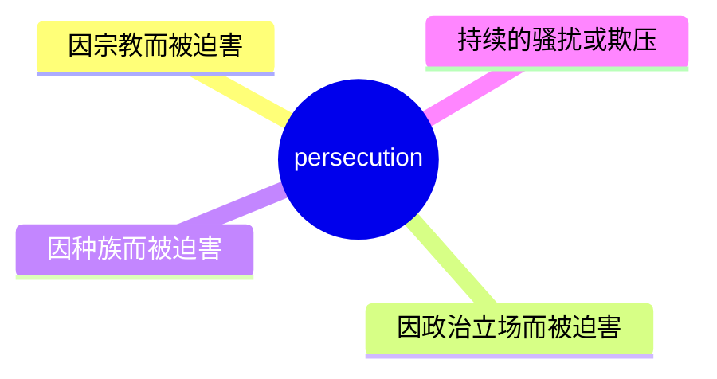
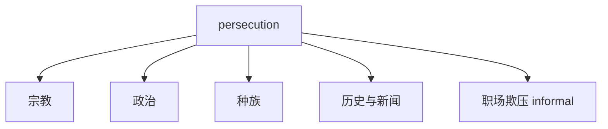
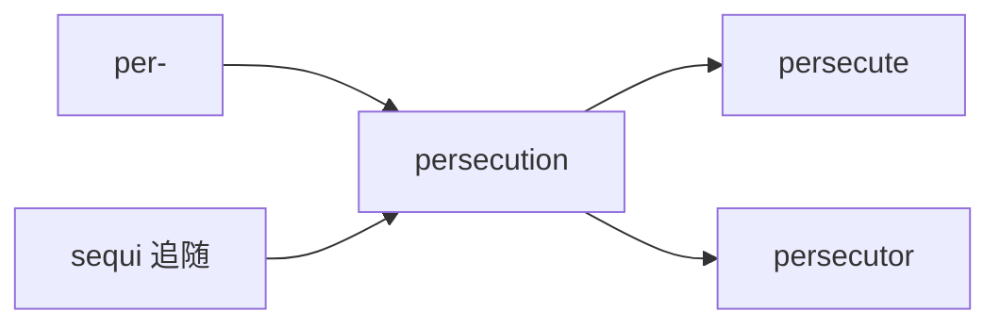
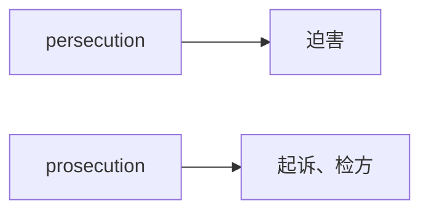

# persecution

## 1. 单词卡片

| 项目 | 内容 |
|---|---|
| 单词 | persecution |
| 词性 | noun |
| 英式音标 | /ˌpɜːsɪˈkjuːʃn/ |
| 美式音标 | /ˌpɜːrsɪˈkjuːʃn/ |
| 音节 | per-se-cu-tion |
| 重音 | 第三音节（cu） |
| 核心意思 | 迫害；持续的、残酷的压迫 |

> 原输入拼写正确，直接生成课程，无需调整。

## 2. 发音拆解


发音提示：

* 重音在第三个音节 `cu` 上，读作 `/ˈkjuː/`，这是全词最响亮、拉长的部分。
* 第一个音节 `per` 英式读 `/pɜː/`，美式读 `/pɜːr/`，注意美式有明显的卷舌音 `/r/`。
* 结尾 `-tion` 统一读作 `/ʃn/`，不要按照拼写读成“提翁”。
* 中文近似音只能辅助记忆，不能代替标准发音：可以理解为“泊儿-思-Q-申”，但真实发音更连贯。

## 3. 核心词义



## 4. 不同词性与用法

| 词性 | 英文含义 | 中文意思 | 常见结构 |
|---|---|---|---|
| noun | cruel and unfair treatment over a long time | 迫害 | religious persecution |
| noun | the act of persecuting someone | 迫害行为 | face persecution |

说明：对应的动词是 `persecute`（迫害），`persecution` 是它的名词形式。

## 5. 常见使用语境



## 6. 常见搭配

| 搭配 | 中文意思 | 使用场景 |
|---|---|---|
| religious persecution | 宗教迫害 | 历史、新闻 |
| political persecution | 政治迫害 | 新闻、政治评论 |
| face persecution | 面临迫害 | 描述处境 |
| flee persecution | 逃离迫害 | 难民、移民话题 |
| a victim of persecution | 迫害的受害者 | 正式写作 |

## 7. 核心句型

```text
suffer persecution because of ...
They suffered persecution because of their religion.
```

```text
flee from persecution
Many refugees flee from persecution in their home countries.
```

## 8. 基础例句

**例句 1**

```text
The group faced **persecution** for their political beliefs.
```

这个团体因为他们的政治信仰而遭到迫害。

**例句 2**

```text
Historians have documented centuries of religious persecution.
```

历史学家记录了数个世纪的宗教迫害。

## 9. 否定句、疑问句与问答

**否定句**

```text
The new government does not tolerate persecution of minority groups.
```

新政府不容忍对少数群体的迫害。

**一般疑问句**

```text
Did the family experience persecution before leaving the country?
```

这家人在离开这个国家之前经历过迫害吗？

**特殊疑问句**

```text
Why did they flee the country in the first place?
```

他们当初为什么要逃离这个国家？

**问答组合**

```text
Question: What forced so many people to leave their homeland?
Answer: Years of persecution based on their ethnicity forced them to flee.
```

问：是什么迫使这么多人离开自己的家乡？
答：多年基于种族的迫害迫使他们逃离。

## 10. 工作场景例句

```text
The report focused on the economic impact of political persecution on skilled workers.
```

这份报告关注政治迫害对技术工人经济状况的影响。

## 11. 日常生活例句

```text
He sometimes feels a sense of persecution, even when no one is actually against him.
```

他有时会有一种被迫害的感觉，即使实际上没有人在针对他。

## 12. 词根词缀与构词



| 单词 | 词性 | 中文意思 |
|---|---|---|
| persecute | verb | 迫害 |
| persecution | noun | 迫害（行为、状态） |
| persecutor | noun | 迫害者 |

说明：`persecution` 来自拉丁语 `persequi`（意为“紧紧追赶”），词根含义是“穷追不舍”，后来发展为“持续压迫、迫害”的意思。

## 13. 派生词

| 单词 | 词性 | 中文意思 | 常见程度 |
|---|---|---|---|
| persecute | verb | 迫害 | 高 |
| persecution | noun | 迫害 | 高 |
| persecutor | noun | 迫害者 | 中 |
| persecuted | adjective | 受迫害的 | 中 |

## 14. 同义词辨析

| 单词 | 主要区别 |
|---|---|
| persecution | 强调长期、系统性的残酷压迫，常与宗教、政治、种族相关 |
| oppression | 强调权力对群体的压制，范围更广，不一定针对个人的信仰 |
| harassment | 强调反复的骚扰，程度通常轻于 persecution |
| discrimination | 强调不公平的区别对待，不一定涉及暴力或残酷手段 |

## 15. 反义词

| 单词 | 中文意思 |
|---|---|
| tolerance | 宽容 |
| protection | 保护 |
| acceptance | 接纳 |

## 16. 易混淆词辨析

`persecution` 容易和发音、拼写相近的 `prosecution` 混淆，两者意思完全不同。



| 单词 | 中文意思 | 例句 |
|---|---|---|
| persecution | 迫害 | They suffered religious persecution. |
| prosecution | 起诉、检方 | The prosecution presented new evidence in court. |

## 17. 常见错误

错误：

```text
The lawyer works for the persecution.
```

正确：

```text
The lawyer works for the prosecution.
```

说明：在法庭语境中，“检方、公诉方”应该用 `prosecution`，而不是 `persecution`。`persecution` 指的是“迫害”，与法庭起诉无关。

## 18. 记忆方法

```text
persecution = 长期、残酷地压迫（迫害）
```

记忆技巧：`persecution` 里的 `per-` 联想为“一直、彻底”，可以理解为“一直追着不放，进行残酷压迫”。同时注意不要和法庭上的 `prosecution`（起诉）混淆。

场景记忆：

```text
They fled the country to escape religious persecution.
他们逃离这个国家，是为了躲避宗教迫害。
```

## 19. 快速复习

| 问题 | 答案 |
|---|---|
| 核心意思是什么 | 迫害，长期残酷的压迫 |
| 常见搭配是什么 | religious persecution / flee persecution |
| 最容易混淆的词是什么 | prosecution（起诉） |
| 对应的动词是什么 | persecute |

## 20. 选择题考试

> 请先独立选择答案，不要提前展开答案区。

### 第 1 题

`persecution` 最核心的意思是什么？

- [ ] A. 起诉
- [ ] B. 迫害
- [ ] C. 保护
- [ ] D. 表扬

<details>
<summary>提交选择后查看结果</summary>

- 正确答案：**B. 迫害**
- 对错判断：选择 B 为正确；选择 A、C 或 D 为错误。
- 解析：`persecution` 表示长期、残酷的压迫，常见于宗教、政治或种族相关语境。

</details>

### 第 2 题

下面哪个句子用词正确？

- [ ] A. The lawyer works for the persecution in this case.
- [ ] B. They suffered religious prosecution for decades.
- [ ] C. They suffered religious persecution for decades.
- [ ] D. The persecution presented new evidence in court.

<details>
<summary>提交选择后查看结果</summary>

- 正确答案：**C. They suffered religious persecution for decades.**
- 对错判断：选择 C 为正确；选择 A、B 或 D 为错误，因为法庭语境应使用 `prosecution`，而“遭受宗教迫害”应使用 `persecution`。
- 解析：A、D 混淆了法庭“起诉”和“迫害”的区别；B 用词位置反了。

</details>

### 第 3 题

`persecution` 这个单词的重音在哪个音节？

- [ ] A. 第一个音节 per
- [ ] B. 第二个音节 se
- [ ] C. 第三个音节 cu
- [ ] D. 第四个音节 tion

<details>
<summary>提交选择后查看结果</summary>

- 正确答案：**C. 第三个音节 cu**
- 对错判断：选择 C 为正确；选择 A、B 或 D 为错误。
- 解析：`persecution` 的重音落在第三个音节 `cu` 上，读作 `/ˈkjuː/`。

</details>

### 第 4 题

`persecution` 对应的动词形式是什么？

- [ ] A. persecute
- [ ] B. persecutive
- [ ] C. persecutable
- [ ] D. persecutionize

<details>
<summary>提交选择后查看结果</summary>

- 正确答案：**A. persecute**
- 对错判断：选择 A 为正确；选择 B、C 或 D 为错误，这些都不是真实存在的常用单词。
- 解析：`persecute` 是动词“迫害”，`persecution` 是它对应的名词形式。

</details>

### 第 5 题

下列哪个搭配最自然？

- [ ] A. flee persecution
- [ ] B. flee prosecution complex
- [ ] C. persecution stand
- [ ] D. persecution ticket

<details>
<summary>提交选择后查看结果</summary>

- 正确答案：**A. flee persecution**
- 对错判断：选择 A 为正确；选择 B、C 或 D 为错误，这些都不是真实存在的自然搭配。
- 解析：`flee persecution` 表示“逃离迫害”，是描述难民和移民话题时非常常见的表达。

</details>

## 21. 考试结果汇总

完成全部题目后，根据答案区自行统计：

| 正确题数 | 掌握情况 | 建议 |
|---|---|---|
| 5 题 | 已掌握 | 进入下一个单词 |
| 4 题 | 基本掌握 | 复习答错的知识点 |
| 2～3 题 | 掌握不稳 | 重新阅读搭配、例句和易错点 |
| 0～1 题 | 尚未掌握 | 重新学习整个单词课程 |
