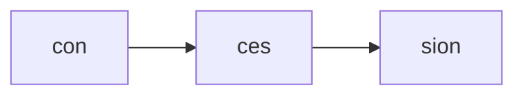
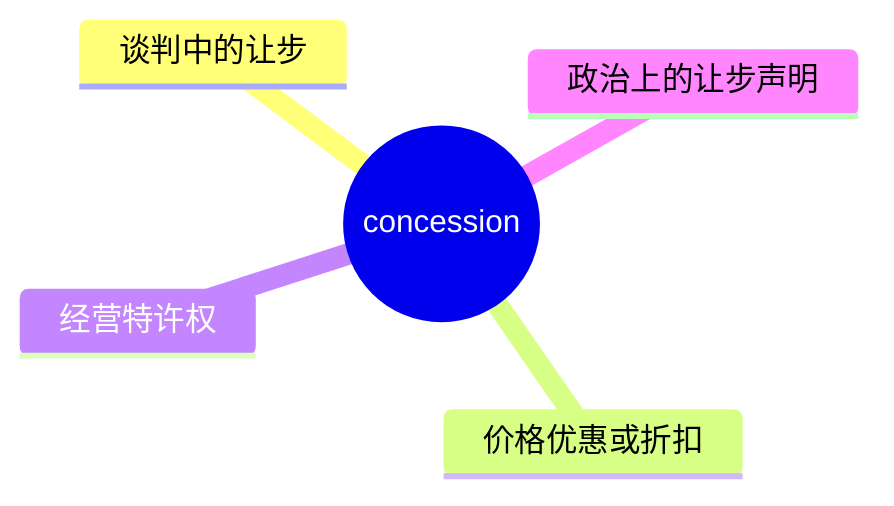
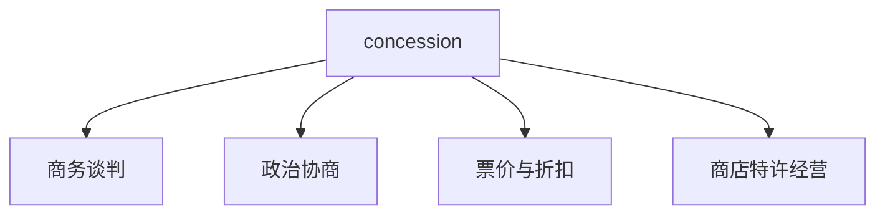
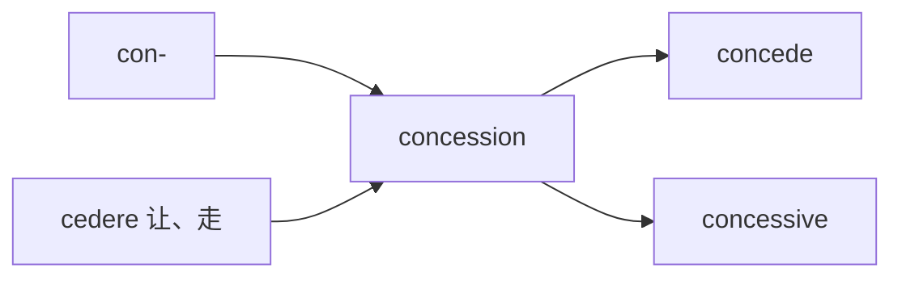
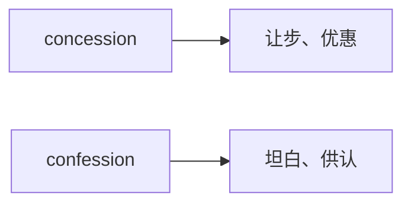

# concession

## 1. 单词卡片

| 项目 | 内容 |
|---|---|
| 单词 | concession |
| 词性 | noun |
| 英式音标 | /kənˈseʃn/ |
| 美式音标 | /kənˈseʃn/ |
| 音节 | con-ces-sion |
| 重音 | 第二音节（ces） |
| 核心意思 | 让步；优惠、特许权 |

> 原输入拼写正确，直接生成课程，无需调整。

## 2. 发音拆解



发音提示：

* 重音在第二个音节 `ces` 上，读作 `/ˈse/`。
* 第一个音节 `con` 是弱读，接近 `/kən/`，不要读成完整的“康”。
* 结尾 `-sion` 读作轻柔的 `/ʃn/`，类似“申”，不要读出明显的元音。
* 中文近似音只能辅助记忆，不能代替标准发音：可以理解为“肯-塞-申”，但真实发音更轻、更连贯。

## 3. 核心词义



## 4. 不同词性与用法

| 词性 | 英文含义 | 中文意思 | 常见结构 |
|---|---|---|---|
| noun | something granted, especially in negotiation | 让步 | make a concession |
| noun | a reduction in price for a certain group | 优惠票价、折扣 | student concession |
| noun | the right to run a business in a certain place | 经营特许权 | a retail concession |

说明：对应的动词是 `concede`（让步、承认），`concession` 是它的名词形式之一。

## 5. 常见使用语境



## 6. 常见搭配

| 搭配 | 中文意思 | 使用场景 |
|---|---|---|
| make a concession | 做出让步 | 谈判、协商 |
| price concession | 价格优惠 | 商业、销售 |
| tax concession | 税收优惠 | 财务、政策 |
| concession stand | 小卖部、售货亭 | 电影院、体育场 |
| student concession | 学生票价优惠 | 交通、门票 |

## 7. 核心句型

```text
make a concession on ...
The company made a concession on delivery time.
```

```text
grant a concession to ...
The government granted tax concessions to small businesses.
```

## 8. 基础例句

**例句 1**

```text
Both sides made small **concessions** to reach an agreement.
```

双方都做出了小小的让步以达成协议。

**例句 2**

```text
Students can buy tickets at a concession price.
```

学生可以以优惠价格购买门票。

## 9. 否定句、疑问句与问答

**否定句**

```text
The union did not make any concessions during the negotiation.
```

工会在谈判中没有做出任何让步。

**一般疑问句**

```text
Did the government offer any tax concessions this year?
```

政府今年提供了任何税收优惠吗？

**特殊疑问句**

```text
What concessions is the company willing to make?
```

公司愿意做出哪些让步？

**问答组合**

```text
Question: What concession did management finally agree to?
Answer: They agreed to a small pay increase as a concession.
```

问：管理层最终同意做出了什么让步？
答：他们同意小幅加薪作为让步。

## 10. 工作场景例句

```text
After hours of negotiation, both companies agreed on a few key concessions.
```

经过几个小时的谈判，两家公司在几个关键点上达成了让步。

## 11. 日常生活例句

```text
There is a small concession stand near the entrance selling popcorn and drinks.
```

入口附近有一个小卖部，卖爆米花和饮料。

## 12. 词根词缀与构词



| 单词 | 词性 | 中文意思 |
|---|---|---|
| concede | verb | 让步、承认 |
| concession | noun | 让步、优惠 |
| concessive | adjective | 让步的（较正式、语法术语） |

说明：`concession` 来自拉丁语 `concedere`（意为“让、退让”），词根含义是“同意让出”，因此发展出“让步”“优惠”“特许权”等意思。

## 13. 派生词

| 单词 | 词性 | 中文意思 | 常见程度 |
|---|---|---|---|
| concede | verb | 让步、承认 | 高 |
| concession | noun | 让步、优惠 | 高 |
| concessionary | adjective | 优惠的（英式英语常用） | 中 |

## 14. 同义词辨析

| 单词 | 主要区别 |
|---|---|
| concession | 强调在谈判或争论中主动做出的让步，也可指价格优惠 |
| compromise | 强调双方各自让一步，达成折中方案 |
| discount | 专指价格上的折扣，不涉及谈判让步的含义 |
| privilege | 强调特权，不一定来自让步 |

## 15. 反义词

| 单词 | 中文意思 |
|---|---|
| demand | 要求 |
| insistence | 坚持 |
| refusal | 拒绝 |

## 16. 易混淆词辨析

`concession` 容易和拼写相近的 `confession` 混淆，两者意思不同。



| 单词 | 中文意思 | 例句 |
|---|---|---|
| concession | 让步、优惠 | They made a concession during the talks. |
| confession | 坦白、供认 | He made a full confession to the police. |

## 17. 常见错误

错误：

```text
He made a concession to the police about the crime.
```

正确：

```text
He made a confession to the police about the crime.
```

说明：“向警方坦白罪行”应该用 `confession`（坦白），而不是 `concession`（让步）。两者拼写相似，但含义完全不同。

## 18. 记忆方法

```text
concession = con-（一起）+ cedere（让、退）= 一起让出一步
```

记忆技巧：可以把 `concession` 理解为“双方一起各退一步”，无论是谈判中的让步，还是价格上的优惠，本质都是“主动让出一部分”。

场景记忆：

```text
Both sides made concessions to reach an agreement.
双方都做出了让步，以达成协议。
```

## 19. 快速复习

| 问题 | 答案 |
|---|---|
| 核心意思是什么 | 让步；价格优惠；经营特许权 |
| 常见搭配是什么 | make a concession / tax concession |
| 最容易混淆的词是什么 | confession（坦白） |
| 对应的动词是什么 | concede |

## 20. 选择题考试

> 请先独立选择答案，不要提前展开答案区。

### 第 1 题

`make a concession` 最自然的中文意思是什么？

- [ ] A. 提出要求
- [ ] B. 做出让步
- [ ] C. 完全拒绝
- [ ] D. 签署合同

<details>
<summary>提交选择后查看结果</summary>

- 正确答案：**B. 做出让步**
- 对错判断：选择 B 为正确；选择 A、C 或 D 为错误。
- 解析：`make a concession` 是谈判和协商中常见的表达，表示在某一点上主动退让。

</details>

### 第 2 题

下面哪个句子用词正确？

- [ ] A. He made a concession to the police about the crime.
- [ ] B. He made a confession to the police about the crime.
- [ ] C. Students can buy tickets at a confession price.
- [ ] D. The government offers confession stands near schools.

<details>
<summary>提交选择后查看结果</summary>

- 正确答案：**B. He made a confession to the police about the crime.**
- 对错判断：选择 B 为正确；选择 A、C 或 D 为错误，因为它们混淆了 `concession` 和 `confession`。
- 解析：“向警方坦白”应使用 `confession`；“学生票价”和“小卖部”都应使用 `concession`。

</details>

### 第 3 题

`concession` 这个单词的重音在哪个音节？

- [ ] A. 第一个音节 con
- [ ] B. 第二个音节 ces
- [ ] C. 第三个音节 sion
- [ ] D. 没有固定重音

<details>
<summary>提交选择后查看结果</summary>

- 正确答案：**B. 第二个音节 ces**
- 对错判断：选择 B 为正确；选择 A、C 或 D 为错误。
- 解析：`concession` 的重音落在第二个音节 `ces` 上，读作 `/ˈse/`。

</details>

### 第 4 题

`concession stand` 通常指的是什么？

- [ ] A. 一份正式的谈判协议
- [ ] B. 电影院或体育场里的小卖部
- [ ] C. 一种法律文件
- [ ] D. 一种税收政策

<details>
<summary>提交选择后查看结果</summary>

- 正确答案：**B. 电影院或体育场里的小卖部**
- 对错判断：选择 B 为正确；选择 A、C 或 D 为错误。
- 解析：`concession stand` 是常见于电影院、体育场等场所出售零食饮料的小卖部，属于 `concession` 的“特许经营”含义。

</details>

### 第 5 题

`concession` 对应的动词形式是什么？

- [ ] A. concede
- [ ] B. concess
- [ ] C. concessionize
- [ ] D. conceive

<details>
<summary>提交选择后查看结果</summary>

- 正确答案：**A. concede**
- 对错判断：选择 A 为正确；选择 B、C 或 D 为错误，其中 D 的 conceive 是完全不同的单词，意思是“构思、怀孕”。
- 解析：`concede` 是动词“让步、承认”，`concession` 是它的名词形式。

</details>

## 21. 考试结果汇总

完成全部题目后，根据答案区自行统计：

| 正确题数 | 掌握情况 | 建议 |
|---|---|---|
| 5 题 | 已掌握 | 进入下一个单词 |
| 4 题 | 基本掌握 | 复习答错的知识点 |
| 2～3 题 | 掌握不稳 | 重新阅读搭配、例句和易错点 |
| 0～1 题 | 尚未掌握 | 重新学习整个单词课程 |
