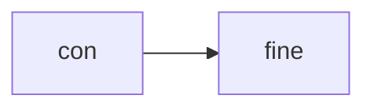
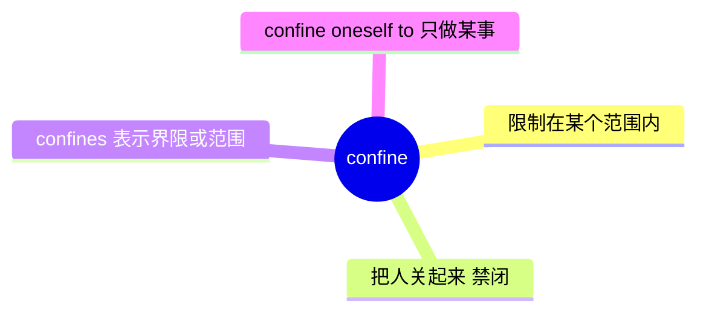
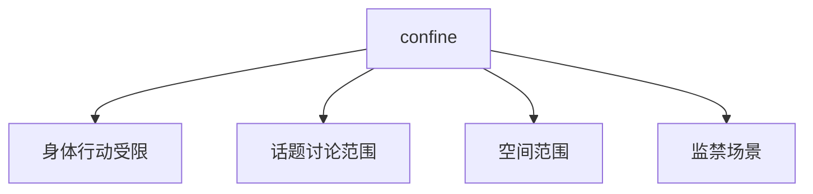
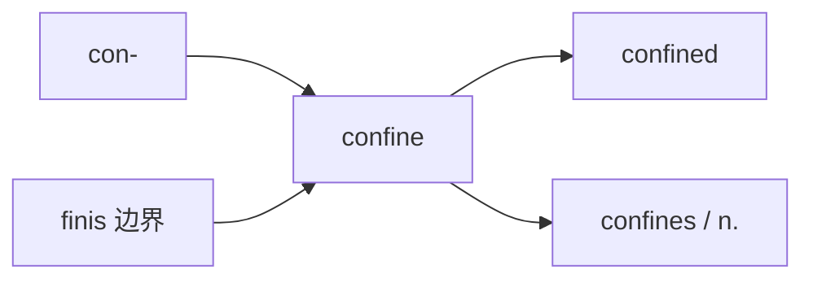
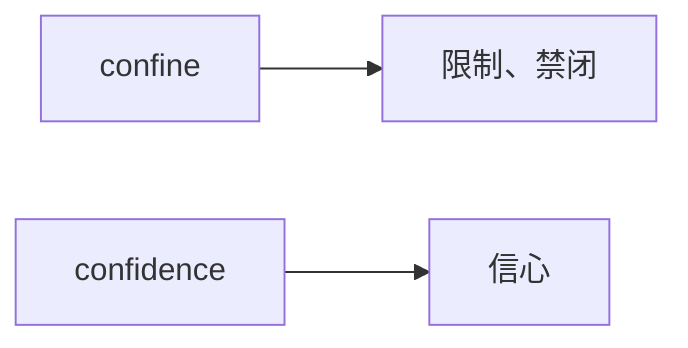

# confine

## 1. 单词卡片

| 项目 | 内容 |
|---|---|
| 单词 | confine |
| 词性 | verb / noun (常用复数 confines) |
| 英式音标（动词） | /kənˈfaɪn/ |
| 美式音标（动词） | /kənˈfaɪn/ |
| 英式音标（名词） | /ˈkɒnfaɪn/ |
| 美式音标（名词） | /ˈkɑːnfaɪn/ |
| 音节 | con-fine |
| 重音 | 动词重音在第二音节，名词重音在第一音节 |
| 核心意思 | 限制、禁闭；（复数）界限、范围 |

> 原输入拼写正确，直接生成课程，无需调整。

## 2. 发音拆解



发音提示：

* `confine` 是一个典型的“重音随词性变化”的单词：作动词时重音在第二个音节，读作 `/kənˈfaɪn/`；作名词（通常用复数 `confines`）时重音在第一个音节，读作 `/ˈkɒnfaɪnz/`。
* 元音 `/aɪ/` 类似“爱”的发音，是全词最响亮的部分。
* 动词形式中第一个音节是弱读 `/kən/`，不要重读。
* 中文近似音只能辅助记忆，不能代替标准发音：动词可以理解为“肯-凡因”，名词可以理解为“康-凡因”。

## 3. 核心词义



## 4. 不同词性与用法

| 词性 | 英文含义 | 中文意思 | 常见结构 |
|---|---|---|---|
| verb | to keep within limits | 限制在……范围内 | confine to |
| verb | to keep someone locked up | 禁闭、监禁 | be confined to a room |
| noun (常用复数) | the limits of an area or subject | 界限、范围 | within the confines of |

## 5. 常见使用语境



## 6. 常见搭配

| 搭配 | 中文意思 | 使用场景 |
|---|---|---|
| confine to | 限制在……范围内 | 通用 |
| be confined to bed | 卧床不起 | 健康、疾病 |
| within the confines of | 在……的范围之内 | 正式写作 |
| confine oneself to | 只谈论/只做某事 | 讨论、写作 |
| a confined space | 狭小的空间 | 建筑、安全 |

## 7. 核心句型

```text
confine A to B
Please confine your comments to the topic at hand.
```

```text
be confined to + 地点/状态
He was confined to bed for a week after the surgery.
```

## 8. 基础例句

**例句 1**

```text
Doctors **confined** him to bed for several days.
```

医生让他卧床休息了几天。

**例句 2**

```text
Let's confine the discussion to today's agenda.
```

我们把讨论限制在今天的议程范围内吧。

## 9. 否定句、疑问句与问答

**否定句**

```text
The problem is not confined to this department alone.
```

这个问题并不仅限于这个部门。

**一般疑问句**

```text
Is the meeting confined to senior managers only?
```

这次会议是否仅限于高层管理人员参加？

**特殊疑问句**

```text
Why was the patient confined to a single room?
```

为什么这位病人被限制在单独的房间里？

**问答组合**

```text
Question: Should we confine the budget discussion to this quarter?
Answer: Yes, let's keep it focused on this quarter only.
```

问：我们应该把预算讨论限制在这个季度吗？
答：是的，我们就专注于这个季度吧。

## 10. 工作场景例句

```text
Please confine your presentation to the key findings only.
```

请把你的展示内容限制在关键结论上。

## 11. 日常生活例句

```text
Because of the storm, they were confined to their house for two days.
```

因为暴风雨，他们被困在家里两天。

## 12. 词根词缀与构词



| 单词 | 词性 | 中文意思 |
|---|---|---|
| confine | verb | 限制、禁闭 |
| confined | adjective | 受限的、狭小的 |
| confines | noun (复数) | 界限、范围 |

说明：`confine` 来自拉丁语 `finis`（意为“边界、终点”），加上前缀 `con-`（一起）构成，词根含义是“划定一起的边界”，也就是“限制在某个范围内”。

## 13. 派生词

| 单词 | 词性 | 中文意思 | 常见程度 |
|---|---|---|---|
| confine | verb | 限制、禁闭 | 高 |
| confined | adjective | 受限的、狭小的 | 高 |
| confines | noun (复数) | 界限、范围 | 中 |
| confinement | noun | 监禁、限制状态 | 中 |

## 14. 同义词辨析

| 单词 | 主要区别 |
|---|---|
| confine | 强调把某事物限制在一个明确的范围之内，可以指身体、话题或空间 |
| restrict | 强调对数量、自由或权利加以限制，使用范围更广 |
| limit | 最常用、最中性，可以描述几乎任何限制 |
| imprison | 专指关进监狱，语气更强、更具体 |

## 15. 反义词

| 单词 | 中文意思 |
|---|---|
| free | 使自由 |
| release | 释放 |
| expand | 扩展 |

## 16. 易混淆词辨析

`confine` 容易和名词 `confidence`（信心）在拼写开头部分混淆，需要注意区分。



| 单词 | 中文意思 | 例句 |
|---|---|---|
| confine | 限制、禁闭 | He was confined to his room. |
| confidence | 信心 | She spoke with great confidence. |

## 17. 常见错误

错误：

```text
He was confine to his room.
```

正确：

```text
He was confined to his room.
```

说明：在被动语态中，`confine` 需要变成过去分词 `confined`，构成 `be confined to`，不能直接使用原形动词。

## 18. 记忆方法

```text
confine = con-（一起）+ finis（边界）= 划定一起的边界，限制在范围内
```

记忆技巧：想象用一条线画出一个范围，把人或事物“圈”在里面，这就是 `confine` 的核心画面。

场景记忆：

```text
He was confined to bed for a week after the surgery.
手术后他卧床休息了一周。
```

## 19. 快速复习

| 问题 | 答案 |
|---|---|
| 核心意思是什么 | 限制在某范围内；禁闭 |
| 常见搭配是什么 | be confined to / within the confines of |
| 动词和名词重音有什么区别 | 动词重音在第二音节，名词重音在第一音节 |
| 常见形容词形式是什么 | confined |

## 20. 选择题考试

> 请先独立选择答案，不要提前展开答案区。

### 第 1 题

`confine someone to bed` 最自然的中文意思是什么？

- [ ] A. 带某人去医院
- [ ] B. 让某人卧床休息
- [ ] C. 给某人换床
- [ ] D. 让某人出院

<details>
<summary>提交选择后查看结果</summary>

- 正确答案：**B. 让某人卧床休息**
- 对错判断：选择 B 为正确；选择 A、C 或 D 为错误。
- 解析：`confine someone to bed` 表示因病或受伤而限制某人只能待在床上。

</details>

### 第 2 题

下面哪个句子语法正确？

- [ ] A. He was confine to his room.
- [ ] B. He was confined to his room.
- [ ] C. He confined to his room.
- [ ] D. He confining to his room.

<details>
<summary>提交选择后查看结果</summary>

- 正确答案：**B. He was confined to his room.**
- 对错判断：选择 B 为正确；选择 A、C 或 D 为错误。
- 解析：被动语态需要使用过去分词 `confined`，正确结构是 `be confined to`。

</details>

### 第 3 题

作动词时，`confine` 的重音在哪个音节？

- [ ] A. 第一个音节
- [ ] B. 第二个音节
- [ ] C. 两个音节重音相同
- [ ] D. 没有固定重音

<details>
<summary>提交选择后查看结果</summary>

- 正确答案：**B. 第二个音节**
- 对错判断：选择 B 为正确；选择 A、C 或 D 为错误。
- 解析：作动词时，`confine` 重音在第二个音节，读作 `/kənˈfaɪn/`；作名词（confines）时重音才移到第一个音节。

</details>

### 第 4 题

`within the confines of` 最自然的中文意思是什么？

- [ ] A. 在……的帮助下
- [ ] B. 在……的范围之内
- [ ] C. 在……的对面
- [ ] D. 在……的历史中

<details>
<summary>提交选择后查看结果</summary>

- 正确答案：**B. 在……的范围之内**
- 对错判断：选择 B 为正确；选择 A、C 或 D 为错误。
- 解析：`confines` 在这里作名词，表示“界限、范围”，`within the confines of` 是常见的正式书面表达。

</details>

### 第 5 题

`confine` 最容易和下面哪个单词在拼写开头部分混淆？

- [ ] A. confidence
- [ ] B. combine
- [ ] C. contain
- [ ] D. confirm

<details>
<summary>提交选择后查看结果</summary>

- 正确答案：**A. confidence**
- 对错判断：选择 A 为正确；选择 B、C 或 D 为错误。
- 解析：`confine` 和 `confidence` 开头都是 `confi-`，容易让初学者混淆，但两者意思完全不同，一个是“限制”，一个是“信心”。

</details>

## 21. 考试结果汇总

完成全部题目后，根据答案区自行统计：

| 正确题数 | 掌握情况 | 建议 |
|---|---|---|
| 5 题 | 已掌握 | 进入下一个单词 |
| 4 题 | 基本掌握 | 复习答错的知识点 |
| 2～3 题 | 掌握不稳 | 重新阅读搭配、例句和易错点 |
| 0～1 题 | 尚未掌握 | 重新学习整个单词课程 |
