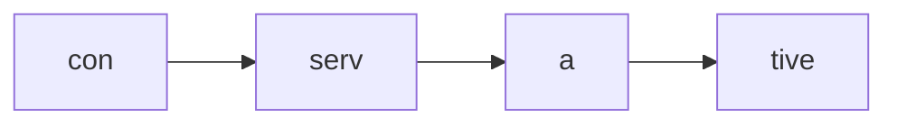
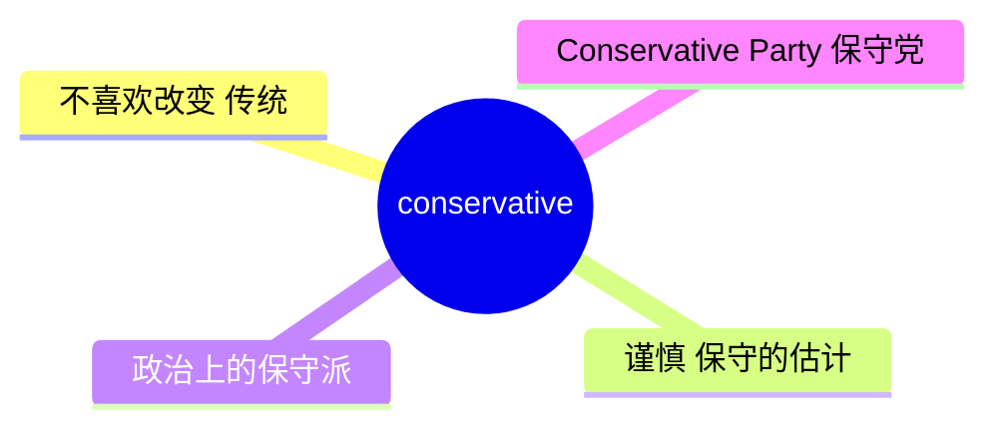
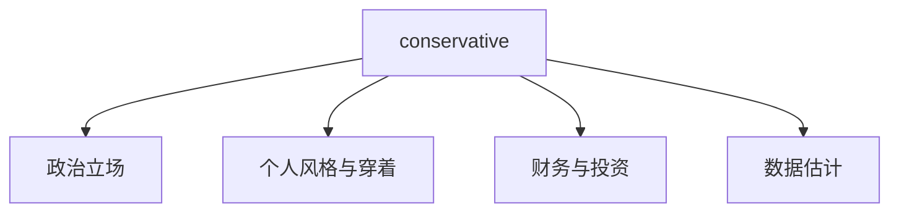
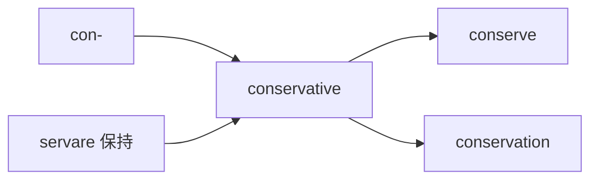
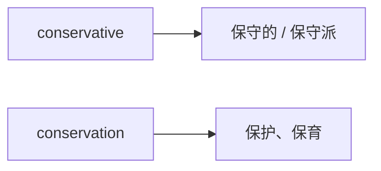

# conservative

## 1. 单词卡片

| 项目 | 内容 |
|---|---|
| 单词 | conservative |
| 词性 | adjective / noun |
| 英式音标 | /kənˈsɜːvətɪv/ |
| 美式音标 | /kənˈsɜːrvətɪv/ |
| 音节 | con-serv-a-tive |
| 重音 | 第二音节（serv） |
| 核心意思 | 保守的；谨慎的；（大写）保守党人 |

> 原输入拼写正确，直接生成课程，无需调整。

## 2. 发音拆解



发音提示：

* 重音在第二个音节 `serv` 上，英式读 `/ˈsɜː/`，美式读 `/ˈsɜːr/`，注意美式有明显卷舌音。
* 第一个音节 `con` 是弱读，接近 `/kən/`。
* 最后一个音节 `-tive` 读作短促的 `/tɪv/`，不要拖长。
* 中文近似音只能辅助记忆，不能代替标准发音：可以理解为“肯-色儿-və-替夫”，但真实发音更连贯、更轻快。

## 3. 核心词义



## 4. 不同词性与用法

| 词性 | 英文含义 | 中文意思 | 常见结构 |
|---|---|---|---|
| adjective | opposed to great or sudden change | 保守的、传统的 | conservative attitude |
| adjective | cautious, avoiding risk | 谨慎的、保守估计的 | a conservative estimate |
| noun | a person with traditional or cautious views | 保守的人、保守派人士 | he is a conservative |
| noun (大写 Conservative) | a member of a Conservative political party | 保守党人 | vote Conservative |

## 5. 常见使用语境



## 6. 常见搭配

| 搭配 | 中文意思 | 使用场景 |
|---|---|---|
| a conservative estimate | 保守的估计 | 数据、预算 |
| politically conservative | 政治上保守的 | 政治评论 |
| a conservative approach | 谨慎的做法 | 商业、投资 |
| conservative dress | 保守、传统的穿着 | 生活、时尚 |
| the Conservative Party | 保守党 | 英国政治 |

## 7. 核心句型

```text
take a conservative approach to ...
The company took a conservative approach to spending.
```

```text
by a conservative estimate
By a conservative estimate, the project will take six months.
```

## 8. 基础例句

**例句 1**

```text
He has fairly **conservative** views on marriage.
```

他对婚姻的看法相当保守。

**例句 2**

```text
By a conservative estimate, we need at least ten more staff.
```

保守估计，我们至少还需要十名员工。

## 9. 否定句、疑问句与问答

**否定句**

```text
This proposal is not particularly conservative; it actually calls for major changes.
```

这个提议并不算保守，它实际上呼吁进行重大改变。

**一般疑问句**

```text
Is your father politically conservative?
```

你父亲在政治上是保守派吗？

**特殊疑问句**

```text
Why did the committee take such a conservative approach to the budget?
```

委员会为什么在预算上采取如此保守的做法？

**问答组合**

```text
Question: How conservative is the new investment plan?
Answer: It's fairly conservative, focusing on low-risk options.
```

问：新的投资计划有多保守？
答：相当保守，主要专注于低风险选项。

## 10. 工作场景例句

```text
Let's use a conservative estimate for the budget so we don't run out of funds.
```

我们在预算上用保守估计吧，这样就不会资金短缺。

## 11. 日常生活例句

```text
Her parents have fairly conservative ideas about how young people should behave.
```

她的父母对年轻人应该如何表现有相当保守的观念。

## 12. 词根词缀与构词



| 单词 | 词性 | 中文意思 |
|---|---|---|
| conserve | verb | 保存、节约 |
| conservative | adjective / noun | 保守的、保守派 |
| conservation | noun | 保护、保育 |

说明：`conservative` 来自拉丁语 `servare`（意为“保持、保存”），加上前缀 `con-`，核心含义是“倾向于保持原有的状态，不轻易改变”。

## 13. 派生词

| 单词 | 词性 | 中文意思 | 常见程度 |
|---|---|---|---|
| conserve | verb | 保存、节约 | 高 |
| conservative | adjective / noun | 保守的、保守派 | 高 |
| conservation | noun | 保护、保育 | 高 |
| conservatively | adverb | 保守地 | 中 |

## 14. 同义词辨析

| 单词 | 主要区别 |
|---|---|
| conservative | 强调不喜欢改变，倾向传统或谨慎，可用于政治、态度或估计 |
| cautious | 强调小心谨慎，避免风险，不一定和传统有关 |
| traditional | 强调遵循传统习俗，语气更偏文化层面 |
| moderate | 强调温和、不极端，和 conservative 不完全等同 |

## 15. 反义词

| 单词 | 中文意思 |
|---|---|
| liberal | 自由派的、开放的 |
| progressive | 进步的、革新的 |
| radical | 激进的 |

## 16. 易混淆词辨析

`conservative` 容易和意思相关但不完全相同的 `conservational`（保护性的，较少用）以及名词 `conservation`（保护、保育）混淆。



| 单词 | 词性 | 中文意思 | 例句 |
|---|---|---|---|
| conservative | adjective/noun | 保守的、保守派 | He holds conservative views. |
| conservation | noun | 保护、保育 | Wildlife conservation is important. |

## 17. 常见错误

错误：

```text
We should focus on conservative of the environment.
```

正确：

```text
We should focus on conservation of the environment.
```

说明：表示“环境保护”应该用名词 `conservation`，而不是形容词 `conservative`。两者虽然同源，但用法完全不同。

## 18. 记忆方法

```text
conservative = con-（一起）+ servare（保持）= 倾向于保持原样，不轻易改变
```

记忆技巧：想象一个人紧紧抱着旧的做法不放，不愿意轻易尝试新东西，这就是 `conservative` 的核心画面。

场景记忆：

```text
By a conservative estimate, the project will take six months.
保守估计，这个项目需要六个月。
```

## 19. 快速复习

| 问题 | 答案 |
|---|---|
| 核心意思是什么 | 保守的、谨慎的；保守派人士 |
| 常见搭配是什么 | a conservative estimate / politically conservative |
| 反义词是什么 | liberal / progressive |
| 常见易混淆词是什么 | conservation（保护、保育） |

## 20. 选择题考试

> 请先独立选择答案，不要提前展开答案区。

### 第 1 题

`a conservative estimate` 最自然的中文意思是什么？

- [ ] A. 一个夸张的估计
- [ ] B. 一个保守、偏低的估计
- [ ] C. 一个随意的猜测
- [ ] D. 一个最终确定的数字

<details>
<summary>提交选择后查看结果</summary>

- 正确答案：**B. 一个保守、偏低的估计**
- 对错判断：选择 B 为正确；选择 A、C 或 D 为错误。
- 解析：`conservative estimate` 常用来表示为了谨慎起见，估计值偏保守、偏低。

</details>

### 第 2 题

下面哪个句子用词正确？

- [ ] A. We should focus on conservative of the environment.
- [ ] B. We should focus on conservation of the environment.
- [ ] C. We should focus on conservatively the environment.
- [ ] D. We should focus on conserve of the environment.

<details>
<summary>提交选择后查看结果</summary>

- 正确答案：**B. We should focus on conservation of the environment.**
- 对错判断：选择 B 为正确；选择 A、C 或 D 为错误。
- 解析：表示“环境保护”应使用名词 `conservation`，而不是形容词 `conservative` 或动词 `conserve`。

</details>

### 第 3 题

`conservative` 这个单词的重音在哪个音节？

- [ ] A. 第一个音节 con
- [ ] B. 第二个音节 serv
- [ ] C. 第三个音节 a
- [ ] D. 第四个音节 tive

<details>
<summary>提交选择后查看结果</summary>

- 正确答案：**B. 第二个音节 serv**
- 对错判断：选择 B 为正确；选择 A、C 或 D 为错误。
- 解析：`conservative` 的重音落在第二个音节 `serv` 上。

</details>

### 第 4 题

`conservative` 最常见的反义词是下面哪一个？

- [ ] A. liberal
- [ ] B. conservation
- [ ] C. cautious
- [ ] D. traditional

<details>
<summary>提交选择后查看结果</summary>

- 正确答案：**A. liberal**
- 对错判断：选择 A 为正确；选择 B、C 或 D 为错误。
- 解析：`liberal`（自由派的、开放的）在政治和态度层面上是 `conservative` 最常见的反义词。

</details>

### 第 5 题

大写的 `Conservative`（如 the Conservative Party）通常指的是什么？

- [ ] A. 一种保守的穿衣风格
- [ ] B. 一个保守党，尤指英国政党
- [ ] C. 一种财务保守估算方法
- [ ] D. 一种环境保护组织

<details>
<summary>提交选择后查看结果</summary>

- 正确答案：**B. 一个保守党，尤指英国政党**
- 对错判断：选择 B 为正确；选择 A、C 或 D 为错误。
- 解析：首字母大写的 `Conservative` 通常特指英国等国家的保守党及其党员。

</details>

## 21. 考试结果汇总

完成全部题目后，根据答案区自行统计：

| 正确题数 | 掌握情况 | 建议 |
|---|---|---|
| 5 题 | 已掌握 | 进入下一个单词 |
| 4 题 | 基本掌握 | 复习答错的知识点 |
| 2～3 题 | 掌握不稳 | 重新阅读搭配、例句和易错点 |
| 0～1 题 | 尚未掌握 | 重新学习整个单词课程 |
