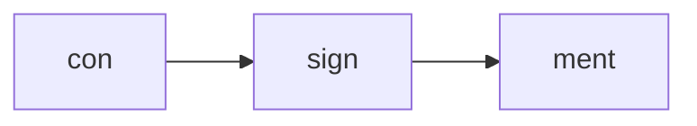
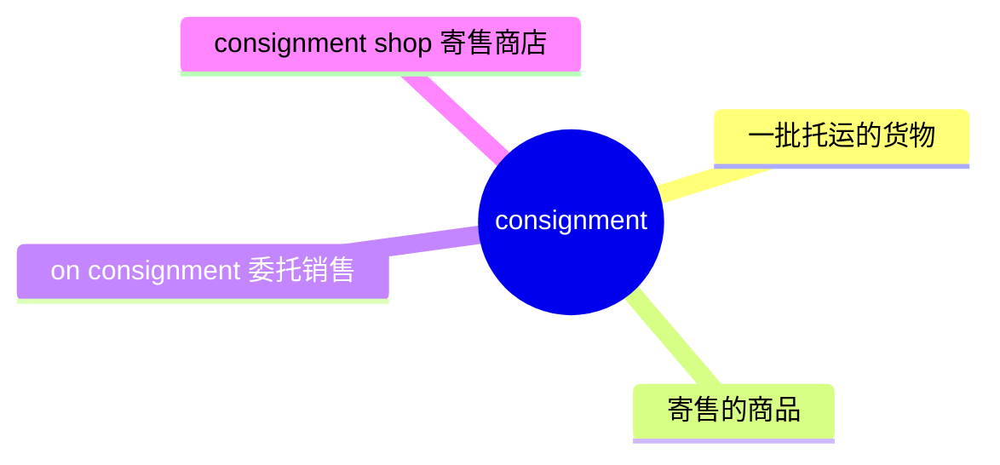
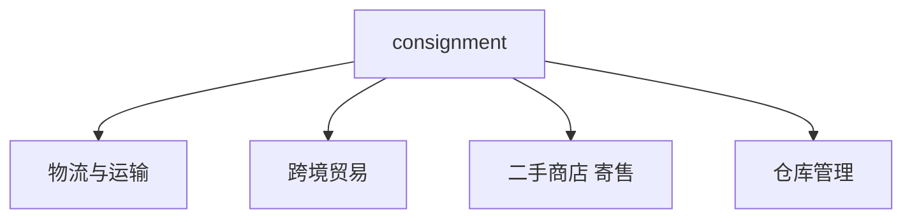
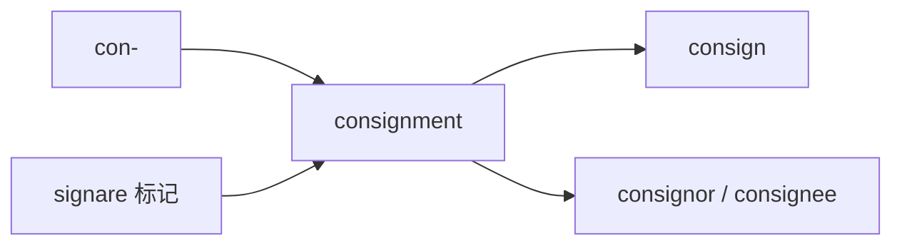
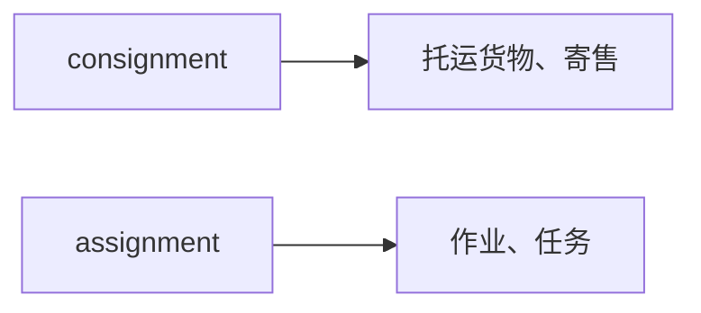

# consignment

## 1. 单词卡片

| 项目 | 内容 |
|---|---|
| 单词 | consignment |
| 词性 | noun |
| 英式音标 | /kənˈsaɪnmənt/ |
| 美式音标 | /kənˈsaɪnmənt/ |
| 音节 | con-sign-ment |
| 重音 | 第二音节（sign） |
| 核心意思 | 一批托运的货物；寄售 |

> 原输入拼写正确，直接生成课程，无需调整。

## 2. 发音拆解



发音提示：

* 重音在第二个音节 `sign` 上，读作 `/ˈsaɪn/`，这里的 `g` 不发音，和单词 `sign`（签名）发音一样。
* 第一个音节 `con` 是弱读，接近 `/kən/`。
* 最后 `-ment` 读作轻快的 `/mənt/`。
* 中文近似音只能辅助记忆，不能代替标准发音：可以理解为“肯-赛因-们特”，但真实发音更连贯。

## 3. 核心词义



## 4. 不同词性与用法

| 词性 | 英文含义 | 中文意思 | 常见结构 |
|---|---|---|---|
| noun | a batch of goods delivered or shipped | 一批（托运的）货物 | a consignment of goods |
| noun | goods sent to be sold, with payment made after sale | 寄售商品 | sell on consignment |

说明：对应的动词是 `consign`（托运、委托），`consignment` 是它的名词形式。

## 5. 常见使用语境



## 6. 常见搭配

| 搭配 | 中文意思 | 使用场景 |
|---|---|---|
| a consignment of goods | 一批货物 | 物流、贸易 |
| sell on consignment | 以寄售方式出售 | 零售、二手商店 |
| consignment shop | 寄售商店 | 零售 |
| receive a consignment | 收到一批货物 | 仓库、采购 |
| a large consignment | 一大批货物 | 物流、贸易 |

## 7. 核心句型

```text
a consignment of + 物品
We received a consignment of electronics yesterday.
```

```text
sell / buy on consignment
Many small shops sell handmade jewelry on consignment.
```

## 8. 基础例句

**例句 1**

```text
The warehouse received a large **consignment** of furniture this morning.
```

仓库今天上午收到了一大批家具。

**例句 2**

```text
She sells her paintings on consignment at a local gallery.
```

她把自己的画作放在当地一家画廊寄售。

## 9. 否定句、疑问句与问答

**否定句**

```text
This shop does not accept clothing on consignment.
```

这家商店不接受寄售服装。

**一般疑问句**

```text
Has the consignment of medical supplies arrived yet?
```

那批医疗用品的货物到了吗？

**特殊疑问句**

```text
When is the next consignment of raw materials expected?
```

下一批原材料预计什么时候到？

**问答组合**

```text
Question: How large was the latest consignment from the supplier?
Answer: It was about five hundred units, larger than usual.
```

问：供应商最近这批货有多大？
答：大约有五百件，比平时多。

## 10. 工作场景例句

```text
We need to inspect the entire consignment before it leaves the warehouse.
```

在这批货离开仓库之前，我们需要对其进行全面检查。

## 11. 日常生活例句

```text
He dropped off a few old jackets at a consignment shop downtown.
```

他把几件旧夹克送到了市中心的一家寄售商店。

## 12. 词根词缀与构词



| 单词 | 词性 | 中文意思 |
|---|---|---|
| consign | verb | 托运、委托 |
| consignment | noun | 托运的货物、寄售 |
| consignee | noun | 收货人 |
| consignor | noun | 发货人、托运人 |

说明：`consignment` 来自拉丁语 `signare`（意为“标记、盖章”），加上前缀 `con-`，词根含义是“正式标记并交付”，因此发展为“托运、寄售”的意思。

## 13. 派生词

| 单词 | 词性 | 中文意思 | 常见程度 |
|---|---|---|---|
| consign | verb | 托运、委托 | 中 |
| consignment | noun | 托运的货物、寄售 | 高 |
| consignee | noun | 收货人 | 中（贸易专业术语） |
| consignor | noun | 发货人 | 中（贸易专业术语） |

## 14. 同义词辨析

| 单词 | 主要区别 |
|---|---|
| consignment | 强调作为一批整体被托运或寄售的货物，常用于物流和零售 |
| shipment | 泛指一批被运输的货物，使用范围更广、更常见 |
| batch | 强调“一批、一组”，不局限于货物运输 |
| delivery | 强调“送达”这个动作或送来的东西，范围更广 |

## 15. 反义词

`consignment` 是一个具体的名词，没有严格意义上的反义词，但在语境中可以对比：

| 相关词 | 中文意思 |
|---|---|
| return | 退货 |
| pickup | 自提（相对于送货） |

## 16. 易混淆词辨析

`consignment` 容易和发音相近的 `assignment`（作业、任务）混淆。



| 单词 | 中文意思 | 例句 |
|---|---|---|
| consignment | 托运货物、寄售 | We received a consignment of goods. |
| assignment | 作业、任务 | She finished her assignment on time. |

## 17. 常见错误

错误：

```text
I need to finish my consignment before the deadline.
```

正确：

```text
I need to finish my assignment before the deadline.
```

说明：这里指的是“学校作业”或者“工作任务”，应该使用 `assignment`，而不是 `consignment`（托运货物）。两者发音相似，但意思完全不同。

## 18. 记忆方法

```text
consignment = con-（一起）+ signare（标记）= 正式标记并交付的一批货物
```

记忆技巧：可以联想“货物上贴着标签，正式交付给运输方”，这个画面就是 `consignment` 的核心含义。

场景记忆：

```text
The warehouse received a large consignment of furniture this morning.
仓库今天上午收到了一大批家具。
```

## 19. 快速复习

| 问题 | 答案 |
|---|---|
| 核心意思是什么 | 一批托运的货物；寄售 |
| 常见搭配是什么 | a consignment of goods / sell on consignment |
| 最容易混淆的词是什么 | assignment（作业、任务） |
| 对应的动词是什么 | consign |

## 20. 选择题考试

> 请先独立选择答案，不要提前展开答案区。

### 第 1 题

`a consignment of goods` 最自然的中文意思是什么？

- [ ] A. 一份购物清单
- [ ] B. 一批托运的货物
- [ ] C. 一次退货申请
- [ ] D. 一份销售合同

<details>
<summary>提交选择后查看结果</summary>

- 正确答案：**B. 一批托运的货物**
- 对错判断：选择 B 为正确；选择 A、C 或 D 为错误。
- 解析：`consignment` 指作为一个整体被运输或交付的一批货物，常用于物流和贸易语境。

</details>

### 第 2 题

下面哪个句子用词正确？

- [ ] A. I need to finish my consignment before the deadline.
- [ ] B. I need to finish my assignment before the deadline.
- [ ] C. We received an assignment of furniture this morning.
- [ ] D. She sells her paintings on assignment at a gallery.

<details>
<summary>提交选择后查看结果</summary>

- 正确答案：**B. I need to finish my assignment before the deadline.**
- 对错判断：选择 B 为正确；选择 A、C 或 D 为错误，因为它们混淆了 `consignment`（货物）和 `assignment`（任务）。
- 解析：“完成作业或任务”应使用 `assignment`；“一批家具”和“寄售画作”应使用 `consignment`。

</details>

### 第 3 题

`consignment` 这个单词的重音在哪个音节？

- [ ] A. 第一个音节 con
- [ ] B. 第二个音节 sign
- [ ] C. 第三个音节 ment
- [ ] D. 没有固定重音

<details>
<summary>提交选择后查看结果</summary>

- 正确答案：**B. 第二个音节 sign**
- 对错判断：选择 B 为正确；选择 A、C 或 D 为错误。
- 解析：`consignment` 的重音落在第二个音节 `sign` 上，其中的 `g` 不发音。

</details>

### 第 4 题

`sell on consignment` 最准确的意思是什么？

- [ ] A. 打折出售
- [ ] B. 以寄售方式出售，卖出后再付款给货主
- [ ] C. 拍卖出售
- [ ] D. 现金交易出售

<details>
<summary>提交选择后查看结果</summary>

- 正确答案：**B. 以寄售方式出售，卖出后再付款给货主**
- 对错判断：选择 B 为正确；选择 A、C 或 D 为错误。
- 解析：`on consignment` 指商品先放在店里出售，卖出后店家再和货主结算，是零售和二手商店中常见的合作方式。

</details>

### 第 5 题

`consignment` 对应的动词形式是什么？

- [ ] A. consign
- [ ] B. consignate
- [ ] C. consignify
- [ ] D. consignize

<details>
<summary>提交选择后查看结果</summary>

- 正确答案：**A. consign**
- 对错判断：选择 A 为正确；选择 B、C 或 D 为错误，这些都不是真实存在的常用单词。
- 解析：`consign` 是动词“托运、委托”，`consignment` 是它对应的名词形式。

</details>

## 21. 考试结果汇总

完成全部题目后，根据答案区自行统计：

| 正确题数 | 掌握情况 | 建议 |
|---|---|---|
| 5 题 | 已掌握 | 进入下一个单词 |
| 4 题 | 基本掌握 | 复习答错的知识点 |
| 2～3 题 | 掌握不稳 | 重新阅读搭配、例句和易错点 |
| 0～1 题 | 尚未掌握 | 重新学习整个单词课程 |
