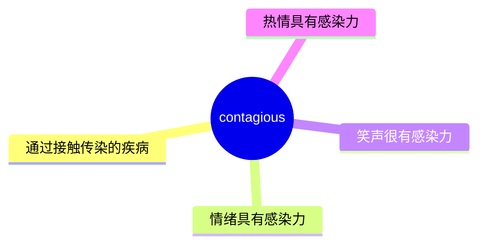
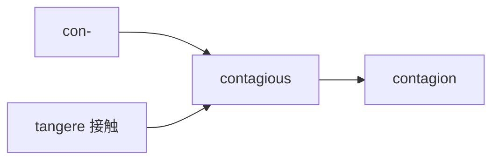
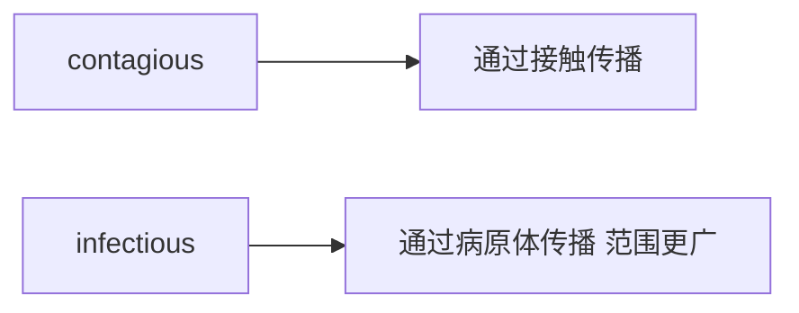

# contagious

## 1. 单词卡片

| 项目 | 内容 |
|---|---|
| 单词 | contagious |
| 词性 | adjective |
| 英式音标 | /kənˈteɪdʒəs/ |
| 美式音标 | /kənˈteɪdʒəs/ |
| 音节 | con-ta-gious |
| 重音 | 第二音节（ta） |
| 核心意思 | （疾病）接触传染的；（情绪）有感染力的 |

> 原输入拼写正确，直接生成课程，无需调整。

## 2. 发音拆解


发音提示：

* 重音在第二个音节 `ta` 上，读作 `/ˈteɪ/`，元音是双元音 `/eɪ/`，类似“诶”。
* 第一个音节 `con` 是弱读，接近 `/kən/`。
* 结尾 `-gious` 读作 `/dʒəs/`，类似轻声的“杰斯”，注意 `g` 在这里发 `/dʒ/` 的音，不要读成硬音 `/g/`。
* 中文近似音只能辅助记忆，不能代替标准发音：可以理解为“肯-忒-杰斯”，但真实发音更连贯。

## 3. 核心词义



## 4. 不同词性与用法

| 词性 | 英文含义 | 中文意思 | 常见结构 |
|---|---|---|---|
| adjective | spread by direct or indirect contact with an infected person | 接触传染的 | a contagious disease |
| adjective | (of feelings) quickly spreading to others | 有感染力的 | contagious laughter |

## 5. 常见使用语境


## 6. 常见搭配

| 搭配 | 中文意思 | 使用场景 |
|---|---|---|
| highly contagious | 高度传染性的 | 医学、新闻 |
| contagious disease | 传染病 | 医学 |
| contagious laughter | 有感染力的笑声 | 生活、情感描述 |
| contagious enthusiasm | 有感染力的热情 | 工作、团队氛围 |
| spread rapidly and is contagious | 迅速传播且具有传染性 | 医学报道 |

## 7. 核心句型

```text
be highly contagious
This virus is highly contagious and spreads quickly.
```

```text
someone's + 情绪 + is contagious
Her enthusiasm is contagious; the whole team feels motivated.
```

## 8. 基础例句

**例句 1**

```text
The flu is highly **contagious**, especially in crowded places.
```

流感传染性很强，尤其是在人群密集的地方。

**例句 2**

```text
His laughter is so contagious that everyone in the room starts laughing too.
```

他的笑声很有感染力，房间里的每个人都跟着笑了起来。

## 9. 否定句、疑问句与问答

**否定句**

```text
This particular condition is not contagious, so you don't need to worry.
```

这种情况并不具有传染性，所以你不用担心。

**一般疑问句**

```text
Is this skin condition contagious?
```

这种皮肤病有传染性吗？

**特殊疑问句**

```text
How long is a person contagious after catching a cold?
```

一个人感冒后传染性会持续多久？

**问答组合**

```text
Question: Is the new variant more contagious than the previous one?
Answer: Yes, health officials say it spreads much more easily.
```

问：新的变异株比之前的传染性更强吗？
答：是的，卫生官员表示它传播得更容易。

## 10. 工作场景例句

```text
Her positive attitude is contagious and helps keep the whole team motivated.
```

她积极的态度很有感染力，帮助整个团队保持积极性。

## 11. 日常生活例句

```text
Doctors advised him to stay home because the illness is contagious.
```

医生建议他待在家里，因为这种病具有传染性。

## 12. 词根词缀与构词



| 单词 | 词性 | 中文意思 |
|---|---|---|
| contagious | adjective | 接触传染的、有感染力的 |
| contagion | noun | 接触传染、传染病 |

说明：`contagious` 来自拉丁语 `tangere`（意为“触碰”），加上前缀 `con-`（一起），词根含义是“通过接触一起传播”，因此发展出“传染”的意思。

## 13. 派生词

| 单词 | 词性 | 中文意思 | 常见程度 |
|---|---|---|---|
| contagious | adjective | 接触传染的、有感染力的 | 高 |
| contagion | noun | 接触传染、传染病 | 中 |
| contagiously | adverb | 有感染力地（较少用） | 低 |

## 14. 同义词辨析

| 单词 | 主要区别 |
|---|---|
| contagious | 强调通过直接或间接接触传播，也可形容情绪的感染力 |
| infectious | 强调通过病原体（如细菌、病毒）传播，范围比 contagious 更广，可以包括空气传播 |
| catching | 口语化说法，和 contagious 意思接近，但更随意，多用于日常对话 |
| epidemic | 强调“流行病、大范围爆发”，是名词/形容词，程度和范围更强调 |

## 15. 反义词

| 单词 | 中文意思 |
|---|---|
| non-contagious | 无传染性的 |
| harmless | 无害的 |

## 16. 易混淆词辨析

`contagious` 最容易和 `infectious` 混淆，两者都可以翻译成“传染性的”，但侧重点不同。



| 单词 | 侧重点 | 例句 |
|---|---|---|
| contagious | 强调接触传播 | Chickenpox is highly contagious. |
| infectious | 强调病原体传播，范围更广，也可包括空气传播 | Tuberculosis is an infectious disease spread through the air. |

## 17. 常见错误

错误：

```text
Her enthusiasm is infectious contagious.
```

正确：

```text
Her enthusiasm is contagious.
```

说明：`contagious` 和 `infectious` 不能同时叠加使用，只需选择其中一个即可，二者意思相近但不完全相同，通常不会同时出现在一起。

## 18. 记忆方法

```text
contagious = con-（一起）+ tangere（触碰）= 通过接触一起传播
```

记忆技巧：可以想象“一个人碰到另一个人，病或者情绪就传过去了”，这个画面就是 `contagious` 的核心含义。

场景记忆：

```text
His laughter is so contagious that everyone starts laughing too.
他的笑声很有感染力，大家都跟着笑了。
```

## 19. 快速复习

| 问题 | 答案 |
|---|---|
| 核心意思是什么 | 接触传染的；有感染力的 |
| 常见搭配是什么 | highly contagious / contagious laughter |
| 最容易混淆的词是什么 | infectious（传染性的，范围更广） |
| 对应的名词是什么 | contagion |

## 20. 选择题考试

> 请先独立选择答案，不要提前展开答案区。

### 第 1 题

`contagious` 最核心的意思是什么？

- [ ] A. 完全无害的
- [ ] B. 通过接触传染的，或有感染力的
- [ ] C. 非常昂贵的
- [ ] D. 难以理解的

<details>
<summary>提交选择后查看结果</summary>

- 正确答案：**B. 通过接触传染的，或有感染力的**
- 对错判断：选择 B 为正确；选择 A、C 或 D 为错误。
- 解析：`contagious` 既可以形容疾病通过接触传播，也可以形容情绪、态度具有感染力。

</details>

### 第 2 题

下面哪个句子最自然？

- [ ] A. His laughter is so contagious that everyone starts laughing too.
- [ ] B. His laughter is so contagion that everyone starts laughing too.
- [ ] C. His laughter is so contagiously that everyone starts laughing too.
- [ ] D. His laughter is so contagious of everyone starts laughing too.

<details>
<summary>提交选择后查看结果</summary>

- 正确答案：**A. His laughter is so contagious that everyone starts laughing too.**
- 对错判断：选择 A 为正确；选择 B、C 或 D 为错误。
- 解析：这里需要形容词 `contagious` 修饰 laughter，`so...that...` 是常见的固定句型。

</details>

### 第 3 题

`contagious` 这个单词的重音在哪个音节？

- [ ] A. 第一个音节 con
- [ ] B. 第二个音节 ta
- [ ] C. 第三个音节 gious
- [ ] D. 没有固定重音

<details>
<summary>提交选择后查看结果</summary>

- 正确答案：**B. 第二个音节 ta**
- 对错判断：选择 B 为正确；选择 A、C 或 D 为错误。
- 解析：`contagious` 的重音落在第二个音节 `ta` 上，读作 `/ˈteɪ/`。

</details>

### 第 4 题

`contagious` 和 `infectious` 最主要的区别是什么？

- [ ] A. 两者完全相同，可以随意互换
- [ ] B. contagious 更强调通过接触传播，infectious 范围更广，可包括空气传播
- [ ] C. contagious 只能形容情绪，不能形容疾病
- [ ] D. infectious 只能形容疾病，不能形容情绪

<details>
<summary>提交选择后查看结果</summary>

- 正确答案：**B. contagious 更强调通过接触传播，infectious 范围更广，可包括空气传播**
- 对错判断：选择 B 为正确；选择 A、C 或 D 为错误。
- 解析：两个词意思接近，但 `contagious` 更强调接触传染，`infectious` 涵盖的传播方式更广。

</details>

### 第 5 题

`contagious` 对应的名词形式是什么？

- [ ] A. contagion
- [ ] B. contagiousness only
- [ ] C. contagiate
- [ ] D. contagive

<details>
<summary>提交选择后查看结果</summary>

- 正确答案：**A. contagion**
- 对错判断：选择 A 为正确；选择 B、C 或 D 为错误，C、D 不是真实存在的常用单词。
- 解析：`contagion` 是名词，意思是“接触传染、传染病”，是 `contagious` 最核心的名词形式。

</details>

## 21. 考试结果汇总

完成全部题目后，根据答案区自行统计：

| 正确题数 | 掌握情况 | 建议 |
|---|---|---|
| 5 题 | 已掌握 | 进入下一个单词 |
| 4 题 | 基本掌握 | 复习答错的知识点 |
| 2～3 题 | 掌握不稳 | 重新阅读搭配、例句和易错点 |
| 0～1 题 | 尚未掌握 | 重新学习整个单词课程 |
