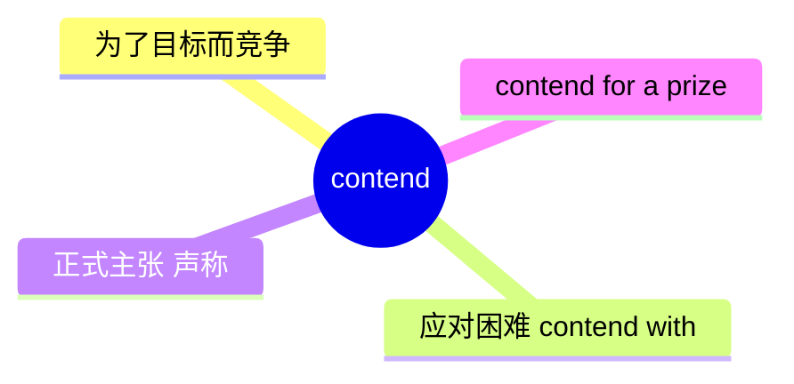
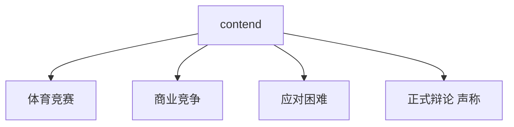
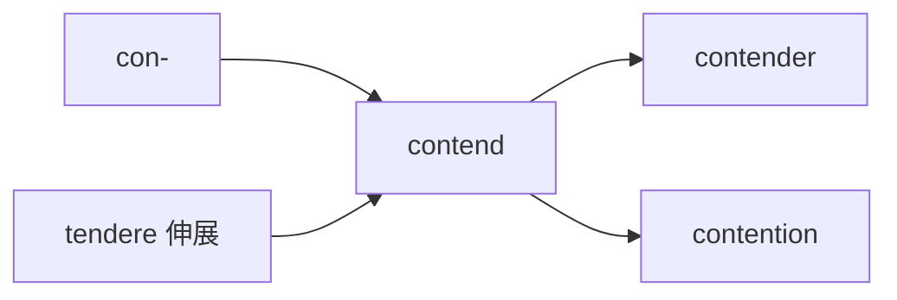
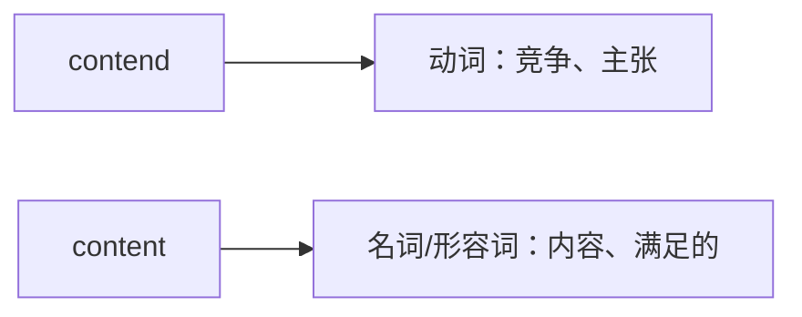

# contend

## 1. 单词卡片

| 项目 | 内容 |
|---|---|
| 单词 | contend |
| 词性 | verb |
| 英式音标 | /kənˈtend/ |
| 美式音标 | /kənˈtend/ |
| 音节 | con-tend |
| 重音 | 第二音节（tend） |
| 核心意思 | 竞争、斗争；（正式）主张、声称 |

> 原输入拼写正确，直接生成课程，无需调整。

## 2. 发音拆解


发音提示：

* 重音在第二个音节 `tend` 上，读作 `/ˈtend/`，类似“坛得”，`e` 是短元音 `/e/`。
* 第一个音节 `con` 是弱读，接近 `/kən/`，不要重读。
* 结尾的 `d` 是清晰的爆破音，不要省略。
* 中文近似音只能辅助记忆，不能代替标准发音：可以理解为“肯-坦得”，但真实发音更轻快、更连贯。

## 3. 核心词义



## 4. 不同词性与用法

| 词性 | 英文含义 | 中文意思 | 常见结构 |
|---|---|---|---|
| verb | to compete for something | 竞争、争夺 | contend for |
| verb | to deal with a difficulty | 应对、处理（困难） | contend with |
| verb (正式) | to argue or claim that something is true | 主张、声称 | contend that |

## 5. 常见使用语境



## 6. 常见搭配

| 搭配 | 中文意思 | 使用场景 |
|---|---|---|
| contend with | 应对、处理（困难） | 通用 |
| contend for | 争夺、竞争（某物） | 体育、竞赛 |
| contend that | 主张、声称 | 正式写作、辩论 |
| a contending team | 参与竞争的队伍 | 体育 |

## 7. 核心句型

```text
contend with + 困难
Small businesses have to contend with rising costs.
```

```text
contend that + 从句
Some experts contend that the policy will backfire.
```

## 8. 基础例句

**例句 1**

```text
The two athletes **contended** for the same gold medal.
```

这两名运动员争夺同一枚金牌。

**例句 2**

```text
Many families have to contend with financial difficulties.
```

许多家庭不得不应对经济困难。

## 9. 否定句、疑问句与问答

**否定句**

```text
He does not contend that the results were unfair.
```

他并不主张结果是不公平的。

**一般疑问句**

```text
Did the two companies contend for the same contract?
```

这两家公司是否争夺了同一份合同？

**特殊疑问句**

```text
What difficulties did the team have to contend with this season?
```

这支队伍这个赛季不得不应对哪些困难？

**问答组合**

```text
Question: What do critics contend about the new policy?
Answer: They contend that it will hurt small businesses.
```

问：批评者对这项新政策有什么主张？
答：他们主张这会伤害小企业。

## 10. 工作场景例句

```text
Our team has had to contend with a shrinking budget this year.
```

我们的团队今年不得不应对预算缩减的问题。

## 11. 日常生活例句

```text
Several runners contended for first place in the local marathon.
```

好几名跑者在本地马拉松比赛中争夺第一名。

## 12. 词根词缀与构词



| 单词 | 词性 | 中文意思 |
|---|---|---|
| contend | verb | 竞争、主张 |
| contender | noun | 竞争者、争夺者 |
| contention | noun | 争论、争夺；主张 |
| contentious | adjective | 有争议的 |

说明：`contend` 来自拉丁语 `tendere`（意为“伸展、拉紧”），加上前缀 `con-`（一起），词根含义是“共同拉紧、较量”，因此发展出“竞争”和“主张”的意思。

## 13. 派生词

| 单词 | 词性 | 中文意思 | 常见程度 |
|---|---|---|---|
| contend | verb | 竞争、主张 | 高 |
| contender | noun | 竞争者 | 高 |
| contention | noun | 争论；主张 | 中 |
| contentious | adjective | 有争议的 | 中 |

## 14. 同义词辨析

| 单词 | 主要区别 |
|---|---|
| contend | 强调为了目标而竞争，或正式主张某个观点 |
| compete | 最常用、最中性的“竞争”，适用范围广 |
| argue | 强调“争论、辩论”，不一定涉及竞争目标 |
| claim | 强调“声称”，不一定有正式辩论的语境 |

## 15. 反义词

| 单词 | 中文意思 |
|---|---|
| yield | 让步、屈服 |
| concede | 让步、承认 |
| agree | 同意 |

## 16. 易混淆词辨析

`contend` 容易和名词 `content`（内容；满足的）在拼写上产生混淆。



| 单词 | 词性 | 中文意思 | 例句 |
|---|---|---|---|
| contend | verb | 竞争、主张 | They contend for the same position. |
| content | noun/adjective | 内容；满足的 | She was content with the result. |

## 17. 常见错误

错误：

```text
They contend about the same job position.
```

正确：

```text
They contend for the same job position.
```

说明：表示“争夺某个职位”应使用 `contend for`，而不是 `contend about`。`contend about` 不是自然的英语搭配。

## 18. 记忆方法

```text
contend = con-（一起）+ tendere（拉紧）= 共同拉紧、较量
```

记忆技巧：可以想象两个人拉着同一根绳子较劲，这个画面既能表示“竞争”，也能引申为“坚持自己的主张”。

场景记忆：

```text
Small businesses have to contend with rising costs.
小企业不得不应对成本上涨的问题。
```

## 19. 快速复习

| 问题 | 答案 |
|---|---|
| 核心意思是什么 | 竞争、争夺；应对困难；正式主张 |
| 常见搭配是什么 | contend with / contend for / contend that |
| 常见派生名词是什么 | contender（竞争者）/ contention（争论） |
| 容易混淆的词是什么 | content（内容、满足的） |

## 20. 选择题考试

> 请先独立选择答案，不要提前展开答案区。

### 第 1 题

`contend with a problem` 最自然的中文意思是什么？

- [ ] A. 忽略一个问题
- [ ] B. 应对、处理一个问题
- [ ] C. 制造一个问题
- [ ] D. 讨论一个问题的历史

<details>
<summary>提交选择后查看结果</summary>

- 正确答案：**B. 应对、处理一个问题**
- 对错判断：选择 B 为正确；选择 A、C 或 D 为错误。
- 解析：`contend with` 表示“努力应对、处理某个困难或问题”。

</details>

### 第 2 题

下面哪个句子用词正确？

- [ ] A. They contend about the same job position.
- [ ] B. They contend for the same job position.
- [ ] C. They content for the same job position.
- [ ] D. They contend of the same job position.

<details>
<summary>提交选择后查看结果</summary>

- 正确答案：**B. They contend for the same job position.**
- 对错判断：选择 B 为正确；选择 A、C 或 D 为错误。
- 解析：表示“争夺某个职位”应使用固定搭配 `contend for`。

</details>

### 第 3 题

`contend` 这个单词的重音在哪个音节？

- [ ] A. 第一个音节 con
- [ ] B. 第二个音节 tend
- [ ] C. 两个音节重音相同
- [ ] D. 没有固定重音

<details>
<summary>提交选择后查看结果</summary>

- 正确答案：**B. 第二个音节 tend**
- 对错判断：选择 B 为正确；选择 A、C 或 D 为错误。
- 解析：`contend` 的重音落在第二个音节 `tend` 上。

</details>

### 第 4 题

`Some experts contend that the policy will backfire.` 这句话中 `contend` 最准确的意思是什么？

- [ ] A. 竞争
- [ ] B. 主张、声称
- [ ] C. 抱怨
- [ ] D. 忽视

<details>
<summary>提交选择后查看结果</summary>

- 正确答案：**B. 主张、声称**
- 对错判断：选择 B 为正确；选择 A、C 或 D 为错误。
- 解析：在 `contend that` 结构中，`contend` 是正式用语，表示“主张、声称”某事是真实的。

</details>

### 第 5 题

`contend` 最容易和下面哪个单词在拼写上混淆？

- [ ] A. content
- [ ] B. context
- [ ] C. contest
- [ ] D. contact

<details>
<summary>提交选择后查看结果</summary>

- 正确答案：**A. content**
- 对错判断：选择 A 为正确；选择 B、C 或 D 为错误。
- 解析：`contend` 和 `content` 拼写接近，但词义和用法完全不同，一个是动词“竞争、主张”，一个是名词/形容词“内容、满足的”。

</details>

## 21. 考试结果汇总

完成全部题目后，根据答案区自行统计：

| 正确题数 | 掌握情况 | 建议 |
|---|---|---|
| 5 题 | 已掌握 | 进入下一个单词 |
| 4 题 | 基本掌握 | 复习答错的知识点 |
| 2～3 题 | 掌握不稳 | 重新阅读搭配、例句和易错点 |
| 0～1 题 | 尚未掌握 | 重新学习整个单词课程 |
