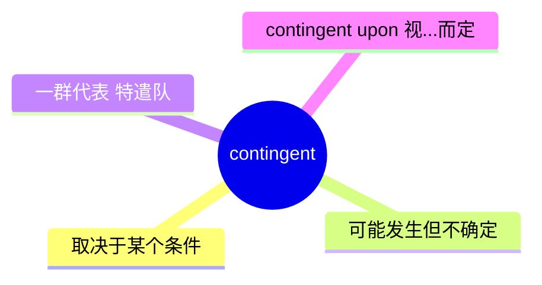
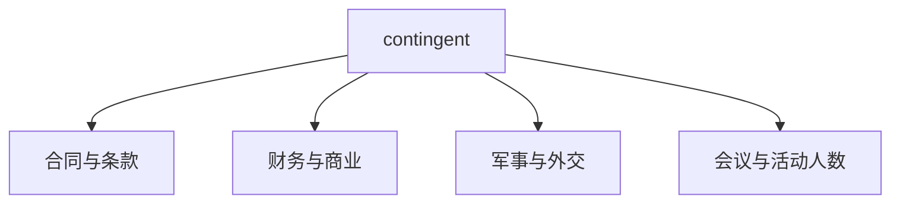
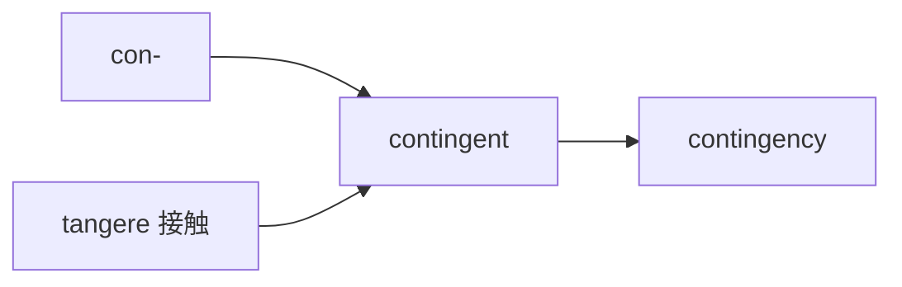
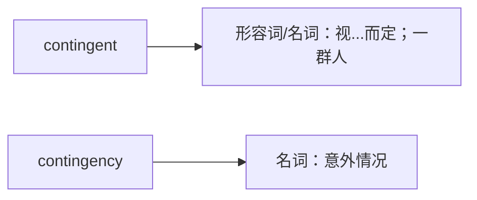

# contingent

## 1. 单词卡片

| 项目 | 内容 |
|---|---|
| 单词 | contingent |
| 词性 | adjective / noun |
| 英式音标 | /kənˈtɪndʒənt/ |
| 美式音标 | /kənˈtɪndʒənt/ |
| 音节 | con-tin-gent |
| 重音 | 第二音节（tin） |
| 核心意思 | 视……而定的、偶然的；（一群）代表团、特遣队 |

> 原输入拼写正确，直接生成课程，无需调整。

## 2. 发音拆解


发音提示：

* 重音在第二个音节 `tin` 上，读作 `/ˈtɪn/`，元音是短音 `/ɪ/`，类似“听”去掉声调的短促发音。
* 第一个音节 `con` 是弱读，接近 `/kən/`。
* 结尾 `-gent` 中的 `g` 发 `/dʒ/` 的音，读作 `/dʒənt/`，类似轻声的“真特”。
* 中文近似音只能辅助记忆，不能代替标准发音：可以理解为“肯-听-真特”，但真实发音更连贯。

## 3. 核心词义



## 4. 不同词性与用法

| 词性 | 英文含义 | 中文意思 | 常见结构 |
|---|---|---|---|
| adjective | dependent on something else happening | 视……而定的、以……为条件的 | contingent on/upon |
| adjective | possible but not certain | 可能发生但不确定的 | contingent risks |
| noun | a group representing a country, organization, or place | 代表团、特遣队、一批人 | a large contingent of |

## 5. 常见使用语境



## 6. 常见搭配

| 搭配 | 中文意思 | 使用场景 |
|---|---|---|
| contingent on / upon | 取决于……、以……为条件 | 合同、商业 |
| a large contingent of | 一大批（人）、一支庞大的代表团 | 新闻、活动报道 |
| contingent liability | 或有负债 | 财务、会计 |
| a peacekeeping contingent | 维和部队 | 军事、国际新闻 |

## 7. 核心句型

```text
be contingent on / upon + 名词
The bonus is contingent on the company's annual performance.
```

```text
a large contingent of + 人群
A large contingent of students attended the conference.
```

## 8. 基础例句

**例句 1**

```text
The final payment is **contingent** upon successful delivery of the goods.
```

最后一笔款项将根据货物是否成功交付来决定。

**例句 2**

```text
A large contingent of journalists arrived to cover the event.
```

一大批记者到场报道这次活动。

## 9. 否定句、疑问句与问答

**否定句**

```text
The offer is not contingent on any additional conditions.
```

这个提议不附带任何额外条件。

**一般疑问句**

```text
Is your acceptance contingent on getting a higher salary?
```

你的接受是否取决于是否能拿到更高的薪水？

**特殊疑问句**

```text
What is the final decision contingent upon?
```

最终决定取决于什么？

**问答组合**

```text
Question: Is the project's success contingent on additional funding?
Answer: Yes, without more funding, the project cannot move forward.
```

问：这个项目的成功是否取决于额外的资金？
答：是的，没有更多资金，这个项目就无法推进。

## 10. 工作场景例句

```text
Your bonus this year is contingent on meeting the sales targets.
```

你今年的奖金取决于是否达成销售目标。

## 11. 日常生活例句

```text
Whether we go hiking this weekend is contingent on the weather.
```

我们这周末是否去徒步，取决于天气情况。

## 12. 词根词缀与构词



| 单词 | 词性 | 中文意思 |
|---|---|---|
| contingent | adjective / noun | 视……而定的；一群人 |
| contingency | noun | 意外情况、可能发生的事 |

说明：`contingent` 来自拉丁语 `contingere`（意为“碰到、发生”），词根含义是“可能发生、有待接触的情况”，因此发展出“取决于”和“不确定的、可能的”这两层含义。

## 13. 派生词

| 单词 | 词性 | 中文意思 | 常见程度 |
|---|---|---|---|
| contingent | adjective / noun | 视……而定的；一群人 | 高 |
| contingency | noun | 意外情况、突发事件 | 高 |
| contingency plan | noun phrase | 应急预案 | 高 |

## 14. 同义词辨析

| 单词 | 主要区别 |
|---|---|
| contingent | 强调“取决于某个条件”，也可指“一群代表某方的人” |
| dependent | 强调“依赖、依靠”，范围更广，不限于条件关系 |
| conditional | 强调“有条件的”，常用于语法、合同等正式语境 |
| possible | 强调“可能的”，语气更中性、更基础 |

## 15. 反义词

| 单词 | 中文意思 |
|---|---|
| unconditional | 无条件的 |
| guaranteed | 有保证的 |
| certain | 确定的 |

## 16. 易混淆词辨析

`contingent` 容易和名词 `contingency`（意外情况）以及动词 `contain`（包含）混淆。



| 单词 | 词性 | 中文意思 | 例句 |
|---|---|---|---|
| contingent | adjective/noun | 视……而定的；一群人 | The bonus is contingent on performance. |
| contingency | noun | 意外情况、突发事件 | We need a contingency plan. |

## 17. 常见错误

错误：

```text
The offer is contingent to your approval.
```

正确：

```text
The offer is contingent on your approval.
```

说明：`contingent` 后面应搭配介词 `on` 或 `upon`，表示“取决于”，不能使用 `to`。

## 18. 记忆方法

```text
contingent = con-（一起）+ tangere（接触）= 可能发生、有待接触的情况
```

记忆技巧：可以想象一件事情“还没碰到”，结果取决于是否会发生，这个画面就是 `contingent` 的核心含义——“取决于某个条件”。

场景记忆：

```text
The bonus is contingent on the company's annual performance.
奖金取决于公司的年度业绩。
```

## 19. 快速复习

| 问题 | 答案 |
|---|---|
| 核心意思是什么 | 视……而定的；一群代表某方的人 |
| 常见搭配是什么 | contingent on / upon |
| 常见派生名词是什么 | contingency（意外情况） |
| 常见搭配短语 | contingency plan（应急预案） |

## 20. 选择题考试

> 请先独立选择答案，不要提前展开答案区。

### 第 1 题

`The bonus is contingent on the company's performance.` 这句话最自然的中文意思是什么？

- [ ] A. 奖金和公司业绩没有关系
- [ ] B. 奖金取决于公司的业绩
- [ ] C. 奖金已经确定发放
- [ ] D. 奖金将会减少

<details>
<summary>提交选择后查看结果</summary>

- 正确答案：**B. 奖金取决于公司的业绩**
- 对错判断：选择 B 为正确；选择 A、C 或 D 为错误。
- 解析：`be contingent on` 表示“取决于……”，说明奖金的多少要看公司的业绩。

</details>

### 第 2 题

下面哪个句子用词正确？

- [ ] A. The offer is contingent to your approval.
- [ ] B. The offer is contingent on your approval.
- [ ] C. The offer is contingency your approval.
- [ ] D. The offer is contingent of your approval.

<details>
<summary>提交选择后查看结果</summary>

- 正确答案：**B. The offer is contingent on your approval.**
- 对错判断：选择 B 为正确；选择 A、C 或 D 为错误。
- 解析：`contingent` 应搭配介词 `on` 或 `upon`，不能用 `to`、`of`，也不能直接用名词 `contingency` 替代形容词。

</details>

### 第 3 题

`contingent` 这个单词的重音在哪个音节？

- [ ] A. 第一个音节 con
- [ ] B. 第二个音节 tin
- [ ] C. 第三个音节 gent
- [ ] D. 没有固定重音

<details>
<summary>提交选择后查看结果</summary>

- 正确答案：**B. 第二个音节 tin**
- 对错判断：选择 B 为正确；选择 A、C 或 D 为错误。
- 解析：`contingent` 的重音落在第二个音节 `tin` 上。

</details>

### 第 4 题

`a large contingent of journalists` 中 `contingent` 作名词时最自然的中文意思是什么？

- [ ] A. 一份合同
- [ ] B. 一大批（记者）
- [ ] C. 一种意外情况
- [ ] D. 一项条件

<details>
<summary>提交选择后查看结果</summary>

- 正确答案：**B. 一大批（记者）**
- 对错判断：选择 B 为正确；选择 A、C 或 D 为错误。
- 解析：`contingent` 作名词时表示“代表某方的一群人、一批人”，比如一大批记者、一支代表团。

</details>

### 第 5 题

`contingent` 对应的常见名词派生词是什么？

- [ ] A. contingency
- [ ] B. contingentness
- [ ] C. contingentation
- [ ] D. contingible

<details>
<summary>提交选择后查看结果</summary>

- 正确答案：**A. contingency**
- 对错判断：选择 A 为正确；选择 B、C 或 D 为错误，这些都不是真实存在的常用单词。
- 解析：`contingency` 意思是“意外情况、突发事件”，常见搭配是 `contingency plan`（应急预案）。

</details>

## 21. 考试结果汇总

完成全部题目后，根据答案区自行统计：

| 正确题数 | 掌握情况 | 建议 |
|---|---|---|
| 5 题 | 已掌握 | 进入下一个单词 |
| 4 题 | 基本掌握 | 复习答错的知识点 |
| 2～3 题 | 掌握不稳 | 重新阅读搭配、例句和易错点 |
| 0～1 题 | 尚未掌握 | 重新学习整个单词课程 |
