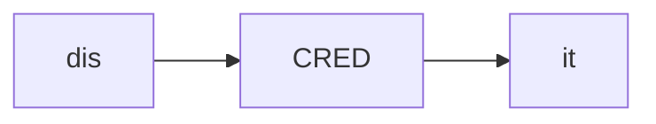
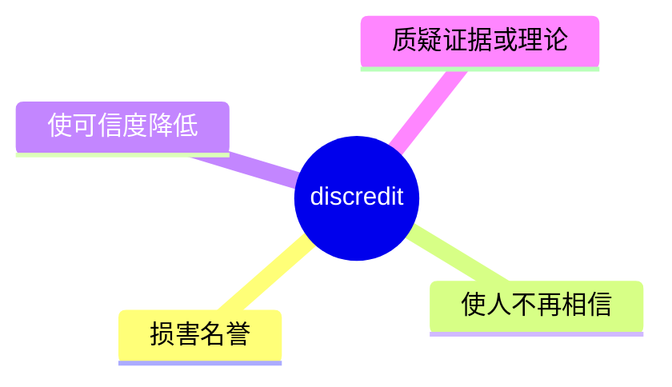
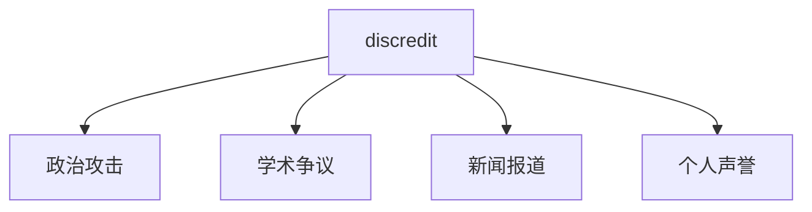
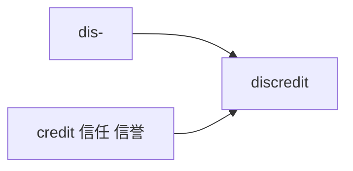

# discredit

## 1. 单词卡片

| 项目 | 内容 |
|---|---|
| 单词 | discredit |
| 词性 | verb / noun |
| 英式音标 | /dɪsˈkredɪt/ |
| 美式音标 | /dɪsˈkredɪt/（基本相同） |
| 音节 | dis-cred-it |
| 重音 | 第二音节 `cred` |
| 核心意思 | 使失去信誉、抹黑；怀疑、不相信 |

## 2. 发音拆解



发音提示：

* 重音在第二个音节 `CRED`，读作 /kred/
* 第一个音节 `dis` 读作 /dɪs/，元音是短元音 /ɪ/
* 词尾 `-it` 读作弱读的 /ɪt/
* 中文近似音只能辅助记忆，不能代替标准发音：可理解为“迪斯克瑞迪特”，但真实发音要更紧凑连贯

## 3. 核心词义



## 4. 不同词性与用法

| 词性 | 英文含义 | 中文意思 | 常见结构 |
|---|---|---|---|
| verb | harm someone's reputation | 使名誉受损、抹黑 | discredit someone |
| verb | cause doubt about accuracy | 使（言论、理论）失去可信度 | discredit a theory |
| noun | loss of reputation | 耻辱、丧失信誉（较正式） | bring discredit on |

## 5. 常见使用语境



## 6. 常见搭配

| 搭配 | 中文意思 | 使用场景 |
|---|---|---|
| discredit a witness | 使证人的证词失去可信度 | 法律 |
| discredit a theory | 推翻或质疑一个理论 | 学术 |
| try to discredit someone | 试图抹黑某人 | 政治、日常 |
| bring discredit on | 给……带来耻辱 | 正式写作 |

## 7. 基础例句

**例句 1**

```text
The scandal was designed to **discredit** the candidate before the election.
```

这场丑闻是为了在选举前抹黑这位候选人。

**例句 2**

```text
New evidence **discredited** the original theory.
```

新证据推翻了最初的理论。

## 8. 问答例句

**Question**

```text
Why are they trying to discredit the journalist's report?
```

他们为什么要试图抹黑这位记者的报道？

**Answer**

```text
They want to discredit it because it exposes their wrongdoing.
```

他们想抹黑它，因为它揭露了他们的不当行为。

## 9. 工作场景

```text
Spreading rumors could **discredit** the entire team's hard work.
```

散布谣言可能会抹黑整个团队的努力成果。

## 10. 日常生活场景

```text
He felt his neighbor was trying to **discredit** him in front of others.
```

他觉得邻居在试图当着别人的面抹黑他。

## 11. 词根词缀与构词



| 单词 | 词性 | 中文意思 |
|---|---|---|
| discredit | verb/noun | 抹黑；使失去信誉 |
| credit | noun/verb | 信誉、信用；相信 |
| credible | adjective | 可信的 |

`dis-` 表示“否定、相反”，`credit` 意思是“信誉、信任”，合起来就是“使失去信誉”。

## 12. 同义词辨析

| 单词 | 主要区别 |
|---|---|
| discredit | 强调使人或事物失去公众的信任，语气较正式 |
| disgrace | 强调使蒙羞，情感色彩更强烈 |
| undermine | 强调逐渐削弱（信任、权威），过程更隐蔽 |

## 13. 反义词

| 单词 | 中文意思 |
|---|---|
| credit | 归功于、信任 |
| vindicate | 证明清白 |
| endorse | 支持、认可 |

## 14. 易混淆点

```text
discredit
```

使失去信誉，动词/名词，强调破坏可信度。

```text
discredited
```

已经失去信誉的（形容词，过去分词），比如 a discredited theory。

## 15. 常见错误

错误：

```text
He discredited about the report.
```

正确：

```text
He discredited the report.
```

说明：

`discredit` 是及物动词，后面直接接宾语，不需要加介词 `about`。

## 16. 记忆方法

```text
dis(否定) + credit(信誉) = discredit（使失去信誉）
```

场景记忆：

```text
The scandal was designed to discredit the candidate before the election.
这场丑闻是为了在选举前抹黑这位候选人。
```

## 17. 快速复习

| 问题 | 答案 |
|---|---|
| 核心意思是什么 | 使失去信誉、抹黑；使不可信 |
| 常见词性是什么 | 动词、名词 |
| 常见搭配是什么 | discredit a witness / discredit a theory |
| 容易犯的错误是什么 | 误加介词 about，应直接接宾语 |

## 18. 选择题考试

> 请先独立选择答案，不要提前展开答案区。

### 第 1 题

`discredit` 最核心的意思是什么？

- [ ] A. 表扬、赞美
- [ ] B. 使失去信誉、抹黑
- [ ] C. 借钱、贷款
- [ ] D. 提高信用等级

<details>
<summary>提交选择后查看结果</summary>

- 正确答案：**B. 使失去信誉、抹黑**
- 对错判断：选择 B 为正确；选择 A、C 或 D 为错误。
- 解析：discredit 表示使某人或某事失去公众信任，抹黑其声誉或可信度。

</details>

### 第 2 题

`discredit` 的重音在哪个音节？

- [ ] A. 第一个音节 dis
- [ ] B. 第二个音节 cred
- [ ] C. 第三个音节 it
- [ ] D. 没有重音

<details>
<summary>提交选择后查看结果</summary>

- 正确答案：**B. 第二个音节 cred**
- 对错判断：选择 B 为正确；选择 A、C 或 D 为错误。
- 解析：discredit 重音在第二个音节 CRED 上，第一和第三音节都是弱读。

</details>

### 第 3 题

下面哪个搭配表示“推翻或质疑一个理论”？

- [ ] A. discredit a theory
- [ ] B. credit a theory
- [ ] C. discredit a lunch
- [ ] D. discredit a vacation

<details>
<summary>提交选择后查看结果</summary>

- 正确答案：**A. discredit a theory**
- 对错判断：选择 A 为正确；选择 B、C 或 D 为错误。
- 解析：discredit a theory 是常见搭配，表示用新证据或论证使一个理论失去可信度。

</details>

### 第 4 题

下面哪句话语法正确？

- [ ] A. He discredited about the report.
- [ ] B. He discredited the report.
- [ ] C. He discredit the report.
- [ ] D. He discredited to the report.

<details>
<summary>提交选择后查看结果</summary>

- 正确答案：**B. He discredited the report.**
- 对错判断：选择 B 为正确；选择 A、C 或 D 为错误。
- 解析：discredit 是及物动词，后面直接接宾语，不需要加介词 about 或 to。

</details>

### 第 5 题

`discredit` 和 `undermine` 的主要区别是什么？

- [ ] A. 完全同义，可以随意互换
- [ ] B. discredit 强调直接使人失去信任，undermine 强调逐渐、隐蔽地削弱信任或权威
- [ ] C. undermine 只能用于建筑物
- [ ] D. discredit 是名词，undermine 是形容词

<details>
<summary>提交选择后查看结果</summary>

- 正确答案：**B. discredit 强调直接使人失去信任，undermine 强调逐渐、隐蔽地削弱信任或权威**
- 对错判断：选择 B 为正确；选择 A、C 或 D 为错误。
- 解析：discredit 通常指直接、明确地破坏某人或某事的信誉；undermine 更强调用隐蔽、渐进的方式削弱信任或权威。

</details>

## 19. 考试结果汇总

完成全部题目后，根据答案区自行统计：

| 正确题数 | 掌握情况 | 建议 |
|---|---|---|
| 5 题 | 已掌握 | 进入下一个单词 |
| 4 题 | 基本掌握 | 复习答错的知识点 |
| 2～3 题 | 掌握不稳 | 重新阅读搭配、例句和易错点 |
| 0～1 题 | 尚未掌握 | 重新学习整个单词课程 |
