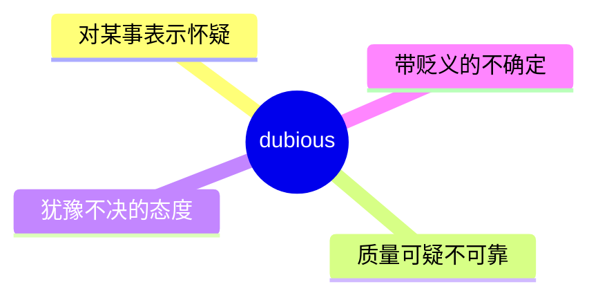
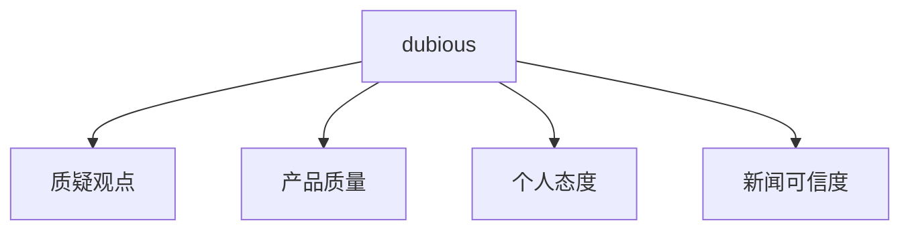
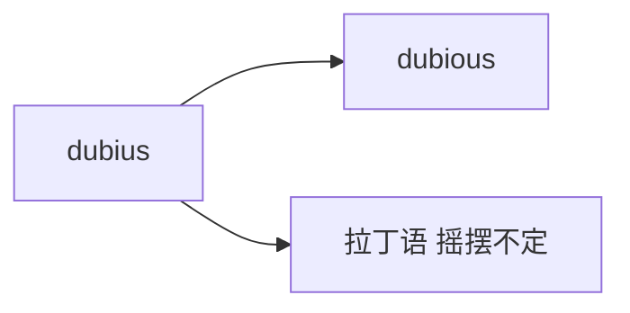

# dubious

## 1. 单词卡片

| 项目 | 内容 |
|---|---|
| 单词 | dubious |
| 词性 | adjective |
| 英式音标 | /ˈdjuːbiəs/ |
| 美式音标 | /ˈduːbiəs/ |
| 音节 | du-bi-ous |
| 重音 | 第一音节 `du` |
| 核心意思 | 可疑的、令人怀疑的；犹豫不决的 |

## 2. 发音拆解


发音提示：

* 重音在第一个音节 `DU`，英式读作 /djuː/，带有 /j/ 滑音；美式读作 /duː/，没有明显的 /j/ 音
* 第二个音节 `bi` 读作弱读的 /bi/
* 词尾 `-ous` 读作 /əs/，很轻很短
* 中文近似音只能辅助记忆，不能代替标准发音：可理解为“丢比厄斯”，但真实发音只有三个音节，更紧凑

## 3. 核心词义



## 4. 不同词性与用法

| 词性 | 英文含义 | 中文意思 | 常见结构 |
|---|---|---|---|
| adjective | feeling doubt/uncertainty | 感到怀疑的、犹豫的 | dubious about |
| adjective | of questionable value/quality | 可疑的、靠不住的（描述事物） | a dubious claim |

## 5. 常见使用语境



## 6. 常见搭配

| 搭配 | 中文意思 | 使用场景 |
|---|---|---|
| dubious about | 对……感到怀疑 | 日常、写作 |
| a dubious claim | 一个可疑的说法 | 新闻、辩论 |
| dubious quality | 可疑的质量 | 商品评价 |
| look dubious | 表情显得怀疑 | 日常描写 |

## 7. 基础例句

**例句 1**

```text
I'm a bit **dubious** about his ability to finish the project on time.
```

我对他能否按时完成项目有点怀疑。

**例句 2**

```text
The advertisement made some **dubious** claims about the product's benefits.
```

这则广告对产品的功效做出了一些可疑的宣称。

## 8. 问答例句

**Question**

```text
Are you dubious about this investment opportunity?
```

你对这个投资机会感到怀疑吗？

**Answer**

```text
Yes, I'm quite dubious because the returns seem too good to be true.
```

是的，我相当怀疑，因为回报看起来好得不真实。

## 9. 工作场景

```text
The manager looked **dubious** when he heard the unrealistic deadline.
```

经理听到这个不切实际的截止日期时，表情显得很怀疑。

## 10. 日常生活场景

```text
She gave me a **dubious** look when I said the food was fresh.
```

当我说食物是新鲜的时候，她用怀疑的眼神看着我。

## 11. 词根词缀与构词



| 单词 | 词性 | 中文意思 |
|---|---|---|
| dubious | adjective | 可疑的、犹豫的 |
| doubt | noun/verb | 怀疑 |
| doubtful | adjective | 令人怀疑的（近义词） |

`dubious` 来自拉丁语 `dubius`，意思是“摇摆不定的”，和 `doubt`（怀疑）是同源词，都源自“对两种可能性犹豫不决”的概念。

## 12. 同义词辨析

| 单词 | 主要区别 |
|---|---|
| dubious | 强调对可靠性、真实性的怀疑，常带贬义 |
| doubtful | 更常用、更中性，可以表示单纯的不确定 |
| skeptical | 强调有意识地质疑，常用于对声明或观点的态度 |

## 13. 反义词

| 单词 | 中文意思 |
|---|---|
| certain | 确定的 |
| convinced | 确信的 |
| trustworthy | 可信赖的 |

## 14. 易混淆点

```text
dubious (形容人的怀疑态度或事物的可疑性)
```

```text
doubtful (更中性，常表示单纯的不确定)
```

`dubious` 语气更偏负面，常暗示对方觉得某事不太正当或不可靠；`doubtful` 语气更中性。

## 15. 常见错误

错误：

```text
I am dubious to his plan.
```

正确：

```text
I am dubious about his plan.
```

说明：

`dubious` 后面表示对象时固定搭配介词 `about`，不用 `to`。

## 16. 记忆方法

```text
dubious（来自拉丁语“摇摆不定的”）→ 对某事拿不准、心存怀疑
```

场景记忆：

```text
I'm a bit dubious about his ability to finish the project on time.
我对他能否按时完成项目有点怀疑。
```

## 17. 快速复习

| 问题 | 答案 |
|---|---|
| 核心意思是什么 | 可疑的、令人怀疑的；犹豫的 |
| 常见词性是什么 | 形容词 |
| 常见搭配是什么 | dubious about / a dubious claim |
| 容易犯的错误是什么 | 介词误用为 to，应为 about |

## 18. 选择题考试

> 请先独立选择答案，不要提前展开答案区。

### 第 1 题

`dubious` 最核心的意思是什么？

- [ ] A. 确信的、肯定的
- [ ] B. 可疑的、令人怀疑的
- [ ] C. 兴奋的、激动的
- [ ] D. 疲惫的、困倦的

<details>
<summary>提交选择后查看结果</summary>

- 正确答案：**B. 可疑的、令人怀疑的**
- 对错判断：选择 B 为正确；选择 A、C 或 D 为错误。
- 解析：dubious 表示对某事真实性、可靠性感到怀疑，或者形容事物本身可疑。

</details>

### 第 2 题

`dubious` 的重音在哪个音节？

- [ ] A. 第一个音节 du
- [ ] B. 第二个音节 bi
- [ ] C. 第三个音节 ous
- [ ] D. 没有明显重音

<details>
<summary>提交选择后查看结果</summary>

- 正确答案：**A. 第一个音节 du**
- 对错判断：选择 A 为正确；选择 B、C 或 D 为错误。
- 解析：dubious 重音在第一个音节 DU 上，后面两个音节都是弱读。

</details>

### 第 3 题

下面哪个搭配表示“对……感到怀疑”？

- [ ] A. dubious about
- [ ] B. dubious to
- [ ] C. dubious for
- [ ] D. dubious with

<details>
<summary>提交选择后查看结果</summary>

- 正确答案：**A. dubious about**
- 对错判断：选择 A 为正确；选择 B、C 或 D 为错误。
- 解析：dubious 表示对某事感到怀疑时，固定搭配介词 about。

</details>

### 第 4 题

下面哪句话语法正确？

- [ ] A. I am dubious to his plan.
- [ ] B. I am dubious about his plan.
- [ ] C. I am dubious his plan.
- [ ] D. I am dubious of his plan for.

<details>
<summary>提交选择后查看结果</summary>

- 正确答案：**B. I am dubious about his plan.**
- 对错判断：选择 B 为正确；选择 A、C 或 D 为错误。
- 解析：dubious 后面表示怀疑对象时应使用介词 about，不用 to。

</details>

### 第 5 题

`dubious` 和 `doubtful` 的主要区别是什么？

- [ ] A. 完全同义，可以随意互换
- [ ] B. dubious 语气更偏负面，常暗示不太正当或不可靠；doubtful 更中性
- [ ] C. doubtful 只能形容人，dubious 只能形容事物
- [ ] D. dubious 是名词，doubtful 是动词

<details>
<summary>提交选择后查看结果</summary>

- 正确答案：**B. dubious 语气更偏负面，常暗示不太正当或不可靠；doubtful 更中性**
- 对错判断：选择 B 为正确；选择 A、C 或 D 为错误。
- 解析：dubious 常带有一定的负面色彩，暗示对方觉得某事可疑或不够正当；doubtful 更常用、更中性，可以只表示单纯的不确定。

</details>

## 19. 考试结果汇总

完成全部题目后，根据答案区自行统计：

| 正确题数 | 掌握情况 | 建议 |
|---|---|---|
| 5 题 | 已掌握 | 进入下一个单词 |
| 4 题 | 基本掌握 | 复习答错的知识点 |
| 2～3 题 | 掌握不稳 | 重新阅读搭配、例句和易错点 |
| 0～1 题 | 尚未掌握 | 重新学习整个单词课程 |
