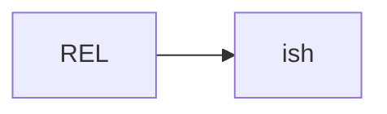
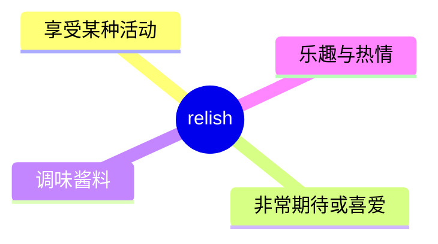
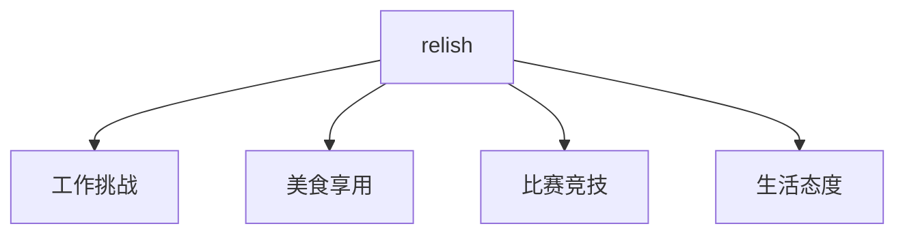
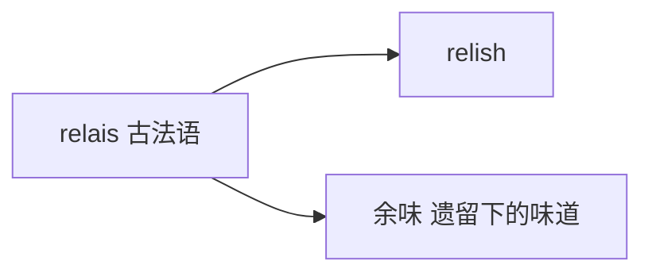

# relish

## 1. 单词卡片

| 项目 | 内容 |
|---|---|
| 单词 | relish |
| 词性 | verb / noun |
| 英式音标 | /ˈrelɪʃ/ |
| 美式音标 | /ˈrelɪʃ/（基本相同） |
| 音节 | rel-ish |
| 重音 | 第一音节 `rel` |
| 核心意思 | 非常喜欢、享受；（名词）调味酱；乐趣 |

## 2. 发音拆解



发音提示：

* 重音在第一个音节 `REL`，元音是短元音 /e/
* 第二个音节 `ish` 读作 /ɪʃ/，`sh` 发清辅音 /ʃ/
* 整体发音短促，只有两个音节
* 中文近似音只能辅助记忆，不能代替标准发音：可理解为“瑞利席”，但真实发音更短更连贯

## 3. 核心词义



## 4. 不同词性与用法

| 词性 | 英文含义 | 中文意思 | 常见结构 |
|---|---|---|---|
| verb | greatly enjoy | 非常享受、喜爱 | relish the challenge |
| noun | great enjoyment | 乐趣、兴致 | eat with relish |
| noun (食品) | a condiment | 调味酱（如甜酸酱） | pickle relish |

## 5. 常见使用语境



## 6. 常见搭配

| 搭配 | 中文意思 | 使用场景 |
|---|---|---|
| relish the challenge | 享受这个挑战 | 工作、体育 |
| relish the opportunity | 珍惜并享受这个机会 | 正式写作 |
| eat with relish | 津津有味地吃 | 日常生活 |
| not relish the idea of | 不太喜欢……这个想法 | 日常表达 |

## 7. 基础例句

**例句 1**

```text
She **relishes** the challenge of learning a new language.
```

她非常享受学习一门新语言的挑战。

**例句 2**

```text
He ate the meal with great **relish**.
```

他津津有味地吃完了这顿饭。

## 8. 问答例句

**Question**

```text
Do you relish public speaking, or does it make you nervous?
```

你享受公开演讲，还是它会让你紧张？

**Answer**

```text
I actually relish it now, though I used to be terrified.
```

我现在其实挺享受的，虽然以前非常害怕。

## 9. 工作场景

```text
Our new manager seems to **relish** difficult negotiations.
```

我们的新经理似乎很享受那些艰难的谈判。

## 10. 日常生活场景

```text
I don't **relish** the idea of cleaning the whole house today.
```

我不太喜欢今天要打扫整个房子这个想法。

## 11. 词根词缀与构词



| 单词 | 词性 | 中文意思 |
|---|---|---|
| relish | verb/noun | 享受；乐趣；调味酱 |
| relishing | present participle | 正在享受的 |

`relish` 来自古法语 `relais`，原意与“遗留的味道、余味”有关，后来引申出“津津有味、享受”的含义。这一词源较为间接，不建议过度拆解。

## 12. 同义词辨析

| 单词 | 主要区别 |
|---|---|
| relish | 强调带着热情和期待去享受，语气较积极 |
| enjoy | 最常用、最中性，适用范围更广 |
| savor | 强调细细品味，常用于食物或美好时刻 |

## 13. 反义词

| 单词 | 中文意思 |
|---|---|
| dread | 惧怕、忧虑 |
| dislike | 不喜欢 |

## 14. 易混淆点

```text
relish (享受，动词/名词)
```

```text
relax (放松，动词)
```

两个词拼写开头相似，但意思完全不同，容易被初学者混淆。

## 15. 常见错误

错误：

```text
I relish to try new food.
```

正确：

```text
I relish trying new food.
```

说明：

`relish` 作及物动词时，后面直接接名词或动名词（`-ing` 形式），不接 `to do`。

## 16. 记忆方法

```text
relish（源自“余味”）→ 细细品味、津津有味地享受
```

场景记忆：

```text
She relishes the challenge of learning a new language.
她非常享受学习一门新语言的挑战。
```

## 17. 快速复习

| 问题 | 答案 |
|---|---|
| 核心意思是什么 | 非常享受、喜爱；调味酱 |
| 常见词性是什么 | 动词、名词 |
| 常见搭配是什么 | relish the challenge / eat with relish |
| 容易犯的错误是什么 | 后接动名词而非不定式 |

## 18. 选择题考试

> 请先独立选择答案，不要提前展开答案区。

### 第 1 题

`relish` 作动词时，最核心的意思是什么？

- [ ] A. 厌恶、讨厌
- [ ] B. 非常享受、喜爱
- [ ] C. 忘记、忽略
- [ ] D. 拒绝、回避

<details>
<summary>提交选择后查看结果</summary>

- 正确答案：**B. 非常享受、喜爱**
- 对错判断：选择 B 为正确；选择 A、C 或 D 为错误。
- 解析：relish 作动词时表示带着热情和期待地享受某件事。

</details>

### 第 2 题

`relish` 的重音在哪个音节？

- [ ] A. 第一个音节 rel
- [ ] B. 第二个音节 ish
- [ ] C. 两个音节重音相同
- [ ] D. 没有明显重音

<details>
<summary>提交选择后查看结果</summary>

- 正确答案：**A. 第一个音节 rel**
- 对错判断：选择 A 为正确；选择 B、C 或 D 为错误。
- 解析：relish 重音在第一个音节 REL 上，元音是短元音 /e/。

</details>

### 第 3 题

下面哪个搭配表示“津津有味地吃”？

- [ ] A. eat with relish
- [ ] B. eat with regret
- [ ] C. eat with relish to
- [ ] D. relish to eat

<details>
<summary>提交选择后查看结果</summary>

- 正确答案：**A. eat with relish**
- 对错判断：选择 A 为正确；选择 B、C 或 D 为错误。
- 解析：eat with relish 是固定搭配，relish 在这里作名词，表示“津津有味、兴致勃勃”。

</details>

### 第 4 题

下面哪句话语法正确？

- [ ] A. I relish to try new food.
- [ ] B. I relish trying new food.
- [ ] C. I relish try new food.
- [ ] D. I relish for trying new food.

<details>
<summary>提交选择后查看结果</summary>

- 正确答案：**B. I relish trying new food.**
- 对错判断：选择 B 为正确；选择 A、C 或 D 为错误。
- 解析：relish 作及物动词时后面接动名词形式，不接 to do 结构。

</details>

### 第 5 题

`relish` 和 `savor` 的主要区别是什么？

- [ ] A. 完全同义，可以随意互换
- [ ] B. relish 强调带着热情期待去享受，savor 更强调细细品味
- [ ] C. savor 只能用于食物，relish 不能用于食物
- [ ] D. relish 是名词，savor 是动词

<details>
<summary>提交选择后查看结果</summary>

- 正确答案：**B. relish 强调带着热情期待去享受，savor 更强调细细品味**
- 对错判断：选择 B 为正确；选择 A、C 或 D 为错误。
- 解析：relish 语气更积极，强调热情投入地享受；savor 更强调放慢节奏细细品味，常用于食物或美好瞬间，两者都可以用于食物但侧重点略有不同。

</details>

## 19. 考试结果汇总

完成全部题目后，根据答案区自行统计：

| 正确题数 | 掌握情况 | 建议 |
|---|---|---|
| 5 题 | 已掌握 | 进入下一个单词 |
| 4 题 | 基本掌握 | 复习答错的知识点 |
| 2～3 题 | 掌握不稳 | 重新阅读搭配、例句和易错点 |
| 0～1 题 | 尚未掌握 | 重新学习整个单词课程 |
