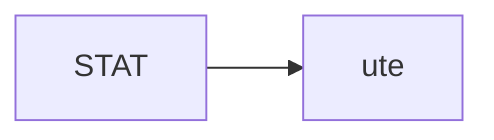
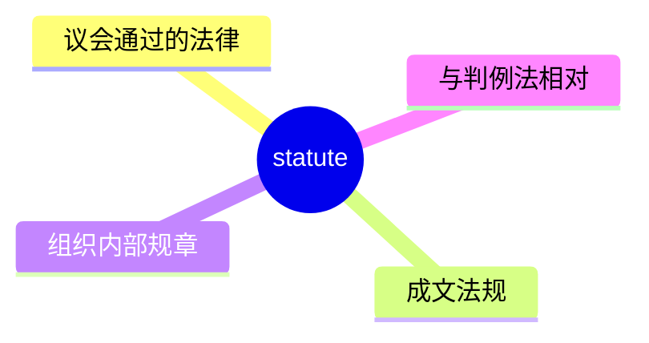
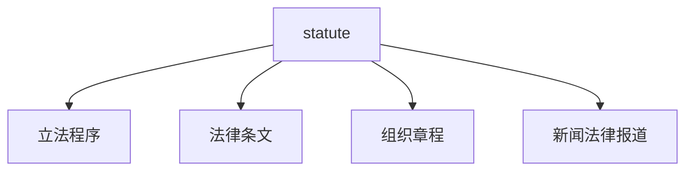
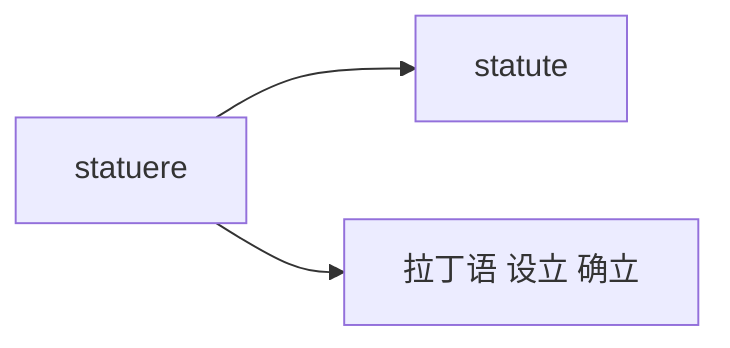

# statute

## 1. 单词卡片

| 项目 | 内容 |
|---|---|
| 单词 | statute |
| 词性 | noun |
| 英式音标 | /ˈstætjuːt/ |
| 美式音标 | /ˈstætʃuːt/ |
| 音节 | stat-ute |
| 重音 | 第一音节 `stat` |
| 核心意思 | 法令、法规；成文法 |

## 2. 发音拆解



发音提示：

* 重音在第一个音节 `STAT`，元音是 /æ/
* 英式发音第二个音节读作 /tjuːt/，带有 /j/ 滑音；美式发音常读作 /tʃuːt/，`tu` 组合发生了腭化
* 这种英美发音差异和 tune、student 等词类似
* 中文近似音只能辅助记忆，不能代替标准发音：可理解为“斯塔丘特”，但真实发音只有两个音节

## 3. 核心词义



## 4. 不同词性与用法

| 词性 | 英文含义 | 中文意思 | 常见结构 |
|---|---|---|---|
| noun | a written law passed by a legislative body | 法令、成文法 | pass a statute |
| noun | rules governing an organization | 章程、规章 | the statutes of the club |

## 5. 常见使用语境



## 6. 常见搭配

| 搭配 | 中文意思 | 使用场景 |
|---|---|---|
| pass a statute | 通过一项法令 | 立法、政治 |
| under the statute | 根据该法令 | 法律文书 |
| a federal statute | 一项联邦法令 | 美国法律语境 |
| statute of limitations | 诉讼时效法 | 法律专业术语 |

## 7. 基础例句

**例句 1**

```text
The new **statute** requires companies to disclose their carbon emissions.
```

这项新法令要求公司披露其碳排放量。

**例句 2**

```text
The case was dismissed because of the **statute** of limitations.
```

这起案件因为诉讼时效已过而被驳回。

## 8. 问答例句

**Question**

```text
When was this statute originally passed?
```

这项法令最初是什么时候通过的？

**Answer**

```text
It was passed by the legislature over twenty years ago.
```

它是二十多年前由立法机构通过的。

## 9. 工作场景

```text
Our compliance team must ensure we follow every relevant **statute**.
```

我们的合规团队必须确保我们遵守每一项相关法令。

## 10. 日常生活场景

```text
He looked up the local **statute** on noise levels before calling the police.
```

他在打电话报警之前先查了一下当地关于噪音水平的法规。

## 11. 词根词缀与构词



| 单词 | 词性 | 中文意思 |
|---|---|---|
| statute | noun | 法令、成文法 |
| statutory | adjective | 法定的 |
| statutorily | adverb | 依法地（较少见） |

词根 `statuere` 来自拉丁语，意思是“设立、确立”，和 `establish`、`institute` 有相同的词根来源，表示“正式确立的规定”。

## 12. 同义词辨析

| 单词 | 主要区别 |
|---|---|
| statute | 特指立法机构正式通过的成文法律 |
| law | 更通用，泛指所有法律，包括成文法和判例法 |
| regulation | 通常指政府机构制定的具体规章，位阶低于 statute |

## 13. 反义词

没有非常固定的反义词，语境中常与以下概念相对：

| 单词 | 中文意思 |
|---|---|
| common law | 判例法、普通法 |

## 14. 易混淆点

```text
statute
```

成文法，由立法机构正式通过。

```text
statue
```

雕像，拼写非常相似，只差一个字母顺序，但意思完全不同。

## 15. 常见错误

错误：

```text
There is a beautiful statute in the park.
```

正确：

```text
There is a beautiful statue in the park.
```

说明：

`statute`（法令）和 `statue`（雕像）拼写极其相似，只是字母 `u` 和 `e` 的顺序不同，书写时一定要仔细核对。

## 16. 记忆方法

```text
statuere(拉丁语，设立、确立) → statute（正式设立的法律）
```

场景记忆：

```text
The new statute requires companies to disclose their carbon emissions.
这项新法令要求公司披露其碳排放量。
```

## 17. 快速复习

| 问题 | 答案 |
|---|---|
| 核心意思是什么 | 法令、成文法 |
| 常见词性是什么 | 名词 |
| 常见搭配是什么 | pass a statute / statute of limitations |
| 容易混淆的词是什么 | statue（雕像） |

## 18. 选择题考试

> 请先独立选择答案，不要提前展开答案区。

### 第 1 题

`statute` 最核心的意思是什么？

- [ ] A. 雕像
- [ ] B. 法令、成文法
- [ ] C. 判决书
- [ ] D. 合同

<details>
<summary>提交选择后查看结果</summary>

- 正确答案：**B. 法令、成文法**
- 对错判断：选择 B 为正确；选择 A、C 或 D 为错误。
- 解析：statute 指立法机构正式通过的成文法律或法令。

</details>

### 第 2 题

`statute` 的美式发音中，第二个音节的 `tu` 组合常怎么读？

- [ ] A. 读作 /tjuː/
- [ ] B. 读作 /tʃuː/（发生腭化）
- [ ] C. 不发音
- [ ] D. 读作 /taɪ/

<details>
<summary>提交选择后查看结果</summary>

- 正确答案：**B. 读作 /tʃuː/（发生腭化）**
- 对错判断：选择 B 为正确；选择 A、C 或 D 为错误。
- 解析：美式发音中 tu 常发生腭化现象，读作 /tʃuː/，这和 tune、student 等词的美式发音类似。

</details>

### 第 3 题

下面哪个搭配是法律专业术语，表示“诉讼时效法”？

- [ ] A. statute of limitations
- [ ] B. statute of the park
- [ ] C. statute of the company
- [ ] D. statute of the recipe

<details>
<summary>提交选择后查看结果</summary>

- 正确答案：**A. statute of limitations**
- 对错判断：选择 A 为正确；选择 B、C 或 D 为错误。
- 解析：statute of limitations 是固定的法律专业术语，指规定诉讼有效期限的法律。

</details>

### 第 4 题

下面哪句话拼写正确？

- [ ] A. There is a beautiful statute in the park.
- [ ] B. There is a beautiful statue in the park.
- [ ] C. There is a beautiful staute in the park.
- [ ] D. There is a beautiful satute in the park.

<details>
<summary>提交选择后查看结果</summary>

- 正确答案：**B. There is a beautiful statue in the park.**
- 对错判断：选择 B 为正确；选择 A、C 或 D 为错误。
- 解析：表示“雕像”应该拼写为 statue，不是 statute（法令），两个词拼写非常相似，容易混淆。

</details>

### 第 5 题

`statute` 和 `regulation` 的主要区别是什么？

- [ ] A. 完全同义，可以随意互换
- [ ] B. statute 是立法机构通过的成文法，regulation 通常是政府机构制定的具体规章，位阶更低
- [ ] C. regulation 只能用于国际法
- [ ] D. statute 是动词，regulation 是名词

<details>
<summary>提交选择后查看结果</summary>

- 正确答案：**B. statute 是立法机构通过的成文法，regulation 通常是政府机构制定的具体规章，位阶更低**
- 对错判断：选择 B 为正确；选择 A、C 或 D 为错误。
- 解析：statute 特指由立法机构正式通过的法律；regulation 通常是政府部门根据法律制定的具体实施规章，法律位阶一般低于 statute。

</details>

## 19. 考试结果汇总

完成全部题目后，根据答案区自行统计：

| 正确题数 | 掌握情况 | 建议 |
|---|---|---|
| 5 题 | 已掌握 | 进入下一个单词 |
| 4 题 | 基本掌握 | 复习答错的知识点 |
| 2～3 题 | 掌握不稳 | 重新阅读搭配、例句和易错点 |
| 0～1 题 | 尚未掌握 | 重新学习整个单词课程 |
