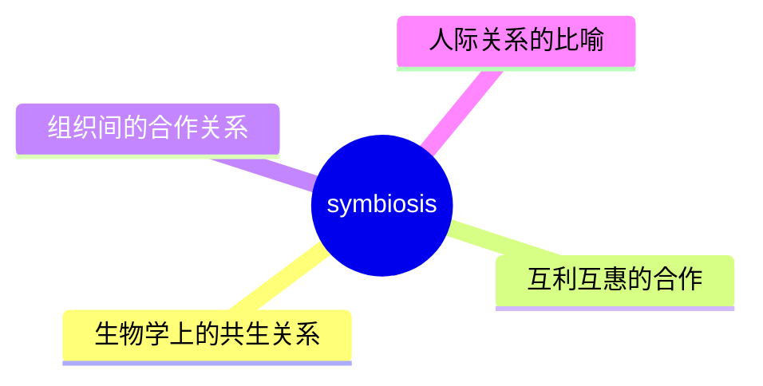
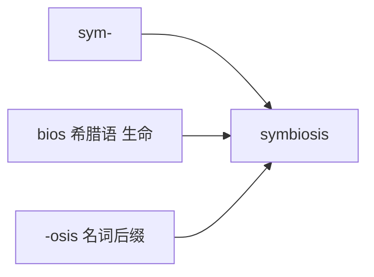

# symbiosis

## 1. 单词卡片

| 项目 | 内容 |
|---|---|
| 单词 | symbiosis |
| 词性 | noun |
| 英式音标 | /ˌsɪmbaɪˈəʊsɪs/ |
| 美式音标 | /ˌsɪmbaɪˈoʊsɪs/ |
| 音节 | sym-bi-o-sis |
| 重音 | 第三音节 `o` |
| 核心意思 | 共生（关系）；两种事物互利共存的关系 |

## 2. 发音拆解


发音提示：

* 重音在第三个音节 `O`，英式读作 /əʊ/，美式读作 /oʊ/，是一个完整的双元音
* 第一个音节 `sym` 读作 /sɪm/，注意不要读成 /saɪm/
* `bi` 读作 /baɪ/，含有长双元音
* 中文近似音只能辅助记忆，不能代替标准发音：可理解为“辛拜奥西斯”，但真实发音更紧凑连贯

## 3. 核心词义



## 4. 不同词性与用法

| 词性 | 英文含义 | 中文意思 | 常见结构 |
|---|---|---|---|
| noun (生物学) | close relationship between two species | 共生（生物学术语） | a symbiosis between species |
| noun (比喻) | mutually beneficial relationship | 互利共存的关系（比喻用法） | a symbiosis between businesses |

## 5. 常见使用语境


## 6. 常见搭配

| 搭配 | 中文意思 | 使用场景 |
|---|---|---|
| a symbiosis between A and B | A 和 B 之间的共生关系 | 学术、比喻 |
| live in symbiosis | 共生生活 | 生物学 |
| a symbiotic relationship | 共生关系（形容词形式） | 学术、商业 |
| mutual symbiosis | 相互共生 | 学术写作 |

## 7. 基础例句

**例句 1**

```text
Clownfish and sea anemones have a well-known **symbiosis**.
```

小丑鱼和海葵之间有一种广为人知的共生关系。

**例句 2**

```text
The two companies have developed a kind of **symbiosis**, each relying on the other for growth.
```

这两家公司发展出了一种共生关系，彼此依赖对方来实现增长。

## 8. 问答例句

**Question**

```text
What is an example of symbiosis in nature?
```

自然界中共生关系的一个例子是什么？

**Answer**

```text
Bees and flowers are a classic example; bees get nectar while flowers get pollinated.
```

蜜蜂和花朵是一个经典的例子，蜜蜂获得花蜜，而花朵得到授粉。

## 9. 工作场景

```text
Our partnership with the supplier has become a true **symbiosis**.
```

我们和供应商的合作关系已经变成了真正的共生关系。

## 10. 日常生活场景

```text
Their friendship works almost like a **symbiosis**, each helping the other grow.
```

他们的友谊几乎就像一种共生关系，彼此帮助对方成长。

## 11. 词根词缀与构词



| 单词 | 词性 | 中文意思 |
|---|---|---|
| symbiosis | noun | 共生（关系） |
| symbiotic | adjective | 共生的 |
| symbiont | noun | 共生体（较少见，生物学专用） |

`sym-` 来自希腊语，表示“共同、一起”，`bios` 意思是“生命”，`-osis` 是表示状态的名词后缀，合起来就是“共同生活的状态”。

## 12. 同义词辨析

| 单词 | 主要区别 |
|---|---|
| symbiosis | 强调双方互利共存，常用于生物学和比喻的合作关系 |
| partnership | 更通用，泛指商业或个人之间的合作 |
| cooperation | 强调共同合作完成某事，不一定强调互利的依存关系 |

## 13. 反义词

没有非常固定的反义词，语境中常与以下概念相对：

| 单词 | 中文意思 |
|---|---|
| parasitism | 寄生关系（一方受益一方受害） |
| competition | 竞争 |

## 14. 易混淆点

```text
symbiosis (noun)
```

共生关系，名词形式。

```text
symbiotic (adjective)
```

共生的，形容词形式，比如 a symbiotic relationship。

两者词性不同，使用时要注意区分。

## 15. 常见错误

错误：

```text
They have a symbiosis relationship.
```

正确：

```text
They have a symbiotic relationship.
```

说明：

`symbiosis` 是名词，不能直接修饰名词 `relationship`；如果要作形容词使用，应该用 `symbiotic`。

## 16. 记忆方法

```text
sym(共同) + bios(生命，希腊语) + osis(名词后缀) = symbiosis（共同生活的状态）
```

场景记忆：

```text
Clownfish and sea anemones have a well-known symbiosis.
小丑鱼和海葵之间有一种广为人知的共生关系。
```

## 17. 快速复习

| 问题 | 答案 |
|---|---|
| 核心意思是什么 | 共生（关系）；互利共存的关系 |
| 常见词性是什么 | 名词 |
| 常见搭配是什么 | a symbiosis between A and B / a symbiotic relationship |
| 容易犯的错误是什么 | 误用名词 symbiosis 直接修饰名词，应用形容词 symbiotic |

## 18. 选择题考试

> 请先独立选择答案，不要提前展开答案区。

### 第 1 题

`symbiosis` 最核心的意思是什么？

- [ ] A. 竞争关系
- [ ] B. 共生、互利共存的关系
- [ ] C. 单方面的寄生关系
- [ ] D. 敌对关系

<details>
<summary>提交选择后查看结果</summary>

- 正确答案：**B. 共生、互利共存的关系**
- 对错判断：选择 B 为正确；选择 A、C 或 D 为错误。
- 解析：symbiosis 指两种事物之间互利共存的紧密关系，常用于生物学，也可比喻用于合作关系。

</details>

### 第 2 题

`symbiosis` 的重音在第几个音节？

- [ ] A. 第一个音节
- [ ] B. 第二个音节
- [ ] C. 第三个音节
- [ ] D. 最后一个音节

<details>
<summary>提交选择后查看结果</summary>

- 正确答案：**C. 第三个音节**
- 对错判断：选择 C 为正确；选择 A、B 或 D 为错误。
- 解析：symbiosis 重音在第三个音节 o 上，读作 /əʊ/ 或 /oʊ/。

</details>

### 第 3 题

下面哪个例子最适合用来说明 symbiosis？

- [ ] A. 两家公司之间的激烈竞争
- [ ] B. 蜜蜂采蜜、花朵授粉的互利关系
- [ ] C. 一场足球比赛的胜负
- [ ] D. 单方面的命令与服从

<details>
<summary>提交选择后查看结果</summary>

- 正确答案：**B. 蜜蜂采蜜、花朵授粉的互利关系**
- 对错判断：选择 B 为正确；选择 A、C 或 D 为错误。
- 解析：蜜蜂和花朵是经典的共生关系例子，双方都从这种关系中获益。

</details>

### 第 4 题

下面哪句话语法正确？

- [ ] A. They have a symbiosis relationship.
- [ ] B. They have a symbiotic relationship.
- [ ] C. They have a symbiosis relation of.
- [ ] D. They have relationship symbiosis.

<details>
<summary>提交选择后查看结果</summary>

- 正确答案：**B. They have a symbiotic relationship.**
- 对错判断：选择 B 为正确；选择 A、C 或 D 为错误。
- 解析：symbiosis 是名词，不能直接修饰另一个名词 relationship；作形容词使用应该用 symbiotic。

</details>

### 第 5 题

`symbiosis` 和 `parasitism` 的主要区别是什么？

- [ ] A. 完全同义，可以随意互换
- [ ] B. symbiosis 强调双方互利，parasitism 强调一方受益、另一方受害
- [ ] C. parasitism 只能用于植物
- [ ] D. symbiosis 是动词，parasitism 是名词

<details>
<summary>提交选择后查看结果</summary>

- 正确答案：**B. symbiosis 强调双方互利，parasitism 强调一方受益、另一方受害**
- 对错判断：选择 B 为正确；选择 A、C 或 D 为错误。
- 解析：symbiosis 通常指互利共存的关系；parasitism（寄生关系）则是一方从中受益，另一方因此受到损害，两者性质不同。

</details>

## 19. 考试结果汇总

完成全部题目后，根据答案区自行统计：

| 正确题数 | 掌握情况 | 建议 |
|---|---|---|
| 5 题 | 已掌握 | 进入下一个单词 |
| 4 题 | 基本掌握 | 复习答错的知识点 |
| 2～3 题 | 掌握不稳 | 重新阅读搭配、例句和易错点 |
| 0～1 题 | 尚未掌握 | 重新学习整个单词课程 |
