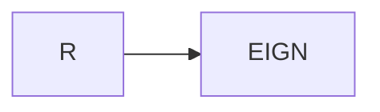
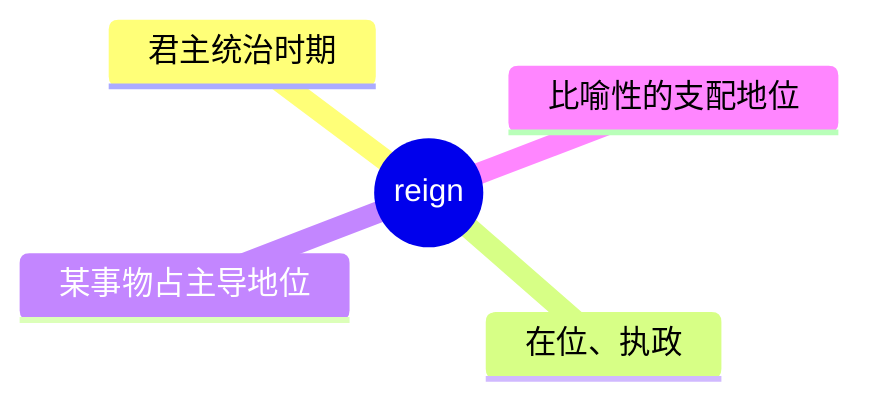
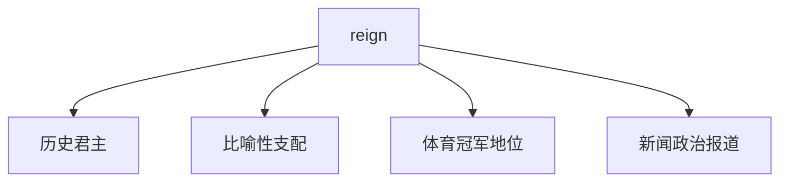
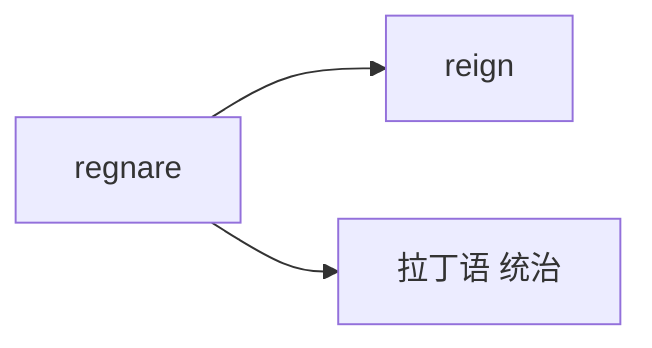

# reign

## 1. 单词卡片

| 项目 | 内容 |
|---|---|
| 单词 | reign |
| 词性 | noun / verb |
| 英式音标 | /reɪn/ |
| 美式音标 | /reɪn/（基本相同） |
| 音节 | reign（单音节） |
| 重音 | 单音节词，无需标重音 |
| 核心意思 | （君主的）统治、在位期间；占主导地位 |

## 2. 发音拆解



发音提示：

* 单音节词，读作 /reɪn/，元音是双元音 /eɪ/
* 拼写中的 `g` 不发音，这是这个单词的发音难点
* 发音和单词 `rain`（雨）、`rein`（缰绳）完全相同，是三个同音词
* 中文近似音只能辅助记忆，不能代替标准发音：可理解为“瑞恩”，但要注意 g 完全不发音

## 3. 核心词义



## 4. 不同词性与用法

| 词性 | 英文含义 | 中文意思 | 常见结构 |
|---|---|---|---|
| noun | the period a monarch rules | 统治时期、在位期间 | during the reign of |
| verb | to rule as king/queen | 统治、在位 | reign over |
| verb (比喻) | to be the most important/dominant | 占主导地位 | chaos reigns |

## 5. 常见使用语境



## 6. 常见搭配

| 搭配 | 中文意思 | 使用场景 |
|---|---|---|
| during the reign of | 在……统治期间 | 历史 |
| reign over | 统治（某地/某人） | 历史、比喻 |
| a long reign | 长期的统治 | 历史 |
| reign supreme | 占绝对主导地位 | 比喻用法 |

## 7. 基础例句

**例句 1**

```text
The castle was built during the **reign** of King Henry.
```

这座城堡是在亨利国王统治期间建造的。

**例句 2**

```text
Silence **reigned** in the room after the announcement.
```

宣布消息后，房间里一片寂静，寂静占据了整个空间。

## 8. 问答例句

**Question**

```text
How long did Queen Victoria's reign last?
```

维多利亚女王的统治持续了多长时间？

**Answer**

```text
Her reign lasted over sixty years, one of the longest in British history.
```

她的统治持续了六十多年，是英国历史上最长的统治时期之一。

## 9. 工作场景

```text
This tech company has **reigned** as the market leader for a decade.
```

这家科技公司作为市场领导者已经占据主导地位十年了。

## 10. 日常生活场景

```text
Chaos **reigned** in the kitchen while everyone tried to cook at once.
```

当大家同时做饭时，厨房里一片混乱。

## 11. 词根词缀与构词



| 单词 | 词性 | 中文意思 |
|---|---|---|
| reign | noun/verb | 统治、在位 |
| reigning | adjective | 现任的、当前的（如冠军） |
| sovereign | noun/adjective | 君主；有主权的（相关词） |

词根来自拉丁语 `regnare`，意思是“统治”，和 `regnum`（王国）、`sovereign`（君主）有词源关联。

## 12. 同义词辨析

| 单词 | 主要区别 |
|---|---|
| reign | 特指君主的统治，或比喻某事物占主导地位 |
| rule | 更通用，可指任何形式的统治或管理 |
| govern | 强调治理、管理国家或组织的具体行为 |

## 13. 反义词

没有非常固定的反义词，语境中常与以下概念相对：

| 单词 | 中文意思 |
|---|---|
| overthrow | 推翻 |
| abdicate | 退位 |

## 14. 易混淆点

```text
reign (统治，g 不发音)
```

```text
rain (雨)
```

```text
rein (缰绳)
```

这三个词发音完全相同，都是 /reɪn/，但拼写和意思完全不同，是英语中经典的同音词组。

## 15. 常见错误

错误：

```text
The king reigned the country for 20 years.
```

正确：

```text
The king reigned over the country for 20 years.
```

说明：

`reign` 作动词表示“统治”时，后面接地点或人群通常需要介词 `over`，不能直接接宾语。

## 16. 记忆方法

```text
reign（来自拉丁语“统治”，与 rain、rein 同音）→ 君主在位、统治的时期
```

场景记忆：

```text
The castle was built during the reign of King Henry.
这座城堡是在亨利国王统治期间建造的。
```

## 17. 快速复习

| 问题 | 答案 |
|---|---|
| 核心意思是什么 | 统治、在位期间；占主导地位 |
| 常见词性是什么 | 名词、动词 |
| 常见搭配是什么 | during the reign of / reign over |
| 容易混淆的词是什么 | rain（雨）、rein（缰绳），三者同音 |

## 18. 选择题考试

> 请先独立选择答案，不要提前展开答案区。

### 第 1 题

`reign` 最核心的意思是什么？

- [ ] A. 下雨
- [ ] B. 君主的统治、在位期间
- [ ] C. 缰绳
- [ ] D. 战争

<details>
<summary>提交选择后查看结果</summary>

- 正确答案：**B. 君主的统治、在位期间**
- 对错判断：选择 B 为正确；选择 A、C 或 D 为错误。
- 解析：reign 指君主统治的时期，也可以比喻表示某事物占主导地位。

</details>

### 第 2 题

`reign` 中的字母 `g` 应该怎么读？

- [ ] A. 读作 /g/
- [ ] B. 读作 /dʒ/
- [ ] C. 不发音
- [ ] D. 读作 /k/

<details>
<summary>提交选择后查看结果</summary>

- 正确答案：**C. 不发音**
- 对错判断：选择 C 为正确；选择 A、B 或 D 为错误。
- 解析：reign 中的 g 不发音，整个单词读作 /reɪn/，和 rain、rein 同音。

</details>

### 第 3 题

下面哪个搭配表示“在……统治期间”？

- [ ] A. during the reign of
- [ ] B. during the rain of
- [ ] C. during the rein of
- [ ] D. under the reign to

<details>
<summary>提交选择后查看结果</summary>

- 正确答案：**A. during the reign of**
- 对错判断：选择 A 为正确；选择 B、C 或 D 为错误。
- 解析：during the reign of 是固定搭配，用来表示某位君主统治的时期。

</details>

### 第 4 题

下面哪句话语法正确？

- [ ] A. The king reigned the country for 20 years.
- [ ] B. The king reigned over the country for 20 years.
- [ ] C. The king reign the country for 20 years.
- [ ] D. The king was reigned the country for 20 years.

<details>
<summary>提交选择后查看结果</summary>

- 正确答案：**B. The king reigned over the country for 20 years.**
- 对错判断：选择 B 为正确；选择 A、C 或 D 为错误。
- 解析：reign 作动词表示“统治”时，后面接地点或人群通常需要介词 over，不能直接接宾语。

</details>

### 第 5 题

下面哪两个单词和 `reign` 发音完全相同？

- [ ] A. rain 和 rein
- [ ] B. reign 和 ring
- [ ] C. rain 和 ring
- [ ] D. rein 和 run

<details>
<summary>提交选择后查看结果</summary>

- 正确答案：**A. rain 和 rein**
- 对错判断：选择 A 为正确；选择 B、C 或 D 为错误。
- 解析：reign、rain、rein 三个词发音完全相同，都读作 /reɪn/，是英语中经典的同音词组。

</details>

## 19. 考试结果汇总

完成全部题目后，根据答案区自行统计：

| 正确题数 | 掌握情况 | 建议 |
|---|---|---|
| 5 题 | 已掌握 | 进入下一个单词 |
| 4 题 | 基本掌握 | 复习答错的知识点 |
| 2～3 题 | 掌握不稳 | 重新阅读搭配、例句和易错点 |
| 0～1 题 | 尚未掌握 | 重新学习整个单词课程 |
