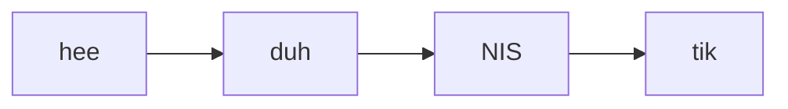
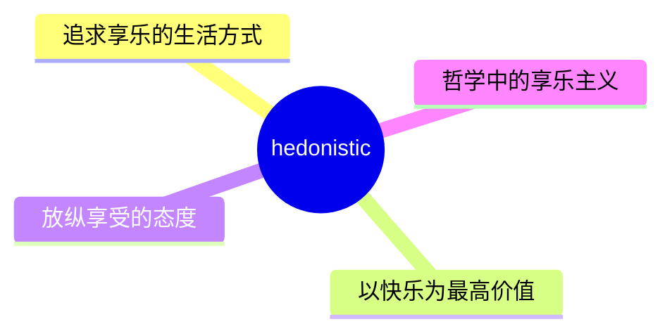
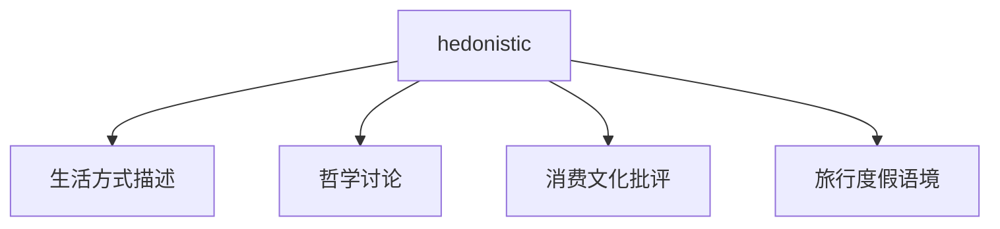
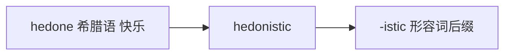

# hedonistic

## 1. 单词卡片

| 项目 | 内容 |
|---|---|
| 单词 | hedonistic |
| 词性 | adjective |
| 英式音标 | /ˌhiːdəˈnɪstɪk/ |
| 美式音标 | /ˌhiːdəˈnɪstɪk/（基本相同） |
| 音节 | he-do-nis-tic |
| 重音 | 第三音节 `nis` |
| 核心意思 | 享乐主义的；以追求快乐为人生目标的 |

## 2. 发音拆解



发音提示：

* 重音在第三个音节 `NIS`，元音是短元音 /ɪ/
* 第一个音节 `hee` 读作长元音 /hiː/
* 第二个音节 `duh` 是弱读的 /də/
* 中文近似音只能辅助记忆，不能代替标准发音：可理解为“黑多尼斯提克”，但真实发音更紧凑连贯

## 3. 核心词义



## 4. 不同词性与用法

| 词性 | 英文含义 | 中文意思 | 常见结构 |
|---|---|---|---|
| adjective | pursuing pleasure as the most important goal | 享乐主义的、追求享乐的 | a hedonistic lifestyle |

## 5. 常见使用语境



## 6. 常见搭配

| 搭配 | 中文意思 | 使用场景 |
|---|---|---|
| a hedonistic lifestyle | 享乐主义的生活方式 | 日常、评论 |
| hedonistic pleasures | 享乐主义的快乐 | 文学、哲学 |
| a hedonistic society | 享乐主义盛行的社会 | 社会评论 |
| purely hedonistic | 纯粹享乐主义的 | 正式写作 |

## 7. 基础例句

**例句 1**

```text
After college, he adopted a **hedonistic** lifestyle, focused only on parties and travel.
```

大学毕业后，他过起了享乐主义的生活，只专注于派对和旅行。

**例句 2**

```text
Critics argue that modern advertising encourages a **hedonistic** view of life.
```

评论家认为现代广告助长了一种享乐主义的人生观。

## 8. 问答例句

**Question**

```text
Do you think a hedonistic lifestyle can make people truly happy?
```

你认为享乐主义的生活方式能让人真正快乐吗？

**Answer**

```text
Not necessarily; constant pleasure-seeking often leaves people feeling empty in the long run.
```

不一定，长期不断追求快乐往往会让人感到空虚。

## 9. 工作场景

```text
This marketing campaign appeals to a **hedonistic** desire for instant gratification.
```

这个营销活动迎合了人们对即时满足的享乐主义渴望。

## 10. 日常生活场景

```text
Their vacation was purely **hedonistic**: eating, drinking, and relaxing all day.
```

他们的假期完全是享乐主义式的：整天吃喝放松。

## 11. 词根词缀与构词



| 单词 | 词性 | 中文意思 |
|---|---|---|
| hedonistic | adjective | 享乐主义的 |
| hedonism | noun | 享乐主义（名词） |
| hedonist | noun | 享乐主义者 |

`hedone` 来自希腊语，意思是“快乐”，加上形容词后缀 `-istic`，表示“属于追求快乐这种主张的”。

## 12. 同义词辨析

| 单词 | 主要区别 |
|---|---|
| hedonistic | 强调以追求快乐为人生首要目标，常带哲学或批判色彩 |
| indulgent | 强调放纵自己，语气较日常 |
| self-indulgent | 强调过度满足自己的欲望，常带轻微贬义 |

## 13. 反义词

| 单词 | 中文意思 |
|---|---|
| ascetic | 禁欲的、苦行的 |
| disciplined | 自律的 |

## 14. 易混淆点

```text
hedonistic (adjective)
```

享乐主义的，形容词形式。

```text
hedonism (noun)
```

享乐主义，名词形式，指这种哲学主张或生活方式本身。

## 15. 常见错误

错误：

```text
He believes in hedonistic.
```

正确：

```text
He believes in hedonism.
```

说明：

`hedonistic` 是形容词，不能作为“相信”的宾语单独使用；表示“相信享乐主义（这种理念）”时应使用名词 `hedonism`。

## 16. 记忆方法

```text
hedone(希腊语，快乐) + istic(形容词后缀) = hedonistic（追求快乐至上的）
```

场景记忆：

```text
After college, he adopted a hedonistic lifestyle, focused only on parties and travel.
大学毕业后，他过起了享乐主义的生活，只专注于派对和旅行。
```

## 17. 快速复习

| 问题 | 答案 |
|---|---|
| 核心意思是什么 | 享乐主义的、追求享乐的 |
| 常见词性是什么 | 形容词 |
| 常见搭配是什么 | a hedonistic lifestyle / hedonistic pleasures |
| 容易混淆的词是什么 | hedonism（享乐主义，名词） |

## 18. 选择题考试

> 请先独立选择答案，不要提前展开答案区。

### 第 1 题

`hedonistic` 最核心的意思是什么？

- [ ] A. 禁欲的、克制的
- [ ] B. 享乐主义的、追求享乐的
- [ ] C. 勤奋努力的
- [ ] D. 悲观消极的

<details>
<summary>提交选择后查看结果</summary>

- 正确答案：**B. 享乐主义的、追求享乐的**
- 对错判断：选择 B 为正确；选择 A、C 或 D 为错误。
- 解析：hedonistic 用来形容以追求快乐为人生首要目标的生活态度或方式。

</details>

### 第 2 题

`hedonistic` 的重音在第几个音节？

- [ ] A. 第一个音节
- [ ] B. 第二个音节
- [ ] C. 第三个音节
- [ ] D. 最后一个音节

<details>
<summary>提交选择后查看结果</summary>

- 正确答案：**C. 第三个音节**
- 对错判断：选择 C 为正确；选择 A、B 或 D 为错误。
- 解析：hedonistic 重音在第三个音节 nis 上，读作 /ˈnɪstɪk/ 前半部分。

</details>

### 第 3 题

下面哪个搭配表示“享乐主义的生活方式”？

- [ ] A. a hedonistic lifestyle
- [ ] B. a hedonistic mathematics
- [ ] C. a hedonistic contract
- [ ] D. a hedonistic law

<details>
<summary>提交选择后查看结果</summary>

- 正确答案：**A. a hedonistic lifestyle**
- 对错判断：选择 A 为正确；选择 B、C 或 D 为错误。
- 解析：a hedonistic lifestyle 是最常见的搭配，形容以享乐为核心的生活方式。

</details>

### 第 4 题

下面哪句话语法正确？

- [ ] A. He believes in hedonistic.
- [ ] B. He believes in hedonism.
- [ ] C. He is hedonism.
- [ ] D. He hedonistic believes.

<details>
<summary>提交选择后查看结果</summary>

- 正确答案：**B. He believes in hedonism.**
- 对错判断：选择 B 为正确；选择 A、C 或 D 为错误。
- 解析：hedonistic 是形容词，不能单独作宾语；表示“相信享乐主义”应使用名词 hedonism。

</details>

### 第 5 题

`hedonistic` 的反义词是什么？

- [ ] A. indulgent
- [ ] B. ascetic
- [ ] C. hedonist
- [ ] D. pleasurable

<details>
<summary>提交选择后查看结果</summary>

- 正确答案：**B. ascetic**
- 对错判断：选择 B 为正确；选择 A、C 或 D 为错误。
- 解析：ascetic 意思是“禁欲的、苦行的”，和追求享乐的 hedonistic 正好相反；indulgent 和 hedonistic 意思接近而非相反。

</details>

## 19. 考试结果汇总

完成全部题目后，根据答案区自行统计：

| 正确题数 | 掌握情况 | 建议 |
|---|---|---|
| 5 题 | 已掌握 | 进入下一个单词 |
| 4 题 | 基本掌握 | 复习答错的知识点 |
| 2～3 题 | 掌握不稳 | 重新阅读搭配、例句和易错点 |
| 0～1 题 | 尚未掌握 | 重新学习整个单词课程 |
