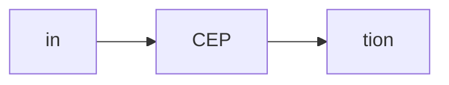
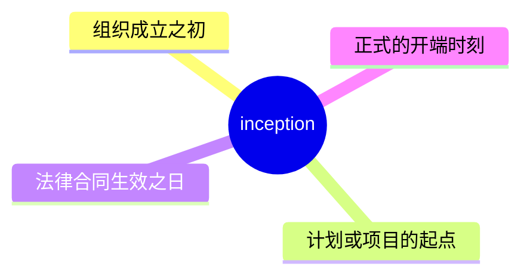
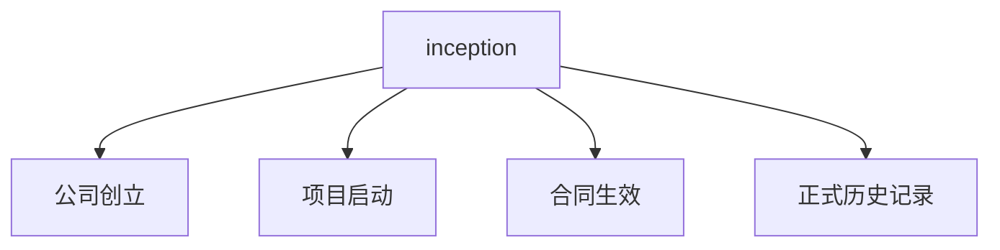
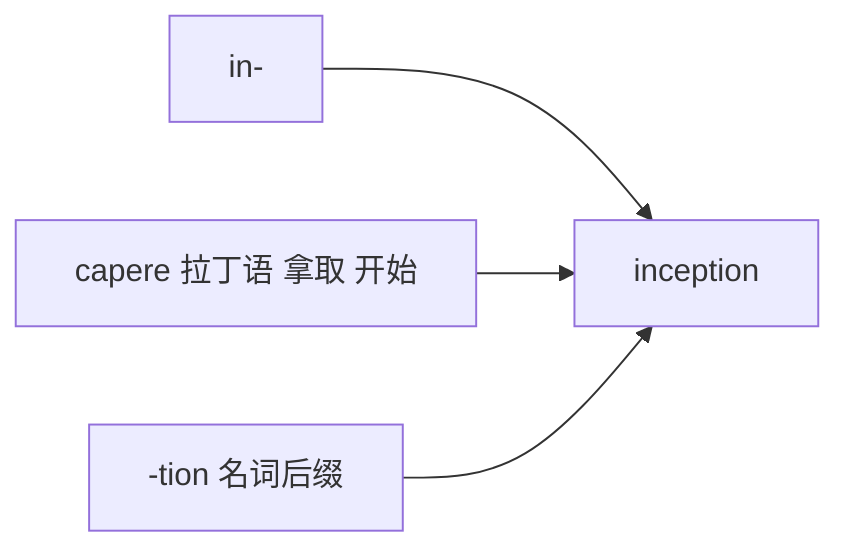

# inception

## 1. 单词卡片

| 项目 | 内容 |
|---|---|
| 单词 | inception |
| 词性 | noun |
| 英式音标 | /ɪnˈsepʃn/ |
| 美式音标 | /ɪnˈsepʃn/（基本相同） |
| 音节 | in-cep-tion |
| 重音 | 第二音节 `cep` |
| 核心意思 | 开端、开始，尤指组织或计划的创立之初 |

## 2. 发音拆解



发音提示：

* 重音在第二个音节 `CEP`，读作 /sep/
* 第一个音节 `in` 读作 /ɪn/
* 词尾 `-tion` 读作 /ʃn/，和之前学过的 persecution、concession 中的结尾发音规律类似
* 中文近似音只能辅助记忆，不能代替标准发音：可理解为“因赛普申”，但真实发音更紧凑连贯

## 3. 核心词义



## 4. 不同词性与用法

| 词性 | 英文含义 | 中文意思 | 常见结构 |
|---|---|---|---|
| noun | the beginning of an organization/undertaking | 开端、创立之初 | since its inception |

## 5. 常见使用语境



## 6. 常见搭配

| 搭配 | 中文意思 | 使用场景 |
|---|---|---|
| since its inception | 自成立以来 | 正式写作、商业 |
| from inception to completion | 从开始到完成 | 项目管理 |
| at its inception | 在其创立之初 | 正式写作 |
| the inception of the project | 项目的启动 | 商务、工作 |

## 7. 基础例句

**例句 1**

```text
The company has grown significantly since its **inception** in 2010.
```

自 2010 年成立以来，这家公司已经有了显著的发展。

**例句 2**

```text
We tracked the project from **inception** to completion.
```

我们追踪了这个项目从启动到完成的全过程。

## 8. 问答例句

**Question**

```text
What was the company's original mission at its inception?
```

这家公司在创立之初的最初使命是什么？

**Answer**

```text
Its original mission was to make quality education accessible to everyone.
```

它最初的使命是让优质教育人人可及。

## 9. 工作场景

```text
We need to document every decision made since the project's **inception**.
```

我们需要记录项目启动以来做出的每一个决定。

## 10. 日常生活场景

```text
She has been a loyal member of this club since its **inception**.
```

自这个俱乐部成立以来，她一直是忠实的成员。

## 11. 词根词缀与构词



| 单词 | 词性 | 中文意思 |
|---|---|---|
| inception | noun | 开端、创立之初 |
| incipient | adjective | 初期的、刚开始的（较正式） |

词根 `capere` 来自拉丁语，意思是“拿取、开始”，和 `capture`、`concept` 是同源词，加上 `in-` 和名词后缀 `-tion`，表示“开始的时刻”。

## 12. 同义词辨析

| 单词 | 主要区别 |
|---|---|
| inception | 正式，常用于组织、项目、合同的正式开端 |
| beginning | 最常用、最通用，适用于任何事情的开始 |
| onset | 常用于疾病或负面事件的开始，带有一定的突然性 |

## 13. 反义词

| 单词 | 中文意思 |
|---|---|
| conclusion | 结束、结论 |
| termination | 终止 |

## 14. 易混淆点

```text
inception (noun)
```

开端，强调正式的创立或启动时刻，语气较正式。

```text
beginning (noun)
```

开始，更通用、更口语化，适用范围更广。

## 15. 常见错误

错误：

```text
Since the inception, the company has grown fast.
```

正确：

```text
Since its inception, the company has grown fast.
```

说明：

`inception` 前面通常需要加所有格代词（如 its、the company's），表示“它的”创立之初，不能只用 the inception 泛泛而谈，除非上下文已经非常明确。

## 16. 记忆方法

```text
in(向内) + cept(拿取、开始，来自 capere) + ion(名词后缀) = inception（开始的时刻）
```

场景记忆：

```text
The company has grown significantly since its inception in 2010.
自 2010 年成立以来，这家公司已经有了显著的发展。
```

## 17. 快速复习

| 问题 | 答案 |
|---|---|
| 核心意思是什么 | 开端、创立之初 |
| 常见词性是什么 | 名词 |
| 常见搭配是什么 | since its inception / from inception to completion |
| 容易犯的错误是什么 | 忘记加所有格代词，应为 since its inception |

## 18. 选择题考试

> 请先独立选择答案，不要提前展开答案区。

### 第 1 题

`inception` 最核心的意思是什么？

- [ ] A. 结束、终止
- [ ] B. 开端、创立之初
- [ ] C. 失败、崩溃
- [ ] D. 高峰、顶点

<details>
<summary>提交选择后查看结果</summary>

- 正确答案：**B. 开端、创立之初**
- 对错判断：选择 B 为正确；选择 A、C 或 D 为错误。
- 解析：inception 指组织、项目或合同正式开始的时刻。

</details>

### 第 2 题

`inception` 的重音在哪个音节？

- [ ] A. 第一个音节 in
- [ ] B. 第二个音节 cep
- [ ] C. 第三个音节 tion
- [ ] D. 没有重音

<details>
<summary>提交选择后查看结果</summary>

- 正确答案：**B. 第二个音节 cep**
- 对错判断：选择 B 为正确；选择 A、C 或 D 为错误。
- 解析：inception 重音在第二个音节 cep 上，读作 /sep/。

</details>

### 第 3 题

下面哪个搭配表示“自成立以来”？

- [ ] A. since its inception
- [ ] B. since its ending
- [ ] C. before its inception
- [ ] D. after its inception forever

<details>
<summary>提交选择后查看结果</summary>

- 正确答案：**A. since its inception**
- 对错判断：选择 A 为正确；选择 B、C 或 D 为错误。
- 解析：since its inception 是固定搭配，表示从某事物创立之初到现在。

</details>

### 第 4 题

下面哪句话更自然？

- [ ] A. Since the inception, the company has grown fast.
- [ ] B. Since its inception, the company has grown fast.
- [ ] C. Since inception, the company has grown fast forever.
- [ ] D. The company since inception has grown fast the.

<details>
<summary>提交选择后查看结果</summary>

- 正确答案：**B. Since its inception, the company has grown fast.**
- 对错判断：选择 B 为正确；选择 A、C 或 D 为错误。
- 解析：inception 前面通常需要加所有格代词，比如 its，表示“它的”创立之初，让指代更清晰。

</details>

### 第 5 题

`inception` 和 `beginning` 的主要区别是什么？

- [ ] A. 完全同义，可以随意互换
- [ ] B. inception 更正式，常用于组织、项目、合同的正式开端；beginning 更通用、更口语化
- [ ] C. beginning 只能用于书面语
- [ ] D. inception 是动词，beginning 是名词

<details>
<summary>提交选择后查看结果</summary>

- 正确答案：**B. inception 更正式，常用于组织、项目、合同的正式开端；beginning 更通用、更口语化**
- 对错判断：选择 B 为正确；选择 A、C 或 D 为错误。
- 解析：inception 语气更正式，常出现在商务、法律或项目管理语境中；beginning 是最常用、最通用的表达，适用于任何情境。

</details>

## 19. 考试结果汇总

完成全部题目后，根据答案区自行统计：

| 正确题数 | 掌握情况 | 建议 |
|---|---|---|
| 5 题 | 已掌握 | 进入下一个单词 |
| 4 题 | 基本掌握 | 复习答错的知识点 |
| 2～3 题 | 掌握不稳 | 重新阅读搭配、例句和易错点 |
| 0～1 题 | 尚未掌握 | 重新学习整个单词课程 |
