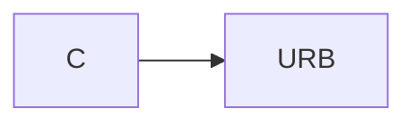
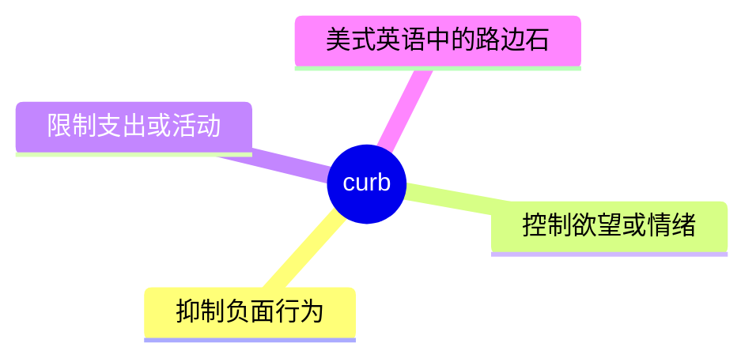
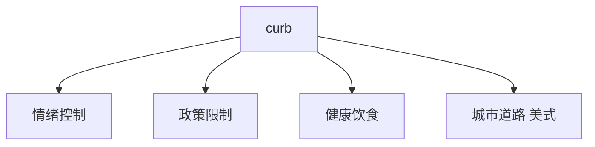
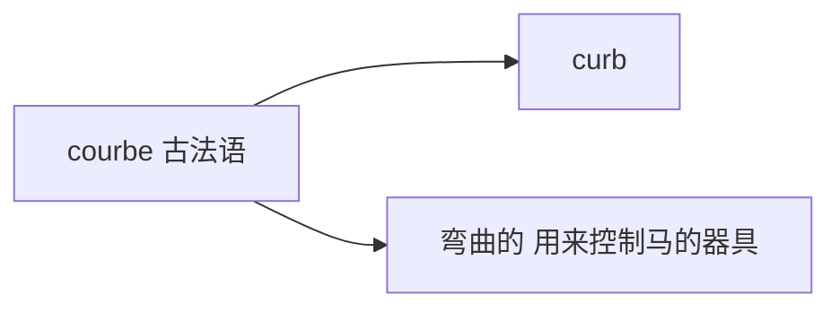

# curb

## 1. 单词卡片

| 项目 | 内容 |
|---|---|
| 单词 | curb |
| 词性 | verb / noun |
| 英式音标 | /kɜːb/ |
| 美式音标 | /kɜːrb/ |
| 音节 | curb（单音节） |
| 重音 | 单音节词，无需标重音 |
| 核心意思 | 抑制、控制（尤指负面行为）；（美式英语中）路边石 |

## 2. 发音拆解



发音提示：

* 单音节词，英式读作 /kɜːb/，美式读作 /kɜːrb/，美式发音需要卷舌
* 元音是长元音 /ɜː/ 或带卷舌的 /ɜːr/
* 词尾 `rb` 要清晰读出，不要省略 `b`
* 中文近似音只能辅助记忆，不能代替标准发音：可理解为“克尔布”，但真实发音更短促

## 3. 核心词义



## 4. 不同词性与用法

| 词性 | 英文含义 | 中文意思 | 常见结构 |
|---|---|---|---|
| verb | control or restrict (something negative) | 抑制、控制 | curb one's appetite |
| noun | a check or restraint | 抑制、控制（措施） | a curb on spending |
| noun (美式英语) | the edge of a pavement/street | 路边石、路缘 | park by the curb |

## 5. 常见使用语境



## 6. 常见搭配

| 搭配 | 中文意思 | 使用场景 |
|---|---|---|
| curb one's appetite | 控制食欲 | 健康、生活 |
| curb spending | 控制支出 | 经济、财务 |
| curb inflation | 抑制通货膨胀 | 经济新闻 |
| put a curb on | 对……加以限制 | 正式写作 |

## 7. 基础例句

**例句 1**

```text
The government introduced new measures to **curb** inflation.
```

政府推出了新措施来抑制通货膨胀。

**例句 2**

```text
He is trying to **curb** his spending after the holidays.
```

假期过后，他正在努力控制自己的开支。

## 8. 问答例句

**Question**

```text
What steps can we take to curb pollution in the city?
```

我们可以采取什么措施来抑制城市里的污染？

**Answer**

```text
We could curb it by promoting public transportation and limiting car use.
```

我们可以通过推广公共交通和限制用车来抑制它。

## 9. 工作场景

```text
New policies aim to **curb** excessive overtime among employees.
```

新政策旨在抑制员工的过度加班现象。

## 10. 日常生活场景

```text
She tries to **curb** her sugar intake to stay healthy.
```

她努力控制自己的糖分摄入，以保持健康。

## 11. 词根词缀与构词



| 单词 | 词性 | 中文意思 |
|---|---|---|
| curb | verb/noun | 抑制、控制；路边石 |
| curbed | adjective/past tense | 被抑制的 |

`curb` 来自古法语 `courbe`，原意是“弯曲的”，最初指用来控制马匹的弯曲马衔或缰绳装置，后来引申出“控制、抑制”的含义。

## 12. 同义词辨析

| 单词 | 主要区别 |
|---|---|
| curb | 强调控制或限制负面行为、欲望，语气较正式 |
| restrain | 强调用力量约束，可用于身体动作或情绪 |
| control | 最常用、最通用，适用范围最广 |

## 13. 反义词

| 单词 | 中文意思 |
|---|---|
| encourage | 鼓励 |
| unleash | 释放、放开 |

## 14. 易混淆点

```text
curb (美式英语，路边石)
```

```text
kerb (英式英语拼写，路边石)
```

在表示“路边石”这个含义时，美式英语拼写为 `curb`，英式英语拼写为 `kerb`，但表示“抑制、控制”这个含义时，两种英语都统一拼写为 `curb`。

## 15. 常见错误

错误：

```text
He curbed his anger to his friend.
```

正确：

```text
He curbed his anger.
```

说明：

`curb` 作及物动词时直接接宾语（要控制的情绪或行为），不需要额外加 `to someone` 这样的介词短语。

## 16. 记忆方法

```text
curb（源自古法语“弯曲的”，控制马匹的器具）→ 引申为“控制、抑制”
```

场景记忆：

```text
The government introduced new measures to curb inflation.
政府推出了新措施来抑制通货膨胀。
```

## 17. 快速复习

| 问题 | 答案 |
|---|---|
| 核心意思是什么 | 抑制、控制；（美式英语）路边石 |
| 常见词性是什么 | 动词、名词 |
| 常见搭配是什么 | curb one's appetite / curb spending |
| 拼写差异是什么 | 表示路边石时，英式拼写为 kerb |

## 18. 选择题考试

> 请先独立选择答案，不要提前展开答案区。

### 第 1 题

`curb` 作动词时，最核心的意思是什么？

- [ ] A. 鼓励、支持
- [ ] B. 抑制、控制
- [ ] C. 增加、扩大
- [ ] D. 忽略、无视

<details>
<summary>提交选择后查看结果</summary>

- 正确答案：**B. 抑制、控制**
- 对错判断：选择 B 为正确；选择 A、C 或 D 为错误。
- 解析：curb 作动词表示控制或抑制某种负面行为、欲望或趋势。

</details>

### 第 2 题

`curb` 表示“路边石”时，英式英语通常怎么拼写？

- [ ] A. curb
- [ ] B. kerb
- [ ] C. curbe
- [ ] D. kirb

<details>
<summary>提交选择后查看结果</summary>

- 正确答案：**B. kerb**
- 对错判断：选择 B 为正确；选择 A、C 或 D 为错误。
- 解析：表示“路边石”这个含义时，英式英语拼写为 kerb，美式英语拼写为 curb；但表示“抑制、控制”时统一拼写为 curb。

</details>

### 第 3 题

下面哪个搭配表示“控制食欲”？

- [ ] A. curb one's appetite
- [ ] B. curb one's height
- [ ] C. curb one's name
- [ ] D. curb one's birthday

<details>
<summary>提交选择后查看结果</summary>

- 正确答案：**A. curb one's appetite**
- 对错判断：选择 A 为正确；选择 B、C 或 D 为错误。
- 解析：curb one's appetite 是常见搭配，表示控制自己的食欲。

</details>

### 第 4 题

下面哪句话语法正确？

- [ ] A. He curbed his anger to his friend.
- [ ] B. He curbed his anger.
- [ ] C. He curbed to his anger.
- [ ] D. He curbed for his anger.

<details>
<summary>提交选择后查看结果</summary>

- 正确答案：**B. He curbed his anger.**
- 对错判断：选择 B 为正确；选择 A、C 或 D 为错误。
- 解析：curb 作及物动词直接接宾语，不需要额外加介词短语。

</details>

### 第 5 题

`curb` 和 `restrain` 的主要区别是什么？

- [ ] A. 完全同义，可以随意互换
- [ ] B. curb 强调控制负面行为或欲望，restrain 强调用力量约束，可用于身体动作或情绪
- [ ] C. restrain 只能用于路边石
- [ ] D. curb 是名词，restrain 是形容词

<details>
<summary>提交选择后查看结果</summary>

- 正确答案：**B. curb 强调控制负面行为或欲望，restrain 强调用力量约束，可用于身体动作或情绪**
- 对错判断：选择 B 为正确；选择 A、C 或 D 为错误。
- 解析：curb 常用于控制支出、通货膨胀、欲望等抽象事物；restrain 使用范围更广，也可以指用力量约束某人的身体动作。

</details>

## 19. 考试结果汇总

完成全部题目后，根据答案区自行统计：

| 正确题数 | 掌握情况 | 建议 |
|---|---|---|
| 5 题 | 已掌握 | 进入下一个单词 |
| 4 题 | 基本掌握 | 复习答错的知识点 |
| 2～3 题 | 掌握不稳 | 重新阅读搭配、例句和易错点 |
| 0～1 题 | 尚未掌握 | 重新学习整个单词课程 |
