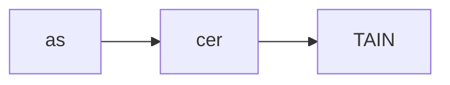
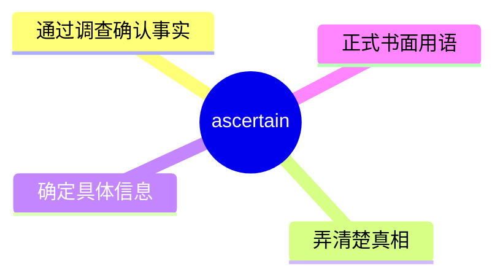
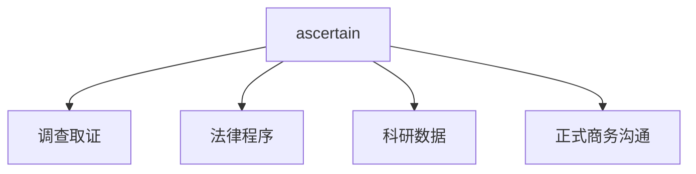
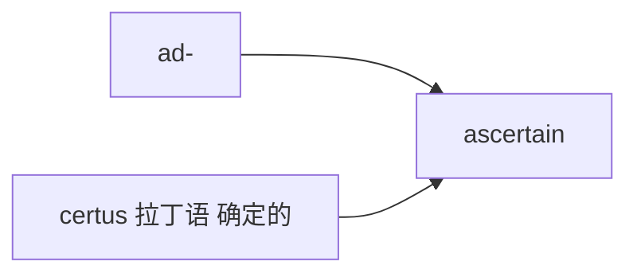

# ascertain

## 1. 单词卡片

| 项目 | 内容 |
|---|---|
| 单词 | ascertain |
| 词性 | verb |
| 英式音标 | /ˌæsəˈteɪn/ |
| 美式音标 | /ˌæsərˈteɪn/ |
| 音节 | as-cer-tain |
| 重音 | 第三音节 `tain` |
| 核心意思 | 查明、确定；弄清楚（事实真相） |

## 2. 发音拆解



发音提示：

* 重音在第三个音节 `TAIN`，读作 /teɪn/，和单词 rain 韵母相同
* 第一个音节 `as` 读作 /æs/
* 第二个音节 `cer`，英式读作弱读的 /sə/，美式读作卷舌的 /sər/
* 中文近似音只能辅助记忆，不能代替标准发音：可理解为“阿瑟坦”，但真实发音要连贯得多

## 3. 核心词义



## 4. 不同词性与用法

| 词性 | 英文含义 | 中文意思 | 常见结构 |
|---|---|---|---|
| verb | find out for certain, especially through checking | 查明、确定 | ascertain the facts |

## 5. 常见使用语境



## 6. 常见搭配

| 搭配 | 中文意思 | 使用场景 |
|---|---|---|
| ascertain the facts | 查明事实 | 法律、正式写作 |
| ascertain whether | 确定是否…… | 正式写作 |
| ascertain the cause of | 查明……的原因 | 调查、报告 |
| difficult to ascertain | 难以查明 | 正式写作 |

## 7. 基础例句

**例句 1**

```text
Investigators are trying to **ascertain** the cause of the fire.
```

调查人员正在努力查明这场火灾的起因。

**例句 2**

```text
It was difficult to **ascertain** exactly how much damage had occurred.
```

很难准确查明发生了多大的损失。

## 8. 问答例句

**Question**

```text
Have you been able to ascertain whether the report is accurate?
```

你能确定这份报告是否准确了吗？

**Answer**

```text
Not yet; we're still trying to ascertain the source of the data.
```

还没有，我们还在努力查明数据的来源。

## 9. 工作场景

```text
Please **ascertain** the client's requirements before drafting the proposal.
```

在起草提案之前，请先确认客户的需求。

## 10. 日常生活场景

```text
She called the hospital to **ascertain** her father's condition.
```

她打电话给医院以确认父亲的病情。

## 11. 词根词缀与构词



| 单词 | 词性 | 中文意思 |
|---|---|---|
| ascertain | verb | 查明、确定 |
| certain | adjective | 确定的（同源词） |
| ascertainable | adjective | 可查明的（较少见） |

`ad-` 在这里演变为 `as-`，表示“朝向”，词根 `certus` 来自拉丁语，意思是“确定的”，和 `certain`（确定的）是同源词，合起来表示“使某事变得确定”。

## 12. 同义词辨析

| 单词 | 主要区别 |
|---|---|
| ascertain | 强调通过调查或核实来确定事实，语气正式、书面化 |
| find out | 更常用、更口语化，适用范围更广 |
| determine | 强调经过分析或判断得出结论，可用于事实或决定 |

## 13. 反义词

没有非常固定的反义词，语境中常与以下概念相对：

| 单词 | 中文意思 |
|---|---|
| guess | 猜测 |
| assume | 假设 |

## 14. 易混淆点

```text
ascertain (verb)
```

查明、确定，强调通过调查得出确切答案。

```text
assert (verb)
```

断言、声称，强调坚定地陈述观点，不一定经过调查核实。

两个词拼写开头相似，但意思和用法都不同。

## 15. 常见错误

错误：

```text
I ascertained him that the report was correct.
```

正确：

```text
I ascertained that the report was correct.
```

说明：

`ascertain` 是及物动词，后面直接接名词或 `that` 从句，表示查明的内容，不能像 `assure` 那样接双宾语（人 + 内容）。

## 16. 记忆方法

```text
as(朝向) + certain(确定的，来自 certus) = ascertain（使变得确定，即查明）
```

场景记忆：

```text
Investigators are trying to ascertain the cause of the fire.
调查人员正在努力查明这场火灾的起因。
```

## 17. 快速复习

| 问题 | 答案 |
|---|---|
| 核心意思是什么 | 查明、确定 |
| 常见词性是什么 | 动词 |
| 常见搭配是什么 | ascertain the facts / ascertain whether |
| 容易犯的错误是什么 | 误接双宾语，应直接接内容或 that 从句 |

## 18. 选择题考试

> 请先独立选择答案，不要提前展开答案区。

### 第 1 题

`ascertain` 最核心的意思是什么？

- [ ] A. 猜测、推测
- [ ] B. 查明、确定
- [ ] C. 隐瞒、掩盖
- [ ] D. 忽略、无视

<details>
<summary>提交选择后查看结果</summary>

- 正确答案：**B. 查明、确定**
- 对错判断：选择 B 为正确；选择 A、C 或 D 为错误。
- 解析：ascertain 表示通过调查或核实来查明事实，弄清楚真相。

</details>

### 第 2 题

`ascertain` 的重音在哪个音节？

- [ ] A. 第一个音节 as
- [ ] B. 第二个音节 cer
- [ ] C. 第三个音节 tain
- [ ] D. 没有重音

<details>
<summary>提交选择后查看结果</summary>

- 正确答案：**C. 第三个音节 tain**
- 对错判断：选择 C 为正确；选择 A、B 或 D 为错误。
- 解析：ascertain 重音在第三个音节 tain 上，读作 /teɪn/。

</details>

### 第 3 题

下面哪个搭配表示“查明事实”？

- [ ] A. ascertain the facts
- [ ] B. ascertain the breakfast
- [ ] C. ascertain the color
- [ ] D. ascertain the weekend

<details>
<summary>提交选择后查看结果</summary>

- 正确答案：**A. ascertain the facts**
- 对错判断：选择 A 为正确；选择 B、C 或 D 为错误。
- 解析：ascertain the facts 是常见的正式搭配，表示通过调查查明事实真相。

</details>

### 第 4 题

下面哪句话语法正确？

- [ ] A. I ascertained him that the report was correct.
- [ ] B. I ascertained that the report was correct.
- [ ] C. I ascertained to him the report was correct.
- [ ] D. I ascertained him the report.

<details>
<summary>提交选择后查看结果</summary>

- 正确答案：**B. I ascertained that the report was correct.**
- 对错判断：选择 B 为正确；选择 A、C 或 D 为错误。
- 解析：ascertain 后面直接接内容或 that 从句，不能像 assure 那样接“人 + 内容”的双宾语结构。

</details>

### 第 5 题

`ascertain` 和 `assert` 的主要区别是什么？

- [ ] A. 完全同义，可以随意互换
- [ ] B. ascertain 强调通过调查确定事实，assert 强调坚定地陈述观点，不一定经过核实
- [ ] C. assert 只能用于法律语境
- [ ] D. ascertain 是名词，assert 是动词

<details>
<summary>提交选择后查看结果</summary>

- 正确答案：**B. ascertain 强调通过调查确定事实，assert 强调坚定地陈述观点，不一定经过核实**
- 对错判断：选择 B 为正确；选择 A、C 或 D 为错误。
- 解析：ascertain 强调查证核实后得出确切结论；assert 强调坚定地断言或声称某事，不一定经过调查验证，两个词拼写相似但含义不同。

</details>

## 19. 考试结果汇总

完成全部题目后，根据答案区自行统计：

| 正确题数 | 掌握情况 | 建议 |
|---|---|---|
| 5 题 | 已掌握 | 进入下一个单词 |
| 4 题 | 基本掌握 | 复习答错的知识点 |
| 2～3 题 | 掌握不稳 | 重新阅读搭配、例句和易错点 |
| 0～1 题 | 尚未掌握 | 重新学习整个单词课程 |
