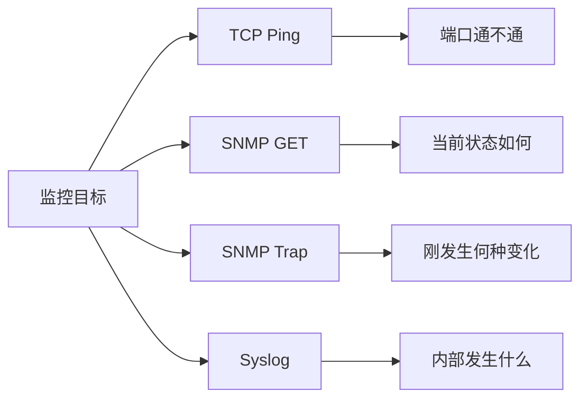

# 四种通信方式回答四个问题

先建立全局心智模型：四种手段互补，不是互相替代。

## 核心要点

- TCP Ping 回答目标 TCP 端口能否建立连接。
- SNMP GET 读取设备当前状态与性能指标。
- SNMP Trap 接收设备主动报告的事件。
- Syslog 提供事件细节、原因线索与审计记录。
- TCP Ping 是基于 TCP 的检测方法，不是独立的标准协议。

---

## 本章测验

本章共 5 道单项选择题。

### 第 1 题

TCP Ping 主要回答哪个问题？

- A. 设备当前 CPU 使用率是多少
- B. 目标 TCP 端口能否建立连接
- C. 设备刚刚主动报告了什么变化
- D. 设备内部记录了哪些详细事件

选择完成后展开答案

正确答案：B. 目标 TCP 端口能否建立连接

答案解析：TCP Ping 关注指定 TCP 端口的可连接性；状态指标、主动事件和详细日志分别更适合由 GET、Trap 和 Syslog 提供。

### 第 2 题

哪组对应关系符合本章的四种观察视角？

- A. TCP 看日志，GET 看端口，Trap 看趋势，Syslog 看温度
- B. TCP 看配置，GET 看审计，Trap 看容量，Syslog 看路由
- C. TCP 看业务结果，GET 看全部原因，Trap 看历史趋势，Syslog 看端口
- D. TCP 看可达性，GET 看当前状态，Trap 看即时变化，Syslog 看事件细节

选择完成后展开答案

正确答案：D. TCP 看可达性，GET 看当前状态，Trap 看即时变化，Syslog 看事件细节

答案解析：四种方式各自回答不同问题，组合使用才能覆盖可达性、状态、变化和上下文。

### 第 3 题

哪项准确描述 TCP Ping 的技术定位？

- A. 它是基于 TCP 的连通性检测方法，不是独立标准协议
- B. 它是 SNMP 的一种请求类型
- C. 它是 Syslog 的可靠传输模式
- D. 它是 ICMP Echo 的正式别名

选择完成后展开答案

正确答案：A. 它是基于 TCP 的连通性检测方法，不是独立标准协议

答案解析：TCP Ping 是常用称呼，指通过 TCP 端口进行连通性检测，并非像 SNMP 或 Syslog 那样的独立标准协议。

### 第 4 题

监控平台已收到接口变化通知，但需要了解详细原因，下一步最适合查看什么？

- A. 只重复 TCP 建连
- B. 只等待下一次 Trap
- C. 相关 Syslog 记录
- D. 关闭所有轮询任务

选择完成后展开答案

正确答案：C. 相关 Syslog 记录

答案解析：Syslog 往往包含设备内部事件、时间和原因线索；TCP 与 Trap 不能单独提供同等详细的上下文。

### 第 5 题

以下哪种理解是常见误区？

- A. 根据证据类型选择通信方式
- B. 寻找一种可以替代其余三种方式的万能监控协议
- C. 将不同信号关联为一个事件
- D. 区分端口可达与业务健康

选择完成后展开答案

正确答案：B. 寻找一种可以替代其余三种方式的万能监控协议

答案解析：四种方式存在互补关系，没有一种能独自覆盖所有监控问题。

<!-- QUIZ_DATA_START
{
  "chapter": "01",
  "questions": [
    {
      "id": 1,
      "question": "TCP Ping 主要回答哪个问题？",
      "options": {
        "A": "设备当前 CPU 使用率是多少",
        "B": "目标 TCP 端口能否建立连接",
        "C": "设备刚刚主动报告了什么变化",
        "D": "设备内部记录了哪些详细事件"
      },
      "answer": "B",
      "explanation": "TCP Ping 关注指定 TCP 端口的可连接性；状态指标、主动事件和详细日志分别更适合由 GET、Trap 和 Syslog 提供。"
    },
    {
      "id": 2,
      "question": "哪组对应关系符合本章的四种观察视角？",
      "options": {
        "A": "TCP 看日志，GET 看端口，Trap 看趋势，Syslog 看温度",
        "B": "TCP 看配置，GET 看审计，Trap 看容量，Syslog 看路由",
        "C": "TCP 看业务结果，GET 看全部原因，Trap 看历史趋势，Syslog 看端口",
        "D": "TCP 看可达性，GET 看当前状态，Trap 看即时变化，Syslog 看事件细节"
      },
      "answer": "D",
      "explanation": "四种方式各自回答不同问题，组合使用才能覆盖可达性、状态、变化和上下文。"
    },
    {
      "id": 3,
      "question": "哪项准确描述 TCP Ping 的技术定位？",
      "options": {
        "A": "它是基于 TCP 的连通性检测方法，不是独立标准协议",
        "B": "它是 SNMP 的一种请求类型",
        "C": "它是 Syslog 的可靠传输模式",
        "D": "它是 ICMP Echo 的正式别名"
      },
      "answer": "A",
      "explanation": "TCP Ping 是常用称呼，指通过 TCP 端口进行连通性检测，并非像 SNMP 或 Syslog 那样的独立标准协议。"
    },
    {
      "id": 4,
      "question": "监控平台已收到接口变化通知，但需要了解详细原因，下一步最适合查看什么？",
      "options": {
        "A": "只重复 TCP 建连",
        "B": "只等待下一次 Trap",
        "C": "相关 Syslog 记录",
        "D": "关闭所有轮询任务"
      },
      "answer": "C",
      "explanation": "Syslog 往往包含设备内部事件、时间和原因线索；TCP 与 Trap 不能单独提供同等详细的上下文。"
    },
    {
      "id": 5,
      "question": "以下哪种理解是常见误区？",
      "options": {
        "A": "根据证据类型选择通信方式",
        "B": "寻找一种可以替代其余三种方式的万能监控协议",
        "C": "将不同信号关联为一个事件",
        "D": "区分端口可达与业务健康"
      },
      "answer": "B",
      "explanation": "四种方式存在互补关系，没有一种能独自覆盖所有监控问题。"
    }
  ]
}
QUIZ_DATA_END -->
