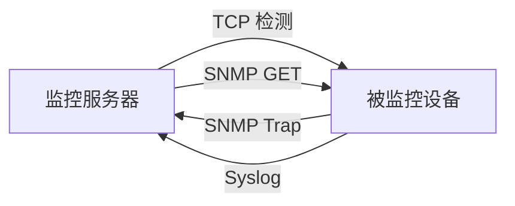

# 主动探测与被动接收

从通信方向理解监控系统与设备之间的职责。

## 核心要点

- TCP 检测与 SNMP GET 通常由监控服务器主动发起。
- SNMP Trap 与 Syslog 通常由设备或应用主动发送。
- 主动探测可以反复确认，被动消息更及时但可能缺失。
- 完整系统同时需要调度器、接收器、存储与告警关联。

---

## 本章测验

本章共 5 道单项选择题。

### 第 1 题

哪两种方式通常由监控服务器主动发起？

- A. SNMP Trap 与 Syslog
- B. TCP 检测与 SNMP GET
- C. TCP 检测与 Syslog
- D. SNMP GET 与 SNMP Trap

选择完成后展开答案

正确答案：B. TCP 检测与 SNMP GET

答案解析：TCP 检测和 GET 都由监控端按需或按周期请求目标；Trap 与 Syslog 通常由设备主动发送。

### 第 2 题

哪条通信方向组合正确？

- A. 设备向监控端发送 GET，监控端向设备发送 Trap
- B. 监控端只接收 TCP，设备只接收 Syslog
- C. 四种方式都必须由监控端先建立会话
- D. 监控端向设备发送 GET，设备向监控端发送 Trap

选择完成后展开答案

正确答案：D. 监控端向设备发送 GET，设备向监控端发送 Trap

答案解析：GET 是 Manager 请求、Agent 响应；Trap 则由设备主动发向接收端。

### 第 3 题

主动探测最突出的控制能力是什么？

- A. 监控端可以安排周期并在失败后按策略重试
- B. 保证设备一定发送故障原因
- C. 自动消除所有网络丢包
- D. 无需考虑探测负载

选择完成后展开答案

正确答案：A. 监控端可以安排周期并在失败后按策略重试

答案解析：主动探测由监控端调度，因此能控制频率、超时和重试，但并不能保证无丢包或无负载。

### 第 4 题

设备突然断电且来不及发送事件时，哪类证据最可能从外部发现问题？

- A. 等待设备补发 Trap
- B. 仅检查历史 Syslog 是否为空
- C. 周期性主动探测失败
- D. 把无消息解释为健康

选择完成后展开答案

正确答案：C. 周期性主动探测失败

答案解析：设备断电时被动消息可能缺失，外部 TCP 或 GET 探测失败能提供设备不可达的证据。

### 第 5 题

对“主动”和“被动”的正确理解是什么？

- A. 主动消息只表示正常
- B. 它描述谁先发起通信，不直接表示正常或故障
- C. 被动消息只表示故障
- D. 被动方式不需要接收器

选择完成后展开答案

正确答案：B. 它描述谁先发起通信，不直接表示正常或故障

答案解析：主动与被动是通信发起方向，不是健康状态标签。

<!-- QUIZ_DATA_START
{
  "chapter": "02",
  "questions": [
    {
      "id": 1,
      "question": "哪两种方式通常由监控服务器主动发起？",
      "options": {
        "A": "SNMP Trap 与 Syslog",
        "B": "TCP 检测与 SNMP GET",
        "C": "TCP 检测与 Syslog",
        "D": "SNMP GET 与 SNMP Trap"
      },
      "answer": "B",
      "explanation": "TCP 检测和 GET 都由监控端按需或按周期请求目标；Trap 与 Syslog 通常由设备主动发送。"
    },
    {
      "id": 2,
      "question": "哪条通信方向组合正确？",
      "options": {
        "A": "设备向监控端发送 GET，监控端向设备发送 Trap",
        "B": "监控端只接收 TCP，设备只接收 Syslog",
        "C": "四种方式都必须由监控端先建立会话",
        "D": "监控端向设备发送 GET，设备向监控端发送 Trap"
      },
      "answer": "D",
      "explanation": "GET 是 Manager 请求、Agent 响应；Trap 则由设备主动发向接收端。"
    },
    {
      "id": 3,
      "question": "主动探测最突出的控制能力是什么？",
      "options": {
        "A": "监控端可以安排周期并在失败后按策略重试",
        "B": "保证设备一定发送故障原因",
        "C": "自动消除所有网络丢包",
        "D": "无需考虑探测负载"
      },
      "answer": "A",
      "explanation": "主动探测由监控端调度，因此能控制频率、超时和重试，但并不能保证无丢包或无负载。"
    },
    {
      "id": 4,
      "question": "设备突然断电且来不及发送事件时，哪类证据最可能从外部发现问题？",
      "options": {
        "A": "等待设备补发 Trap",
        "B": "仅检查历史 Syslog 是否为空",
        "C": "周期性主动探测失败",
        "D": "把无消息解释为健康"
      },
      "answer": "C",
      "explanation": "设备断电时被动消息可能缺失，外部 TCP 或 GET 探测失败能提供设备不可达的证据。"
    },
    {
      "id": 5,
      "question": "对“主动”和“被动”的正确理解是什么？",
      "options": {
        "A": "主动消息只表示正常",
        "B": "它描述谁先发起通信，不直接表示正常或故障",
        "C": "被动消息只表示故障",
        "D": "被动方式不需要接收器"
      },
      "answer": "B",
      "explanation": "主动与被动是通信发起方向，不是健康状态标签。"
    }
  ]
}
QUIZ_DATA_END -->
