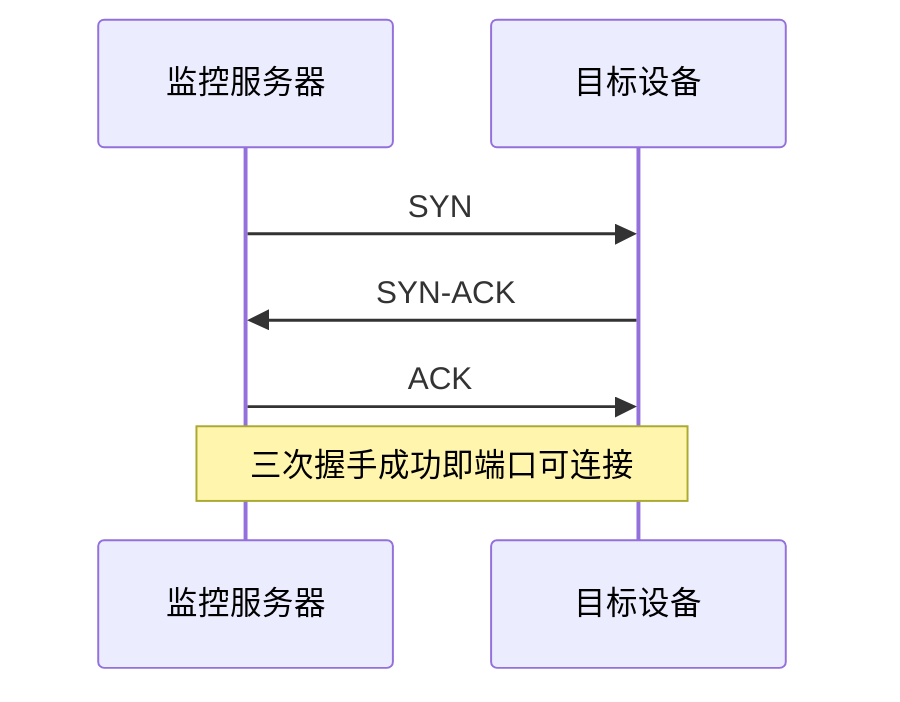

# TCP Ping：检测端口连通性

一句话：TCP Ping 通过尝试建立 TCP 连接，判断指定端口是否可用。

```mermaid
sequenceDiagram
    participant M as 监控服务器
    participant D as 目标设备
    M->>D: SYN
    D->>M: SYN-ACK
    M->>D: ACK
    Note over M,D: 三次握手成功即端口可连接
```

## 核心要点

* 检测的是指定端口，而不是整个主机
* 常用于检测 80 443 22 3306 等端口
* 与 ICMP Ping 不同，ICMP 检测网络层是否可达
* 防火墙可能禁止 ICMP 但仍允许某个端口连接
* 适合快速判断服务是否在监听
