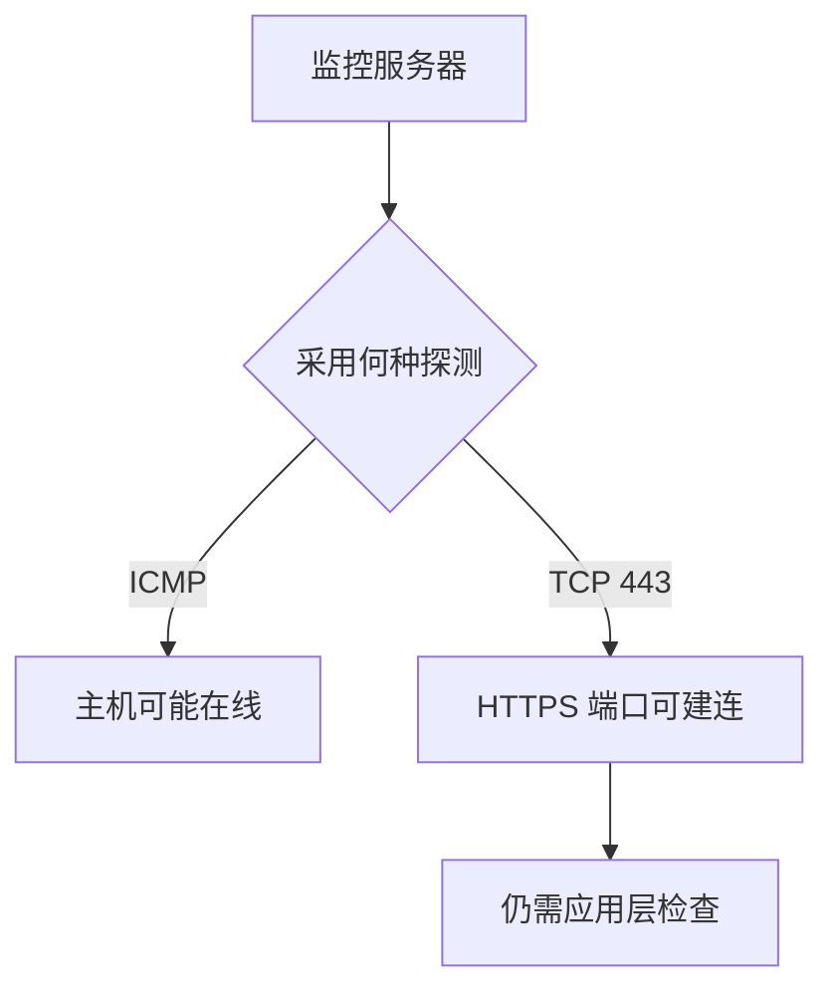

# TCP Ping 与 ICMP Ping

当 ICMP 被限制时，用真实业务端口检查可连接性。

## 核心要点

- ICMP 成功不代表业务端口可用。
- TCP 检测会覆盖路由、防火墙、操作系统响应和端口监听。
- 云安全组、企业防火墙和负载均衡环境可能限制 ICMP。
- TCP 443 成功只证明 TCP 建连，不证明 HTTP 或业务成功。

---

## 本章测验

本章共 5 道单项选择题。

### 第 1 题

ICMP Ping 成功最合理的结论是什么？

- A. HTTPS 业务一定成功
- B. 目标主机可能在线且 ICMP 路径可用
- C. 所有 TCP 端口都开放
- D. 数据库依赖一定正常

选择完成后展开答案

正确答案：B. 目标主机可能在线且 ICMP 路径可用

答案解析：ICMP 成功只能证明相应网络消息可往返，不能证明具体端口、应用或依赖健康。

### 第 2 题

TCP 443 检测会依次涉及哪些关键条件？

- A. 只需要 DNS 正常
- B. 只需要 CPU 未超阈值
- C. 只需要设备发出 Trap
- D. 路由可达、防火墙允许、操作系统响应且 443 有监听

选择完成后展开答案

正确答案：D. 路由可达、防火墙允许、操作系统响应且 443 有监听

答案解析：TCP 建连跨越网络路径、访问控制、目标协议栈和端口监听多个环节。

### 第 3 题

哪项最准确地描述 TCP 443 成功？

- A. 从当前监控点到目标 443 端口当时可以建立 TCP 连接
- B. 网站全部页面均正确
- C. TLS 证书一定有效
- D. 后端数据库一定可用

选择完成后展开答案

正确答案：A. 从当前监控点到目标 443 端口当时可以建立 TCP 连接

答案解析：TCP 证据应保留来源、目标、端口和时刻，不能扩大到 TLS、HTTP 或业务层。

### 第 4 题

云安全组禁止 ICMP，但允许 HTTPS。若要检查真实访问路径，应优先采用什么？

- A. 只检查本机回环地址
- B. 等待设备发送 Syslog
- C. 从监控点执行 TCP 443 检测
- D. 把 ICMP 失败直接定为宕机

选择完成后展开答案

正确答案：C. 从监控点执行 TCP 443 检测

答案解析：TCP 443 探测能沿实际允许的业务端口验证连接路径，更符合该场景。

### 第 5 题

哪种说法属于过度推断？

- A. TCP 失败可能有多种原因
- B. TCP 443 成功，所以整个业务系统完全健康
- C. TCP 成功后仍需应用层检查
- D. 检测结论应注明监控来源

选择完成后展开答案

正确答案：B. TCP 443 成功，所以整个业务系统完全健康

答案解析：端口建连只覆盖 TCP 层，不能证明应用逻辑、数据和依赖都正常。

<!-- QUIZ_DATA_START
{
  "chapter": "03",
  "questions": [
    {
      "id": 1,
      "question": "ICMP Ping 成功最合理的结论是什么？",
      "options": {
        "A": "HTTPS 业务一定成功",
        "B": "目标主机可能在线且 ICMP 路径可用",
        "C": "所有 TCP 端口都开放",
        "D": "数据库依赖一定正常"
      },
      "answer": "B",
      "explanation": "ICMP 成功只能证明相应网络消息可往返，不能证明具体端口、应用或依赖健康。"
    },
    {
      "id": 2,
      "question": "TCP 443 检测会依次涉及哪些关键条件？",
      "options": {
        "A": "只需要 DNS 正常",
        "B": "只需要 CPU 未超阈值",
        "C": "只需要设备发出 Trap",
        "D": "路由可达、防火墙允许、操作系统响应且 443 有监听"
      },
      "answer": "D",
      "explanation": "TCP 建连跨越网络路径、访问控制、目标协议栈和端口监听多个环节。"
    },
    {
      "id": 3,
      "question": "哪项最准确地描述 TCP 443 成功？",
      "options": {
        "A": "从当前监控点到目标 443 端口当时可以建立 TCP 连接",
        "B": "网站全部页面均正确",
        "C": "TLS 证书一定有效",
        "D": "后端数据库一定可用"
      },
      "answer": "A",
      "explanation": "TCP 证据应保留来源、目标、端口和时刻，不能扩大到 TLS、HTTP 或业务层。"
    },
    {
      "id": 4,
      "question": "云安全组禁止 ICMP，但允许 HTTPS。若要检查真实访问路径，应优先采用什么？",
      "options": {
        "A": "只检查本机回环地址",
        "B": "等待设备发送 Syslog",
        "C": "从监控点执行 TCP 443 检测",
        "D": "把 ICMP 失败直接定为宕机"
      },
      "answer": "C",
      "explanation": "TCP 443 探测能沿实际允许的业务端口验证连接路径，更符合该场景。"
    },
    {
      "id": 5,
      "question": "哪种说法属于过度推断？",
      "options": {
        "A": "TCP 失败可能有多种原因",
        "B": "TCP 443 成功，所以整个业务系统完全健康",
        "C": "TCP 成功后仍需应用层检查",
        "D": "检测结论应注明监控来源"
      },
      "answer": "B",
      "explanation": "端口建连只覆盖 TCP 层，不能证明应用逻辑、数据和依赖都正常。"
    }
  ]
}
QUIZ_DATA_END -->
