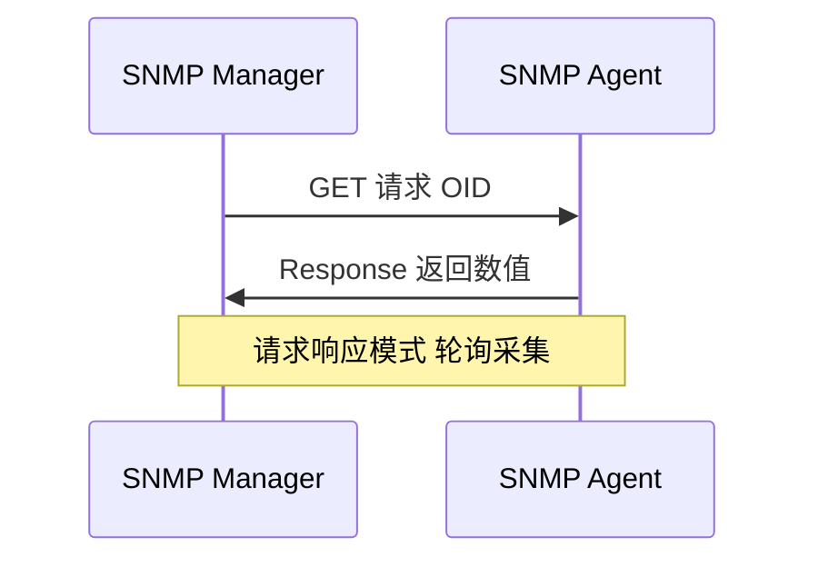

# SNMP GET：主动查询设备状态

一句话：监控服务器通过 OID 主动向设备查询具体指标。

```mermaid
sequenceDiagram
    participant Mg as SNMP Manager
    participant Ag as SNMP Agent
    Mg->>Ag: GET 请求 OID
    Ag->>Mg: Response 返回数值
    Note over Mg,Ag: 请求响应模式 轮询采集
```

## 核心要点

* 使用 UDP 161 端口
* 通过 OID 定位具体指标
* 可查询 CPU 内存 接口流量 运行时间等
* SNMPv3 支持认证和加密 更适合正式环境
* 属于轮询模式 需要设置合理的采集频率
