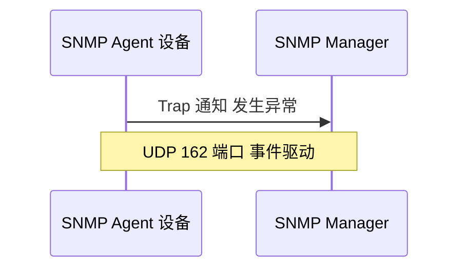

# SNMP Trap：设备主动上报异常

一句话：设备发现异常后主动通知监控服务器，无需等待轮询。

```mermaid
sequenceDiagram
    participant Ag as SNMP Agent 设备
    participant Mg as SNMP Manager
    Ag->>Mg: Trap 通知 发生异常
    Note over Ag,Mg: UDP 162 端口 事件驱动
```

## 核心要点

* 使用 UDP 162 端口
* 由设备主动发送 不需要服务器先询问
* 常见事件 接口断开 电源故障 温度过高 设备重启
* 传统 Trap 无确认机制 可能丢失
* Inform 是带确认的通知方式 可靠性更高
