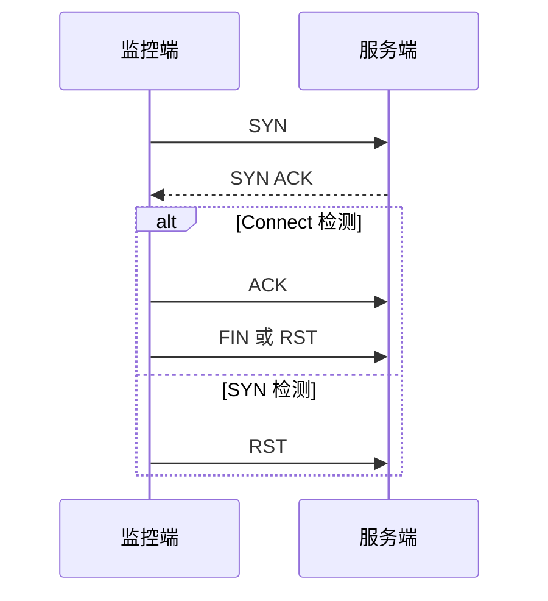

# TCP 三次握手与两种检测

理解 TCP Connect 与 TCP SYN 检测在握手过程中的差别。

## 核心要点

- Connect 检测通过操作系统 connect 完成三次握手。
- SYN 检测收到 SYN-ACK 后通常发送 RST，不建立完整连接。
- Connect 实现简单且普通用户可执行，但会真实占用连接资源。
- SYN 检测开销较低，但通常需要原始报文能力与更高权限。

---

## 本章测验

本章共 5 道单项选择题。

### 第 1 题

TCP Connect 检测会执行什么？

- A. 只读取一个 OID
- B. 通过 connect 完成完整三次握手
- C. 只接收设备日志
- D. 发送 SYN 后不处理响应

选择完成后展开答案

正确答案：B. 通过 connect 完成完整三次握手

答案解析：Connect 检测建立真实 TCP 连接，完成 SYN、SYN-ACK、ACK。

### 第 2 题

TCP SYN 检测收到 SYN-ACK 后通常怎样处理？

- A. 发送 Syslog 确认
- B. 执行 SNMP GetBulk
- C. 持续保持应用会话
- D. 发送 RST，不完成完整连接

选择完成后展开答案

正确答案：D. 发送 RST，不完成完整连接

答案解析：SYN 检测借助 SYN-ACK 判断端口开放，随后通常用 RST 结束，避免完整建连。

### 第 3 题

Connect 检测的一项实际优势是什么？

- A. 实现直接且普通用户权限通常即可执行
- B. 绝不占用服务端资源
- C. 能证明业务事务成功
- D. 不产生任何网络连接记录

选择完成后展开答案

正确答案：A. 实现直接且普通用户权限通常即可执行

答案解析：Connect 借助操作系统接口，权限要求通常较低；但它会建立真实连接，也只验证 TCP 层。

### 第 4 题

高频探测对目标连接资源较敏感，且环境允许原始报文能力时，可评估哪种方式？

- A. 只查看历史日志
- B. 关闭所有端口监控
- C. TCP SYN 检测
- D. 把 GET 改成 Trap

选择完成后展开答案

正确答案：C. TCP SYN 检测

答案解析：SYN 检测不完成完整连接，可能降低连接资源占用，但仍需评估权限与报文开销。

### 第 5 题

关于两种 TCP 检测，哪项说法错误？

- A. Connect 会建立真实连接
- B. 只要握手相关检查成功，就能证明业务交易完成
- C. SYN 检测通常需要更高权限
- D. 两者都只能直接验证 TCP 层

选择完成后展开答案

正确答案：B. 只要握手相关检查成功，就能证明业务交易完成

答案解析：TCP 握手成功不等于 TLS、HTTP、应用逻辑或业务事务成功。

<!-- QUIZ_DATA_START
{
  "chapter": "04",
  "questions": [
    {
      "id": 1,
      "question": "TCP Connect 检测会执行什么？",
      "options": {
        "A": "只读取一个 OID",
        "B": "通过 connect 完成完整三次握手",
        "C": "只接收设备日志",
        "D": "发送 SYN 后不处理响应"
      },
      "answer": "B",
      "explanation": "Connect 检测建立真实 TCP 连接，完成 SYN、SYN-ACK、ACK。"
    },
    {
      "id": 2,
      "question": "TCP SYN 检测收到 SYN-ACK 后通常怎样处理？",
      "options": {
        "A": "发送 Syslog 确认",
        "B": "执行 SNMP GetBulk",
        "C": "持续保持应用会话",
        "D": "发送 RST，不完成完整连接"
      },
      "answer": "D",
      "explanation": "SYN 检测借助 SYN-ACK 判断端口开放，随后通常用 RST 结束，避免完整建连。"
    },
    {
      "id": 3,
      "question": "Connect 检测的一项实际优势是什么？",
      "options": {
        "A": "实现直接且普通用户权限通常即可执行",
        "B": "绝不占用服务端资源",
        "C": "能证明业务事务成功",
        "D": "不产生任何网络连接记录"
      },
      "answer": "A",
      "explanation": "Connect 借助操作系统接口，权限要求通常较低；但它会建立真实连接，也只验证 TCP 层。"
    },
    {
      "id": 4,
      "question": "高频探测对目标连接资源较敏感，且环境允许原始报文能力时，可评估哪种方式？",
      "options": {
        "A": "只查看历史日志",
        "B": "关闭所有端口监控",
        "C": "TCP SYN 检测",
        "D": "把 GET 改成 Trap"
      },
      "answer": "C",
      "explanation": "SYN 检测不完成完整连接，可能降低连接资源占用，但仍需评估权限与报文开销。"
    },
    {
      "id": 5,
      "question": "关于两种 TCP 检测，哪项说法错误？",
      "options": {
        "A": "Connect 会建立真实连接",
        "B": "只要握手相关检查成功，就能证明业务交易完成",
        "C": "SYN 检测通常需要更高权限",
        "D": "两者都只能直接验证 TCP 层"
      },
      "answer": "B",
      "explanation": "TCP 握手成功不等于 TLS、HTTP、应用逻辑或业务事务成功。"
    }
  ]
}
QUIZ_DATA_END -->
