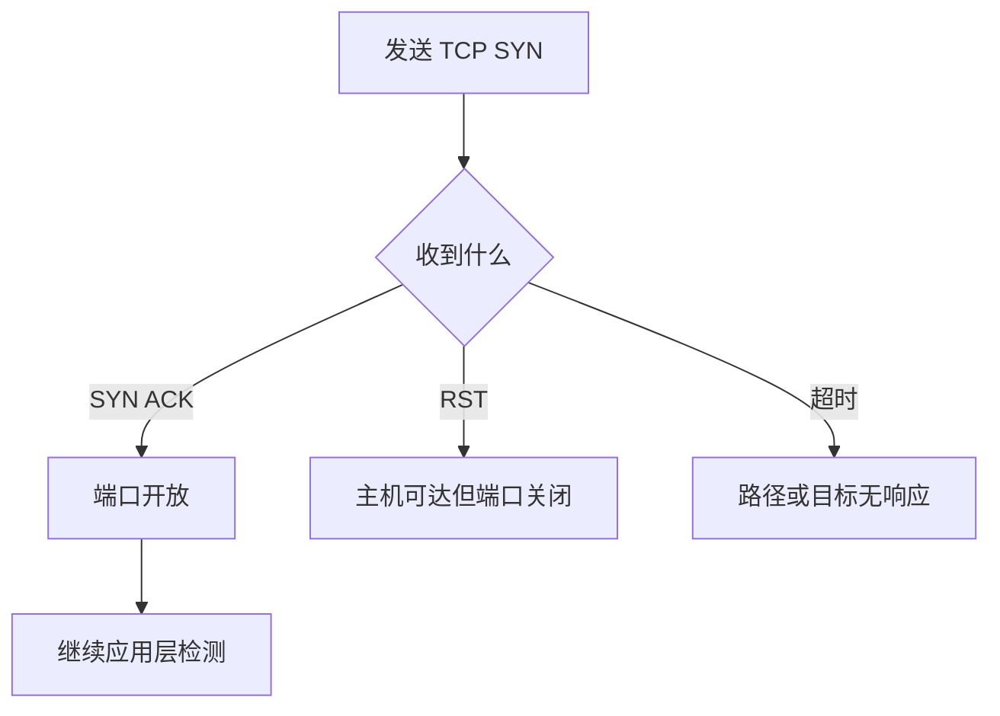

# TCP 检测结果与局限

把 SYN-ACK、RST 与超时转成谨慎、可操作的结论。

## 核心要点

- SYN-ACK 通常表示目标端口开放。
- RST 通常表示目标主机可达，但端口未监听或被明确拒绝。
- 超时可能由丢包、过滤、路由故障或目标宕机造成。
- TCP 成功不能证明应用内容、依赖服务和业务结果正常。

---

## 本章测验

本章共 5 道单项选择题。

### 第 1 题

收到 SYN-ACK 通常表示什么？

- A. 目标 CPU 一定正常
- B. 目标 TCP 端口开放
- C. 目标刚发送了 Trap
- D. 应用返回内容一定正确

选择完成后展开答案

正确答案：B. 目标 TCP 端口开放

答案解析：SYN-ACK 表明目标愿意继续握手，因此端口通常处于开放状态。

### 第 2 题

收到 RST 时，哪种解释最合理？

- A. 一定是目标断电
- B. 一定是 DNS 故障
- C. 一定是 SNMP 凭据错误
- D. 主机或路径有响应，但端口关闭或连接被明确拒绝

选择完成后展开答案

正确答案：D. 主机或路径有响应，但端口关闭或连接被明确拒绝

答案解析：RST 是明确的 TCP 响应，常见于端口未监听或策略主动拒绝。

### 第 3 题

为什么 TCP 超时的诊断含义较模糊？

- A. 丢包、过滤、路由或目标故障都可能导致超时
- B. 超时只可能由应用代码造成
- C. 超时等同于收到 RST
- D. 超时证明端口开放

选择完成后展开答案

正确答案：A. 丢包、过滤、路由或目标故障都可能导致超时

答案解析：静默丢弃和无返回可能发生在多个环节，因此需要其他信号进一步定位。

### 第 4 题

TCP 端口开放后，若要判断网站功能，应继续做什么？

- A. 只提高 TCP 探测频率
- B. 停止所有日志收集
- C. 执行 TLS、HTTP 或业务层检查
- D. 把开放端口视为最终结论

选择完成后展开答案

正确答案：C. 执行 TLS、HTTP 或业务层检查

答案解析：端口开放仅是分层检查的一步，应用与业务需要匹配其语义的探测。

### 第 5 题

哪条告警文案最谨慎准确？

- A. 服务器已经永久损坏
- B. 从监控点访问目标端口超时，需要结合其他证据定位
- C. 所有网络设备均已宕机
- D. 数据库数据已经丢失

选择完成后展开答案

正确答案：B. 从监控点访问目标端口超时，需要结合其他证据定位

答案解析：超时证据只能说明当前路径未收到预期响应，不能直接确定根因。

<!-- QUIZ_DATA_START
{
  "chapter": "05",
  "questions": [
    {
      "id": 1,
      "question": "收到 SYN-ACK 通常表示什么？",
      "options": {
        "A": "目标 CPU 一定正常",
        "B": "目标 TCP 端口开放",
        "C": "目标刚发送了 Trap",
        "D": "应用返回内容一定正确"
      },
      "answer": "B",
      "explanation": "SYN-ACK 表明目标愿意继续握手，因此端口通常处于开放状态。"
    },
    {
      "id": 2,
      "question": "收到 RST 时，哪种解释最合理？",
      "options": {
        "A": "一定是目标断电",
        "B": "一定是 DNS 故障",
        "C": "一定是 SNMP 凭据错误",
        "D": "主机或路径有响应，但端口关闭或连接被明确拒绝"
      },
      "answer": "D",
      "explanation": "RST 是明确的 TCP 响应，常见于端口未监听或策略主动拒绝。"
    },
    {
      "id": 3,
      "question": "为什么 TCP 超时的诊断含义较模糊？",
      "options": {
        "A": "丢包、过滤、路由或目标故障都可能导致超时",
        "B": "超时只可能由应用代码造成",
        "C": "超时等同于收到 RST",
        "D": "超时证明端口开放"
      },
      "answer": "A",
      "explanation": "静默丢弃和无返回可能发生在多个环节，因此需要其他信号进一步定位。"
    },
    {
      "id": 4,
      "question": "TCP 端口开放后，若要判断网站功能，应继续做什么？",
      "options": {
        "A": "只提高 TCP 探测频率",
        "B": "停止所有日志收集",
        "C": "执行 TLS、HTTP 或业务层检查",
        "D": "把开放端口视为最终结论"
      },
      "answer": "C",
      "explanation": "端口开放仅是分层检查的一步，应用与业务需要匹配其语义的探测。"
    },
    {
      "id": 5,
      "question": "哪条告警文案最谨慎准确？",
      "options": {
        "A": "服务器已经永久损坏",
        "B": "从监控点访问目标端口超时，需要结合其他证据定位",
        "C": "所有网络设备均已宕机",
        "D": "数据库数据已经丢失"
      },
      "answer": "B",
      "explanation": "超时证据只能说明当前路径未收到预期响应，不能直接确定根因。"
    }
  ]
}
QUIZ_DATA_END -->
