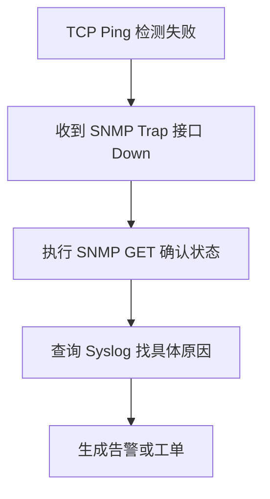

# 综合场景：路由器接口故障排查

一句话：四种监控方式配合，完整还原一次接口故障的排查过程。

```mermaid
flowchart TD
    A[TCP Ping 检测失败] --> B[收到 SNMP Trap 接口 Down]
    B --> C[执行 SNMP GET 确认状态]
    C --> D[查询 Syslog 找具体原因]
    D --> E[生成告警或工单]
```

## 核心要点

* 第一步 TCP Ping 发现 SSH 端口连接超时
* 第二步 SNMP Trap 上报接口 Down 事件
* 第三步 SNMP GET 确认接口当前状态和流量
* 第四步 Syslog 显示原因是信号丢失
* 四步结合 才能形成完整结论
